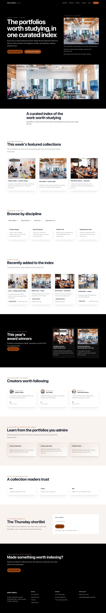
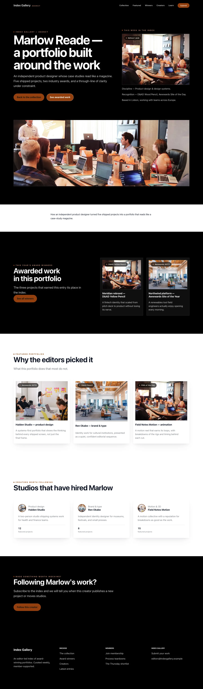

# Theme Agency

<!-- prettier-ignore-start -->

## What This Plugin Adds

Theme Agency is an **Available**, **No schema impact** Capell theme in the **Capell Themes** product group. It ships as `capell-app/theme-agency` and extends these surfaces: frontend.

Theme Agency provides a Blade presentation for curated portfolios, creator profiles, winner labels, taxonomy filters, resources, and newsletter sections.

Admins select Agency through theme management, preview it, and adjust shared theme settings. Public pages use its portfolio-focused presets and package-owned widgets.

Evidence: [`src/AgencyThemeServiceProvider.php`](src/AgencyThemeServiceProvider.php), [`src/Support/Demo/AgencyDemoContent.php`](src/Support/Demo/AgencyDemoContent.php), [`tests/Feature/SignatureWidgetsRenderTest.php`](tests/Feature/SignatureWidgetsRenderTest.php), [`capell.json`](capell.json), [`src/Manifest/ThemeManagementPageContribution.php`](src/Manifest/ThemeManagementPageContribution.php), [`tests/Unit/AgencyThemeDefinitionTest.php`](tests/Unit/AgencyThemeDefinitionTest.php), [`docs/overview.admin.md`](docs/overview.admin.md).

Status details:

- Status: Available
- Tier: premium
- Bundle: themes
- Composer package: `capell-app/theme-agency`
- Namespace: `Capell\ThemeAgency`
- Theme key: `agency`

## Why It Matters

**For developers:** The provider extends the Foundation default theme and registers Agency definitions, presets, assets, and layout-widget renderables through shared registries.

**For teams:** Portfolio and design-education teams get a recognition-led public structure while editors keep their normal Capell content workflow.

Evidence: [`src/AgencyThemeServiceProvider.php`](src/AgencyThemeServiceProvider.php), [`tests/Unit/AgencyThemeDefinitionTest.php`](tests/Unit/AgencyThemeDefinitionTest.php), [`tests/Unit/PublicOutputSafetyTest.php`](tests/Unit/PublicOutputSafetyTest.php), [`docs/overview.admin.md`](docs/overview.admin.md), [`src/Support/Demo/AgencyDemoContent.php`](src/Support/Demo/AgencyDemoContent.php), [`tests/Feature/SignatureWidgetsRenderTest.php`](tests/Feature/SignatureWidgetsRenderTest.php).

## Screens And Workflow

Screenshot contract: `docs/screenshots.json`.

Desktop, tablet, and mobile variants remain defined in the screenshot contract; this list groups them by workflow.

- Agency Homepage (frontend, required evidence).
- Agency Landing page (frontend, required evidence).
- Agency List page (frontend, required evidence).
- Agency Search results (frontend, required evidence).
- Agency Contact form (frontend, supplementary evidence).
- Agency Page Not Found (frontend, supplementary evidence).
- Agency Call To Action (frontend, supplementary evidence).

## Technical Shape

### Service providers

- `Capell\ThemeAgency\AgencyThemeServiceProvider`

### Actions

- `InstallAgencyThemeDemoAction`

### Command signatures

- `capell:theme-agency-demo`

### Console command classes

- `DemoCommand`

### Manifest contributions

- `admin-page: Capell\ThemeAgency\Manifest\ThemeManagementPageContribution`

### Health checks

- `Capell\ThemeAgency\Health\ThemeAgencyHealthCheck`

### Blade views

- `packages/theme-agency/resources/views/page.blade.php`
- `packages/theme-agency/resources/views/sections/awarded-profiles--spotlight.blade.php`
- `packages/theme-agency/resources/views/sections/awarded-profiles.blade.php`
- `packages/theme-agency/resources/views/sections/content-listing.blade.php`
- `packages/theme-agency/resources/views/sections/creator-directory.blade.php`
- `packages/theme-agency/resources/views/sections/cta.blade.php`
- `packages/theme-agency/resources/views/sections/education-upsell--cta.blade.php`
- `packages/theme-agency/resources/views/sections/education-upsell.blade.php`
- `packages/theme-agency/resources/views/sections/featured-portfolios--parallax.blade.php`
- `packages/theme-agency/resources/views/sections/featured-portfolios.blade.php`
- `packages/theme-agency/resources/views/sections/filter-taxonomies--grid.blade.php`
- `packages/theme-agency/resources/views/sections/filter-taxonomies.blade.php`
- `packages/theme-agency/resources/views/sections/footer.blade.php`
- `packages/theme-agency/resources/views/sections/form.blade.php`
- `packages/theme-agency/resources/views/sections/hero.blade.php`
- `packages/theme-agency/resources/views/sections/navigation.blade.php`
- `packages/theme-agency/resources/views/sections/newsletter.blade.php`
- `packages/theme-agency/resources/views/sections/portfolio-grid--gallery-wall.blade.php`
- `packages/theme-agency/resources/views/sections/portfolio-grid.blade.php`
- `packages/theme-agency/resources/views/sections/proof.blade.php`
- `packages/theme-agency/resources/views/widget/section.blade.php`

### Cache tags

- `theme-agency`

## Marketplace Classification

Tier: **premium**

Product group: **Capell Themes**

## Data Model

This theme has no schema impact. It relies on core Capell site, page, locale, and theme records instead of declaring package-owned tables.

## Install Impact

- Required packages: `capell-app/core`, `capell-app/theme-foundation`, `capell-app/frontend`.
- Admin navigation: declares `admin-page: ThemeManagementPageContribution`; each Filament page or resource controls its own navigation visibility.
- Admin/editor extensions: none declared.
- Permissions: no package permission declarations or Shield gates detected; host access rules still apply.
- Public routes: none declared.
- Database changes: no package migrations declared.
- Config: no package config files.
- Settings: no package settings declared.
- Queues or schedules: none declared.
- Cache tags: `theme-agency`.
- Commands: `capell:theme-agency-demo`.

## Common Pitfalls

- Keep required Capell packages on compatible v4 releases: `capell-app/core`, `capell-app/theme-foundation`, `capell-app/frontend`.
- Keep public Blade and cached HTML free of authoring markers, model IDs, permissions, signed editor URLs, and lazy database queries.
- Custom write integrations must preserve invalidation for `theme-agency` cache tags.

## Troubleshooting

| Symptom | Likely cause | Check | Fix |
| --- | --- | --- | --- |
| Package surface is missing after install | Provider or manifest is not loaded | Confirm `capell.json`, package `composer.json`, and provider registration | Reinstall the package, refresh Composer autoload, and clear host caches |
| Public output leaks unexpected state | Render data, cache variation, or authoring boundary has regressed | Check public Blade, cache tags, and public-output safety tests | Move data loading out of Blade and rerun the package public-output tests |

## Quick Start

1. Install the package: `composer require capell-app/theme-agency`.
2. See it working: run `php artisan capell:theme-agency-demo`.
3. Open `/theme-agency` and confirm the public output renders without admin state.

## Next Steps

- [Package docs](docs/README.md)
- [Overview](docs/overview.md)
- [Troubleshooting](#troubleshooting)
- [Screenshot contract](docs/screenshots.json)
- [Marketplace assets](docs/assets/marketplace/)
- [Capell content language plan](../../docs/CONTENT_LANGUAGE_PLAN.md)
- [Capell documentation design system](../../docs/DESIGN_SYSTEM.md)
- [Capell and package ERD notes](../../docs/erd/capell-and-package-erds.md)
- Related packages: [Theme Foundation](../theme-foundation/README.md), [Form Builder](../form-builder/README.md), [Newsletter](../newsletter/README.md).
- Focused tests: `vendor/bin/pest packages/theme-agency/tests --configuration=phpunit.xml`.

<!-- prettier-ignore-end -->
