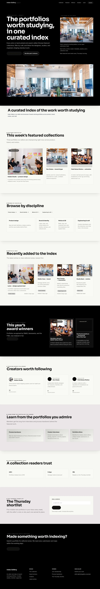
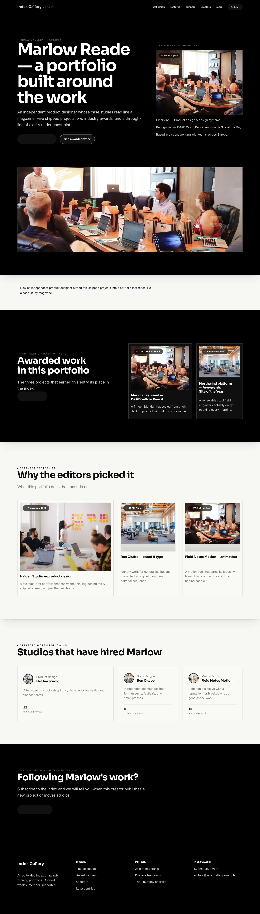

# Theme Agency

<!-- prettier-ignore-start -->

## What It Does

Theme Agency provides a Blade presentation for curated portfolios, creator profiles, winner labels, taxonomy filters, resources, and newsletter sections.

- **Price and availability:** Check current availability and price on the [Capell Marketplace listing](https://capell.app/extensions/theme-agency).
- **Licence:** Check the licence terms on the [Capell Marketplace listing](https://capell.app/extensions/theme-agency).
- **Requires:** `PHP ^8.4`, `capell-app/core ^1.0.72`, `capell-app/theme-foundation ^1.0`, `capell-app/frontend ^1.0`.
- **Install:** `composer require capell-app/theme-agency`.

Use Preview Theme Agency on existing content before Apply Theme Agency, which changes the selected site's public design; reapply its previous theme to restore that selection. Shared Theme Studio settings saves can affect public pages. For fictional demo content, name a disposable target with --sites and review --url and --languages; unscoped setup refuses existing sites, scoped repeats preserve site configuration unless --force deliberately replaces its theme, enabled state, requested site translations and domains, while demo pages, widgets and demo layouts are rewritten on scoped repeats.

## Who It Is For

**For developers:** The provider extends the Foundation default theme and registers Agency definitions, presets, assets, and layout-widget renderables through shared registries.

**For teams:** Portfolio and design-education teams get a recognition-led public structure while editors keep their normal Capell content workflow.

## Quick Start

1. Install the package: `composer require capell-app/theme-agency`.
2. See it working on a disposable site: run `php artisan capell:theme-agency-demo --sites="Theme demo"`. Choose a new site name for your demo; keep customer sites for the Preview → Apply workflow above.
3. Run `php artisan list` and verify the package command signatures are registered.

## Configure

- **Commands:** `php artisan capell:theme-agency-demo`.

## Limits And Pitfalls

- Install the required Capell packages at the versions in `composer.json`: `capell-app/core ^1.0.72`, `capell-app/theme-foundation ^1.0`, `capell-app/frontend ^1.0`.
- Keep public Blade and cached HTML free of authoring markers, model IDs, permissions, signed editor URLs, and lazy database queries.
- Custom write integrations must preserve invalidation for `theme-agency` cache tags.

## Screens And Workflow

- Agency Homepage (frontend).
- Agency Landing page (frontend).
- Agency List page (frontend).
- Agency Search results (frontend).
- Agency Contact form (frontend).
- Agency Page Not Found (frontend).
- Agency Call To Action (frontend).

## Marketplace Classification

Proposed tier (confirm the terms on the Marketplace listing): **free**

Product group: **Capell Themes**

## Install Impact

- Required packages: `capell-app/core`, `capell-app/theme-foundation`, `capell-app/frontend`.
- Admin navigation: declares `admin-page: ThemeManagementPageContribution`; each Filament page or resource controls its own navigation visibility.
- Admin/editor extensions: none declared.
- Permissions: no package permission declarations or Shield gates detected; host access rules still apply.
- Public routes: none declared.
- Database changes: no package migrations declared.
- Config: no package config files.
- Settings: no package settings declared.
- Queues or schedules: none declared.
- Cache tags: `theme-agency`.
- Commands: `capell:theme-agency-demo`.

## Troubleshooting

| Symptom | Likely cause | Check | Fix |
| --- | --- | --- | --- |
| Package surface is missing after install | Provider or manifest is not loaded | Confirm `capell.json`, package `composer.json`, and provider registration | Reinstall the package, refresh Composer autoload, and clear host caches |
| Public output leaks unexpected state | Render data, cache variation, or authoring boundary has regressed | Check public Blade, cache tags, and public-output safety tests | Move data loading out of Blade and rerun the package public-output tests |

## Upgrading

No manual steps between minor versions.

Read [CHANGELOG.md](CHANGELOG.md) before upgrading.

## Next Steps

- [Package docs](docs/README.md)
- [Overview](docs/overview.md)
- [Troubleshooting](#troubleshooting)
- [Developer reference](docs/reference.md)
- [Marketplace assets](docs/assets/marketplace/)
- [Capell content language plan](../../docs/CONTENT_LANGUAGE_PLAN.md)
- [Capell documentation design system](../../docs/DESIGN_SYSTEM.md)
- [Capell and package ERD notes](../../docs/erd/capell-and-package-erds.md)
- Related packages: [Foundation Theme](../theme-foundation/README.md), [Form Builder](../form-builder/README.md), [Newsletter](../newsletter/README.md).

<!-- prettier-ignore-end -->
