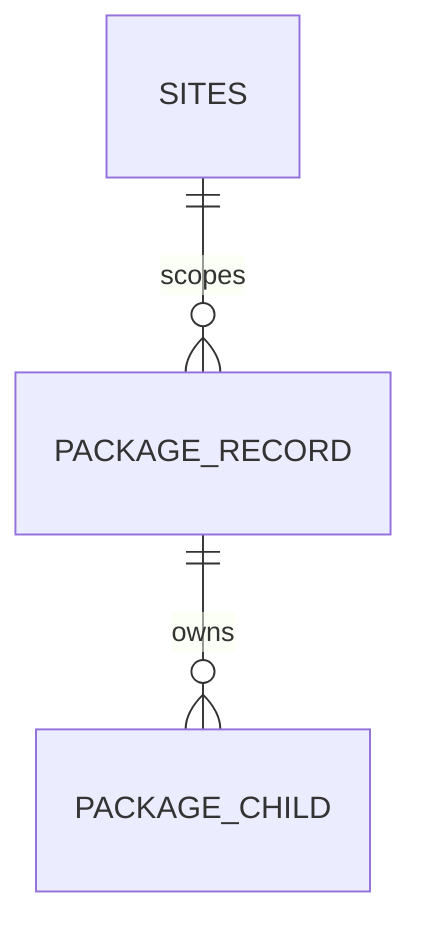

# Capell And Package ERD Notes

This file is the schema source guide for package documentation. It does not
replace migrations or models. Package READMEs should use this file to decide
whether a schema claim is proven, needs an ERD excerpt, or should be marked as a
docs gap.

## Source Of Truth

Use these files before writing any data model section:

- `packages/<package>/database/migrations`
- `packages/<package>/src/Models`
- model relationship methods
- package tests that create, delete, or query records
- `capell.json` install and migration metadata

Do not infer cascade rules, retention policy, tenancy, or site scoping from a
table name alone.

## Common Core Connections

Most schema-owning packages connect to one or more core Capell records:

- sites
- languages
- pages
- page URLs
- users
- media
- layouts
- widgets
- settings

Only document the connection when the package migration, model, or test proves
it.

## Package ERD Standard

For each schema-owning package, the `## Data Model` section should list:

- tables owned by the package
- main Eloquent models
- important relationships to Capell core records
- migration impact
- deletion or retention behaviour when proven
- `Docs gap:` notes for unproven cascade, retention, or pruning behaviour

For packages with no tables, write:

> This package has no schema impact. It extends Capell through [providers,
>
> > routes, render hooks, views, commands, or contracts].

## Mermaid Pattern

Use Mermaid only when relationships are proven:

Do not use placeholder nodes. If the relationship is unclear, write a docs gap
instead of a diagram.

## Review Checklist

- Does every table name exist in a migration?
- Does every relationship appear in a model or test?
- Does every retention statement cite a command, action, job, observer, or
  documented host policy?
- Does public output safety stay separate from admin/editor schema details?
- Does the README avoid exposing sensitive token, secret, or payload fields to a
  non-technical audience unless the page is clearly a technical audit report?
