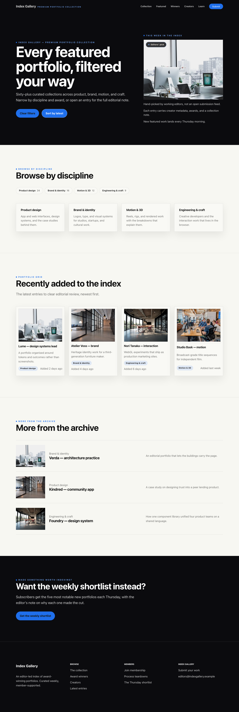


# Agency

Awarded portfolios and design-education picks, given a best-seat-in-the-house presentation. Agency is for editor-led indexes: black hero bands, large image previews, award labels, creator metadata, and taxonomy filters. It also ships the playful curated "Hand Picked" preset for lighter, taste-led indexes.

<!-- prettier-ignore-start -->


## Put it on your site

```bash
composer require capell-app/theme-agency
```

Then, in the admin:

1. Open **System → Themes**. Agency appears as an installed package definition.
2. Choose **Create theme** to turn that definition into a theme record you can edit.
3. Choose **Preview**, pick the site, page, and preset — including "Hand Picked" — and open it in a new tab. Nothing on the live site has changed yet.
4. When you are happy, choose **Apply theme**. Set **Activation scope** to **Global** to change the default theme for every site without its own override, or to **Selected sites** to change only the sites you name.

Applying a theme refreshes the frontend cache keys for the sites it affects, so the change shows immediately.

Colour, type, and spacing tokens sit under **Customize**, so the black bands and the blue accent can be retuned without touching a Blade file.

### Start from the demo content

To get the pages below rather than an empty site:

```bash
php artisan capell:theme-agency-demo
```

The command takes `--url`, `--languages`, and `--sites`, so you can seed one site or a whole multilingual set.

## A tour of the pages

### Homepage

The page alternates between black editorial bands and off-white content sections, so an index reads as a sequence of chapters rather than one long scroll. Award chips ("Awwwards SOTD", "D&AD Pencil", "FWA of the Day") sit on the images themselves, and a stats row plus a newsletter sign-up close the page out. The screenshot above shows it in full.

### Entry (landing)

A single portfolio, opened out. The hero carries the creator's name in the same oversized headline as the homepage, then a black "Awarded work in this portfolio" band puts the award-winning projects on dark cards, before the page returns to off-white for the editors' note and the studios that hired them.


### Collection listing

The filtered index. A "Browse by discipline" row of counted pills (Product design 24, Brand & identity 16, Motion & 3D 12, Engineering & craft 9) sits above a four-up card grid, and the archive below it drops to a compact row layout — thumbnail, discipline, title, one-line note — so a long tail stays skimmable.


### Search

The empty state is designed rather than apologised for. The hero says "No portfolios match that filter — yet", the search box repeats the query with a plain "0 results" line, and the page then offers a broader discipline row and three featured portfolios so the visitor has somewhere to go.



### Contact

Contact is a submission page. Instead of a long field-by-field form, the hero explains how review works, and the page carries a "What we look for" card row, a pale-blue newsletter band with an email field and a black Subscribe button, and a stats row (420+ portfolios indexed, 5 days average turnaround, 38k readers).


## On a phone

Everything stacks to one column. The hero headline keeps its scale rather than shrinking to fit, the discipline pills and card grids become single-file, and the award chips stay on the images. The black bands still separate the sections, so the chaptered rhythm of the desktop page survives.



## Before you install

Agency extends the **Foundation** theme (`default`) rather than replacing it, and needs these packages present:

- `capell-app/core`
- `capell-app/theme-foundation`
- `capell-app/frontend`

Composer pulls them in for you. Agency declares no conflicts.

It also declares support for `capell-app/blog`, `capell-app/form-builder`, `capell-app/newsletter`, and `capell-app/shopify-commerce` — if you want editorial posts, real forms, a working sign-up behind that Thursday shortlist band, or a shop alongside the index. None of them are required.

---

For the package boundary, runtime surfaces, and troubleshooting, see the [package README](../README.md).

<!-- prettier-ignore-end -->
