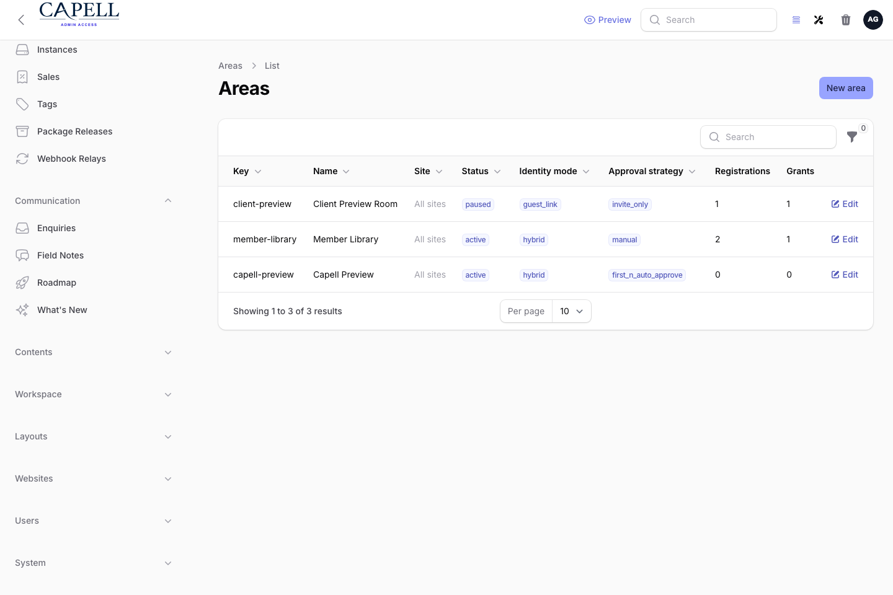
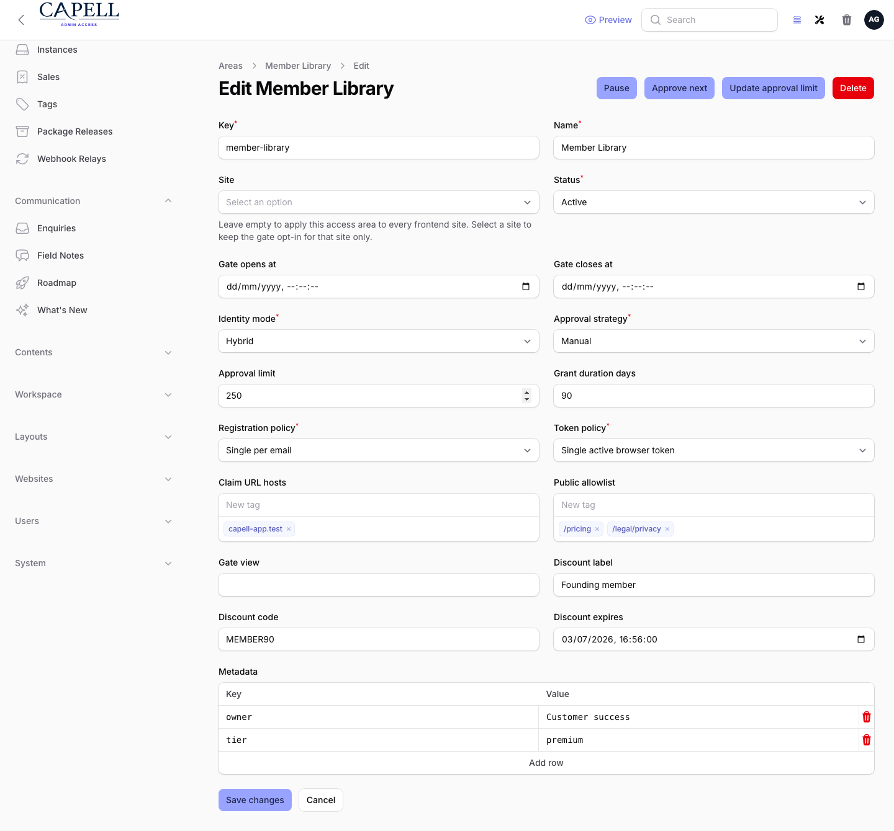
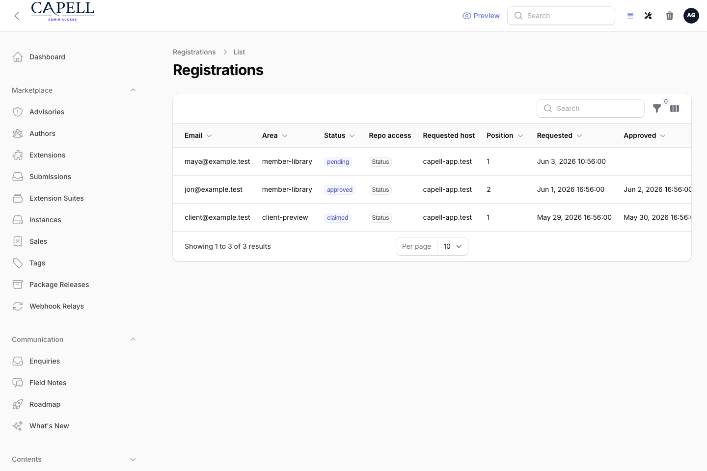
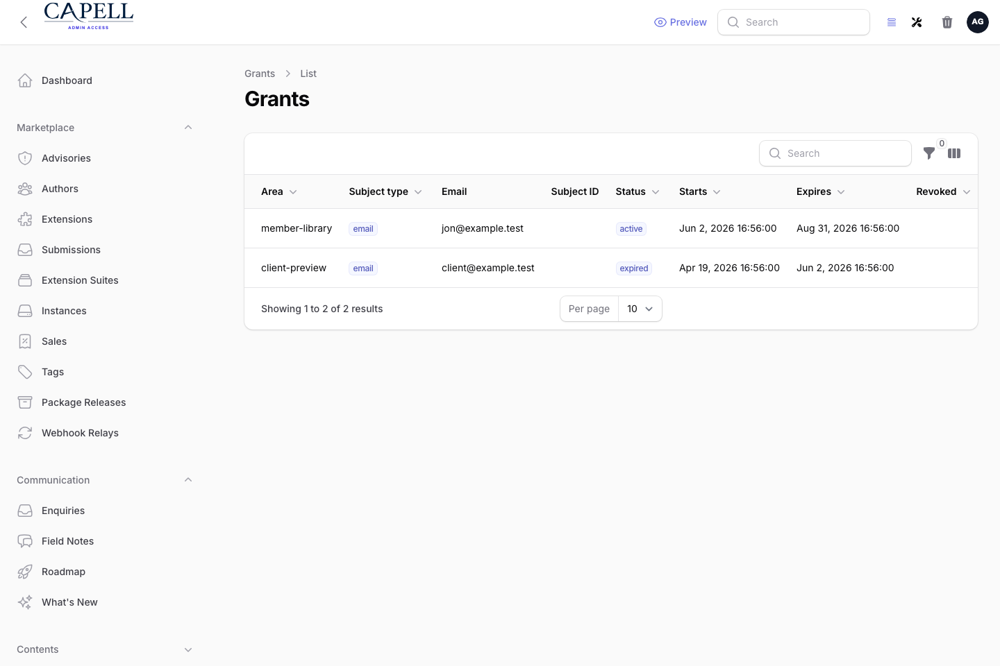
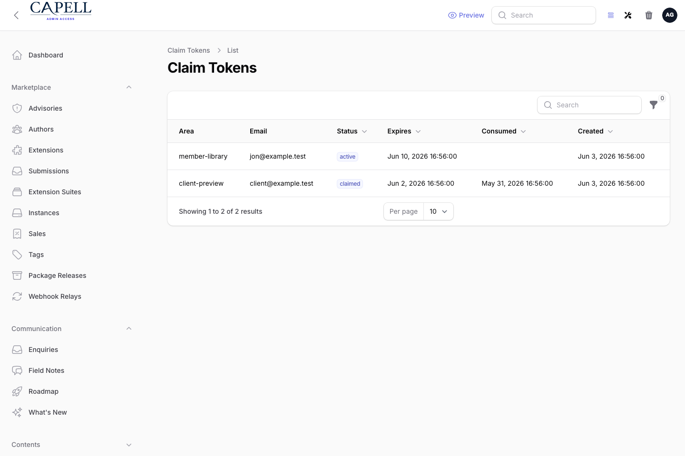
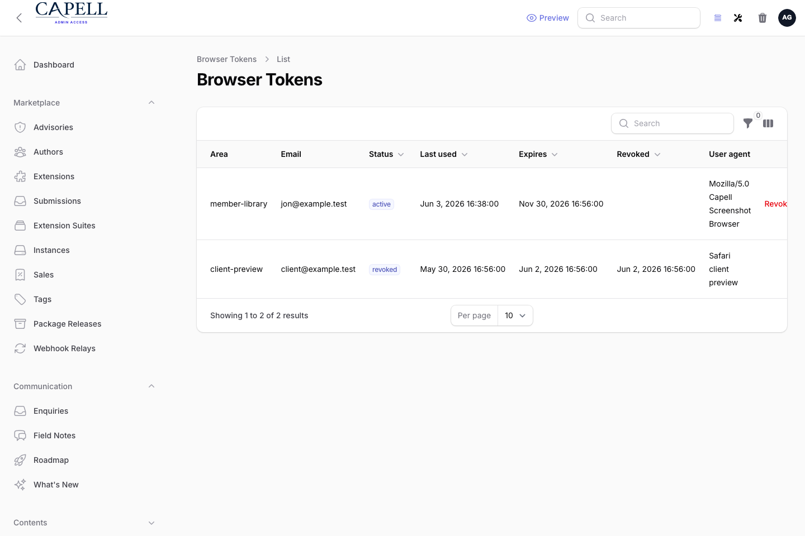
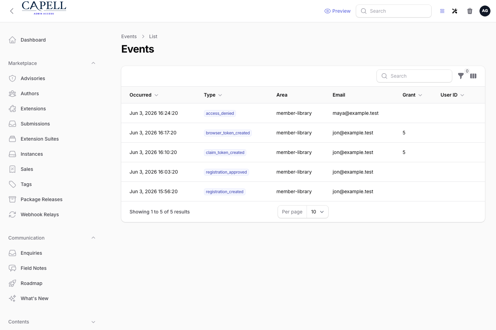
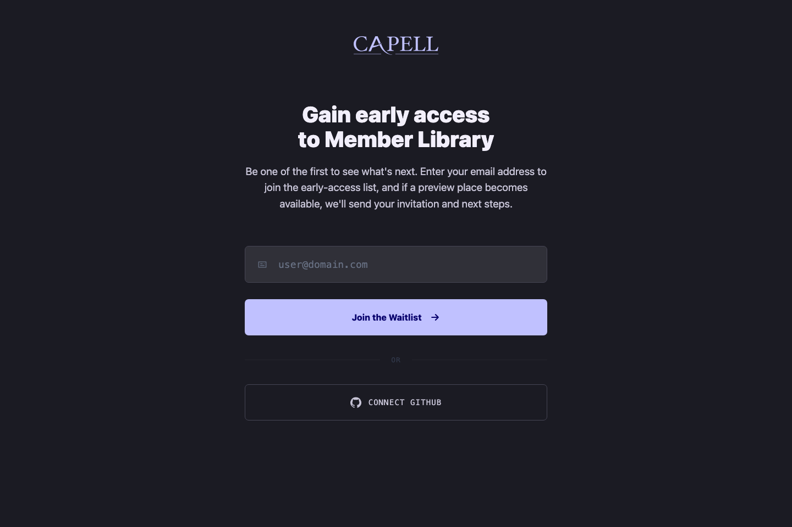
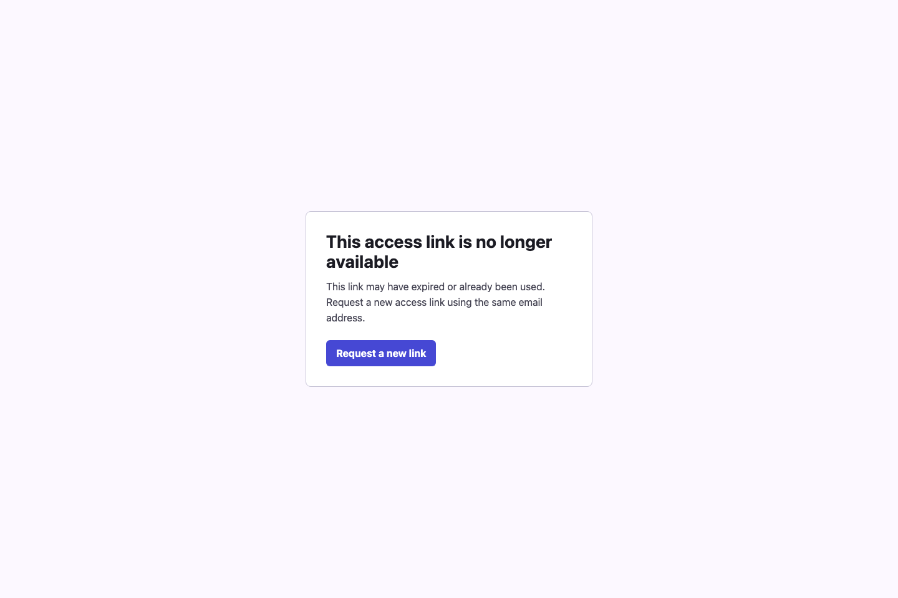
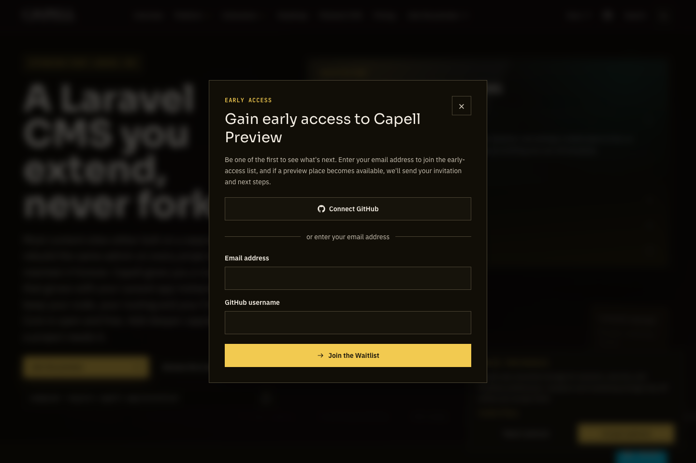

# Using Access Gate

This guide is for the people who run access to protected content: admins who set up gated areas and reviewers who approve or reject the people asking to get in. No technical knowledge needed. Every step uses the labels you see on screen. Everything is under the **Access Gate** group in the admin sidebar.

## Using Access Gate (how-to)

### How to review your protected areas

1. Go to **Access Gate > Access areas**.
2. The list shows every protected area, its **Key**, its **Status**, and how it lets people in (its **Registration policy** and **Token policy**).
3. Use this screen to confirm an area is active and accepting requests the way you expect before you point private content at it.

### How to set up a protected area

1. Go to **Access Gate > Access areas** and start a new area.
2. Give it a **Key** (a short name used to attach the gate to content) and a **Name**.
3. Choose the **Site** it applies to, or leave it empty to apply to every site.
4. Set the **Status** to control whether the area is live.
5. To run the area on a schedule, set **Gate opens at** and **Gate closes at**.
6. Choose how people are recognised with **Identity mode**, and how requests are handled with **Approval strategy** and the **Registration policy**.
7. Set an **Approval limit** if you want to cap how many people can be let in.
8. Set the **Token policy** and **Grant duration days** to control how long access lasts.
9. Use the **Public allowlist** to let named people straight through, and **Claim URL hosts** plus **Claim landing URL** to control where approved people land.
10. Save the area.

### How to review and decide on access requests

1. Go to **Access Gate > Registrations**.
2. Each row is someone asking for access, with their **Email**, the **Area** they want, and a **Status** such as pending, approved, rejected, or expired.
3. Use the filters at the top to show just the requests you want to work through.
4. To let someone in, use **Approve**. To turn them down, use **Reject**.
5. Use **Approve next** to work through pending requests in order, or **Approve selected** to handle several at once.
6. Use **Expire** to close out a request that should no longer be open.
7. Use **Update approval limit** if you need to change how many people an area will admit.

### How to resend an approval link

1. Go to **Access Gate > Registrations** and find the approved person.
2. Use **Resend claim link**. This sends them a fresh approval email.
3. If you see a message that there is no active grant to re-send, approve the registration again to issue a new link.

### How to see who has access and revoke it

1. Go to **Access Gate > Grants**.
2. Each row is a current or past grant, with its **Status** (such as active, expired, or revoked), the **Area**, and when it **Expires**.
3. To take access away from someone immediately, use **Revoke** on their grant.

### How to check whether approval links were used

1. Go to **Access Gate > Claim links**.
2. The list shows each approval link and whether it is still pending, was **Claimed**, or has **Expired**.
3. Use this when someone says they never received or could not use their link.

### How to revoke access on a lost or shared device

1. Go to **Access Gate > Browser sessions**.
2. Each row is access tied to a specific browser or device, with its **Status** and when it was **Last used**.
3. To cut off a device after it is lost or no longer trusted, use **Revoke** on that session.

### How to investigate the history of an access request

1. Go to **Access Gate > Audit events**.
2. Each row records something that happened: a request, an approval, a rejection, a claim, a grant, a revoke, or a blocked visit, with when it **Occurred**.
3. Read down the events for a person or area to see exactly what happened and when.

## What visitors see

Visitors never see any of the admin screens above. Depending on how an area is set up, they see one of three plain public pages.

- A request form, where they ask for access by filling in the fields you configured.

- A blocked message, shown instead of the protected content when they do not have access.

- An inline request button on a protected page or teaser, which sends them into the request flow.

## Rolling out Access Gate (for owners)

### Turn on first

- **One access area, set to manual approval.** Start with a single protected area where you review every request by hand. Get comfortable approving and rejecting before you open anything wider.

### Add when needed

| Need                                             | Use                                              |
| ------------------------------------------------ | ------------------------------------------------ |
| Let named people straight through without review | The **Public allowlist** on the area             |
| Open and close access on a timetable             | **Gate opens at** and **Gate closes at**         |
| Cap how many people can be admitted              | The **Approval limit**                           |
| Control how long access lasts                    | The **Token policy** and **Grant duration days** |

### Who does what

| Role       | First useful screen                                                         |
| ---------- | --------------------------------------------------------------------------- |
| Site owner | **Access Gate > Access areas**: set up and review protected areas           |
| Reviewer   | **Access Gate > Registrations**: approve and reject requests                |
| Support    | **Access Gate > Claim links** and **Audit events**: check links and history |

## Troubleshooting

| What you see                                            | What it means                                                    | What to do                                                                                  |
| ------------------------------------------------------- | ---------------------------------------------------------------- | ------------------------------------------------------------------------------------------- |
| A request is stuck as pending                           | No one has reviewed it yet, or the area's approval limit is full | Open **Registrations**, approve or reject it, or raise the **Approval limit**               |
| Someone says their approval link did not work           | The link was never claimed or has expired                        | Check **Claim links** for its status, then use **Resend claim link** on their registration  |
| Resend claim link says there is no active grant         | The grant behind the link is gone                                | Approve the registration again to issue a new link                                          |
| Someone still has access you wanted to remove           | Their grant or browser session is still active                   | Use **Revoke** in **Grants**, and in **Browser sessions** if they were on a specific device |
| A visitor sees the blocked message when they should not | They have no active grant for that area                          | Check **Grants** for their access, and confirm the area's **Status** and schedule           |
| You cannot tell what happened to a request              | The events are spread across several actions                     | Open **Audit events** and read the history for that person or area                          |
