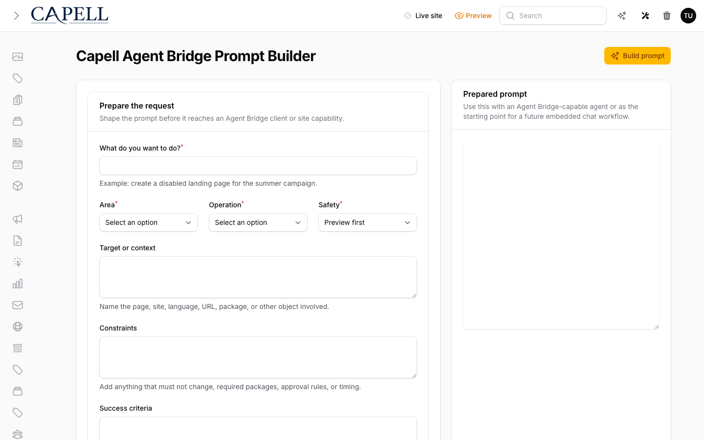

# Agent Bridge

<!-- prettier-ignore-start -->

## What This Plugin Adds

Agent Bridge is an **Available**, **Schema-owning** Capell package in the **Capell Operations** product group. It ships as `capell-app/agent-bridge` and extends these surfaces: admin, frontend.

Connect AI agents and MCP clients to Capell with read-only package knowledge, scoped site capabilities, preview-then-confirm execution, and audited operations.

After install, admins get package-owned management surfaces and public users may see package-owned frontend output or routes.

Status details:

- Status: Available
- Tier: premium
- Bundle: operations
- Composer package: `capell-app/agent-bridge`
- Namespace: `Capell\AgentBridge`
- Theme key: not applicable

## Why It Matters

**For developers:** The package gives developers package-owned service providers, Actions, Data objects, models, Laravel routes, Filament classes, and Blade views instead of pushing this behaviour into core or application code.

**For teams:** Let AI agents safely read and operate your Capell site through scoped tokens, preview-then-confirm guardrails, and a full audit trail.

## Screens And Workflow

Screenshot contract: `screenshots.json`.

- Agent Bridge prompt builder page (admin, required).
- Token management or setup surface (admin, optional runner target; blocked from marketplace promotion until a seeded user edit relation-manager capture exists).
- Capability preview and confirmation flow (admin, optional runner target; blocked until a seeded confirmation capture exists).
- Audit entry review (admin, optional runner target; blocked until a seeded audit relation-manager capture exists).
- Agent Bridge server health output (admin, optional runner target; blocked until a real health/Diagnostics surface capture exists).

Marketplace media currently promotes only the verified light/dark prompt-builder captures. The other committed PNGs are retained as runner evidence and must not be promoted while they duplicate the prompt-builder screen.

## Screenshot Evidence

These captures are the package-owned visual contract for the admin pages, public pages, actions, workflows, and feature surfaces described above. Keep this section aligned with `docs/screenshots.json` whenever the package surface changes.

### Agent Bridge prompt builder page

- Surface: admin · Target: CapellAgentBridgePromptBuilderPage.
- Documents: An administrator builds a scoped prompt for an external agent using the installed Capell package context.
- Capture notes: Requires `capell-app/agent-bridge` installed, settings migrated, and an admin session. This page is available at the Filament slug `capell-agent-bridge/prompt-builder`.

### Token management or setup surface

- Surface: admin · Target: CapellAgentBridgePromptBuilderPage.
- Documents: An administrator creates or reviews a token used by a trusted Agent Bridge client.
- Capture notes: Blocked from marketplace promotion until the screenshot runner can open a seeded host user edit screen with the Agent Bridge token relation manager visible. Existing committed output is runner evidence only and must not be promoted while it duplicates the prompt builder.

### Capability preview and confirmation flow

- Surface: admin · Target: CapellAgentBridgePromptBuilderPage.
- Documents: An administrator reviews a proposed capability run before confirming that an agent may execute it.
- Capture notes: Blocked from marketplace promotion until the screenshot runner can seed and display a pending `CapellAgentBridgeConfirmation`. Existing committed output is runner evidence only and must not be promoted while it duplicates the prompt builder.

### Audit entry review

- Surface: admin · Target: CapellAgentBridgePromptBuilderPage.
- Documents: An administrator reviews what an Agent Bridge client previewed, confirmed, or ran for a user.
- Capture notes: Blocked from marketplace promotion until the screenshot runner can open the user-resource audit relation manager after seeding capability invocation records. Existing committed output is runner evidence only and must not be promoted while it duplicates the prompt builder.

### Agent Bridge server health output

- Surface: admin · Target: CapellAgentBridgePromptBuilderPage.
- Documents: An operator confirms which Agent Bridge endpoints are enabled and whether token-authenticated requests can reach them.
- Capture notes: Blocked from marketplace promotion until the screenshot runner can expose a real route/config health panel or Diagnostics health surface for Agent Bridge. Existing committed output is runner evidence only and must not be promoted while it duplicates the prompt builder.

## Technical Shape

- Service providers: `Capell\AgentBridge\Providers\AgentBridgeServiceProvider`.
- Config files: `packages/agent-bridge/config/capell-agent-bridge.php`.
- Migrations: `packages/agent-bridge/database/migrations/2026_05_10_190840_01_create_capell_agent-bridge_tokens_table.php`, `packages/agent-bridge/database/migrations/2026_05_10_190840_02_create_capell_agent-bridge_confirmations_table.php`, `packages/agent-bridge/database/migrations/2026_05_10_190840_03_create_capell_agent-bridge_audit_entries_table.php`, `packages/agent-bridge/database/migrations/2026_05_27_000001_create_capell_agent-bridge_saved_prompts_table.php`.
- Settings migrations: `packages/agent-bridge/database/settings/2026_05_10_190841_01_add_agent_bridge_settings.php`.
- Settings classes: `AgentBridgeSettings`.
- Models: `CapellAgentBridgeAuditEntry`, `CapellAgentBridgeConfirmation`, `CapellAgentBridgeSavedPrompt`, `CapellAgentBridgeToken`.
- Filament classes: `CapellAgentBridgePromptBuilderPage`, `AgentBridgeAuditEntriesRelationManager`, `AgentBridgeConfirmationsRelationManager`, `AgentBridgeTokensRelationManager`, `AgentBridgeSettingsSchema`.
- Livewire components: `PromptBuilderToolbarAction`.
- Route files: `packages/agent-bridge/routes/agent-bridge.php`.
- Actions: `AuditAgentBridgeCapabilityAction`, `BuildAgentBridgePromptAction`, `ClearCapellCacheCapabilityAction`, `ConfirmAgentBridgeCapabilityAction`, `CreateAgentBridgeTokenAction`, `DeleteAgentBridgePromptAction`, `InvokeAgentBridgeCapabilityPreviewAction`, `CreateDraftPageCapabilityAction`, `DisablePageCapabilityAction`, `InspectPagePublishingReadinessCapabilityAction`, `UpdateDraftPageCapabilityAction`, `PruneAgentBridgeAuditEntriesAction`, `and 4 more`.
- Data objects: `AgentBridgePromptData`, `AuthenticatedAgentBridgeClientData`, `ClearCacheCapabilityInputData`, `CreateDraftPageCapabilityInputData`, `PageIdCapabilityInputData`, `UpdateDraftPageCapabilityInputData`, `CapabilityData`, `CapabilityInvocationData`, `CapabilityResultData`.
- Command signatures: `capell:agent-bridge-prune-audit`.
- Console command classes: `PruneAgentBridgeAuditEntriesCommand`.
- Manifest contributions: `admin-page: Capell\AgentBridge\Manifest\AgentBridgeAdminPageContribution`, `agent-capability: Capell\AgentBridge\Manifest\AgentBridgeBuiltInCapabilitiesContribution`, `console-command: Capell\AgentBridge\Manifest\AgentBridgeConsoleCommandsContribution`, `health-check: Capell\AgentBridge\Health\AgentBridgeHealthCheck`, `migration: Capell\AgentBridge\Manifest\AgentBridgeMigrationsContribution`, `model: Capell\AgentBridge\Manifest\AgentBridgeModelsContribution`, `route: Capell\AgentBridge\Manifest\AgentBridgeRoutesContribution`, `schema-extender: Capell\AgentBridge\Manifest\AgentBridgeUserSchemaExtenderContribution`, `setting: Capell\AgentBridge\Manifest\AgentBridgeSettingsContribution`.
- Health checks: `Capell\AgentBridge\Health\AgentBridgeHealthCheck`.
- Blade views: `packages/agent-bridge/resources/views/filament/pages/prompt-builder.blade.php`, `packages/agent-bridge/resources/views/livewire/prompt-builder-toolbar-action.blade.php`.

## Data Model

- Required tables: `capell_agent_bridge_tokens`, `capell_agent_bridge_confirmations`, `capell_agent_bridge_audit_entries`, `capell_agent_bridge_saved_prompts`.
- Models: `CapellAgentBridgeAuditEntry`, `CapellAgentBridgeConfirmation`, `CapellAgentBridgeSavedPrompt`, `CapellAgentBridgeToken`.
- Migration files: `2026_05_10_190840_01_create_capell_agent-bridge_tokens_table.php`, `2026_05_10_190840_02_create_capell_agent-bridge_confirmations_table.php`, `2026_05_10_190840_03_create_capell_agent-bridge_audit_entries_table.php`, `2026_05_27_000001_create_capell_agent-bridge_saved_prompts_table.php`.
- Migration impact: run host migrations through the package install flow before opening package surfaces.
- Deletion/retention behaviour: audit entries are pruned by `capell:agent-bridge-prune-audit`, using `capell-agent-bridge.audit_retention_days` / `CAPELL_AGENT_BRIDGE_AUDIT_RETENTION_DAYS` with a 90-day default.

## Install Impact

- Admin navigation: adds package-owned Filament classes when registered.
- Permissions: `agent-bridge.manage-tokens`, `agent-bridge.view-audit`.
- Public routes: route files exist and must be reviewed before public enablement.
- Database changes: package migrations are declared.
- Settings: `Capell\AgentBridge\Settings\AgentBridgeSettings`.
- Queues or schedules: daily audit pruning is declared as `capell-agent-bridge-prune-audit`.
- Cache tags: none declared.
- Commands: `capell:agent-bridge-prune-audit`.

## Audit Retention

Agent Bridge stores capability audit entries so operators can review scoped AI-agent activity without exposing reusable secrets. The package redacts sensitive payload fragments before persistence, then keeps audit rows for 90 days by default.

The knowledge server exposes a read-only capability catalog at `capell://agent-bridge/capabilities`. Operators can review scope, server visibility, risk, preview support, confirmation requirements, required packages, and policy abilities before issuing token scopes.

Set `CAPELL_AGENT_BRIDGE_AUDIT_RETENTION_DAYS` or `capell-agent-bridge.audit_retention_days` to change the default window. The pruning command is `capell:agent-bridge-prune-audit`; pass `--days=30` for a one-off override. The manifest also declares a daily scheduled-job contribution named `capell-agent-bridge-prune-audit` so host installs can surface retention automation alongside the package command.

## Common Pitfalls

- Run migrations before opening package resources or public routes.
- Configure package settings before testing production-like workflows.
- Review route middleware, throttling, signed URLs, and public-output safety before exposing routes.
- Keep public Blade and cached HTML free of authoring markers, model IDs, permissions, signed editor URLs, and lazy database queries.
- Keep `composer.json`, `composer.local.json`, `capell.json`, docs, screenshots, and tests aligned when the package surface changes.

## Troubleshooting

| Symptom | Likely cause | Check | Fix |
| --- | --- | --- | --- |
| Package surface is missing after install | Provider or manifest is not loaded | Confirm `capell.json`, package `composer.json`, and provider registration | Reinstall the package, refresh Composer autoload, and clear host caches |
| Admin screen or command fails on missing table | Package migrations have not run | Check the tables listed in `Data Model` | Run the Capell package install/migration flow, then rerun the focused package test |
| Route returns unexpected output | Route cache, middleware, or signed URL setup does not match the package route file | Check the route files listed in `Technical Shape` | Clear route cache and verify middleware before exposing public routes |
| Background work does not run | Queue worker or scheduled command is not active | Check package jobs, commands, and host scheduler configuration | Start the queue or scheduler, then run the focused command or package test |
| Public output leaks unexpected state | Render data, cache variation, or authoring boundary has regressed | Check public Blade, cache tags, and public-output safety tests | Move data loading out of Blade and rerun the package public-output tests |

## Quick Start

1. Install the package: `composer require capell-app/agent-bridge`.
2. Run the Capell package install/migration flow for installed packages.
3. Open the related Capell admin surface and verify Agent Bridge appears.

## Next Steps

- [Package docs index](README.md)
- [Screenshot contract](screenshots.json)
- [Marketplace assets](assets/marketplace/)
- [Capell content language plan](../../../docs/CONTENT_LANGUAGE_PLAN.md)
- [Capell documentation design system](../../../docs/DESIGN_SYSTEM.md)
- [Capell and package ERD notes](../../../docs/erd/capell-and-package-erds.md)
- Focused tests: `vendor/bin/pest packages/agent-bridge/tests --configuration=phpunit.xml`.

<!-- prettier-ignore-end -->
