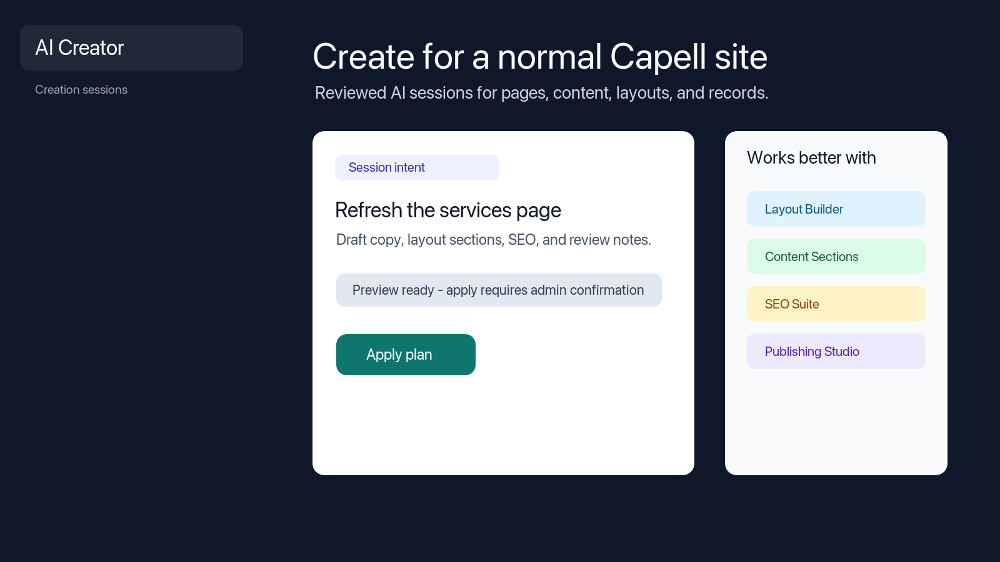
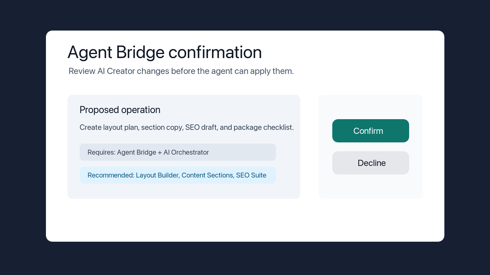

# Using AI Creator

This guide is for editors and administrators who want help creating content, pages, layouts, and records on the site. You describe what you want in plain language, review the plan AI Creator prepares, and approve it before anything is applied. No technical knowledge needed.

## Using AI Creator (editor how-to)

### How to start a reviewed creation session

1. Open **AI Creator** in the admin.
2. Describe what you want to create in plain language, for example the kind of page or content you have in mind.
3. AI Creator turns your description into a clear plan and shows it back to you for review.
4. As you read the plan, it points out which Capell packages would make the result stronger, so you can decide whether to add them.
5. Check the plan over before moving on. Nothing is created at this stage.

### How to confirm a requested change

1. When a change is ready to be applied, AI Creator asks you to confirm it first.
2. Review the summary, including any required and recommended packages, so you know what will happen.
3. Approve the request to apply it, or step back if you want to adjust the plan instead.
4. Only after you confirm does AI Creator apply the change.

## Troubleshooting

| What you see                             | What it means                                               | What to do                                                  |
| ---------------------------------------- | ----------------------------------------------------------- | ----------------------------------------------------------- |
| I can't open an AI Creator session       | You may not have access to it, or you are not signed in     | Sign in, and ask an administrator to confirm your access    |
| A recommended package is listed          | The plan would work better with another extension installed | Decide whether to add it; the plan still applies without it |
| Nothing was created after I described it | A plan is reviewed first and only applied after you confirm | Review the plan, then approve the change to apply it        |
