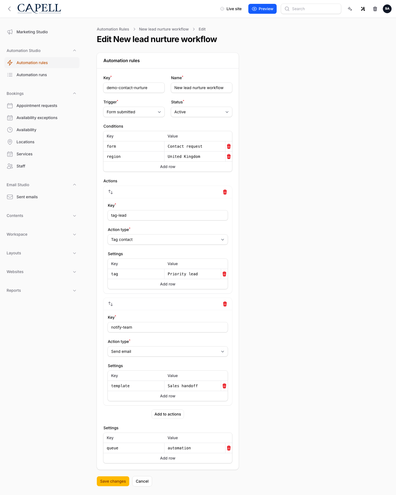
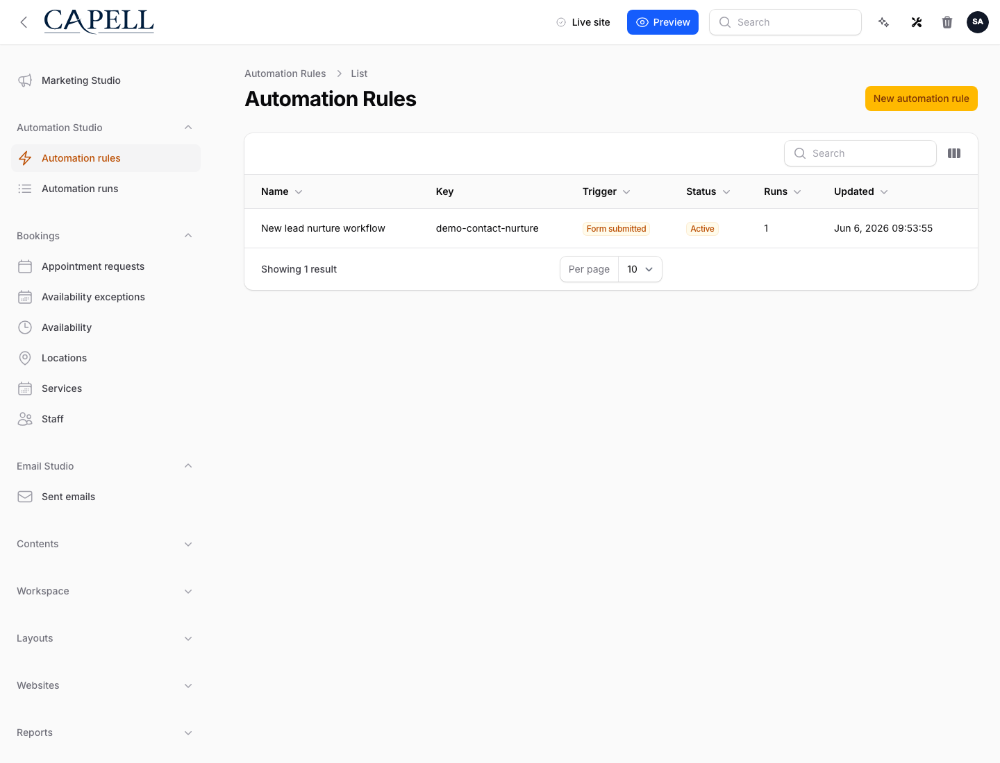
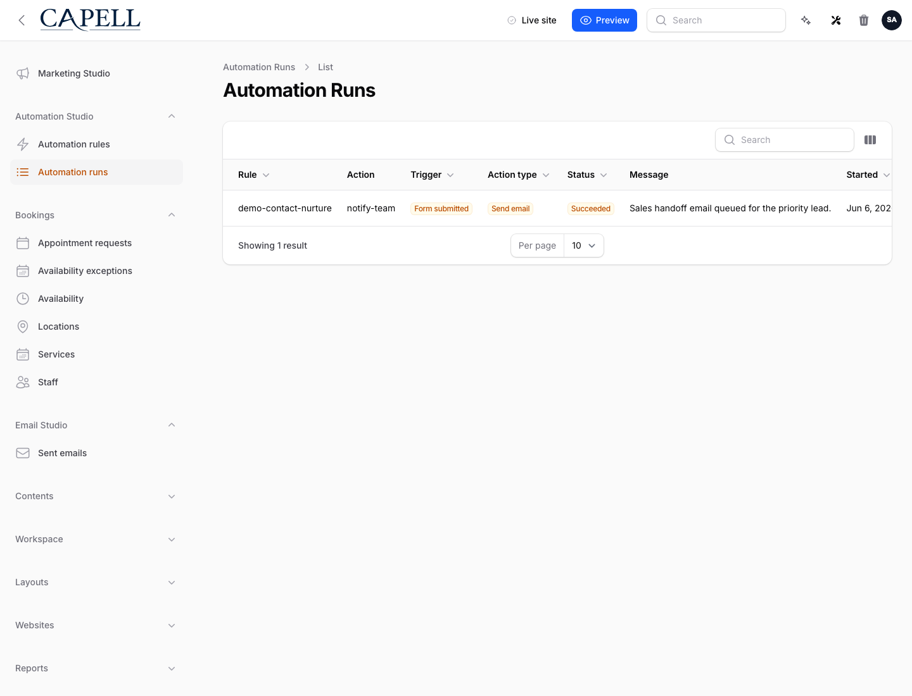

# Using Automation Studio

This guide is for the people who set up and watch over automations: operators who build the rules, and owners deciding how much to switch on. Automation Studio runs simple "when this happens, do that" rules for you, so a routine task happens on its own. No technical knowledge needed. Every step uses the labels you see on screen.

## Using Automation Studio (how-to)

### How to build a rule

1. Go to **Automation Studio > Automation rules**.
2. Start a new rule.
3. Give it a clear **Name** so you can recognise it later in the list.
4. Pick a **Trigger**: the event that starts the rule. Choose from **Access approved**, **Campaign converted**, **Form submitted**, or **Page published**.
5. Under **Conditions**, decide whether the rule should run every time the trigger fires, or only in certain cases. To narrow it, add a condition: pick a **Field**, choose an **Operator** (**Equals**, **Does not equal**, **Blank**, or **Filled**), and where needed type a **Value**. Add more conditions if you want the rule to be more specific.
6. Under **Actions**, choose what the rule does. Set the **Action type** to one of **Create note**, **Run Public Action**, **Queue agent capability**, **Send email**, **Subscribe user**, **Tag contact**, or **Webhook**.
7. Fill in the **Settings** for that action type. The fields you see depend on what you chose. For example, a key-and-value pair uses **Key** and **Value**, and a message uses **Message**.
8. Leave the rule **Paused** while you finish setting it up. You will turn it on after testing.
9. Save the rule.

### How to test a rule before turning it on

1. Open the rule from **Automation Studio > Automation rules**.
2. Choose **Test rules**. This is a dry run: it checks the rule against an example without affecting anyone.
3. Provide a **Sample payload**: this is the made-up event data the test uses. Add a **Payload key** and a **Payload value** for each piece of information the rule looks at.
4. Run the test and read the result. It tells you whether the rule would have run and what it would have done.
5. Adjust the **Conditions** or **Settings** if the result is not what you expected, then test again.

Test before you rely on a rule, so you know it does the right thing before it runs for real.

### How to turn a rule on or off

1. Open the rule from **Automation Studio > Automation rules**.
2. Set the **Status** to **Active** to turn it on. From now on the rule runs whenever its **Trigger** fires and its **Conditions** are met.
3. Set the **Status** to **Paused** to turn it off. The rule stops running but stays in your list, ready to switch back on later.
4. Save the rule.

### How to find and review your rules

1. Go to **Automation Studio > Automation rules**.
2. The list shows each rule's **Name**, its **Trigger**, its **Action**, and its **Status** (**Active** or **Paused**).
3. Scan the **Status** column to see at a glance which automations are on.
4. Open any rule to read or change its trigger, conditions, and action.

### How to review run history

1. Go to **Automation Studio > Automation runs**.
2. Each row is one time a rule ran. You can see the **Rule** it belongs to, when it **Started** and **Finished**, and its **Status**.
3. The **Updated** time tells you when the run last changed.
4. Open a run to see more detail, including its **Idempotency key**, which is how the system avoids running the same event twice.

See every run, so you can confirm a new rule does what you expect before relying on it.

### How to understand run statuses

A run can show one of four statuses:

- **Succeeded**: the rule ran and its action completed.
- **Pending**: the run is waiting to finish.
- **Skipped**: the rule was triggered but its conditions were not met, so no action was taken.
- **Failed**: the run started but did not complete. Open it to see why.

### How to replay a failed run

1. Go to **Automation Studio > Automation runs**.
2. Find the run you want to retry. **Replay** works on runs marked **Pending**, **Skipped**, or **Failed**.
3. Fix whatever caused the problem first. For a **Failed** run, that might mean correcting the rule's **Settings** or an outside service it depends on.
4. Choose **Replay** to run it again.
5. Check the run history afterwards to confirm the new attempt **Succeeded**.

### How to pause a rule instead of deleting it

1. Open the rule from **Automation Studio > Automation rules**.
2. To stop it temporarily, set the **Status** to **Paused** and save. The rule keeps all its settings and its run history, so you can switch it back to **Active** at any time.
3. Delete a rule only when you are sure you will not need it again. Deleting removes it entirely, while pausing keeps it for later.

## Rolling out Automation Studio (for owners)

### Turn on first

- **One simple rule.** Start with a single, low-risk automation, such as creating a note or sending an email when a form is submitted. Build it, leave it **Paused**, and use **Test rules** until you trust it.

### Switch to live when ready

| Choice         | What it means                                                                  |
| -------------- | ------------------------------------------------------------------------------ |
| **Paused**     | The rule is set up but does nothing yet. Use this while you build and test.    |
| **Active**     | The rule is live and runs whenever its **Trigger** fires and conditions match. |
| **Test rules** | A dry run against a **Sample payload**. No one is affected.                    |

### Don't enable yet

- Hold off on turning rules **Active** until a test run looks right. A live rule acts on real people and real data.
- Add more rules one at a time. Confirm each one in the **Automation runs** history before building the next.

### Who does what

| Role       | First useful screen                                                                       |
| ---------- | ----------------------------------------------------------------------------------------- |
| Operator   | **Automation Studio > Automation rules**: build, test, and turn rules on or off           |
| Site owner | **Automation Studio > Automation runs**: confirm rules are running and nothing is failing |

## Troubleshooting

| What you see                            | What it means                                                            | What to do                                                                                         |
| --------------------------------------- | ------------------------------------------------------------------------ | -------------------------------------------------------------------------------------------------- |
| My rule never runs                      | It is still **Paused**, or its **Conditions** are never met              | Open it, set the **Status** to **Active**, and use **Test rules** to check the conditions match    |
| A run shows **Skipped**                 | The rule was triggered but its **Conditions** did not match the event    | Open the rule and check the **Field**, **Operator**, and **Value** in each condition               |
| A run shows **Failed**                  | The run started but did not complete                                     | Open the run to see why, fix the cause, then use **Replay**                                        |
| A run is stuck on **Pending**           | The run has not finished yet                                             | Wait a moment and refresh **Automation runs**; if it stays pending, ask your developer to check    |
| The same event seems to run twice       | A repeat was sent for an event that already ran                          | The **Idempotency key** is there to prevent this; open the runs to confirm and tell your developer |
| **Test rules** does nothing useful      | The **Sample payload** is missing the data the rule's conditions look at | Add the right **Payload key** and **Payload value** so the test matches a real event               |
| I want to stop a rule without losing it | You only need to pause it, not delete it                                 | Set the **Status** to **Paused**; it keeps its settings and run history for later                  |
