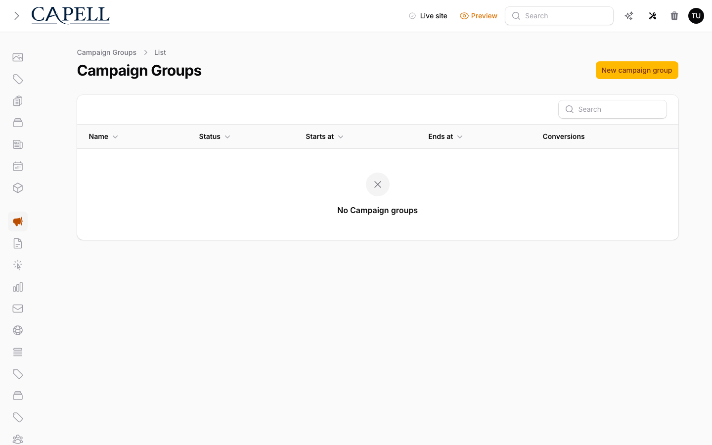
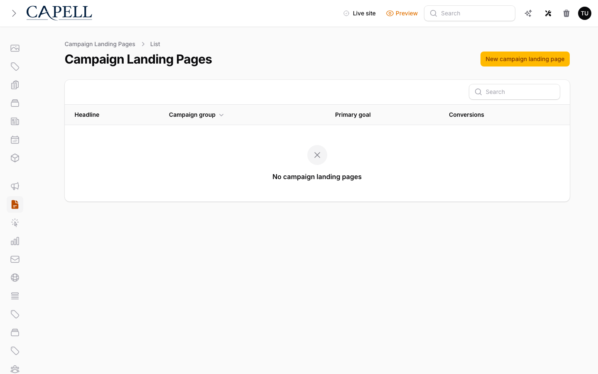
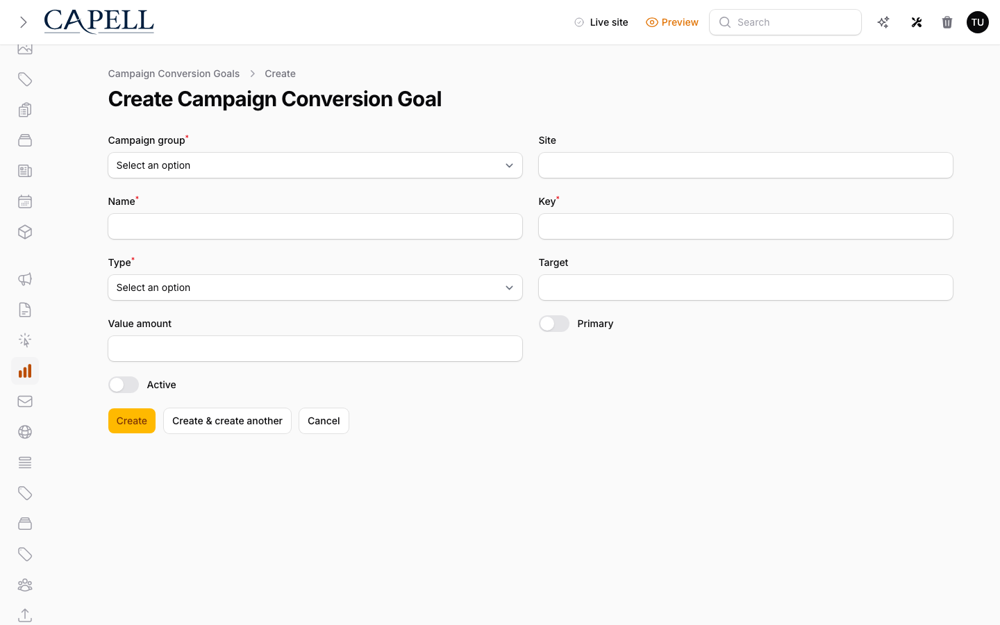
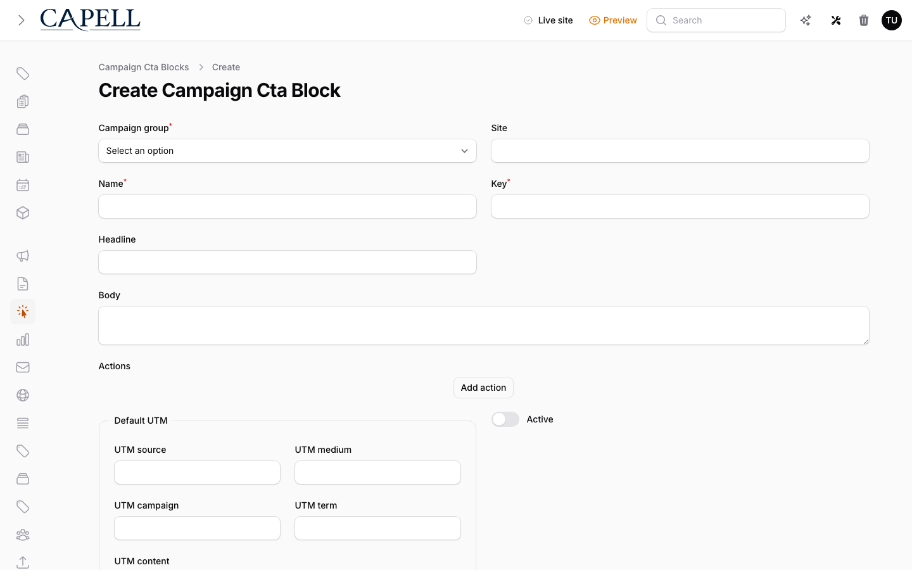
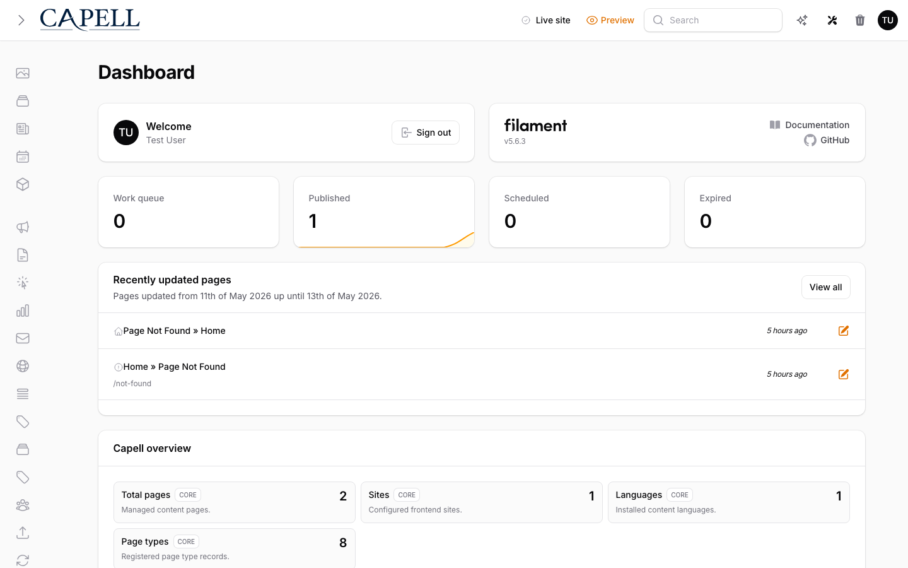
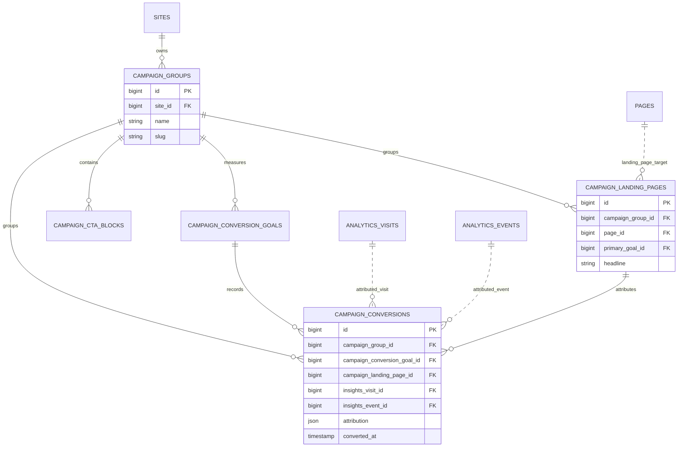

# CampaignStudio

Status: **Available, schema-owning** · Kind: **package** · Tier: **premium** · Bundle: **growth** · Contexts: **admin, frontend** · Product group: **Capell Growth**

This page is the consolidated implementation overview for the CampaignStudio package. It is extracted from the package README, service providers, migrations, config files, routes, resources, models, actions, and the shared Capell ERD notes where available.

## What This Package Adds

CampaignStudio adds campaign groups, landing pages, CTA widgets, conversion goals, UTM attribution, and conversion reporting to Capell.

- Campaign Filament resources for groups, landing pages, goals, and CTA widgets.
- Campaign dashboard widgets.
- Page schema extender for campaign fields.
- core layout builder widget configurators for campaign hero, CTA, and lead form widgets.
- Campaign hero widget CTAs can append configured UTM metadata through the shared campaign URL builder.
- Conversion recording actions for page views, CTA clicks, and form submissions.
- Public post-load conversion capture for page-view and CTA-click goals through the Campaign Studio beacon.
- UTM landing-page variant resolution only considers linked pages that are currently public-visible under Capell's page publish-date rules.
- Optional Experiments integration that syncs campaign landing-page variants and conversion goals into campaign-scoped experiment definitions.
- Campaign experiment result readout from synced Experiments winner reports, including per-variant conversion rates and lift over the control variant.

## Developer Notes

Connects Capell pages, FormBuilder, Insights, and core layout builder APIs through explicit actions and listener classes instead of inline resource logic.

- CampaignStudioServiceProvider, AdminServiceProvider, and FrontendServiceProvider register package surfaces.
- Config file: capell-campaign-studio.php.
- Migrations create campaign groups, goals, landing pages, CTA widgets, and conversions.
- Filament resources cover each owned model.
- Frontend routes and render hooks add the campaign conversion beacon and public tracker script.
- Listeners sync landing pages and form submission conversions.
- `CampaignConverted` is dispatched when a conversion row is newly recorded, giving Automation Studio and other packages a stable conversion trigger without importing Campaign Studio internals.
- `SyncCampaignExperimentAction` bridges to Experiments when that package is installed. It turns campaign landing pages into experiment variants, conversion goals into experiment goals, and the campaign UTM value into an audience rule.
- `BuildCampaignExperimentResultsAction` reads back campaign-scoped Experiments winner reports through typed Campaign Studio data.

## Operational Notes

Lets marketing and editorial teams connect landing pages to goals and see which campaign-studio convert.

- Adds campaign admin navigation and database tables.
- Adds campaign dashboard widgets.
- Adds config keys for conversion cookie, UTM keys, table names, tracker route prefix, and layout presets.
- Adds `attribution.lookback_days` so stale Insights visits can be excluded from conversion identity and attribution.
- May use Insights events and FormBuilder submissions when those packages are installed.
- May sync campaign-scoped experiments when `capell-app/experiments` is installed.
- Registers `POST /capell/campaigns/conversions` for same-origin page-view and CTA-click conversion capture.

## Frontend Conversion Capture

Campaign Studio injects a small public tracker at the frontend `BodyEnd` render hook. The tracker posts to `POST /capell/campaigns/conversions`, reads the existing Insights visit id from local storage or cookie when available, records page-view conversions for campaign landing pages, and records CTA-click conversions from elements with `data-campaign-goal`. CTA-click goals are resolved inside the campaign landing page matched from the submitted URL; unresolved URLs are ignored rather than attributed to another campaign with the same goal key.

The tracker is post-load and contains no admin/editor state, signed editor URLs, model ids, or field paths. Because Campaign Studio can render UTM-aware landing-page variants, its frontend contribution is recorded as non-cacheable with UTM variance metadata; HTML cache should not store those rendered pages, while static HTML that already exists can still load the tracker and record conversions after the response is served.

## Landing Page Variant Resolution

`ResolveCampaignLandingPageVariantAction` matches `utm_content` before `utm_term`, then falls back to the primary landing page and finally the first available landing page. Each candidate must have a linked Capell page passing the same `publishedDate()` scope used by the public frontend loader, so scheduled or expired pages are skipped and cannot be selected as campaign variants.

## Data And Retention

- campaign_groups belong to sites.
- campaign_landing_pages belong to groups and target pages.
- campaign_conversion_goals define measurable outcomes.
- campaign_cta_widgets store CTA content.
- campaign_conversions connect goals, landing pages, insights visits/events, and attribution JSON.

## Screenshot Plan

- Campaign groups index.
- Campaign landing pages index.
- Campaign conversion goals form.
- CTA widget form.
- Campaign dashboard widgets.
- Frontend landing page with campaign widgets.

## Screenshots

## Pitfalls

- Install dependent packages before expecting attribution from form-builder or insights.
- Check UTM keys before launch.
- Configure campaign hero UTM fields when hero CTAs should carry campaign attribution.
- Create conversion goals before reporting on landing page success.
- Keep the Insights tracker enabled when visitor-level deduplication is required for CTA/page-view conversions.
- Tune `capell-campaign-studio.attribution.lookback_days` for the marketing team's attribution policy.
- Publish linked Capell pages before expecting Campaign Studio to serve them as UTM-targeted variants.
- Treat UTM-targeted campaign variant pages as dynamic frontend output; do not rely on static HTML cache to personalize variant selection.

## Verification

- Run `vendor/bin/pest packages/campaign-studio/tests` when package tests exist.
- Run the relevant host-app migration or package install flow in a disposable database.
- Open the listed admin or frontend surface and compare it with the screenshot plan.

## Package Manifest

- Composer name: `capell-app/campaign-studio`
- Product group: Capell Growth
- Kind: package
- Tier: premium
- Bundle: growth
- Contexts: `admin`, `frontend`
- Requires: `capell-app/admin`, `capell-app/core`, `capell-app/form-builder`, `capell-app/frontend`, `capell-app/insights`, `capell-app/layout-builder`
- Optional dependencies: `capell-app/experiments`, `capell-app/seo-suite`

## Admin Surfaces

- CampaignConversionGoalResource (packages/campaign-studio/src/Filament/Resources/CampaignConversionGoals/CampaignConversionGoalResource.php)
- CreateCampaignConversionGoal (packages/campaign-studio/src/Filament/Resources/CampaignConversionGoals/Pages/CreateCampaignConversionGoal.php)
- EditCampaignConversionGoal (packages/campaign-studio/src/Filament/Resources/CampaignConversionGoals/Pages/EditCampaignConversionGoal.php)
- ListCampaignConversionGoals (packages/campaign-studio/src/Filament/Resources/CampaignConversionGoals/Pages/ListCampaignConversionGoals.php)
- CampaignCtaWidgetResource (packages/campaign-studio/src/Filament/Resources/CampaignCtaWidgets/CampaignCtaWidgetResource.php)
- CreateCampaignCtaWidget (packages/campaign-studio/src/Filament/Resources/CampaignCtaWidgets/Pages/CreateCampaignCtaWidget.php)
- EditCampaignCtaWidget (packages/campaign-studio/src/Filament/Resources/CampaignCtaWidgets/Pages/EditCampaignCtaWidget.php)
- ListCampaignCtaWidgets (packages/campaign-studio/src/Filament/Resources/CampaignCtaWidgets/Pages/ListCampaignCtaWidgets.php)
- CampaignGroupResource (packages/campaign-studio/src/Filament/Resources/CampaignGroups/CampaignGroupResource.php)
- CreateCampaignGroup (packages/campaign-studio/src/Filament/Resources/CampaignGroups/Pages/CreateCampaignGroup.php)
- EditCampaignGroup (packages/campaign-studio/src/Filament/Resources/CampaignGroups/Pages/EditCampaignGroup.php)
- ListCampaignGroups (packages/campaign-studio/src/Filament/Resources/CampaignGroups/Pages/ListCampaignGroups.php)
- CampaignLandingPageResource (packages/campaign-studio/src/Filament/Resources/CampaignLandingPages/CampaignLandingPageResource.php)
- CreateCampaignLandingPage (packages/campaign-studio/src/Filament/Resources/CampaignLandingPages/Pages/CreateCampaignLandingPage.php)
- EditCampaignLandingPage (packages/campaign-studio/src/Filament/Resources/CampaignLandingPages/Pages/EditCampaignLandingPage.php)
- ListCampaignLandingPages (packages/campaign-studio/src/Filament/Resources/CampaignLandingPages/Pages/ListCampaignLandingPages.php)

## Commands

- `capell:campaign-studio-install-layouts {--force : Update existing campaign layouts}` (packages/campaign-studio/src/Console/Commands/InstallCampaignLayoutsCommand.php)

## Routes And Config

- Config: packages/campaign-studio/config/capell-campaign-studio.php
- Route: `POST /capell/campaigns/conversions`

## Permissions And Gates

- Gate: CampaignOverviewStatsWidget: `admin`, `super_admin`
- Gate: TopCampaignStudioWidget: `admin`, `super_admin`
- Gate: TopLandingPagesWidget: `admin`, `super_admin`

## Migrations

- Migration: 2026_04_20_000001_create_campaign_groups_table.php
- Migration: 2026_04_20_000002_create_campaign_conversion_goals_table.php
- Migration: 2026_04_20_000003_create_campaign_landing_pages_table.php
- Migration: 2026_04_20_000004_create_campaign_cta_widgets_table.php
- Migration: 2026_04_20_000005_create_campaign_conversions_table.php

## ERD Excerpt

## Screenshot Automation

Deployment should read [screenshots.json](screenshots.json), install the package with demo data, resolve each admin surface or frontend URL, and write images to `packages/campaign-studio/docs/screenshots`.

- Campaign groups index.
- Campaign landing pages index.
- Campaign conversion goals form.
- CTA widget form.
- Campaign dashboard widgets.
- Frontend landing page with campaign widgets.
