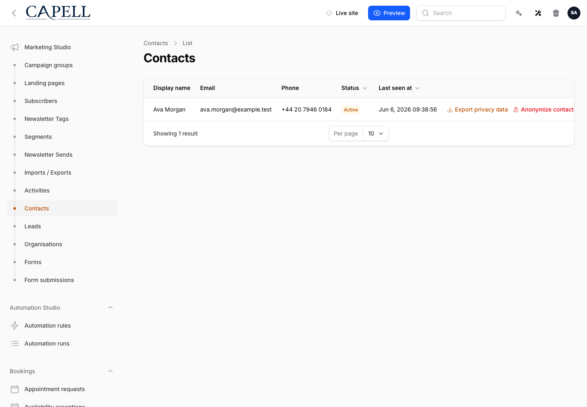
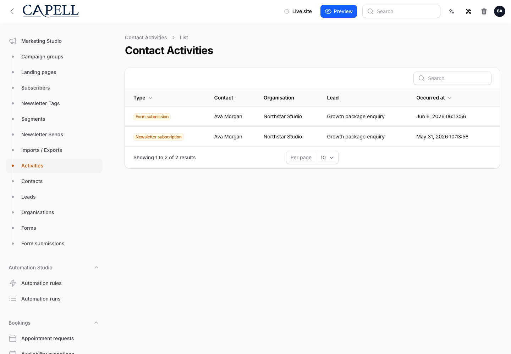

# Using Contacts

This guide is for staff who manage contacts and owners deciding how to segment them. Every step uses the labels you see on screen.

## Using Contacts (editor how-to)

### How to add a contact

1. Go to **Contacts**.
2. Add a new contact and fill in their details.
3. Save. The contact appears in your list.

### How to import contacts from a spreadsheet

1. In **Contacts**, open the import tool.
2. Provide your spreadsheet and match its columns to contact fields.
3. Import. The new contacts join your list.

### How to group contacts with tags

1. Open a contact, or select several.
2. Add **tags** that describe them (for example "Newsletter" or "VIP").
3. Save. You can now filter by tag.

### How to merge duplicates

1. Find the duplicate contacts.
2. Merge them into one record so history stays together.
3. Confirm the merged contact has the right details.

### How to export a list

1. Filter to the contacts you want.
2. Export the list to a spreadsheet.

### How to review contact activity

1. Go to **Activities**.
2. Review the timeline of activity recorded for your contacts, such as form submissions and event registrations.
3. Use it to see how each contact has engaged over time.

## Rolling out Contacts (for owners)

### Turn on first

- **A clean import and a simple tag scheme.** Decide your core tags before importing, so contacts are easy to segment from the start.

### Add when needed

| Need                      | Enable                         |
| ------------------------- | ------------------------------ |
| Target groups of people   | More **tags** for segmentation |
| Bring in an existing list | Import from a spreadsheet      |

### Don't enable yet

- Don't import without agreeing tags first, or you'll have a flat list that's hard to segment.

### Who does what

| Role       | First useful screen                  |
| ---------- | ------------------------------------ |
| Staff      | **Contacts**: add, tag, and import   |
| Site owner | **Tags**: keep the segmentation tidy |

## Troubleshooting for editors

| What you see                          | What it means                               | What to do                                            |
| ------------------------------------- | ------------------------------------------- | ----------------------------------------------------- |
| I have duplicate contacts             | The same person was added or imported twice | Merge the duplicates into one record                  |
| An import put data in the wrong field | The columns weren't matched correctly       | Re-import with the columns mapped to the right fields |
| I can't find a segment                | The contacts aren't tagged                  | Add **tags** so you can filter them                   |
