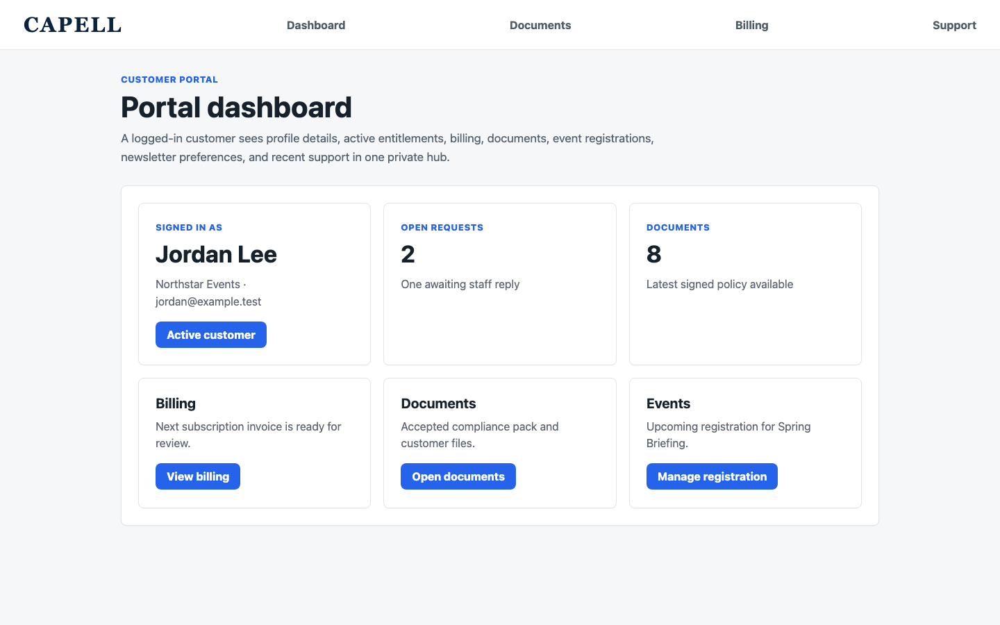
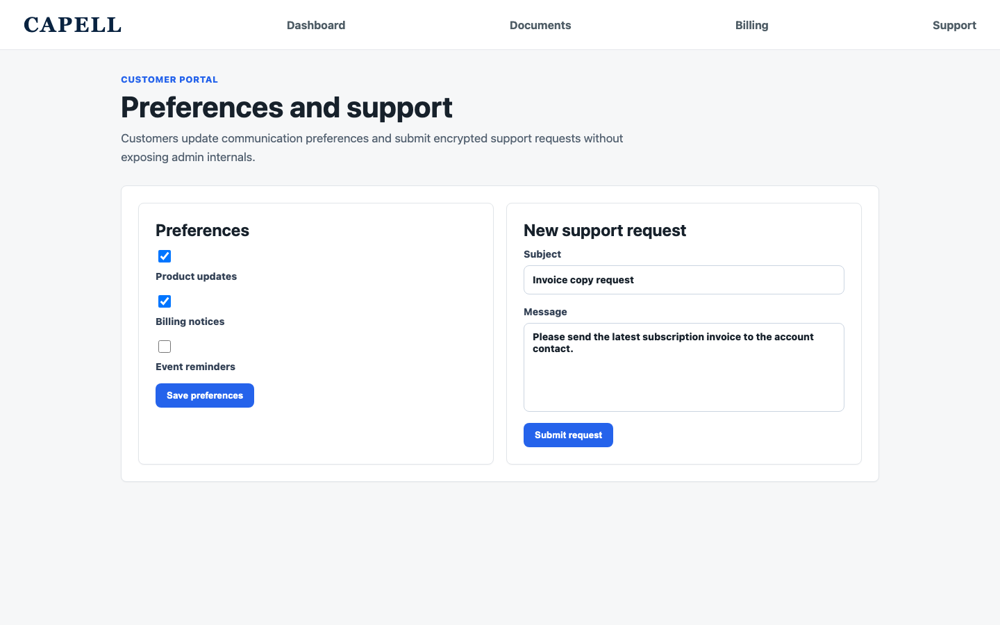
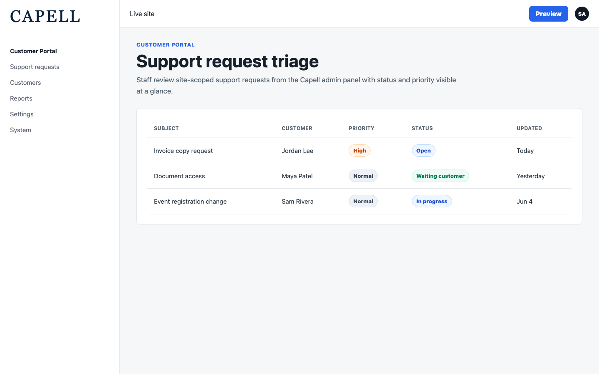
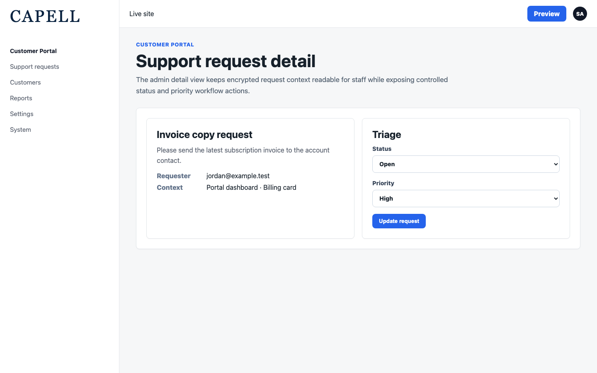

# Customer Portal

<!-- prettier-ignore-start -->

## What This Plugin Adds

Customer Portal is an **Available**, **Schema-owning** Capell package in the **Capell Content** product group. It ships as `capell-app/customer-portal` and extends these surfaces: admin, frontend.

Customer Portal turns a Capell site into an authenticated self-service experience. A single dashboard aggregates billing, documents, event registrations, gated resources and newsletter preferences contributed by your other Capell packages - no custom glue code, just install and they appear. Customers raise and track support requests; staff triage them from the admin panel with full status workflow and audit-safe, encrypted records. Built on Capell's Action and provider-registry architecture, it stays cache-safe and never leaks admin internals into public output.

After install, admins get package-owned management surfaces and public users may see package-owned frontend output or routes.

Status details:

- Status: Available
- Tier: premium
- Bundle: content-product
- Composer package: `capell-app/customer-portal`
- Namespace: `Capell\CustomerPortal`
- Theme key: not applicable

## Why It Matters

**For developers:** The package gives developers package-owned service providers, Actions, Data objects, models, Laravel routes, Filament classes, and Blade views instead of pushing this behaviour into core or application code.

**For teams:** A unified, logged-in customer hub for Capell sites - payments, documents, event registrations, gated content and support requests in one secure dashboard.

## Screens And Workflow

Screenshot contract: `screenshots.json`.

- Customer portal frontend dashboard (frontend, required).
- Customer portal preferences and support form (frontend, required).
- Customer portal support triage admin list (frontend, required).
- Customer portal support triage edit screen (frontend, required).

## Screenshot Evidence

These captures are the package-owned visual contract for the admin pages, public pages, actions, workflows, and feature surfaces described above. Keep this section aligned with `docs/screenshots.json` whenever the package surface changes.

### Customer portal frontend dashboard

- Surface: frontend · Target: capell-customer-portal.dashboard.
- Documents: A signed-in customer opens one private hub for account details and package-contributed self-service items.
- Capture notes: Route-backed Capell fixture showing the authenticated customer dashboard with profile, billing, documents, events, and support summary cards.

### Customer portal preferences and support form

- Surface: frontend · Target: capell-customer-portal.dashboard.
- Documents: A customer updates communication preferences and submits a support request without leaving the portal.
- Capture notes: Route-backed Capell fixture showing schema-driven preferences beside the encrypted support-request form.

### Customer portal support triage admin list

- Surface: frontend · Target: PortalSupportRequestResource.
- Documents: Staff triage customer support requests from the Capell admin panel.
- Capture notes: Route-backed Capell admin fixture showing site-scoped support requests with status and priority indicators.

### Customer portal support triage edit screen

- Surface: frontend · Target: PortalSupportRequestResource.edit.
- Documents: Staff review a customer request and update triage workflow fields.
- Capture notes: Route-backed Capell admin fixture showing support request detail, encrypted context, status, and priority workflow controls.

## Technical Shape

- Service providers: `Capell\CustomerPortal\Providers\CustomerPortalServiceProvider`, `Capell\CustomerPortal\Providers\AdminServiceProvider`.
- Config files: `packages/customer-portal/config/capell-customer-portal.php`.
- Migrations: `packages/customer-portal/database/migrations/2026_05_31_150000_01_create_portal_accounts_table.php`, `packages/customer-portal/database/migrations/2026_05_31_150000_02_create_portal_support_requests_table.php`, `packages/customer-portal/database/migrations/2026_06_06_000001_create_portal_support_request_replies_table.php`.
- Models: `PortalAccount`, `PortalSupportRequest`, `PortalSupportRequestReply`.
- Filament classes: `EditPortalSupportRequest`, `ListPortalSupportRequests`, `PortalSupportRequestResource`.
- Route files: `packages/customer-portal/routes/web.php`.
- Events: `PortalSupportRequestStatusChanged`, `PortalSupportRequestSubmitted`.
- Actions: `AddSupportRequestReplyAction`, `FindOrCreatePortalAccountAction`, `ResolveAuthenticatedPortalAccountAction`, `ResolvePortalDashboardItemsAction`, `ResolvePortalPreferenceOptionsAction`, `ResolvePortalProfileAction`, `ResolvePortalSelfServiceItemsAction`, `SubmitSupportRequestAction`, `UpdatePortalPreferencesAction`, `UpdateSupportRequestStatusAction`.
- Data objects: `PortalAccountIdentityData`, `PortalDashboardItemData`, `PortalPreferenceOptionData`, `PortalPreferencesData`, `PortalProfileData`, `PortalSelfServiceItemData`, `SupportRequestData`.
- Manifest contributions: `admin-resource: Capell\CustomerPortal\Manifest\PortalSupportRequestResourceContribution`, `model: Capell\CustomerPortal\Manifest\CustomerPortalModelsContribution`, `route: Capell\CustomerPortal\Manifest\CustomerPortalFrontendRoutesContribution`.
- Health checks: `Capell\CustomerPortal\Health\CustomerPortalHealthCheck`.
- Blade views: `packages/customer-portal/resources/views/dashboard.blade.php`.
- Cache tags: `customer-portal`.

## Data Model

- Required tables: `portal_accounts`, `portal_support_requests`, `portal_support_request_replies`.
- Models: `PortalAccount`, `PortalSupportRequest`, `PortalSupportRequestReply`.
- Migration files: `2026_05_31_150000_01_create_portal_accounts_table.php`, `2026_05_31_150000_02_create_portal_support_requests_table.php`, `2026_06_06_000001_create_portal_support_request_replies_table.php`.
- Migration impact: run host migrations through the package install flow before opening package surfaces.
- Deletion/retention behaviour: Docs gap unless the package has an explicit pruning command, retention setting, or tested cascade path.

## Install Impact

- Admin navigation: adds package-owned Filament classes when registered.
- Permissions: `ViewAny:PortalSupportRequest`, `View:PortalSupportRequest`, `Update:PortalSupportRequest`.
- Public routes: route files exist and must be reviewed before public enablement.
- Database changes: package migrations are declared.
- Settings: no package settings declared.
- Queues or schedules: none detected in standard package paths.
- Cache tags: `customer-portal`.
- Commands: none declared.

## Common Pitfalls

- Run migrations before opening package resources or public routes.
- Review route middleware, throttling, signed URLs, and public-output safety before exposing routes.
- Keep public Blade and cached HTML free of authoring markers, model IDs, permissions, signed editor URLs, and lazy database queries.
- Keep `composer.json`, `composer.local.json`, `capell.json`, docs, screenshots, and tests aligned when the package surface changes.

## Troubleshooting

| Symptom | Likely cause | Check | Fix |
| --- | --- | --- | --- |
| Package surface is missing after install | Provider or manifest is not loaded | Confirm `capell.json`, package `composer.json`, and provider registration | Reinstall the package, refresh Composer autoload, and clear host caches |
| Admin screen or command fails on missing table | Package migrations have not run | Check the tables listed in `Data Model` | Run host migrations and rerun the focused package test |
| Route returns unexpected output | Route cache, middleware, or signed URL setup does not match the package route file | Check the route files listed in `Technical Shape` | Clear route cache and verify middleware before exposing public routes |
| Public output leaks unexpected state | Render data, cache variation, or authoring boundary has regressed | Check public Blade, cache tags, and public-output safety tests | Move data loading out of Blade and rerun the package public-output tests |

## Quick Start

1. Install the package: `composer require capell-app/customer-portal`.
2. Run the required setup: `php artisan migrate`.
3. Open the related Capell admin surface and verify Customer Portal appears.

## Next Steps

- [Package docs index](README.md)
- [Screenshot contract](screenshots.json)
- [Marketplace assets](assets/marketplace/)
- [Capell content language plan](../../../docs/CONTENT_LANGUAGE_PLAN.md)
- [Capell documentation design system](../../../docs/DESIGN_SYSTEM.md)
- [Capell and package ERD notes](../../../docs/erd/capell-and-package-erds.md)
- Related packages: [Access Gate](../../access-gate/README.md), [Contacts](../../contacts/README.md), [Document Lifecycle](../../document-lifecycle/README.md), [Events](../../events/README.md), [Newsletter](../../newsletter/README.md), [Payments](../../payments/README.md), [Privacy Center](../../privacy-center/README.md).
- Focused tests: `vendor/bin/pest packages/customer-portal/tests --configuration=phpunit.xml`.

<!-- prettier-ignore-end -->
