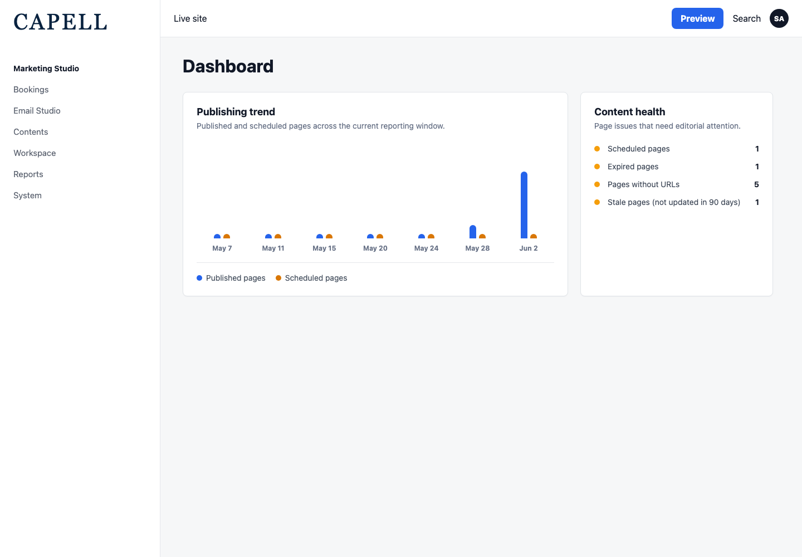
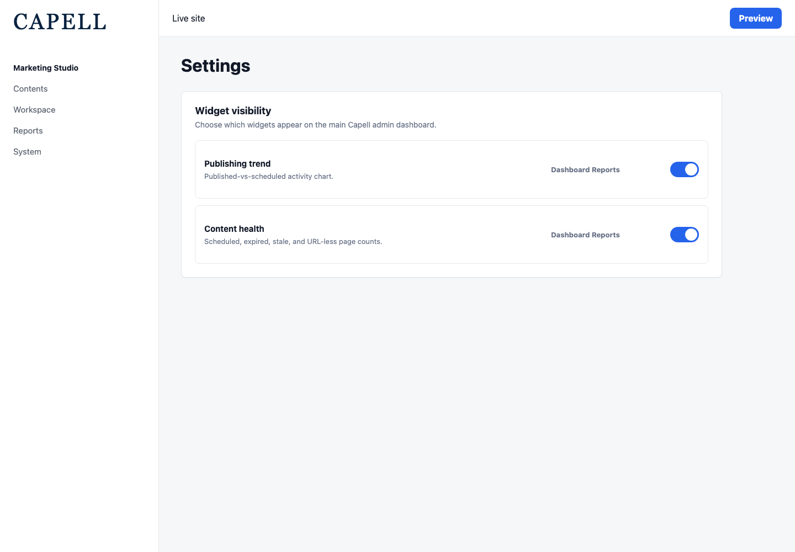

# Dashboard Reports

<!-- prettier-ignore-start -->

## What This Plugin Adds

Dashboard Reports is an **Available**, **No schema impact** Capell package in the **Capell Operations** product group. It ships as `capell-app/dashboard-reports` and extends these surfaces: admin.

Dashboard Reports surfaces editorial health and publishing momentum directly on the Capell admin dashboard, so owners and editors see what needs attention the moment they log in. The Content Health widget flags scheduled, expired, stale, and URL-less pages with one-click deep-links into the page list, while the Publishing Trend chart tracks published-vs-scheduled activity across any date window. All counts respect each user's site access, and report visibility is toggleable per dashboard. Built on testable Actions and typed Data objects so teams can extend the reporting layer instead of bolting on a bespoke analytics package.

After install, admins get package-owned management or reporting surfaces inside Capell.

Status details:

- Status: Available
- Tier: premium
- Bundle: operations
- Composer package: `capell-app/dashboard-reports`
- Namespace: `Capell\DashboardReports`
- Theme key: not applicable

## Why It Matters

**For developers:** The package gives developers package-owned service providers, Actions, Data objects, Filament classes, and Blade views instead of pushing this behaviour into core or application code.

**For teams:** At-a-glance content-health and publishing-activity widgets for the Capell admin dashboard - spot scheduled, expired, stale, and URL-less pages without opening a single resource.

## Screens And Workflow

Screenshot contract: `screenshots.json`.

- Publishing trend dashboard widget (admin, required).
- Content health dashboard widget (admin, required).
- Dashboard report visibility settings (admin, required).

## Screenshot Evidence

These captures are the package-owned visual contract for the admin pages, public pages, actions, workflows, and feature surfaces described above. Keep this section aligned with `docs/screenshots.json` whenever the package surface changes.

### Publishing trend dashboard widget

- Surface: admin · Target: PublishingTrendChartWidget.
- Documents: An administrator checks whether publishing and scheduling activity changed during the current reporting window.
- Capture notes: Capture on the main admin dashboard with seeded published and scheduled page counts across the selected date window.

### Content health dashboard widget

- Surface: admin · Target: ContentHealthWidget.
- Documents: An editor spots page health issues that need attention before the next publishing review.
- Capture notes: Capture on the main admin dashboard with at least one scheduled, expired, URL-less, or stale page so canView() keeps the widget visible.

### Dashboard report visibility settings

- Surface: admin · Target: DashboardReportsDashboardSettingsContributor.
- Documents: A site owner confirms the Dashboard Reports widgets can be enabled or hidden through dashboard settings.
- Capture notes: Capture the shared dashboard settings screen after this package contributes the publishing trend and content health visibility keys.

## Technical Shape

- Service providers: `Capell\DashboardReports\Providers\DashboardReportsServiceProvider`, `Capell\DashboardReports\Providers\AdminServiceProvider`.
- Config files: `packages/dashboard-reports/config/capell-dashboard-reports.php`.
- Filament classes: `DashboardReportsPageTableExtender`, `DashboardReportsDashboardSettingsContributor`, `ContentHealthWidget`, `PublishingTrendChartWidget`.
- Extension points: sibling packages can resolve `Capell\DashboardReports\Support\Dashboard\DashboardReportWidgetRegistry` and call `register($widgetClass, DashboardEnum::Main)` during package registration to add dashboard report widgets without bypassing the package's registration path.
- Actions: `BuildDefaultContentHealthAction`, `BuildPublishingTrendAction`, `ExportContentHealthCsvAction`, `ExportPublishingTrendCsvAction`, `SendDashboardReportDigestAction`.
- Data objects: `PublishingTrendData`, `PublishingTrendPointData`, `ResolvedDashboardReportsSettingsData`.
- Command signatures: `capell:dashboard-reports:export`, `capell:dashboard-reports:send-digest`.
- Console command classes: `ExportDashboardReportCommand`, `SendDashboardReportDigestCommand`.
- Health checks: `Capell\DashboardReports\Health\DashboardReportsHealthCheck`.
- Blade views: `packages/dashboard-reports/resources/views/widgets/content-health.blade.php`.

## Data Model

This package has no schema impact. It does not declare package-owned migrations or required tables.

Docs gap: document extension points here if the package delegates persistence to a host package.

## Install Impact

- Admin navigation: adds package-owned Filament classes when registered.
- Permissions: none declared in `capell.json`.
- Public routes: none detected in package route files.
- Database changes: no package migrations declared.
- Settings: no package settings declared.
- Queues or schedules: hosts can schedule `capell:dashboard-reports:send-digest`; digest notifications are queued and only send to configured emails that match Capell users.
- Cache tags: none declared.
- Commands: `capell:dashboard-reports:export`, `capell:dashboard-reports:send-digest`.

## Common Pitfalls

- Verify the package is installed before expecting its provider, views, or extension contributions to run.
- Keep `composer.json`, `composer.local.json`, `capell.json`, docs, screenshots, and tests aligned when the package surface changes.

## Troubleshooting

| Symptom | Likely cause | Check | Fix |
| --- | --- | --- | --- |
| Package surface is missing after install | Provider or manifest is not loaded | Confirm `capell.json`, package `composer.json`, and provider registration | Reinstall the package, refresh Composer autoload, and clear host caches |
| Background work does not run | Queue worker or scheduled command is not active | Check package jobs, commands, and host scheduler configuration | Start the queue or scheduler, then run the focused command or package test |

## Quick Start

1. Install the package: `composer require capell-app/dashboard-reports`.
2. Run the required setup: no package migrations are declared; clear cached config and routes if the host app uses caches.
3. Open the related Capell admin surface and verify Dashboard Reports appears.

## Next Steps

- [Package docs index](README.md)
- [Screenshot contract](screenshots.json)
- [Marketplace assets](assets/marketplace/)
- [Capell content language plan](../../../docs/CONTENT_LANGUAGE_PLAN.md)
- [Capell documentation design system](../../../docs/DESIGN_SYSTEM.md)
- [Capell and package ERD notes](../../../docs/erd/capell-and-package-erds.md)
- Focused tests: `vendor/bin/pest packages/dashboard-reports/tests --configuration=phpunit.xml`.

<!-- prettier-ignore-end -->
