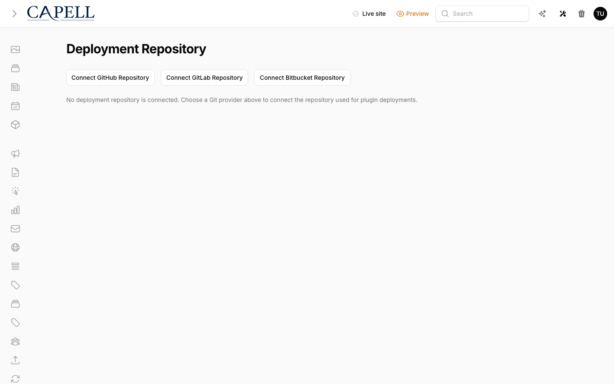

# Using Deployments

This guide is for the people who keep your site's add-on packages up to date: operators who connect the deployment repository and watch what gets published, and owners deciding how releases are applied. No technical knowledge needed. Every step uses the labels you see on screen. The page lives under **System > Deployment Repository**.

## Using Deployments (how-to)

### How to connect your repository to a Git provider

1. Go to **System > Deployment Repository**.
2. If nothing is connected yet you see the message "No deployment repository is connected. Choose a Git provider above to connect the repository used for plugin deployments."
3. Fill in **Repository owner or group**. This is the account or team that owns the repository.
4. Fill in **Repository name**. This is the name of the repository itself.
5. Choose your provider by clicking **Connect GitHub Repository**, **Connect GitLab Repository**, or **Connect Bitbucket Repository**.
6. Complete the sign-in for that provider when it asks you to. Once you approve, you are returned to the page and the repository is connected.

### How to see whether a repository is connected

1. Go to **System > Deployment Repository**.
2. If a repository is connected, the page shows **Connected to <provider> - <repo>** near the top, along with a **Disconnect** button.
3. If nothing is connected, you instead see the message "No deployment repository is connected. Choose a Git provider above to connect the repository used for plugin deployments." and the three provider buttons.

### How to review recent publishes and read their statuses

1. Go to **System > Deployment Repository**.
2. Look at the **Recent publishes** section. Each row shows the **Package**, the **Reference**, the **Status**, when it was **Published**, and any available **Actions**.
3. The **Reference** points at the pull request raised for that change. It shows as "PR <id>".
4. Read the **Status** to see how that publish went:
    - **Pending**: the pull request has been raised and is still waiting.
    - **Passed**: the change was applied cleanly.
    - **Failed**: the change did not complete. Share this with your developer.
    - **Cancelled**: the publish was stopped before it finished.
    - **Dry run**: a safe check that confirms a change works without applying it.
5. If nothing has run yet you see "No Composer requirement publishes have been recorded for this repository yet."

### How to cancel a pending publish

1. Go to **System > Deployment Repository** and find the row in **Recent publishes**.
2. A row with the **Pending** status shows a **Cancel** button in its **Actions**.
3. Click **Cancel**.
4. Confirm when asked "Cancel this pending deployment publication pull request?"
5. The publish stops and its status moves to **Cancelled**.

### How to choose the Install policy

1. Go to **System > Deployment Repository**.
2. Find the **Install policy** setting.
3. Choose the option that matches how you want package changes applied, then save.

### How to disconnect the repository

1. Go to **System > Deployment Repository**.
2. Click **Disconnect** next to **Connected to <provider> - <repo>**.
3. Confirm when asked "Are you sure you want to disconnect this deployment repository?"
4. The repository is disconnected. To start again, connect a provider as above.

## Rolling out Deployments (for owners)

### Connect first

- **Connect the deployment repository.** Nothing happens here until a repository is connected. Enter the **Repository owner or group** and **Repository name**, pick a provider with **Connect GitHub Repository**, **Connect GitLab Repository**, or **Connect Bitbucket Repository**, and complete the sign-in. This is the repository where package install pull requests are raised.

### Choose how changes are applied

- **Install policy.** Decide how package changes are handled once they are published. Pick the option that fits how cautious you want to be, then save. When in doubt, prefer the safer choice and review publishes in **Recent publishes** before relying on them.

### Watch, then decide

- Use **Recent publishes** as your status view. **Passed** means a change went out cleanly. **Pending** means it is still in flight, so wait for it to finish. **Failed** is the one to act on: tell your developer. A **Dry run** confirms a change works without applying it, so it is the safe way to check before committing.

### Disconnecting

- Use **Disconnect** to stop using a repository. You can reconnect later. Disconnecting does not undo changes that have already been published.

## Troubleshooting

| What you see                                                                                                                | What it means                                  | What to do                                                                                                                          |
| --------------------------------------------------------------------------------------------------------------------------- | ---------------------------------------------- | ----------------------------------------------------------------------------------------------------------------------------------- |
| "No deployment repository is connected. Choose a Git provider above to connect the repository used for plugin deployments." | No repository is connected yet                 | Enter the **Repository owner or group** and **Repository name**, then click one of the **Connect** buttons and complete the sign-in |
| A publish shows **Failed**                                                                                                  | The change did not complete                    | Tell your developer and share what the **Status** and **Reference** ("PR <id>") show                                                |
| A publish stays on **Pending**                                                                                              | The pull request is still in flight            | Wait for it to finish before making more changes; cancel it with **Cancel** only if you no longer want it                           |
| "No Composer requirement publishes have been recorded for this repository yet."                                             | Nothing has been published for this repository | This is normal for a new connection; it fills in once changes are published                                                         |
| You expected a change but see a **Dry run**                                                                                 | This was a safe check, not a real apply        | Run the real publish when you are ready, or ask your developer if a dry run is all that was intended                                |
| The **Disconnect** button is missing                                                                                        | No repository is connected                     | Connect a provider first; **Disconnect** only appears once **Connected to <provider> - <repo>** is shown                            |
