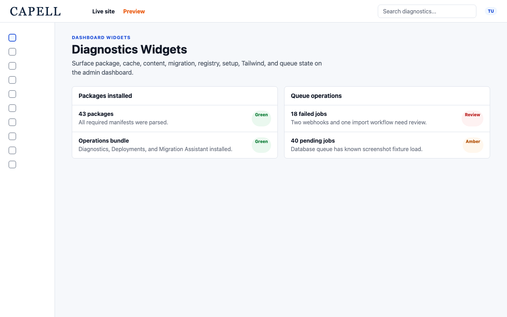
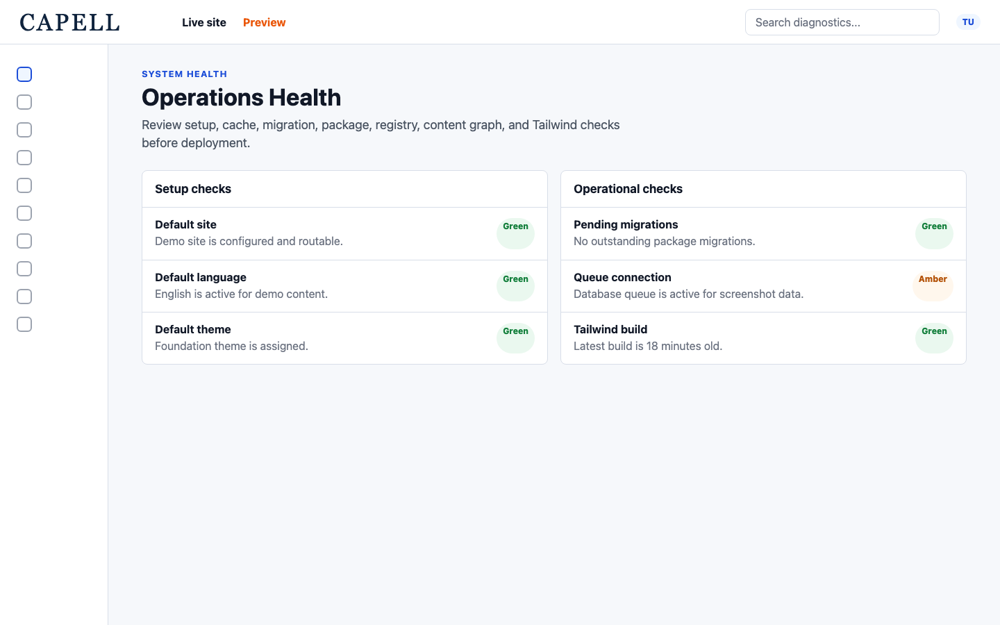
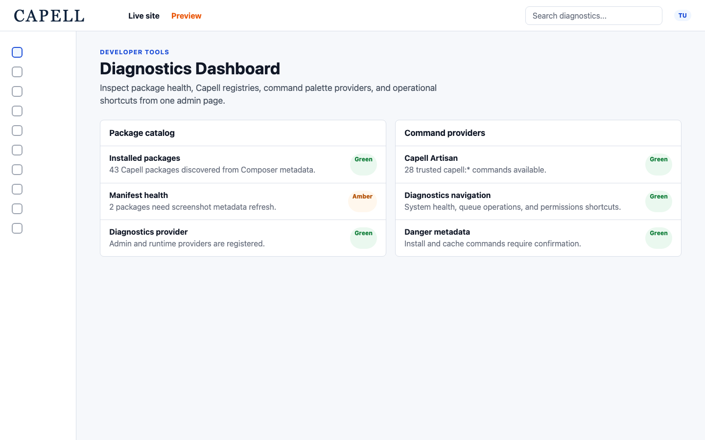
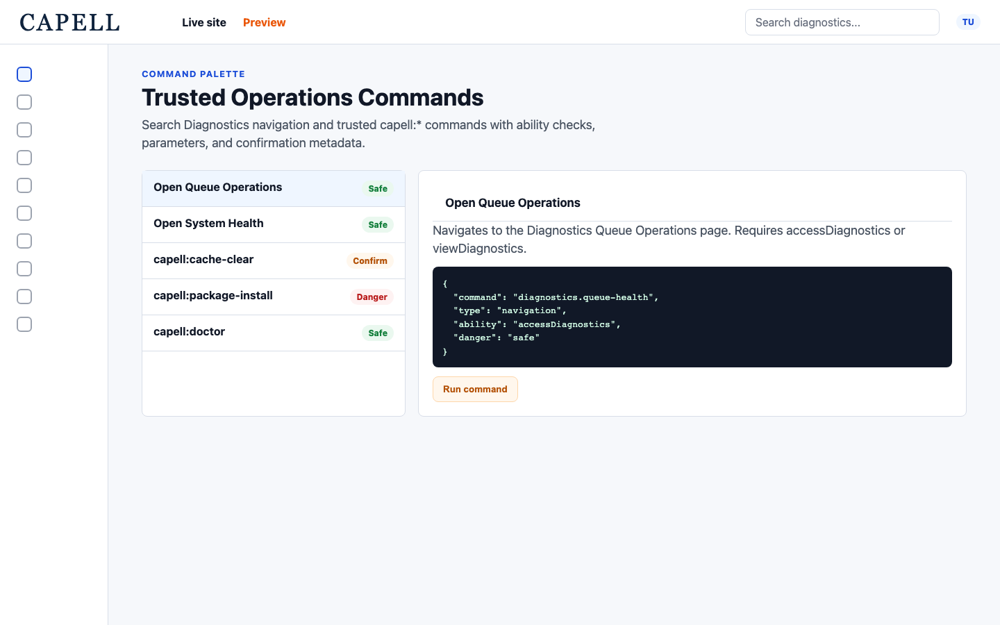
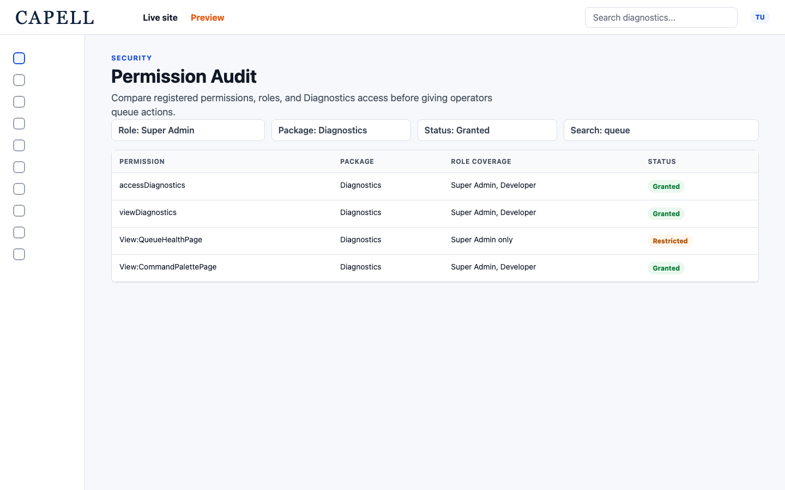

# Using Diagnostics

This guide is for the people who keep the site running: operators who check whether everything is healthy before and after a release, and the developers they work with. Diagnostics gives you health panels you can read at a glance, plus a few screens that let you run maintenance tasks safely. The health panels are read-only, so looking at them changes nothing. Two screens, the Command Palette and Queue Operations, do take action, so this guide tells you exactly when that happens. Green means healthy. A warning or failure means something needs attention. Every step uses the labels you see on screen.

## Using Diagnostics (how-to)

### How to read the health widgets on your admin dashboard

1. Open your admin dashboard. The health widgets are grouped together near the top.
2. Read each panel and check its colour. Green means that area is healthy. A warning or failure colour means it needs attention.
3. The panels you will see are **Setup health**, **Cache health**, **Migrations health**, **Registry health**, **Config drift**, **Content health**, **Content graph**, **Tailwind build status**, **Packages installed**, and **Public output safety**.
4. **Setup health** lists any **Items to complete:**. When there is nothing outstanding it shows "All setup requirements met!".
5. If a panel is green, there is nothing to do. If a panel warns or fails and you are not sure what it means, note the panel name and its message and send it to your developer.

### How to review System health

1. Go to **System health**.
2. Read each panel the same way as on the dashboard: green is healthy, a warning or failure needs attention.
3. Use this screen as your first stop before you change package setup, run a deployment, or alter publishing configuration. It gives you the full picture in one place.
4. If something fails, decide whether it is a thing you can fix yourself (described in the panel) or a thing for a developer, then act or escalate.

### How to warm the cache from Cache health

1. Find the **Cache health** panel, either on your dashboard or on **System health**.
2. Click **Warm cache**.
3. The button shows **Warming...** while it works. When it finishes it shows **Last warmed:** followed by the time it ran.
4. Warming the cache is safe to do at any time. It refreshes cached data so the next visitor gets an up-to-date page.

### How to check pending migrations

1. Find the **Migrations health** panel on your dashboard or on **System health**.
2. Read the status. When everything is up to date it shows **All migrated** along with the **Last batch:** that ran.
3. If it shows **Pending migrations**, the database has changes waiting to be applied. This usually follows a deployment and is a job for your developer.
4. If it shows **Orphaned registrations**, a registered migration no longer matches the files on the site. Note this and pass it to your developer.

### How to review installed packages on the developer tools dashboard

1. Go to **Diagnostics** to open the developer tools dashboard.
2. Find the **Packages installed** panel. It lists each package with columns for **Package**, **Version**, **Bundle**, **Commands**, **Health**, **Docs**, **Admin guide**, and **README**.
3. The **Health** column tells you at a glance whether each package is in good shape.
4. Each package shows whether its configuration is **Config published** or **Not published**. "Not published" means the package is using its shipped defaults, which is normal unless you meant to customise it.
5. Use the **Docs**, **Admin guide**, and **README** links to open a package's documentation when you need more detail.

### How to run a maintenance command from the Command Palette

1. Go to **Command Palette**.
2. In the search box (placeholder "Search commands, packages, cache, migrations..."), type what you are looking for. Results are grouped under **Developer tools** and **Commands**.
3. Pick a result. The screen prompts you to **Select a command to review parameters, permission scope, and confirmation requirements.** so you can see exactly what the command does before running it.
4. Fill in any parameters the command asks for.
5. If the command needs confirmation, you will see "This operational command requires confirmation before it runs." For commands that make wider changes you will also see "This command may make broad or destructive operational changes."
6. When a command requires confirmation, tick the checkbox "I understand this command will run on this application."
7. Click **Run** to run it, or **Cancel** to back out without running anything.

### How to audit permissions and roles

1. Go to **Permission Audit**.
2. Read the **Permissions**, **Roles**, and **Users** sections. Together they show which permissions are registered and how well your roles cover them.
3. Run this audit after you install or remove a package, since that can change which permissions exist.
4. If a permission looks uncovered or a role looks wrong, note it and work with your developer to adjust the roles.

### How to check Queue Operations

1. Go to **Queue Operations**.
2. At the top, read the summary stats: **Tracked jobs**, **Succeeded**, **Pending**, and **Failed**. This is your quick health check for background work.
3. Switch between the tabs **History**, **Failed jobs**, and **Pending jobs** to focus on what you need.
4. Each row shows a job's details, including **Job**, **Status**, **Attempts**, **Duration**, **Started at**, **Finished at**, **Failed At**, and **Exception**. A status can be **Pending**, **Processing**, **Running**, **Succeeded**, **Failed**, or **Delayed**.
5. To narrow the list by date, use the **From** and **Until** filters.

To retry a failed job:

1. Open the **Failed jobs** tab.
2. Click **Retry** on a single job to run it again, or **Retry failed jobs** to retry them all at once.

To delete a pending job:

1. Open the **Pending jobs** tab.
2. Click **Delete pending job** on the job you want to remove. This stops it from running.

To prune history:

1. Click **Prune history**.
2. This clears out old tracked-job records so the list stays manageable. It does not affect jobs that are still waiting to run.

## Rolling out Diagnostics (for owners)

Diagnostics is mostly a tool for the people who keep the site running. Decide who looks at it and who is allowed to act from it.

### Start with the health widgets

- The health widgets on your admin dashboard and on **System health** are read-only. Anyone responsible for the site can read them safely. Make these the first thing your team checks when something seems wrong, before escalating.

### Who does what

| Task                                               | Who                                                                |
| -------------------------------------------------- | ------------------------------------------------------------------ |
| Read the health widgets and **System health**      | Operator or owner: safe to view, nothing can break                 |
| Warm the cache from **Cache health**               | Operator: safe to run at any time                                  |
| Read **Migrations health** and **Config drift**    | Operator reads; applying migrations or fixing drift is a developer |
| Review **Packages installed** on **Diagnostics**   | Operator or developer                                              |
| Run a command from **Command Palette**             | Developer: these run real commands, some make broad changes        |
| Audit **Permission Audit**                         | Administrator reads; changing roles is a developer task            |
| Act on **Queue Operations** (retry, delete, prune) | Operator or developer, depending on the job                        |

### Read-only versus action

- The health widgets only show you information. Reading them cannot change anything.
- The **Command Palette** and **Queue Operations** screens do take action. Use them deliberately, read the confirmation messages, and let your developer run anything marked as making broad or destructive changes.

## Troubleshooting

| What you see                                                 | What it means                                                                                         | What to do                                                                                         |
| ------------------------------------------------------------ | ----------------------------------------------------------------------------------------------------- | -------------------------------------------------------------------------------------------------- |
| A health panel is green                                      | That area is healthy                                                                                  | Nothing to do                                                                                      |
| **Setup health** lists **Items to complete:**                | Some setup steps are still outstanding                                                                | Work through each listed item until it shows "All setup requirements met!"                         |
| **Cache health** warns                                       | Cached data may be out of date                                                                        | Click **Warm cache**; if it still warns, note it for your developer                                |
| **Migrations health** shows **Pending migrations**           | Database changes are waiting to be applied, usually after a deployment                                | Ask your developer to apply the pending migrations                                                 |
| **Migrations health** shows **Orphaned registrations**       | A registered migration no longer matches the files on the site                                        | Note it and pass it to your developer                                                              |
| **Config drift** shows **missing**                           | A key in the shipped config is absent from the host. Missing = key in shipped config absent from host | Send the drift details to your developer to reconcile the configuration                            |
| **Config drift** shows **stale**                             | A key in the host config is no longer shipped. Stale = key in host config no longer shipped           | Send the drift details to your developer; when there is none it shows "No config drift detected"   |
| **Tailwind build status** shows **stale** or **never built** | The site styles have not been built, or were built against older input                                | Ask your developer to rebuild; **fresh** means it is up to date                                    |
| A package shows **Not published** under **Config published** | That package is using its shipped default configuration                                               | Normal unless you meant to customise it; otherwise ask your developer to publish its config        |
| A queue job shows **Failed**                                 | A background job did not complete                                                                     | Open **Failed jobs**, read the **Exception**, then click **Retry** or share it with your developer |
| Jobs are stuck on **Pending** or **Delayed**                 | Background work is not being processed                                                                | Share the **Queue Operations** view with your developer                                            |
| A red check you do not understand                            | A check failed and the message is unclear                                                             | Send the panel name and its message to your developer                                              |
