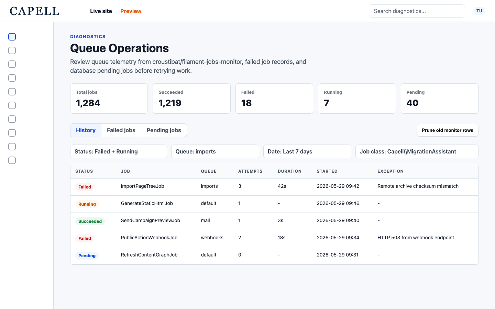

# Diagnostics

Status: **Available, audited schema** · Kind: **package** · Tier: **premium** · Bundle: **operations** · Contexts: **admin, console** · Product group: **Capell Operations**

This page is the consolidated implementation overview for the Diagnostics package. It is extracted from the package README, service providers, migrations, config files, routes, resources, models, actions, and the shared Capell ERD notes where available.

## What This Package Adds

Diagnostics adds operational diagnostics for cache, configuration drift, migrations, packages, registries, queues, permissions, setup health, and Tailwind build status.

- Command palette admin page.
- System health admin pages.
- Developer tools dashboard page.
- Permission audit report.
- Queue Operations report backed by [`croustibat/filament-jobs-monitor`](https://github.com/ultraviolettes/filament-jobs-monitor) queue telemetry.
- Health widgets for cache, content, migrations, registry, setup, packages, and Tailwind.
- Secure command palette discovery, execution, feedback, and audit logging for developer tools, system health, queue health, and trusted `capell:*` Artisan operations.
- Health-check reflection that reports implemented, stub, and broken manifest declarations across installed packages.
- `capell:diagnostics:health` for running declared extension health checks from the console.

## Developer Notes

Keeps diagnostics in actions and data objects so admin pages can show health information without hard-coded checks in the UI.

- DiagnosticsServiceProvider and AdminServiceProvider register admin pages and widgets.
- AdminServiceProvider registers `CapellArtisanPaletteCommandProvider` and `DiagnosticsPaletteCommandProvider` through the `capell.diagnostics.command-palette-provider` tag.
- Command palette actions discover providers dynamically, authorize commands, validate parameters, execute navigation or Artisan commands, and record audit runs.
- Command palette output is redacted before response and audit persistence.
- `RunExtensionHealthChecksAction` resolves declared package health checks, classifies implementation status, and executes runnable checks.
- Actions build each health report.
- Data objects describe report rows and dashboard state.
- QueueMonitor, FailedJob, and PendingQueueJob models support Queue Operations reporting.
- Infrastructure status reports cover cache, queue, mail, and storage configuration.
- CommandPaletteRun model records command palette execution history.

## Queue Operations

Diagnostics uses [`croustibat/filament-jobs-monitor`](https://packagist.org/packages/croustibat/filament-jobs-monitor), maintained at [`ultraviolettes/filament-jobs-monitor`](https://github.com/ultraviolettes/filament-jobs-monitor), as its low-level queue monitor. The upstream package listens to Laravel queue events and writes `queue_monitors` rows; Capell owns the Diagnostics page, permissions, Capell queue discovery, retry/delete Actions, retention config, and screenshot fixtures.

- Upstream navigation is disabled so operators use the Capell-native Queue Operations page.
- `queue_monitors` is created by a guarded Diagnostics migration when the upstream table is not already installed.
- Queue names are discovered from `capell-diagnostics.queue_monitor.queues`, package queue config paths, and the active Laravel queue connection.
- Pending database queue jobs are shown only when the database queue driver and jobs table are active.
- Retry, bulk retry, pending deletion, and pruning are handled by Diagnostics Actions.

See [queue-operations.md](queue-operations.md) for the focused runbook and upstream credit requirements.

## Operational Notes

Helps operators and agencies see setup problems before they become publishing or deployment issues.

- Adds admin pages for developer diagnostics.
- Adds dashboard widgets.
- Adds the `command_palette_runs` audit table.
- No public routes are registered by this package.

## Data And Retention

- This package owns the `command_palette_runs` table for command palette audit history.
- This package ships a guarded, upstream-compatible `queue_monitors` migration for `croustibat/filament-jobs-monitor` telemetry.
- It reads existing Laravel and Capell state such as config, migrations, failed jobs, permissions, packages, registries, and Tailwind outputs.

## Screenshot Plan

- Developer tools dashboard.
- Health widgets on the admin dashboard.
- Queue Operations page with dummy `queue_monitors`, failed-job, and pending-job data.

## Pitfalls

- Some checks depend on host-app conventions and may need configuration.
- Queue health needs access to failed job data.
- Permission audit output is only useful when permissions are registered.

## Verification

- Run `vendor/bin/pest packages/diagnostics/tests` when package tests exist.
- Run the relevant host-app migration or package install flow in a disposable database.
- Open the listed admin or frontend surface and compare it with the screenshot plan.

## Package Manifest

- Composer name: `capell-app/diagnostics`
- Product group: Capell Operations
- Kind: package
- Tier: premium
- Bundle: operations
- Contexts: `admin`, `console`
- Requires: `capell-app/core`, `capell-app/admin`
- Optional dependencies: None listed.
- Queue telemetry dependency: `croustibat/filament-jobs-monitor`.

## Admin Surfaces

- DiagnosticsPage (packages/diagnostics/src/Filament/Pages/DiagnosticsPage.php, slug `diagnostics`)
- CommandPalettePage (packages/diagnostics/src/Filament/Pages/CommandPalettePage.php, slug `diagnostics/command-palette`)
- PermissionAuditPage (packages/diagnostics/src/Filament/Pages/PermissionAuditPage.php, slug `reports/permission-audit`)
- QueueHealthPage / Queue Operations (packages/diagnostics/src/Filament/Pages/QueueHealthPage.php, slug `reports/queue-health`)
- SystemHealthPage (packages/diagnostics/src/Filament/Pages/SystemHealthPage.php, slug `system-health`)

## Commands

- Dynamic command palette metadata for trusted `capell:*` Artisan commands.
- Dynamic discovery happens through the `capell.diagnostics.command-palette-provider` provider tag.
- Commands can be navigation or Artisan commands and can define abilities, confirmation level, and parameters.
- Explicitly mapped low-risk commands can run without confirmation.
- Unknown dynamic `capell:*` commands require confirmation by default.
- Install, setup, and upgrade commands are marked dangerous when mapped.
- `capell:diagnostics:health`: runs declared extension health checks and supports `--json` or `--csv` exports.

## Command Palette

- `diagnostics.open`: opens DiagnosticsPage.
- `diagnostics.system-health`: opens SystemHealthPage.
- `diagnostics.queue-health`: opens QueueHealthPage.
- `artisan.capell:*`: generated from available Capell Artisan commands, including command parameters.

Diagnostics owns the command palette UI, server-side authorization, validation, execution, notifications, and audit log records. Custom packages can add commands by implementing the package command provider contract and tagging the provider with `capell.diagnostics.command-palette-provider`.

## Routes And Config

- None proven in this package directory.

## Permissions And Gates

- Gate: CacheHealthWidgetAbstract: `admin`, `super_admin`
- Gate: ConfigDriftWidgetAbstract: `super_admin`
- Gate: ContentHealthWidgetAbstract: `editor`, `admin`, `super_admin`
- Gate: DiagnosticsPage: Gate `accessDiagnostics`, `viewDiagnostics`
- Gate: MigrationsHealthWidgetAbstract: `super_admin`
- Gate: PackagesInstalledWidgetAbstract: `super_admin`
- Gate: QueueHealthPage: Gate `accessDiagnostics`, `viewDiagnostics`
- Gate: RegistryHealthWidgetAbstract: `super_admin`
- Gate: SetupHealthWidgetAbstract: settings-gated only
- Gate: SiteHealthWidgetAbstract: settings-gated only
- Gate: TailwindBuildStatusWidgetAbstract: `super_admin`

## Migrations

- `create_command_palette_runs_table`: stores command id, label, type, user, parameters, status, output, exit code, and executed timestamps.
- `create_queue_monitors_table`: guarded upstream-compatible table for `croustibat/filament-jobs-monitor` queue telemetry.

## ERD Excerpt

`command_palette_runs` belongs to an optional user record and records each command palette execution for audit and debugging.

`queue_monitors` records queue job id, name, queue, attempt, progress, start/finish timestamps, failed state, exception summary, and optional tenant id. Rows are written by `croustibat/filament-jobs-monitor` and read by Capell Diagnostics.

## Screenshot Automation

Deployment should read [screenshots.json](screenshots.json), install the package with demo data, resolve each admin surface or frontend URL, and write images to `packages/diagnostics/docs/screenshots`.

- Developer tools dashboard.
- Command palette page.
- System health page.
- Permission audit page.
- Queue health page.
- Health widgets on the admin dashboard.

The committed runner screenshots live under `packages/diagnostics/docs/screenshots`. Keep operational data synthetic so Marketplace media never exposes real job names, customer payloads, or exception details.
