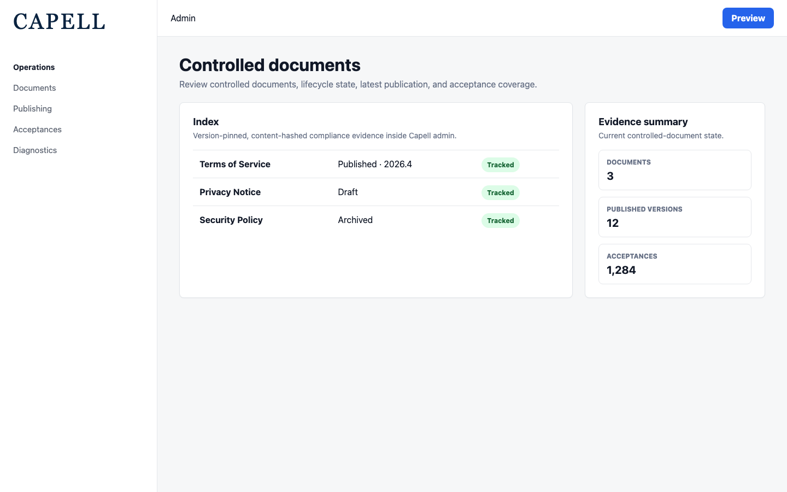
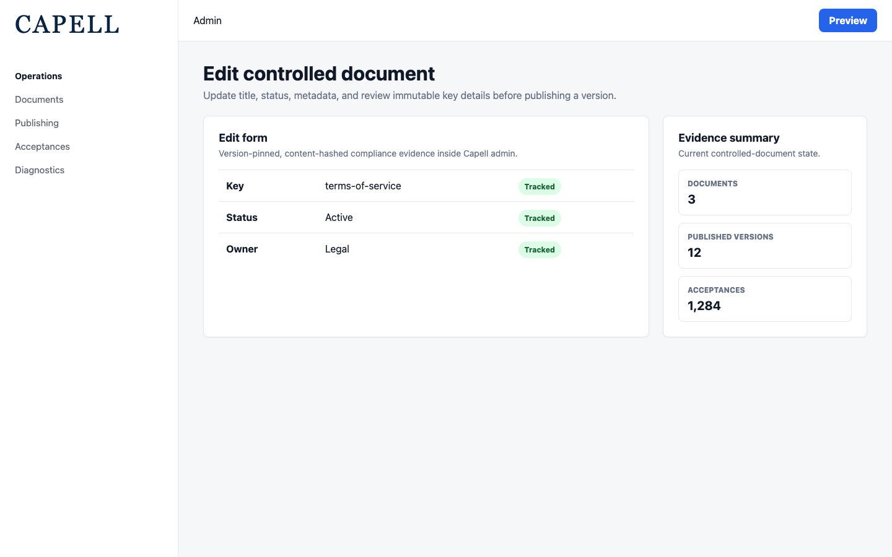
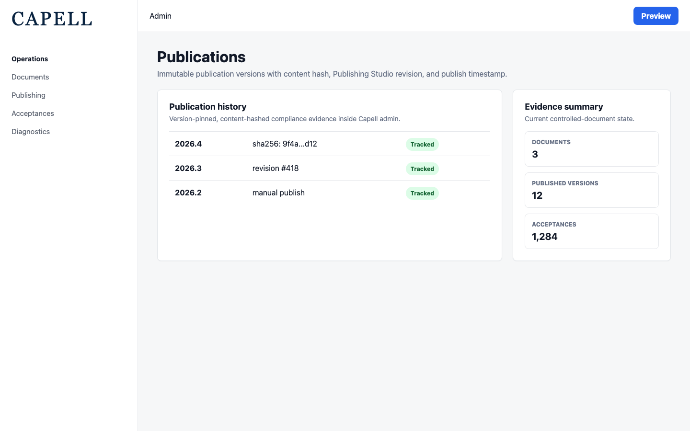
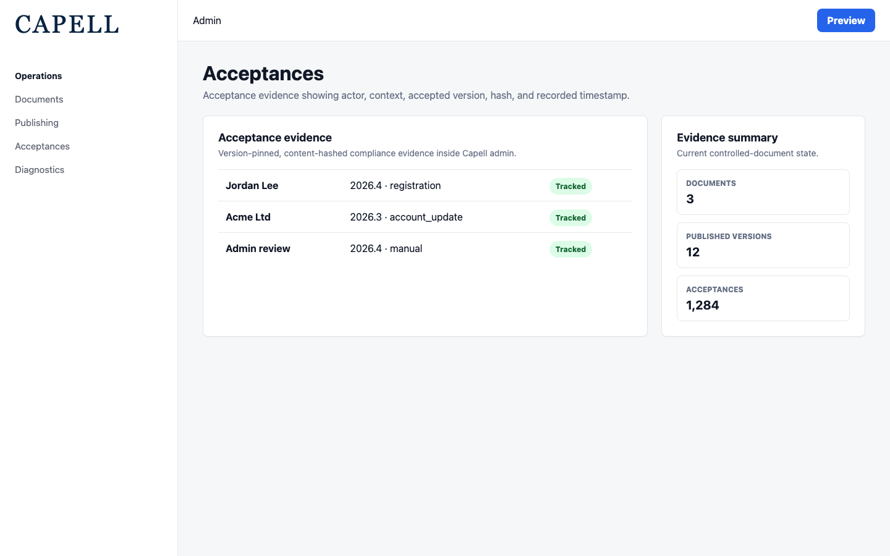

# Document Lifecycle

<!-- prettier-ignore-start -->

## What This Plugin Adds

Document Lifecycle is an **Available**, **Schema-owning** Capell package in the **Capell Operations** product group. It ships as `capell-app/document-lifecycle` and extends these surfaces: admin, console.

Document Lifecycle tracks controlled documents as admin-managed records with version-labelled, content-hashed publications and acceptance history. Admin users can publish manual versions, matching Publishing Studio revisions can create publication records automatically, and acceptance records show which actor accepted which document version and when. The package also registers protected audit tables, a health diagnostic, and an authenticated Customer Portal feed for account self-service history.

After install, admins get package-owned management or reporting surfaces inside Capell.

Status details:

- Status: Available
- Tier: premium
- Bundle: operations
- Composer package: `capell-app/document-lifecycle`
- Namespace: `Capell\DocumentLifecycle`
- Theme key: not applicable

## Why It Matters

**For developers:** The package gives developers package-owned service providers, Actions, Data objects, models, and Filament classes instead of pushing this behaviour into core or application code.

**For teams:** Version-pinned acceptance evidence for controlled documents in Capell: register documents, publish hashed versions from admin or Publishing Studio, and record who accepted which version and when.

## Screens And Workflow

Screenshot contract: `screenshots.json`.

- Controlled documents index (admin, required).
- Controlled document edit form (admin, required).
- Document publications relation manager (admin, required).
- Document acceptances relation manager (admin, required).

## Screenshot Evidence

These captures are the package-owned visual contract for the admin pages, public pages, actions, workflows, and feature surfaces described above. Keep this section aligned with `docs/screenshots.json` whenever the package surface changes.

### Controlled documents index

- Surface: admin · Target: DocumentResource:index.
- Documents: An administrator reviews controlled documents and sees which policy or legal records have published versions.
- Capture notes: Capture with at least one active document and one draft or archived document so status badges and publication counts are visible.

### Controlled document edit form

- Surface: admin · Target: DocumentResource:edit.
- Documents: An administrator updates the title, lifecycle status, or metadata for a controlled document.
- Capture notes: Requires a seeded Document record. The key field is disabled; title, status, metadata, and relation manager tabs should be visible.

### Document publications relation manager

- Surface: admin · Target: PublicationsRelationManager.
- Documents: A compliance reviewer checks immutable publication versions, hashes, revision IDs, and publish timestamps for a document.
- Capture notes: Requires at least one DocumentPublication, ideally one created from a Publishing Studio revision so published_revision_id is populated.

### Document acceptances relation manager

- Surface: admin · Target: AcceptancesRelationManager.
- Documents: A compliance reviewer confirms which version a user or workflow accepted and when that acceptance was recorded.
- Capture notes: Requires seeded DocumentAcceptance rows linked to the controlled document. Include at least one context such as registration or account_update.

## Technical Shape

- Service providers: `Capell\DocumentLifecycle\Providers\DocumentLifecycleServiceProvider`.
- Migrations: `packages/document-lifecycle/database/migrations/2026_05_10_190868_01_create_document_lifecycle_documents_table.php`, `packages/document-lifecycle/database/migrations/2026_05_10_190868_02_create_document_lifecycle_publications_table.php`, `packages/document-lifecycle/database/migrations/2026_05_10_190868_03_extend_legal_acceptances_for_document_lifecycle.php`, `packages/document-lifecycle/database/migrations/2026_06_06_000001_add_review_dates_to_document_lifecycle_documents_table.php`.
- Models: `Document`, `DocumentAcceptance`, `DocumentPublication`.
- Filament classes: `DocumentResource`, `CreateDocument`, `EditDocument`, `ListDocuments`, `AcceptancesRelationManager`, `PublicationsRelationManager`.
- Policies: `DocumentPolicy`.
- Actions: `ArchiveDocumentAction`, `ArchiveExpiredDocumentsAction`, `BuildDocumentAcceptanceCertificateAction`, `BuildDocumentAcceptanceEvidenceCsvAction`, `BuildDocumentLifecycleHealthReportAction`, `BuildDocumentPublicationDiffAction`, `BuildOutstandingDocumentAcceptancesCsvAction`, `ComputeDocumentContentHashAction`, `PublishDocumentAction`, `PublishDocumentFromPublishingRevisionAction`, `RecordDocumentAcceptanceAction`, `RegisterDocumentAction`, `and 3 more`.
- Data objects: `DocumentLifecycleHealthReportData`.
- Command signatures: `capell:document-lifecycle:archive-expired`.
- Console command classes: `ArchiveExpiredDocumentsCommand`.
- Manifest contributions: `admin-resource: Capell\DocumentLifecycle\Manifest\DocumentResourceContribution`, `scheduled-job: Capell\DocumentLifecycle\Manifest\DocumentLifecycleRetentionScheduleContribution`.
- Health checks: `Capell\DocumentLifecycle\Health\DocumentLifecycleHealthCheck`.

## Data Model

- Required tables: `document_lifecycle_documents`, `document_lifecycle_publications`, `legal_acceptances`.
- Models: `Document`, `DocumentAcceptance`, `DocumentPublication`.
- Migration files: `2026_05_10_190868_01_create_document_lifecycle_documents_table.php`, `2026_05_10_190868_02_create_document_lifecycle_publications_table.php`, `2026_05_10_190868_03_extend_legal_acceptances_for_document_lifecycle.php`, `2026_06_06_000001_add_review_dates_to_document_lifecycle_documents_table.php`.
- Migration impact: run host migrations through the package install flow before opening package surfaces.
- Deletion/retention behaviour: Docs gap unless the package has an explicit pruning command, retention setting, or tested cascade path.

## Install Impact

- Admin navigation: adds package-owned Filament classes when registered.
- Permissions: `ViewAny:Document`, `View:Document`, `Create:Document`, `Update:Document`, `Delete:Document`, `DeleteAny:Document`, `Restore:Document`, `ForceDelete:Document`, `Replicate:Document`, `Reorder:Document`.
- Public routes: none detected in package route files.
- Database changes: package migrations are declared.
- Settings: no package settings declared.
- Queues or schedules: none detected in standard package paths.
- Cache tags: none declared.
- Commands: `capell:document-lifecycle:archive-expired`.

## Common Pitfalls

- Run migrations before opening package resources or public routes.
- Run package commands from the host app; in this repository use `vendor/bin/pest` for package tests.
- Keep `composer.json`, `composer.local.json`, `capell.json`, docs, screenshots, and tests aligned when the package surface changes.

## Troubleshooting

| Symptom | Likely cause | Check | Fix |
| --- | --- | --- | --- |
| Package surface is missing after install | Provider or manifest is not loaded | Confirm `capell.json`, package `composer.json`, and provider registration | Reinstall the package, refresh Composer autoload, and clear host caches |
| Admin screen or command fails on missing table | Package migrations have not run | Check the tables listed in `Data Model` | Run host migrations and rerun the focused package test |
| Background work does not run | Queue worker or scheduled command is not active | Check package jobs, commands, and host scheduler configuration | Start the queue or scheduler, then run the focused command or package test |

## Quick Start

1. Install the package: `composer require capell-app/document-lifecycle`.
2. Run the required setup: `php artisan migrate`.
3. Open the related Capell admin surface and verify Document Lifecycle appears.

## Next Steps

- [Package docs index](README.md)
- [Screenshot contract](screenshots.json)
- [Marketplace assets](assets/marketplace/)
- [Capell content language plan](../../../docs/CONTENT_LANGUAGE_PLAN.md)
- [Capell documentation design system](../../../docs/DESIGN_SYSTEM.md)
- [Capell and package ERD notes](../../../docs/erd/capell-and-package-erds.md)
- Related packages: [Publishing Studio](../../publishing-studio/README.md), [Customer Portal](../../customer-portal/README.md).
- Focused tests: `vendor/bin/pest packages/document-lifecycle/tests --configuration=phpunit.xml`.

<!-- prettier-ignore-end -->
