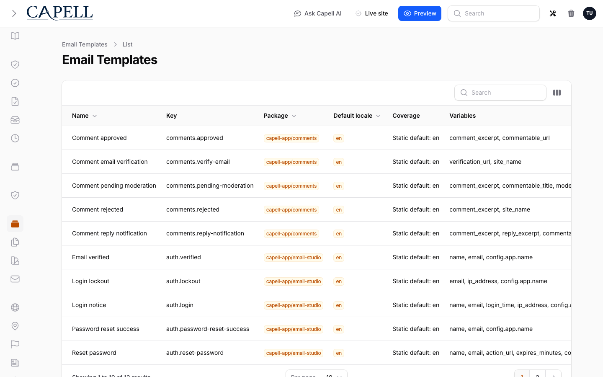
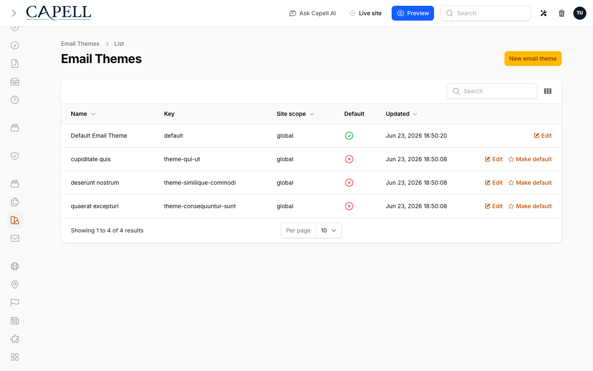
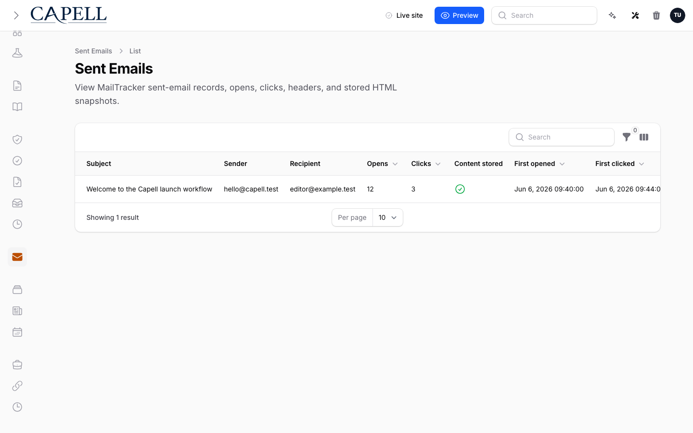
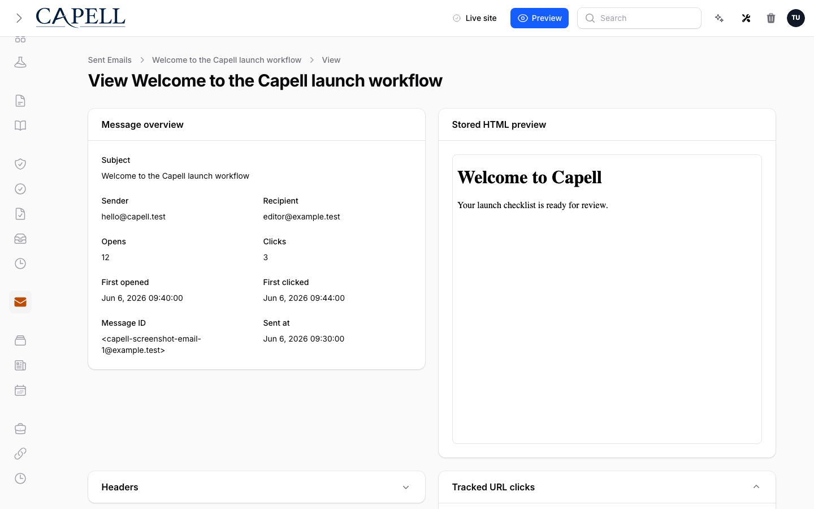

# Using Email Studio

This guide is for editors who brand the emails customers receive and owners deciding what to change. Every step uses the labels you see on screen. Everything lives under the **Email Studio** group in the admin menu.

## Using Email Studio (editor how-to)

### How to edit and brand a template

1. Go to **Email Studio > Email Templates** and find the email you want (for example the welcome email).
2. Use **Customize** to start your own editable version from the package default.
3. Edit its content and apply your branding (logo, colours, wording).
4. Save the template.

The list shows each template's **Package**, **Coverage**, and **Status**, so you can see at a glance which emails are still on the **Static default** and which you have customised.

### How to brand all your emails at once

1. Go to **Email Studio > Email Themes**.
2. Open the theme you want to edit, or add a site theme for your brand.
3. Set the shared branding tokens, such as **Logo URL**, **Header background**, **Button background**, and **Button text**.
4. Use **Make default** on the theme you want themed templates to use.
5. Save. Templates that use the theme pick up your branding without editing each one.

### How to preview a template

1. With a template open in the list, use **Preview**.
2. Check how it looks before any customer receives it.
3. If the preview flags unresolved variables, fill in the missing details before sending.

### How to send a test

1. From the template list, use **Send test**.
2. Enter the **Test recipient** address (your own).
3. Send it, then confirm the content, links, and branding are right before going live.

### How to review sent emails

1. Go to **Email Studio > Sent emails**.
2. Each row shows the **Subject**, **Sender**, **Recipient**, and whether the message has **Opens** and **Clicks**.
3. Use the filters to narrow by **Sent date**, or to show only those that were **Opened** or **Clicked**.
4. Use this when a customer says an email didn't arrive.

### How to inspect a single sent email

1. From **Email Studio > Sent emails**, open the message you want.
2. Read the **Message overview** for the basics, and the **Headers** section for delivery details.
3. Check **Tracked URL clicks** to see which links the recipient followed.
4. If content storage is on, use the **Stored HTML preview** to see exactly what was sent. This snapshot does not change.

## Rolling out Email Studio (for owners)

### Turn on first

- **Branding the core templates.** Edit the everyday emails (welcome, password reset) and test them before relying on them.

### Add when needed

| Need                          | Enable                                        |
| ----------------------------- | --------------------------------------------- |
| Confirm an email was opened   | **Track opens** in Email Studio settings      |
| See which links were followed | **Track clicks** in Email Studio settings     |
| Inspect exactly what was sent | **Store rendered email content** in settings  |
| Apply one brand across emails | An **Email theme**, set with **Make default** |

### Don't enable yet

- Don't change a template customers depend on without a test send first. These emails are transactional.

### Who does what

| Role       | First useful screen                                |
| ---------- | -------------------------------------------------- |
| Editor     | **Email Studio > Email Templates**: edit and brand |
| Site owner | **Email Studio > Sent emails**: confirm delivery   |

## Troubleshooting

| What you see                           | What it means                                          | What to do                                                |
| -------------------------------------- | ------------------------------------------------------ | --------------------------------------------------------- |
| A customer says an email didn't arrive | It may have failed or gone to spam                     | Check **Email Studio > Sent emails** for that email's row |
| The email looks unbranded              | The template wasn't saved, or the wrong one was edited | Re-open the correct template, apply branding, and save    |
| A test email looks broken              | A content or link issue in the template                | Fix it, **Preview** again, and re-test before going live  |
| **Opens** show as zero                 | Open tracking is off, or the email wasn't opened       | Confirm **Track opens** is on in Email Studio settings    |
| **Clicks** show as zero                | Click tracking is off, or no link was followed         | Confirm **Track clicks** is on in Email Studio settings   |
| The stored HTML preview is empty       | Email content storage is off                           | Turn on **Store rendered email content** in settings      |
| A preview shows leftover variables     | The template still has unresolved placeholders         | Fill in the missing details, then **Preview** again       |
