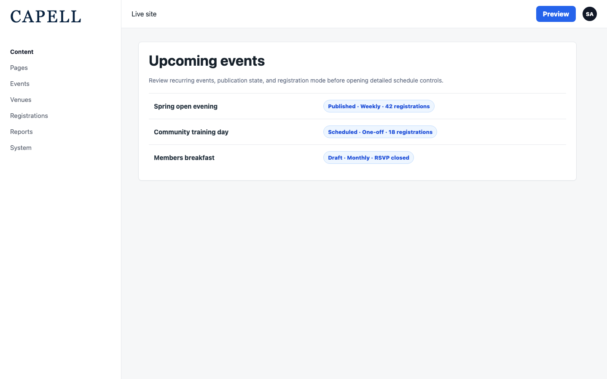
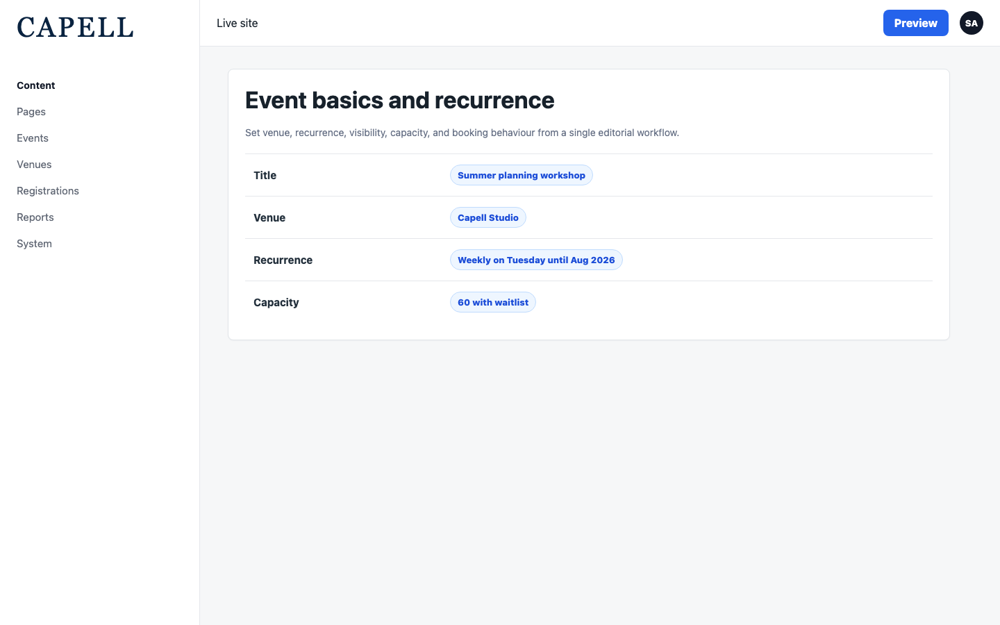
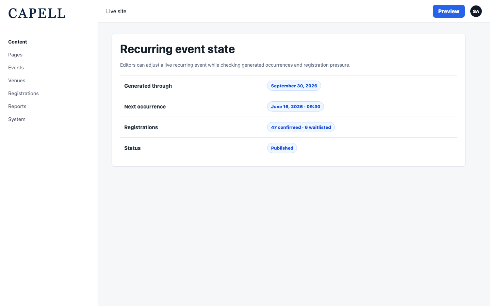
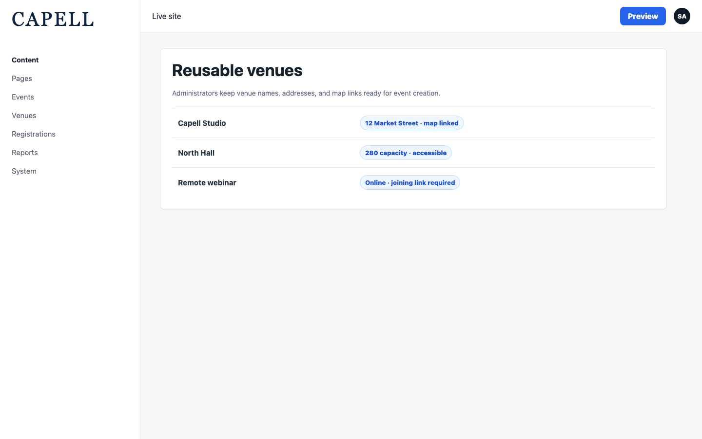
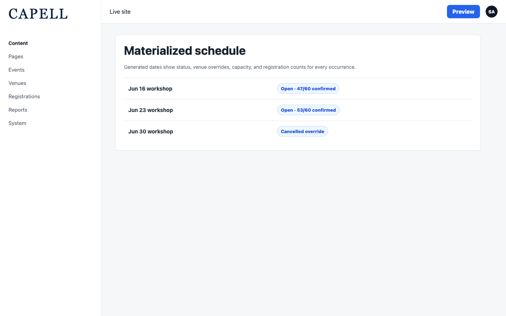
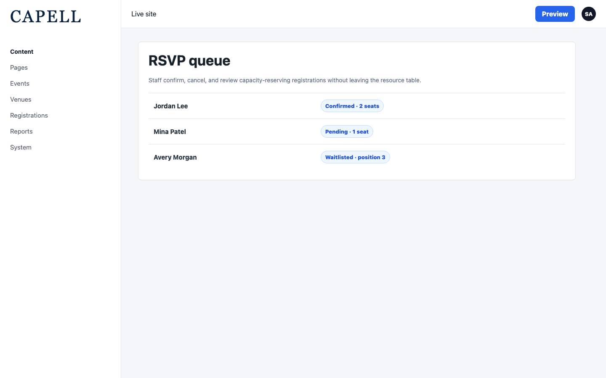
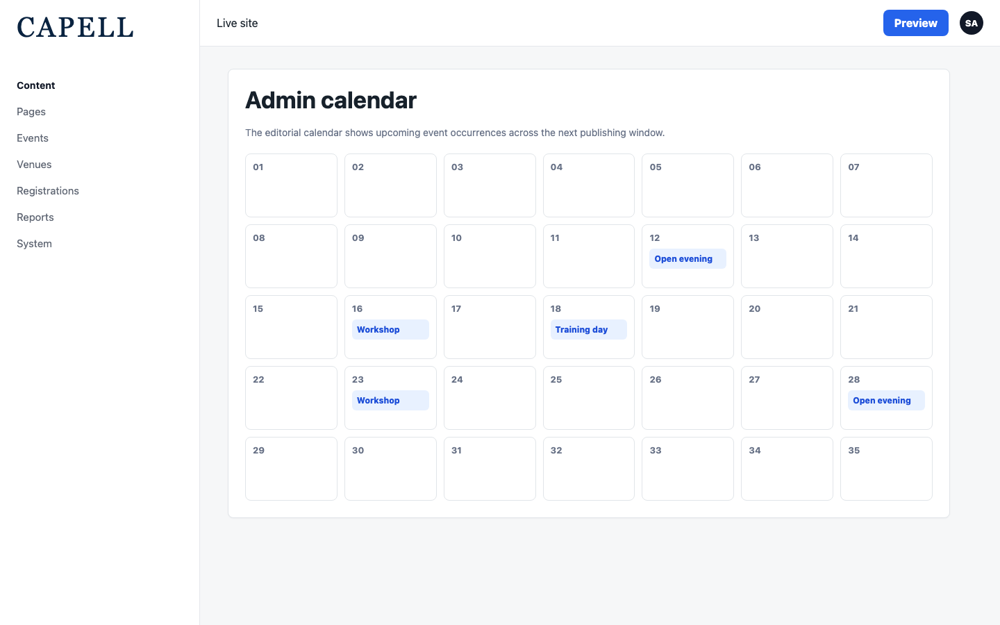
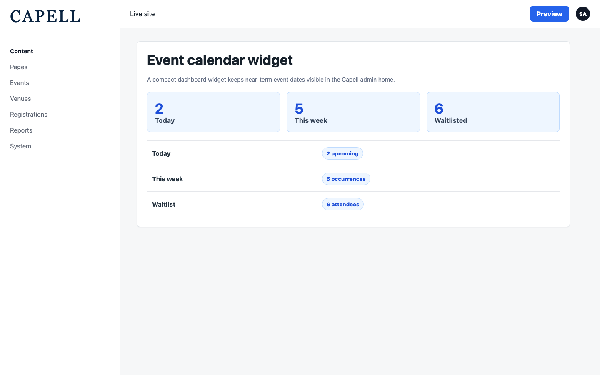

# Using Events

This guide is for the people who run events on the site: editors who create and schedule events, and administrators who manage venues, attendees, and the calendar. No technical knowledge needed. Every step uses the labels you see on screen.

## Using Events (editor how-to)

### How to review your events

1. Go to **Content > Events**.
2. The list shows each event with its **Schedule**, **Visibility**, and registration count.
3. Use this view to find an event before opening it to change its schedule or registration settings.
4. Click an event to open it for editing, or use **New event** to start a new one.

### How to create an event

1. From **Content > Events**, click the button to create a new event.
2. Under **Event details**, give the event a **Name**, choose its **Site**, and pick a layout. Set the **Visibility** to **Public** so it appears on the site, or to **Unlisted** or **Private** to keep it out of public listings.
3. Under **Schedule**, set **Starts at** and, if it has an end time, **Ends at**. Set the **Timezone**, and switch on **All day** for events without set hours.
4. To repeat the event, fill in the **Recurrence rule**. The package then builds a separate dated page for each occurrence.
5. Under **Settings**, choose the **Location mode** and, if it is held at a place, pick a **Venue**.
6. Under **Registration**, choose a **Booking mode**. For an outside ticket page, set **External** and add the **Booking URL**. To take sign-ups on the site, choose the RSVP option, set a **Capacity**, and turn on **Waitlist enabled** so people can still join once it is full.
7. To email attendees before the event, leave **Send reminder emails** on and set the **Reminder offsets** in minutes before the start.
8. Save the event.

### How to edit a recurring event

1. Go to **Content > Events** and open the event.
2. Change the **Schedule** or **Recurrence rule** as needed. The generated occurrences update to match.
3. Check the **Visibility** and **Registration** settings before saving.
4. Save the event.

### How to manage venues

1. Go to **Content > Event venues**.
2. Add a venue and fill in its **Address** and **Map URL** so the place shows correctly on the event page.
3. Reuse the same venue across many events instead of typing the address each time.

### How to review the dates of a recurring event

1. Go to **Content > Event occurrences**.
2. This shows the individual dates the package generated for your events, with each occurrence's **Status**, **Venue**, and registration count.
3. To change a single date, use **Reschedule occurrence**. To call one off without affecting the rest, use **Cancel occurrence**.

### How to manage attendee registrations

1. Go to **Content > Event registrations**.
2. The list shows each attendee's **Name**, **Email**, **Quantity**, **Status**, and the occurrence they signed up for.
3. Use **Confirm registration** to approve a pending sign-up, or **Cancel registration** to remove one. When a confirmed place is freed, a waitlisted attendee can move up.

### How to scan upcoming events on the calendar

1. Go to **Content > Event calendar**.
2. The calendar shows upcoming event occurrences across the coming weeks so you can see the programme at a glance.
3. Use the month controls to move between **Previous month** and **Next month**.

### How to see upcoming events without leaving your work

1. The event calendar widget appears on the dashboard where it has been added.
2. It lists upcoming event dates so you can check the near-term schedule without opening the full calendar.

## Rolling out Events (for owners)

### Turn on first

- **Events and the schedule.** This is the core of the package: creating an event, setting its schedule, and publishing it. Start here and get your team comfortable creating a single event before adding recurrence or registration.

### Add when needed

| Need                                       | Enable                                             |
| ------------------------------------------ | -------------------------------------------------- |
| Hold events at set places                  | **Event venues** with address and map details      |
| Repeat an event on a pattern               | A **Recurrence rule** on the event                 |
| Take sign-ups on the site                  | An RSVP **Booking mode**, with a **Capacity** set  |
| Keep taking sign-ups once an event is full | **Waitlist enabled**                               |
| Remind attendees before the event          | **Send reminder emails** with **Reminder offsets** |

### Who does what

| Role          | First useful screen                                                                    |
| ------------- | -------------------------------------------------------------------------------------- |
| Editor        | **Content > Events**: create, schedule, and publish events                             |
| Administrator | **Content > Event venues** and **Content > Event registrations**: places and attendees |
| Site owner    | **Content > Event calendar**: see the whole upcoming programme                         |

## Troubleshooting

| What you see                     | What it means                                                          | What to do                                                                                       |
| -------------------------------- | ---------------------------------------------------------------------- | ------------------------------------------------------------------------------------------------ |
| My event isn't on the site       | Its **Visibility** is **Unlisted** or **Private**                      | Open the event and set **Visibility** to **Public**                                              |
| A recurring event shows no dates | The **Recurrence rule** is empty or does not produce future dates      | Open the event, check the **Recurrence rule** and **Starts at**, then save                       |
| People can't RSVP                | The **Booking mode** does not take sign-ups, or **Capacity** is full   | Set an RSVP **Booking mode** and a **Capacity**; turn on **Waitlist enabled** if it is full      |
| Reminder emails didn't go out    | **Send reminder emails** is off, or the **Reminder offsets** are wrong | Open the event, turn on **Send reminder emails**, and check the **Reminder offsets**             |
| A single date is wrong           | One occurrence needs its own change                                    | Go to **Content > Event occurrences** and use **Reschedule occurrence** or **Cancel occurrence** |
