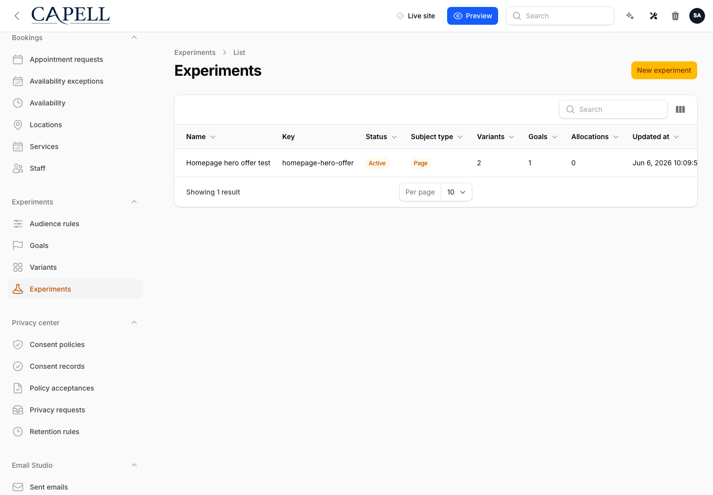
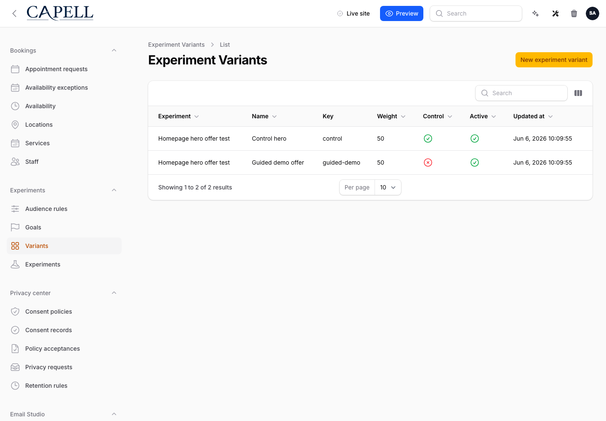
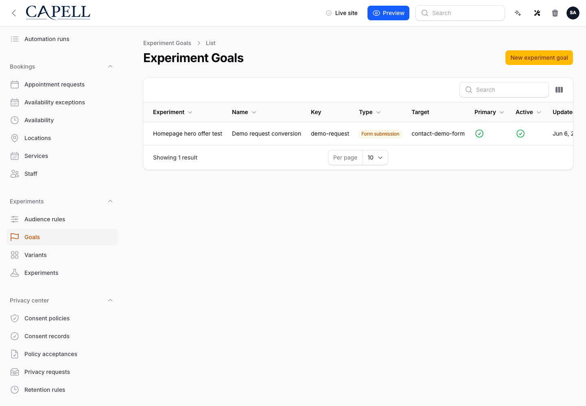
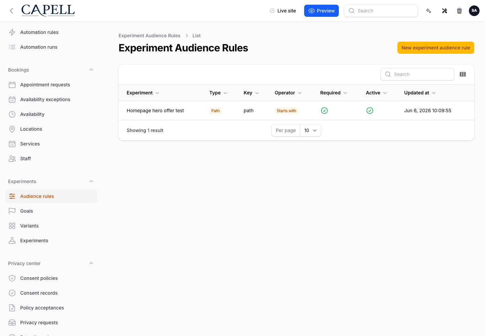

# Using Experiments

This guide is for owners and operators who run A/B tests: people who set up a test, send a share of visitors to each version, and pick the version that performs best. No technical knowledge needed. Every step uses the labels you see on screen. Everything lives under the **Experiments** group in the admin menu.

## Using Experiments (operator how-to)

### How to set up an experiment

1. Go to **Experiments > Experiments**.
2. Click the button to add a new experiment.
3. Give it a **Name** you will recognise later, and a short **Key** that identifies the test.
4. Set the **Status** to **Draft** while you are still building it. Visitors are not split until the test is running.
5. Choose the **Subject type** so the test knows what it is changing (for example a **Page**).
6. Set the **Traffic percentage** to decide how many visitors take part. Lower it if you want to expose only a slice of your audience.
7. Optionally set **Starts at** and **Ends at** to have the test begin and finish on its own.
8. Save the experiment.

Your experiment now appears in the list. The list shows each test's **Status** along with how many **Variants**, **Goals**, and **Allocations** it has.

### How to add the versions you want to compare

1. Go to **Experiments > Variants**.
2. Click the button to add a new variant.
3. Pick the **Experiment** this version belongs to.
4. Give it a **Name** and a **Key** (for example "control" and "new headline").
5. Set the **Weight** to control how much of the test's traffic this version receives. Equal weights split traffic evenly.
6. Turn on **Control** for the version that represents your current page. Every test needs one control to measure against.
7. Leave **Active** on so the version is included while the test runs.
8. Use **Sort order** if you want the versions listed in a particular order.
9. Save the variant, then repeat for each version you want to compare.

### How to choose what counts as a win

1. Go to **Experiments > Goals**.
2. Click the button to add a new goal.
3. Pick the **Experiment** the goal belongs to.
4. Give it a **Name** and a **Key**.
5. Set the **Type** to match the action you are measuring, such as **Page view**, **Click**, **Form submission**, or **Custom event**.
6. Fill in the **Target** if the goal needs one (for example the page or element being measured).
7. Turn on **Primary** for the single goal you will use to pick the winner. Keep other goals as secondary measures.
8. Leave **Active** on and save.

The list shows each goal's **Type** and whether it is the **Primary** goal, so you can confirm the test is measuring the right thing before you launch.

### How to decide who sees an experiment

1. Go to **Experiments > Audience rules**.
2. Click the button to add a new rule.
3. Pick the **Experiment** the rule applies to.
4. Choose the **Type** of rule, such as **Path** (which page they are on), **Query**, **Referrer**, or **UTM**.
5. Set the **Operator** (for example **Equals**, **Contains**, or **Starts with**) and the value it should match.
6. Leave **Required** on if every visitor must match this rule to take part. Turn it off for a rule that only helps narrow the audience.
7. Leave **Active** on and save.

Only visitors who match your rules are entered into the test. With no rules, everyone in the traffic share takes part.

### How to launch an experiment

1. Go to **Experiments > Experiments** and open the test.
2. Confirm it has at least two **Variants**, one of them marked **Control**, and a **Primary** goal.
3. Change the **Status** from **Draft** to **Active**.
4. Save. Visitors in your traffic share now start being split between the versions.

If you set a **Starts at** date, the test moves to **Active** on its own when that time arrives, and shows as **Scheduled** until then.

### How to read results and pick a winner

1. Go to **Experiments > Experiments**.
2. On the test's row, use the **Results** action to open its results.
3. Read the **Conversion rate** and **Lift** for each variant against the control, plus the **Confidence** in the numbers.
4. Wait until the test reports that the sample is ready and the result is **Significant** before trusting it.
5. When a variant is clearly ahead and the result is stable, treat it as the **Winner** and roll that version out.

If the results say there is no significant winner yet, the test needs more visitors. Let it keep running.

### How to pause or end an experiment

1. Go to **Experiments > Experiments** and open the test.
2. To stop splitting traffic for a while without losing the test, set the **Status** to **Paused**.
3. To finish the test for good, set the **Status** to **Ended**.
4. Save. An ended test stops entering new visitors but keeps its results for reference.

## Rolling out Experiments (for owners)

### Turn on first

- **One simple test with a clear control.** Start with a single experiment, two variants (your current page as the **Control** and one challenger), and one **Primary** goal. Get comfortable reading the **Results** before running more.

### Add when needed

| Need                                        | Add                                             |
| ------------------------------------------- | ----------------------------------------------- |
| Compare more than two versions              | More **Variants**, with **Weight** set on each  |
| Show the test to only part of your audience | A lower **Traffic percentage**                  |
| Limit the test to certain visitors or pages | **Audience rules**                              |
| Start or stop a test on a set date          | **Starts at** and **Ends at** on the experiment |
| Measure more than one outcome               | Extra **Goals** (keep one marked **Primary**)   |

### Don't run yet

- Hold off on launching until the test has a **Control** variant and a **Primary** goal. Without them, the **Results** cannot tell you which version won.
- Don't run many tests on the same page at once. Overlapping tests make the numbers hard to trust.

### Who does what

| Role       | First useful screen                                                             |
| ---------- | ------------------------------------------------------------------------------- |
| Operator   | **Experiments > Experiments**: set up, launch, pause, and read **Results**      |
| Site owner | **Experiments > Experiments** list: see which tests are **Active** vs **Draft** |

## Troubleshooting

| What you see                           | What it means                                                                  | What to do                                                                                           |
| -------------------------------------- | ------------------------------------------------------------------------------ | ---------------------------------------------------------------------------------------------------- |
| Visitors aren't being split            | The experiment is still **Draft** or **Paused**, or its **Starts at** is ahead | Open it, set the **Status** to **Active**, and check the start date is not in the future             |
| The results won't name a winner        | Not enough visitors have taken part yet for a reliable result                  | Let the test keep running until it reports the sample is ready and the result is **Significant**     |
| A variant is getting almost no traffic | Its **Weight** is low, or it is switched off                                   | Open the variant, raise its **Weight**, and confirm **Active** is on                                 |
| Hardly anyone is entering the test     | The **Traffic percentage** is low, or the **Audience rules** are too narrow    | Raise the **Traffic percentage**, or loosen or remove a **Required** audience rule                   |
| The results look wrong or one-sided    | No variant is marked **Control**, so there is nothing to measure against       | Open **Variants**, mark your current page as **Control**, and let the test gather fresh data         |
| A scheduled test never started         | The **Starts at** time hasn't been reached, or scheduling isn't running        | Re-check **Starts at**; if it has clearly passed, ask your developer to confirm scheduling is active |
