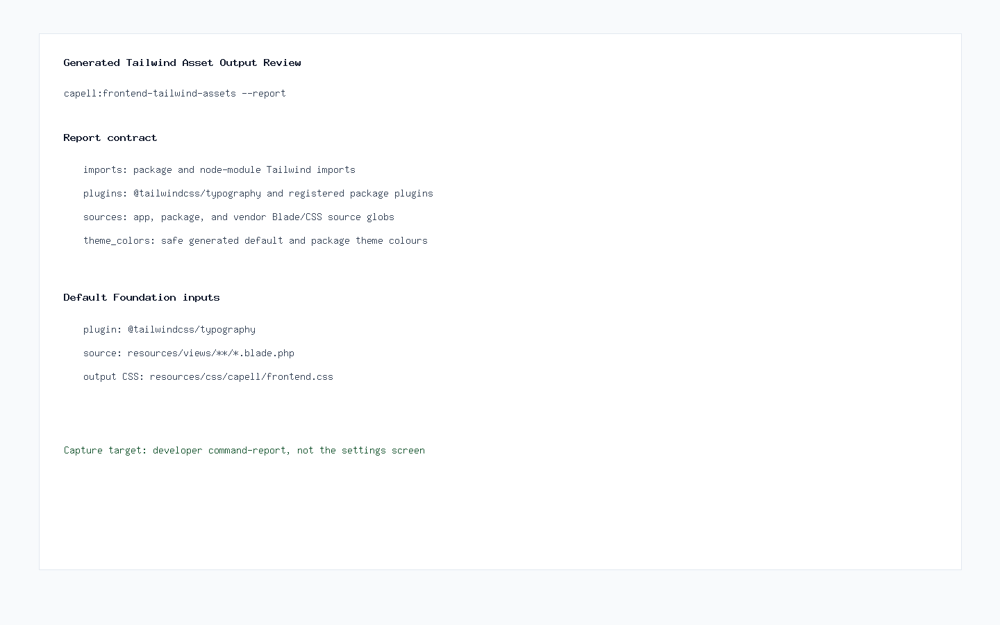
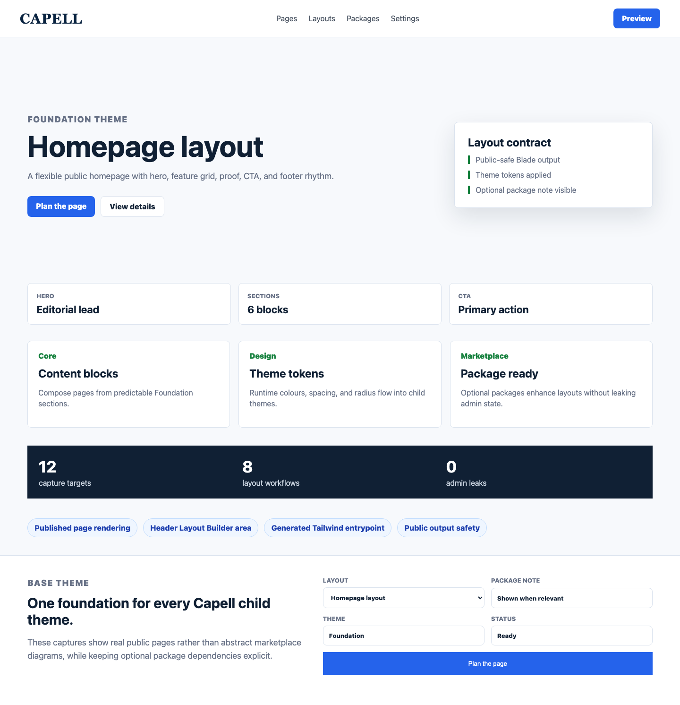
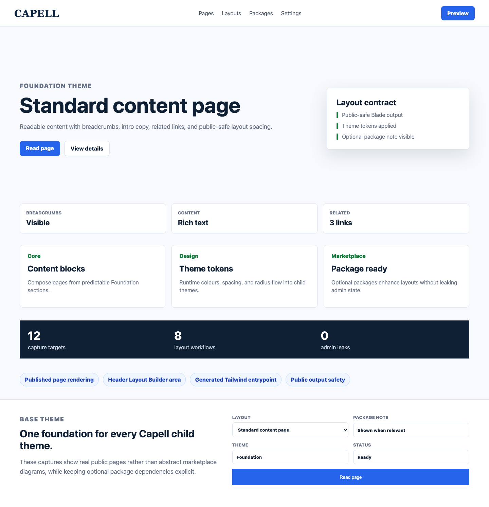
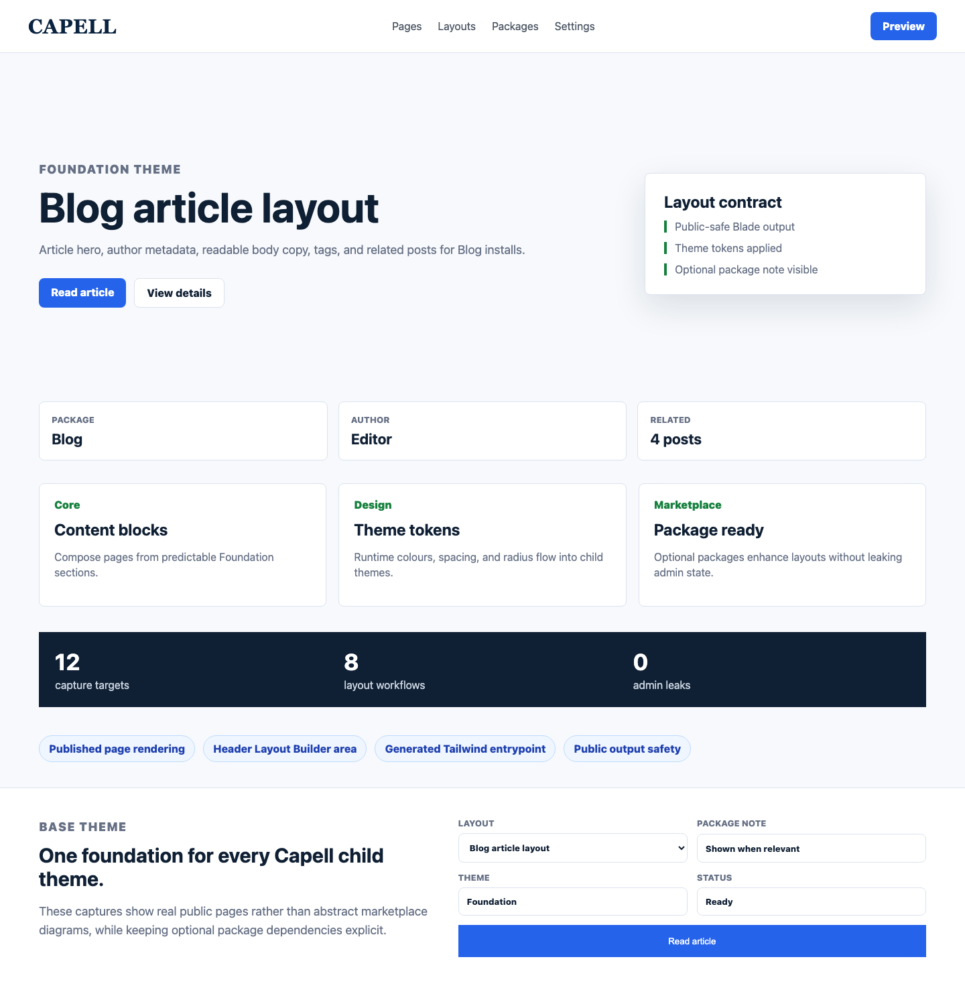
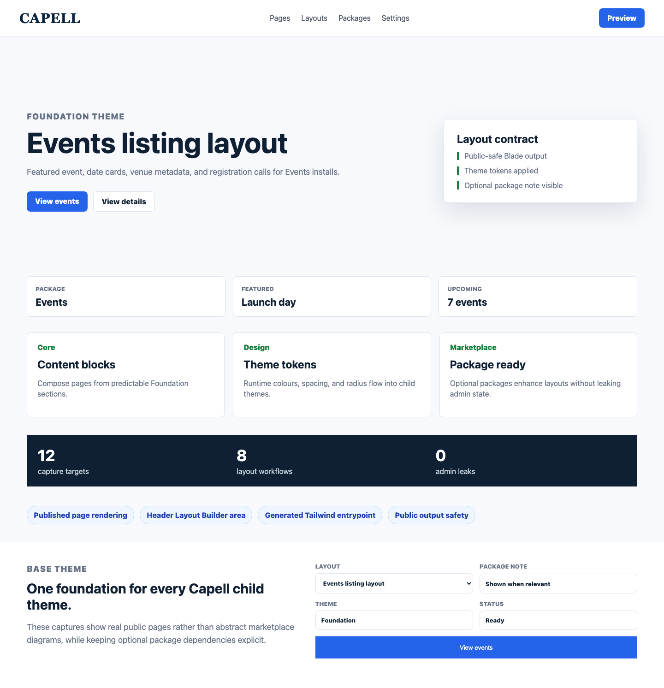

# Foundation Theme

<!-- prettier-ignore-start -->

## What This Plugin Adds

Foundation Theme is an **Available**, **No schema impact** Capell theme in the **Capell Foundation** product group. It ships as `capell-app/foundation-theme` and extends these surfaces: admin, frontend.

Capell's foundation theme - base Blade layouts, runtime design tokens, the Tailwind asset pipeline, Blade directives, media/SVG handling, and the override contracts that all vertical Capell themes extend.

After install, admins can select the theme through the core theme management surface. Editors keep using normal Capell content workflows while the package controls public presentation.

Status details:

- Status: Available
- Tier: free
- Bundle: foundation
- Composer package: `capell-app/foundation-theme`
- Namespace: `Capell\FoundationTheme`
- Theme key: `default`

## Why It Matters

**For developers:** The package gives developers package-owned service providers, Actions, Data objects, Filament classes, and Blade views instead of pushing this behaviour into core or application code.

**For teams:** The base theme every Capell site and child theme builds on: shared Blade layouts, a runtime design-token system (colours, spacing, radius), the Tailwind asset pipeline, an SVG sanitiser, and the section/area contracts that vertical themes override.

## Screens And Workflow

Screenshot contract: `screenshots.json`.

- Default theme settings screen (admin, required).
- Generated Tailwind asset output review (developer, required).
- Frontend page using the default theme (frontend, required).
- Foundation header Layout Builder area (frontend, required).
- Homepage layout (frontend, required).
- Standard content page (frontend, required).
- Blog article layout (frontend, required).
- Listing page layout (frontend, required).
- Contact form layout (frontend, required).
- Search results layout (frontend, required).
- Events listing layout (frontend, required).
- Access-gated page layout (frontend, required).

## Screenshot Evidence

These captures are the package-owned visual contract for the admin pages, public pages, actions, workflows, and feature surfaces described above. Keep this section aligned with `docs/screenshots.json` whenever the package surface changes.

### Default theme settings screen

- Surface: admin · Target: admin-surface.
- Documents: A site owner adjusts Foundation Theme settings and reviews theme defaults.
- Capture notes: Capture after installing capell-app/foundation-theme in the isolated demo harness and seeding the data required for this use case.

### Generated Tailwind asset output review

- Surface: developer · Target: capell:frontend-tailwind-assets --report.
- Documents: A developer verifies the generated Tailwind entrypoint after package/theme asset registration.
- Capture notes: Capture the generated Tailwind asset report output, not the generic settings screen. The committed report evidence lives at packages/foundation-theme/docs/reports/generated-tailwind-asset-output-review.md.

### Frontend page using the default theme

- Surface: frontend · Target: frontend-url.
- Documents: A visitor sees a seeded page rendered by Foundation Theme with its header, footer, tokens, and components.
- Capture notes: Capture after installing capell-app/foundation-theme in the isolated demo harness and seeding the data required for this use case.

### Foundation header Layout Builder area

- Surface: frontend · Target: frontend-url.
- Documents: A maintainer verifies the registered Layout Builder header area renders through Foundation Theme.
- Capture notes: Capture a route-backed Foundation fixture with the layout contract evidence for the registered Layout Builder header area. Do not use the generic screenshot runner home page.

### Homepage layout

- Surface: frontend · Target: /foundation-homepage-layout.
- Documents: A buyer reviews how Foundation Theme handles the homepage layout page layout before installing the theme.
- Capture notes: Capture Foundation Theme homepage layout with hero, feature grid, content widgets, cta, footer. No additional package note required.

### Standard content page

- Surface: frontend · Target: /foundation-standard-page-layout.
- Documents: A buyer reviews how Foundation Theme handles the standard content page page layout before installing the theme.
- Capture notes: Capture Foundation Theme standard content page with header, breadcrumbs, rich content, related links. No additional package note required.

### Blog article layout

- Surface: frontend · Target: /foundation-blog-article-layout.
- Documents: A buyer reviews how Foundation Theme handles the blog article layout page layout before installing the theme.
- Capture notes: Capture Foundation Theme blog article layout with article hero, author row, body, related posts. Requires capell-app/blog; show this package note on the captured image.

### Listing page layout

- Surface: frontend · Target: /foundation-listing-layout.
- Documents: A buyer reviews how Foundation Theme handles the listing page layout page layout before installing the theme.
- Capture notes: Capture Foundation Theme listing page layout with card grid, filters, pagination, empty state. Requires capell-app/tags; show this package note on the captured image.

### Contact form layout

- Surface: frontend · Target: /foundation-contact-form-layout.
- Documents: A buyer reviews how Foundation Theme handles the contact form layout page layout before installing the theme.
- Capture notes: Capture Foundation Theme contact form layout with intro copy, validated form, consent, confirmation. Requires capell-app/form-builder; show this package note on the captured image.

### Search results layout

- Surface: frontend · Target: /foundation-search-results-layout.
- Documents: A buyer reviews how Foundation Theme handles the search results layout page layout before installing the theme.
- Capture notes: Capture Foundation Theme search results layout with search box, result excerpts, highlighting, no-results state. Requires capell-app/search; show this package note on the captured image.

### Events listing layout

- Surface: frontend · Target: /foundation-events-layout.
- Documents: A buyer reviews how Foundation Theme handles the events listing layout page layout before installing the theme.
- Capture notes: Capture Foundation Theme events listing layout with featured event, date cards, location metadata. Requires capell-app/events; show this package note on the captured image.

### Access-gated page layout

- Surface: frontend · Target: /foundation-membership-gate-layout.
- Documents: A buyer reviews how Foundation Theme handles the access-gated page layout page layout before installing the theme.
- Capture notes: Capture Foundation Theme access-gated page layout with teaser content, sign-in prompt, gated sections. Requires capell-app/access-gate; show this package note on the captured image.

## Technical Shape

- Service providers: `Capell\FoundationTheme\Providers\FoundationThemeServiceProvider`.
- Config files: `packages/foundation-theme/config/capell-foundation-theme.php`.
- Settings migrations: `packages/foundation-theme/database/settings/2026_05_10_190850_01_create_foundation_theme_settings.php`, `packages/foundation-theme/database/settings/2026_05_23_160819_add_foundation_theme_design_tokens.php`, `packages/foundation-theme/database/settings/2026_05_23_161002_refresh_foundation_theme_design_token_defaults.php`, `packages/foundation-theme/database/settings/2026_05_23_170001_add_foundation_theme_composition_tokens.php`, `packages/foundation-theme/database/settings/2026_05_23_171201_quiet_foundation_theme_composition_palette.php`, `packages/foundation-theme/database/settings/2026_05_23_180101_add_foundation_theme_image_tokens.php`, `packages/foundation-theme/database/settings/2026_06_07_000001_add_foundation_theme_dark_design_tokens.php`, `packages/foundation-theme/database/settings/2026_06_07_000002_add_foundation_theme_typography_tokens.php`.
- Settings classes: `FoundationThemeSettings`, `FoundationThemeSettingsMigrationProvider`.
- Filament classes: `FoundationThemeSettingsSchema`.
- Livewire components: `AbstractAssets`, `PageAssets`, `AbstractWidget`, `Pages`.
- Listeners: `RunTailwindAssetsOnPackageChange`.
- Actions: `BuildAssetBannerItemsAction`, `BuildBannerImageRenderDataAction`, `BuildHeroRailItemsRenderDataAction`, `BuildLayoutNeighborLinksDataAction`, `BuildPageContentRenderDataAction`, `BuildWidgetAssetRenderDataAction`, `InstallFoundationThemeDemoAction`, `InstallFoundationThemeLayoutDefaultsAction`, `MarkPrimaryHeadingRenderedAction`, `ResolveFoundationThemeTokensAction`, `ResolveLoadedLayoutContainerBackgroundImageAction`, `ResolveLoadedWidgetBackgroundImageAction`, `and 3 more`.
- Data objects: `AssetBannerItemData`, `BannerImageRenderData`, `FoundationThemeTokensData`, `LayoutNeighborLinksData`, `PageContentRenderData`, `ThemeDemoInstallData`, `WidgetAssetRenderData`.
- Command signatures: `capell:foundation-theme-demo`, `capell:foundation-theme-setup`.
- Console command classes: `DemoCommand`, `GenerateTailwindAssetsCommand`, `SetupCommand`.
- Health checks: `Capell\FoundationTheme\Health\FoundationThemeHealthCheck`.
- Blade views: `packages/foundation-theme/resources/views/app.blade.php`, `packages/foundation-theme/resources/views/block/wrapper.blade.php`, `packages/foundation-theme/resources/views/components/actions/index.blade.php`, `packages/foundation-theme/resources/views/components/app/body.blade.php`, `packages/foundation-theme/resources/views/components/app/head/custom.blade.php`, `packages/foundation-theme/resources/views/components/app/head/tokens.blade.php`, `packages/foundation-theme/resources/views/components/badge.blade.php`, `packages/foundation-theme/resources/views/components/block/wrapper.blade.php`, `packages/foundation-theme/resources/views/components/button/index.blade.php`, `packages/foundation-theme/resources/views/components/content.blade.php`, `packages/foundation-theme/resources/views/components/demo/contact-page.blade.php`, `packages/foundation-theme/resources/views/components/dropdown/index.blade.php`, `and 78 more`.
- Cache tags: `foundation-theme`.

## Child Theme Override Contract

Foundation Theme owns the stable child theme override surface for Capell themes. Child themes should declare `extends: 'default'` and override documented sections, views, tokens, and chrome areas instead of replacing the whole public rendering path.

Stable contract points:

- Theme Studio sections: `navigation`, `hero`, `features`, `proof`, `content-listing`, `cta`, `footer`.
- Shared views: `capell::theme.page`, `capell::layout.area`, `capell::media.svg`.
- Runtime tokens: `--foundation-page-bg`, `--foundation-section-spacing`, `--foundation-widget-gap`.
- Layout Builder chrome areas: `header`.
- Public-output rule: child themes must not expose authoring metadata, editor controls, model IDs, field paths, permissions, or signed editor URLs.

## Data Model

This theme has no schema impact. It relies on core Capell site, page, locale, and theme records instead of declaring package-owned tables.

## Install Impact

- Admin navigation: adds package-owned Filament classes when registered.
- Permissions: none declared in `capell.json`.
- Public routes: none detected in package route files.
- Deferred route contributions: none; Foundation Theme contributes presentation/runtime theme surfaces, not package-owned routes.
- Database changes: no package migrations declared.
- Settings: settings classes or settings migrations exist; verify the install flow registers them.
- Queues or schedules: none detected in standard package paths.
- Cache tags: `foundation-theme`.
- Commands: `capell:foundation-theme-demo`, `capell:foundation-theme-setup`.

## Common Pitfalls

- Keep public Blade and cached HTML free of authoring markers, model IDs, permissions, signed editor URLs, and lazy database queries.
- Keep `composer.json`, `composer.local.json`, `capell.json`, docs, screenshots, and tests aligned when the package surface changes.

## Troubleshooting

| Symptom | Likely cause | Check | Fix |
| --- | --- | --- | --- |
| Package surface is missing after install | Provider or manifest is not loaded | Confirm `capell.json`, package `composer.json`, and provider registration | Reinstall the package, refresh Composer autoload, and clear host caches |
| Background work does not run | Queue worker or scheduled command is not active | Check package jobs, commands, and host scheduler configuration | Start the queue or scheduler, then run the focused command or package test |
| Public output leaks unexpected state | Render data, cache variation, or authoring boundary has regressed | Check public Blade, cache tags, and public-output safety tests | Move data loading out of Blade and rerun the package public-output tests |

## Quick Start

1. Install the package: `composer require capell-app/foundation-theme`.
2. Run the required setup: `php artisan capell:foundation-theme-setup`.
3. Open the related Capell admin surface and verify Foundation Theme appears.

## Next Steps

- [Package docs index](README.md)
- [Screenshot contract](screenshots.json)
- [Marketplace assets](assets/marketplace/)
- [Capell content language plan](../../../docs/CONTENT_LANGUAGE_PLAN.md)
- [Capell documentation design system](../../../docs/DESIGN_SYSTEM.md)
- [Capell and package ERD notes](../../../docs/erd/capell-and-package-erds.md)
- Related packages: [Layout Builder](../../layout-builder/README.md).
- Focused tests: `vendor/bin/pest packages/foundation-theme/tests --configuration=phpunit.xml`.

<!-- prettier-ignore-end -->
