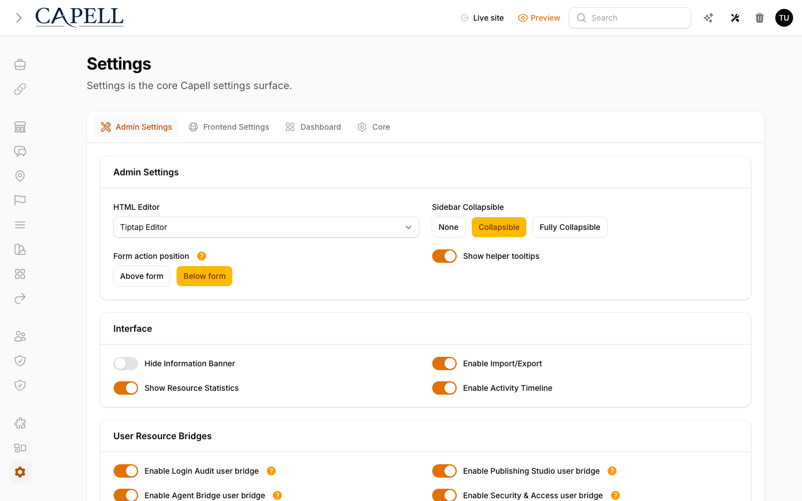

# Using Frontend Authoring

This guide is for editors who make quick edits on the live site and owners deciding where in-context editing fits. Every step uses the labels you see on screen.

## Using Frontend Authoring (editor how-to)

### How to edit a page from the live site

1. Sign in to the admin, then open the page on your site.
2. Click **Edit** to turn on **Edit mode**. Editable areas are highlighted.
3. Click an editable area to open the inline editor.

### How to change content and save

1. With an area open, change the text or content.
2. Save your change.
3. If you don't want to keep it, discard the unsaved changes instead.

### How to finish editing

1. Click **Close editor** when you are done.
2. The page returns to its normal view for visitors.

## Rolling out Frontend Authoring (for owners)

### Turn on first

- **In-context edits for trusted admins.** Use it for small text and content fixes where seeing the page helps.

### How to turn inline editing on or off safely

1. Use the setting that enables or disables inline authoring for your site.
2. When it is on, only signed-in admins see editing controls.
3. When it is off, public visitors get the same plain page either way, with no editing controls exposed.

### How editing controls reach admins

1. After a page loads, the site quietly checks whether the current visitor is a signed-in admin.
2. Only when that check confirms an admin does the page add the editing controls.
3. Public visitors never receive this, so cached public pages stay free of any editing data.

### Add when needed

| Need                               | Enable                                |
| ---------------------------------- | ------------------------------------- |
| Quick fixes without the full admin | Inline editing on key pages           |
| Bigger structural changes          | The full page editor in admin instead |

### Don't enable yet

- Don't use inline editing for large layout changes. It is best for small, in-place edits; use the page editor for structure.

### Who does what

| Role       | First useful screen                               |
| ---------- | ------------------------------------------------- |
| Editor     | The live page with **Edit** turned on             |
| Site owner | Decide which pages and editors use inline editing |

## Troubleshooting for editors

| What you see                         | What it means                                         | What to do                                                     |
| ------------------------------------ | ----------------------------------------------------- | -------------------------------------------------------------- |
| I don't see edit areas on the page   | You aren't signed in as an admin, or edit mode is off | Sign in and click **Edit** to turn on edit mode                |
| My change isn't showing for visitors | The page is serving a cached copy                     | Wait a moment, or clear the page cache                         |
| I can't edit part of the page        | That area isn't set as editable                       | Use the full page editor for areas that aren't editable inline |
| I changed the wrong thing            | The edit isn't saved yet                              | Discard the unsaved changes before saving                      |
