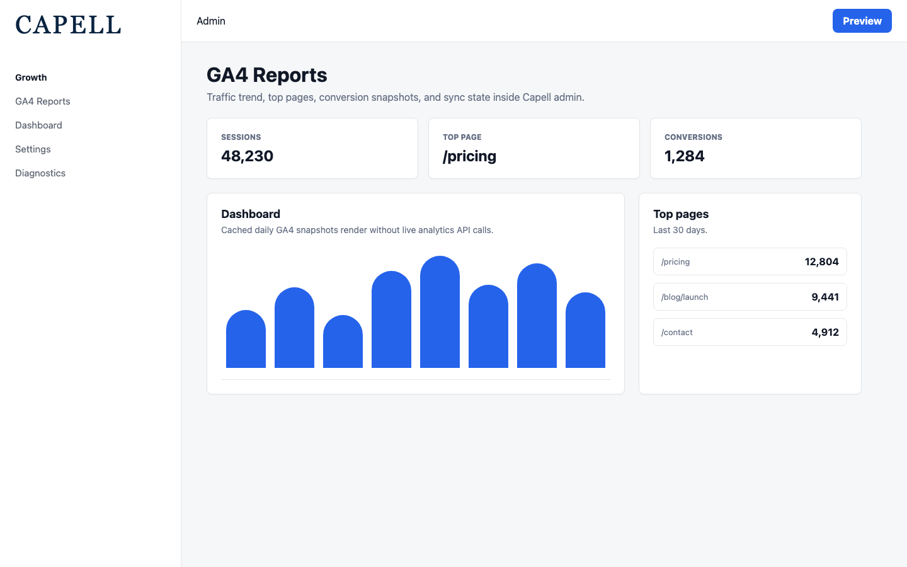
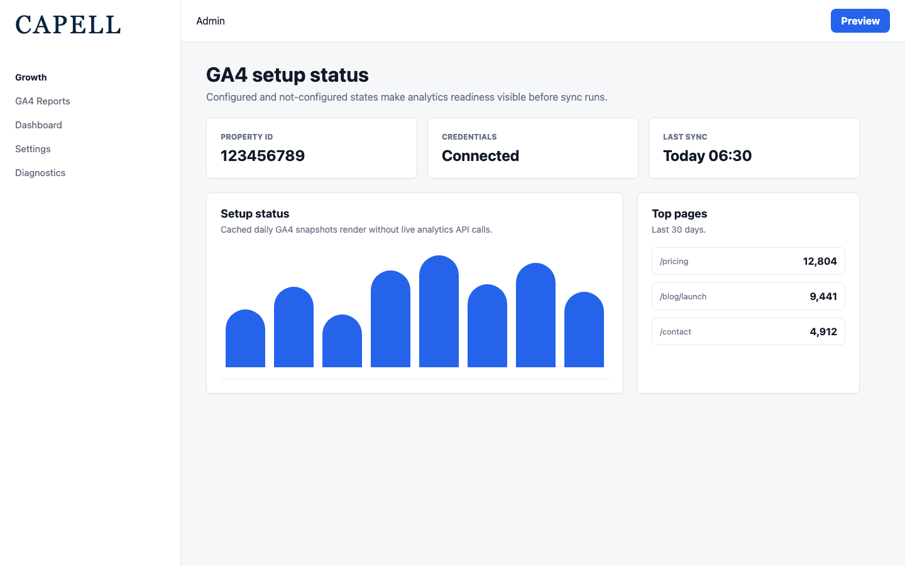
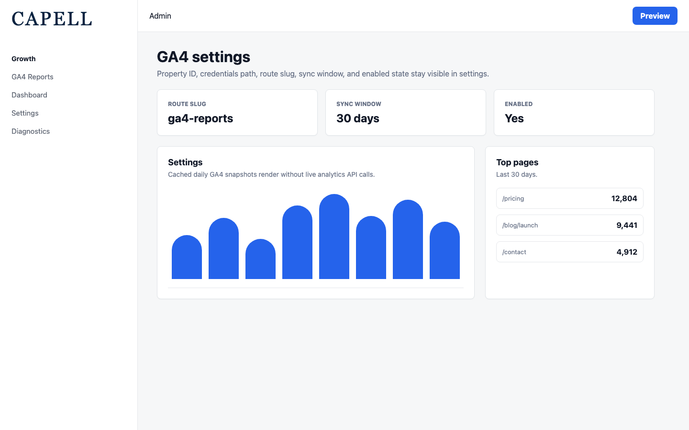

# GA4 Reports

<!-- prettier-ignore-start -->

## What This Plugin Adds

GA4 Reports is an **Available**, **Schema-owning** Capell package in the **Capell Growth** product group. It ships as `capell-app/ga4-reports` and extends these surfaces: admin, console.

GA4 Reports brings Google Analytics 4 into the Capell admin as cached daily snapshots, so owners see traffic trends, top pages, sessions, and conversions beside the content they manage. A scheduled sync authenticates with a Google service account, stores a configurable window locally, and powers dashboard widgets and overview stats that never call GA4 at render time. Setup status, sync history, and a swappable data-client contract keep the integration transparent and testable. Built for marketing and growth teams who want analytics signal in the CMS without standing up a separate reporting tool.

After install, admins get package-owned management or reporting surfaces inside Capell.

Status details:

- Status: Available
- Tier: premium
- Bundle: growth
- Composer package: `capell-app/ga4-reports`
- Namespace: `Capell\GA4Reports`
- Theme key: not applicable

## Why It Matters

**For developers:** The package gives developers package-owned service providers, Actions, Data objects, models, Filament classes, and Blade views instead of pushing this behaviour into core or application code.

**For teams:** Pull Google Analytics 4 traffic, top-page, and conversion snapshots into your Capell admin on a daily schedule - no per-pageview API calls, no leaving the CMS.

## Screens And Workflow

Screenshot contract: `screenshots.json`.

- GA4 Reports dashboard page (admin, required).
- GA4 Reports setup status widget (admin, required).
- GA4 Reports settings (admin, required).

## Screenshot Evidence

These captures are the package-owned visual contract for the admin pages, public pages, actions, workflows, and feature surfaces described above. Keep this section aligned with `docs/screenshots.json` whenever the package surface changes.

### GA4 Reports dashboard page

- Surface: admin · Target: /admin/ga4-reports.
- Documents: An administrator reviews GA4 overview stats, traffic trends, top pages, and setup status.
- Capture notes: Capture the extension page with overview stats, traffic trend, top pages, and setup status widgets.

### GA4 Reports setup status widget

- Surface: admin · Target: /admin/ga4-reports.
- Documents: A site owner distinguishes not-configured and configured GA4 states before enabling sync.
- Capture notes: Capture the not-configured and configured states if the screenshot runner can seed both.

### GA4 Reports settings

- Surface: admin · Target: /admin/settings.
- Documents: A site owner configures property ID, credentials path, route slug, sync window, and enabled state.
- Capture notes: Capture the settings section for property ID, credentials path, route slug, sync window, and enabled state.

## Technical Shape

- Service providers: `Capell\GA4Reports\Providers\GA4ReportsServiceProvider`, `Capell\GA4Reports\Providers\AdminServiceProvider`.
- Config files: `packages/ga4-reports/config/capell-ga4-reports.php`.
- Migrations: `packages/ga4-reports/database/migrations/2026_05_10_190852_01_create_ga4_reports_daily_metrics_table.php`, `packages/ga4-reports/database/migrations/2026_05_10_190852_02_create_ga4_reports_page_metrics_table.php`, `packages/ga4-reports/database/migrations/2026_05_10_190852_03_create_ga4_reports_sync_runs_table.php`.
- Settings migrations: `packages/ga4-reports/database/settings/2026_05_10_190853_01_create_ga4_reports_settings.php`.
- Settings classes: `GA4ReportsSettings`, `GA4ReportsSettingsMigrationProvider`.
- Models: `GA4ReportsDailyMetric`, `GA4ReportsPageMetric`, `GA4ReportsSyncRun`.
- Filament classes: `GA4ReportsPage`, `GA4ReportsDashboardSettingsContributor`, `GA4ReportsSettingsSchema`, `BuildsGA4ReportsDashboardWindow`, `GA4ReportsOverviewStatsWidget`, `GA4ReportsSetupStatusWidget`, `GA4ReportsTopPagesTableWidget`, `GA4ReportsTopPagesWidget`, `GA4ReportsTrafficTrendWidget`.
- Actions: `BuildGA4ReportsDigestAction`, `BuildGA4ReportsOverviewAction`, `BuildGA4ReportsTrendAction`, `BuildGA4ReportsWindowAction`, `BuildTopGA4ReportsPagesAction`, `CheckGA4ReportsCredentialsPathAction`, `ExportGA4ReportsDigestCsvAction`, `PersistGA4ReportsDailyMetricAction`, `PersistGA4ReportsPageMetricAction`, `RedactGA4ReportsSyncErrorMessageAction`, `ResolveGA4ReportsConfigAction`, `SyncGA4ReportsMetricsAction`.
- Data objects: `GA4ReportsConfigData`, `GA4ReportsCredentialsStatusData`, `GA4ReportsDailyMetricData`, `GA4ReportsDigestData`, `GA4ReportsOverviewData`, `GA4ReportsPageMetricData`, `GA4ReportsSyncResultData`, `GA4ReportsTopPageData`, `GA4ReportsTrendPointData`, `GA4ReportsWindowData`.
- Command signatures: `capell:ga4-reports-sync`.
- Console command classes: `SyncGA4ReportsCommand`.
- Health checks: `Capell\GA4Reports\Health\Ga4ReportsHealthCheck`.
- Blade views: `packages/ga4-reports/resources/views/filament/pages/ga4-reports.blade.php`.
- Cache tags: `ga4-reports`.

## Data Model

- Models: `GA4ReportsDailyMetric`, `GA4ReportsPageMetric`, `GA4ReportsSyncRun`.
- Migration files: `2026_05_10_190852_01_create_ga4_reports_daily_metrics_table.php`, `2026_05_10_190852_02_create_ga4_reports_page_metrics_table.php`, `2026_05_10_190852_03_create_ga4_reports_sync_runs_table.php`.
- Migration impact: run host migrations through the package install flow before opening package surfaces.
- Deletion/retention behaviour: each sync refreshes the configured reporting window (`sync_days`, default 30) for the configured GA4 property and replaces local daily/page snapshots for that window. Sync run history is retained for operational audit.

## Install Impact

- Admin navigation: adds package-owned Filament classes when registered.
- Permissions: none declared in `capell.json`.
- Public routes: none detected in package route files.
- Database changes: package migrations are declared.
- Settings: settings classes or settings migrations exist; verify the install flow registers them.
- Queues or schedules: registers `capell:ga4-reports-sync` on the host scheduler using `capell-ga4-reports.sync_cron` / the GA4 Reports settings cron expression, with overlap protection.
- Cache tags: `ga4-reports`.
- Commands: `capell:ga4-reports-sync`.

## Common Pitfalls

- Run migrations before opening package resources or public routes.
- Run package commands from the host app; in this repository use `vendor/bin/pest` for package tests.
- Keep `composer.json`, `composer.local.json`, `capell.json`, docs, screenshots, and tests aligned when the package surface changes.

## Troubleshooting

| Symptom | Likely cause | Check | Fix |
| --- | --- | --- | --- |
| Package surface is missing after install | Provider or manifest is not loaded | Confirm `capell.json`, package `composer.json`, and provider registration | Reinstall the package, refresh Composer autoload, and clear host caches |
| Admin screen or command fails on missing table | Package migrations have not run | Check the tables listed in `Data Model` | Run host migrations and rerun the focused package test |
| Background work does not run | Queue worker or scheduled command is not active | Check package jobs, commands, and host scheduler configuration | Start the queue or scheduler, then run the focused command or package test |
| Dashboard data looks stale | The scheduled sync has not completed recently or GA4 credentials are unreadable | Check the GA4 Reports setup status widget and package health check | Fix the property/credentials settings, then run `capell:ga4-reports-sync` |

## Quick Start

1. Install the package: `composer require capell-app/ga4-reports`.
2. Run the required setup: `php artisan migrate`.
3. Open the related Capell admin surface and verify GA4 Reports appears.

## Next Steps

- [Package docs index](README.md)
- [Screenshot contract](screenshots.json)
- [Marketplace assets](assets/marketplace/)
- [Capell content language plan](../../../docs/CONTENT_LANGUAGE_PLAN.md)
- [Capell documentation design system](../../../docs/DESIGN_SYSTEM.md)
- [Capell and package ERD notes](../../../docs/erd/capell-and-package-erds.md)
- Focused tests: `vendor/bin/pest packages/ga4-reports/tests --configuration=phpunit.xml`.

<!-- prettier-ignore-end -->
