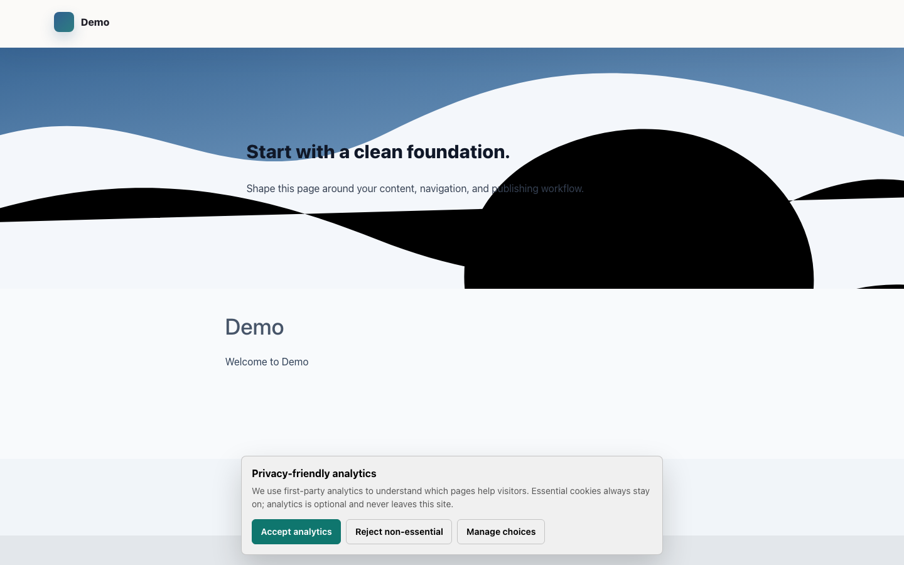
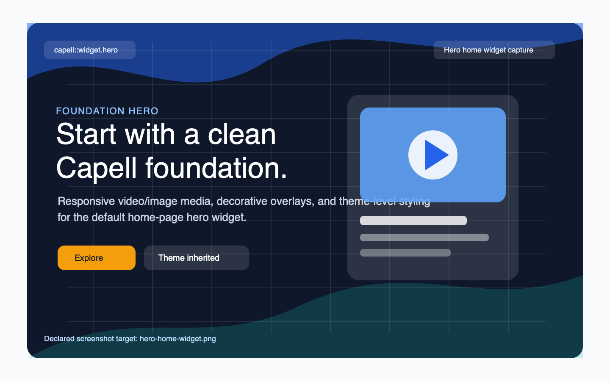

# Hero

<!-- prettier-ignore-start -->

## What This Plugin Adds

Hero is an **Available**, **No schema impact** Capell package in the **Capell Foundation** product group. It ships as `capell-app/hero` and extends these surfaces: admin, frontend, console.

A polished, responsive home hero for every Capell theme - autoplay video or decorative overlay backgrounds, multi-slide carousel, and theme-level styling that pages inherit automatically.

After install, admins get package-owned management surfaces and public users may see package-owned frontend output or routes.

Status details:

- Status: Available
- Tier: free
- Bundle: foundation
- Composer package: `capell-app/hero`
- Namespace: `Capell\Hero`
- Theme key: not applicable

## Why It Matters

**For developers:** The package gives developers package-owned service providers, Actions, Data objects, Filament classes, and Blade views instead of pushing this behaviour into core or application code.

**For teams:** A polished, responsive home hero for every Capell theme - autoplay video or decorative overlay backgrounds, multi-slide carousel, and theme-level styling that pages inherit automatically.

## Screens And Workflow

Screenshot contract: `screenshots.json`.

- Insights consent priming capture (frontend, optional).
- Hero home widget rendered on a public page (frontend, required).

## Screenshot Evidence

These captures are the package-owned visual contract for the admin pages, public pages, actions, workflows, and feature surfaces described above. Keep this section aligned with `docs/screenshots.json` whenever the package surface changes.

### Insights consent priming capture

- Surface: frontend · Target: frontend-url.
- Documents: The screenshot runner sets anonymous visitor consent state so Hero captures do not include analytics consent chrome.
- Capture notes: Runner-only warm-up capture that dismisses the Insights consent banner before marketplace-facing Hero screenshots are taken.

### Hero home widget rendered on a public page

- Surface: frontend · Target: frontend-url.
- Documents: A visitor sees the seeded hero widget rendered through Layout Builder and the active frontend theme.
- Capture notes: Runs capell:hero-setup --force before capture and waits for the public home page to render the Hero widget.

## Technical Shape

- Service providers: `Capell\Hero\Providers\HeroServiceProvider`.
- Filament classes: `HeroBackgroundSchema`, `HeroBackgroundThemeSchemaExtender`, `HeroBackgroundWidgetAssetSchemaExtender`, `HeroBackgroundWidgetSchemaExtender`.
- Actions: `InstallHeroLayoutDefaultsAction`, `ResolveHeroBackgroundDataAction`, `ResolveHeroMediaDataAction`.
- Data objects: `HeroAssetSlideData`, `HeroBackgroundData`, `HeroMediaData`, `HeroWidgetRenderData`.
- Command signatures: `capell:hero-setup`.
- Console command classes: `SetupCommand`.
- Health checks: `Capell\Hero\Health\HeroHealthCheck`.
- Blade views: `packages/hero/resources/views/components/hero/background.blade.php`, `packages/hero/resources/views/components/hero/content.blade.php`, `packages/hero/resources/views/components/hero/media.blade.php`, `packages/hero/resources/views/components/hero/related.blade.php`, `packages/hero/resources/views/components/hero/slide.blade.php`, `packages/hero/resources/views/components/hero/wrapper.blade.php`, `packages/hero/resources/views/components/widget/default.blade.php`, `packages/hero/resources/views/components/widget/hero.blade.php`.
- Cache tags: `hero`.

## Data Model

This package has no schema impact. It does not declare package-owned migrations or required tables.

Docs gap: document extension points here if the package delegates persistence to a host package.

## Install Impact

- Admin navigation: adds package-owned Filament classes when registered.
- Permissions: none declared in `capell.json`.
- Public routes: none detected in package route files.
- Database changes: no package migrations declared.
- Settings: no package settings declared.
- Queues or schedules: none detected in standard package paths.
- Cache tags: `hero`.
- Commands: `capell:hero-setup`.

## Common Pitfalls

- Keep public Blade and cached HTML free of authoring markers, model IDs, permissions, signed editor URLs, and lazy database queries.
- Run package commands from the host app; in this repository use `vendor/bin/pest` for package tests.
- Keep `composer.json`, `composer.local.json`, `capell.json`, docs, screenshots, and tests aligned when the package surface changes.

## Troubleshooting

| Symptom | Likely cause | Check | Fix |
| --- | --- | --- | --- |
| Package surface is missing after install | Provider or manifest is not loaded | Confirm `capell.json`, package `composer.json`, and provider registration | Reinstall the package, refresh Composer autoload, and clear host caches |
| Background work does not run | Queue worker or scheduled command is not active | Check package jobs, commands, and host scheduler configuration | Start the queue or scheduler, then run the focused command or package test |
| Public output leaks unexpected state | Render data, cache variation, or authoring boundary has regressed | Check public Blade, cache tags, and public-output safety tests | Move data loading out of Blade and rerun the package public-output tests |

## Quick Start

1. Install the package: `composer require capell-app/hero`.
2. Run the required setup: `php artisan capell:hero-setup`.
3. Open the related Capell admin surface and verify Hero appears.

## Next Steps

- [Package docs index](README.md)
- [Screenshot contract](screenshots.json)
- [Marketplace assets](assets/marketplace/)
- [Capell content language plan](../../../docs/CONTENT_LANGUAGE_PLAN.md)
- [Capell documentation design system](../../../docs/DESIGN_SYSTEM.md)
- [Capell and package ERD notes](../../../docs/erd/capell-and-package-erds.md)
- Related packages: [Layout Builder](../../layout-builder/README.md).
- Focused tests: `vendor/bin/pest packages/hero/tests --configuration=phpunit.xml`.

<!-- prettier-ignore-end -->
