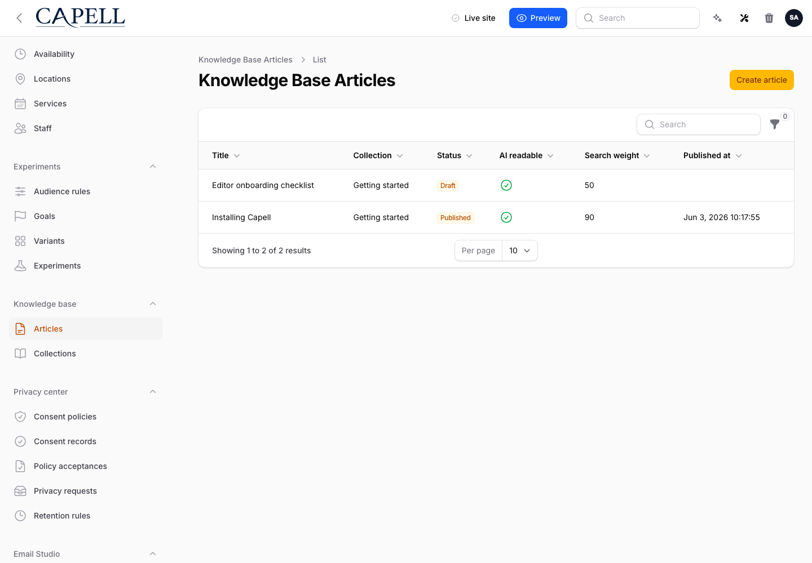
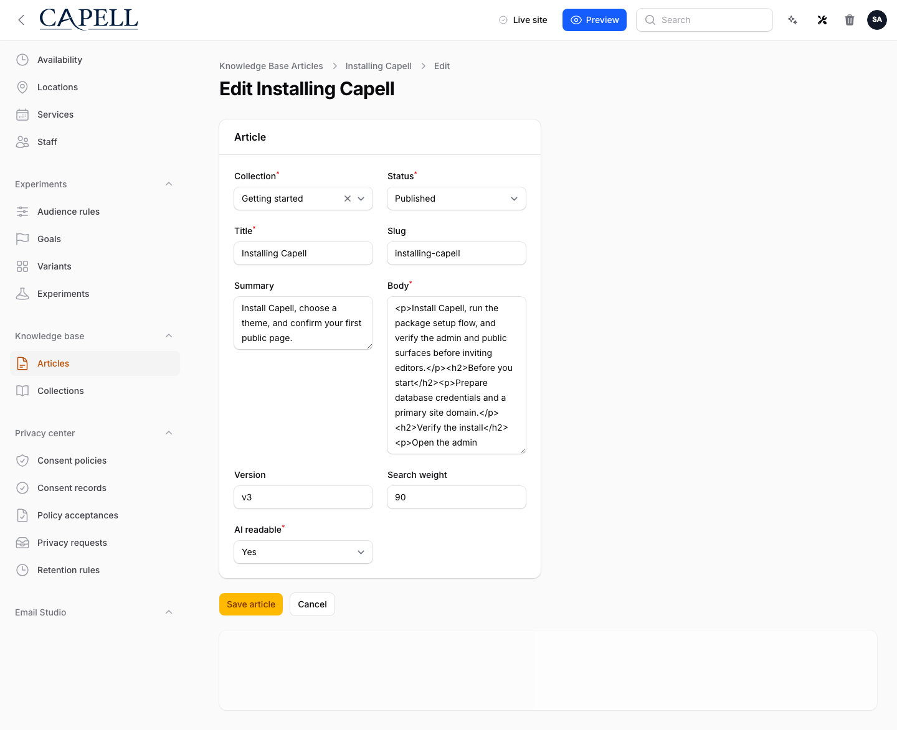

# Using Knowledge Base

This guide is for editors who write help content and owners deciding how to structure it. Every step uses the labels you see on screen.

## Using Knowledge Base (editor how-to)

### How to create a collection

1. Go to **Knowledge Base**.
2. Click **Create collection**.
3. Name it for a topic your visitors care about (for example "Getting started").
4. Save the collection.

### How to write and publish an article

1. Click **Create article**.
2. Add a **Title** and write the **Body**.
3. Put it in a **Collection** so visitors can find it.
4. Set it to **Public** and publish it when it is ready for customers.

### How to edit an article and review past versions

1. Open an article to edit it.
2. Update its title and body.
3. Check the earlier versions listed for the article before you publish the next revision.
4. Save and publish when you are happy.

### How to organise articles

1. Open an article.
2. Set or change its **Collection**, and its sort order within that collection.
3. Save. The article moves to its new place in the knowledge base.

### How to let visitors find articles

1. Make sure the article is **Public** and published.
2. Visitors can then browse its collection and search for it on your site.

## Rolling out Knowledge Base (for owners)

### Turn on first

- **A clear set of collections.** Decide your top-level topics before writing many articles, so the knowledge base stays easy to browse.

### Add when needed

| Need                       | Enable                           |
| -------------------------- | -------------------------------- |
| Group related help content | A **Collection** per topic       |
| Connect related articles   | Related articles on each article |

### Don't enable yet

- Don't publish half-finished articles. Keep them unpublished until they are ready for customers.

### Who does what

| Role       | First useful screen                          |
| ---------- | -------------------------------------------- |
| Editor     | **Articles**: write and publish help content |
| Site owner | **Collections**: keep the structure clear    |

## Troubleshooting for editors

| What you see                       | What it means                                          | What to do                                                         |
| ---------------------------------- | ------------------------------------------------------ | ------------------------------------------------------------------ |
| My article isn't on the site       | It isn't **Public** yet, or isn't published            | Open it, set it **Public**, and publish                            |
| An article is hard to find         | It isn't in a collection, or the collection is unclear | Assign it to the right **Collection** and name collections clearly |
| Articles appear in the wrong order | Their sort order needs setting                         | Open each article and set its sort order within the collection     |
| Visitors can't search an article   | It is unpublished or not public                        | Confirm it is **Public** and published                             |
