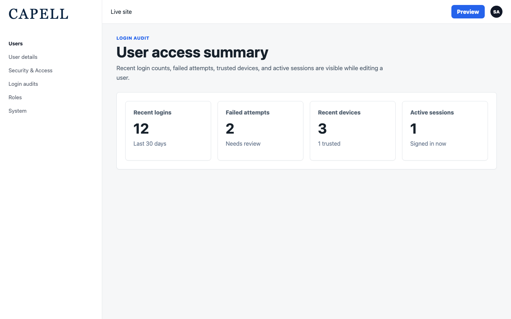
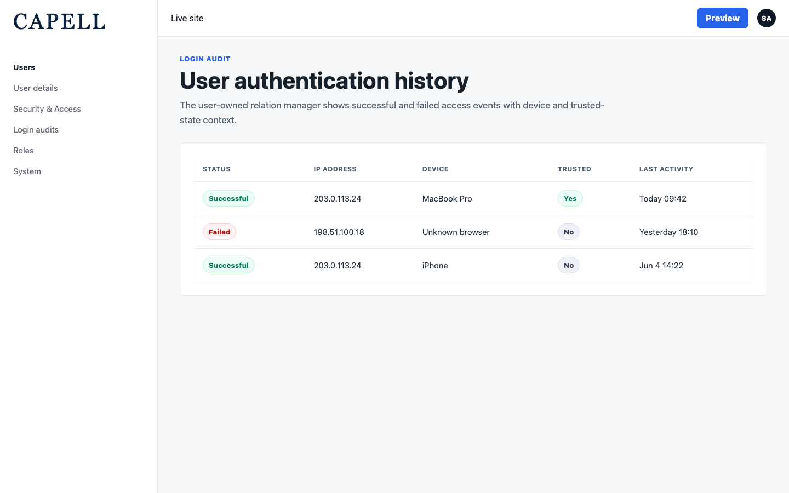

# Login Audit

<!-- prettier-ignore-start -->

## What This Plugin Adds

Login Audit is an **Available**, **Schema-owning** Capell package in the **Capell Operations** product group. It ships as `capell-app/login-audit` and extends these surfaces: admin.

Login Audit gives Capell operators a complete, immutable record of who accessed the admin and storefront, when, from which IP and device, and whether each attempt succeeded. A dedicated Filament resource, dashboard widget, and per-user access summary make it easy to spot unusual activity and respond to incidents, while configurable retention keeps the log lean and aligned with your data-protection policy. IP capture can be disabled or resolved through your CDN (Cloudflare and similar), and the audit log is read-only by design so records can't be quietly altered. Built on the battle-tested Laravel authentication-log foundation and wired into Capell's settings, permissions, and Diagnostics.

After install, admins get package-owned management or reporting surfaces inside Capell.

Status details:

- Status: Available
- Tier: premium
- Bundle: operations
- Composer package: `capell-app/login-audit`
- Namespace: `Capell\LoginAudit`
- Theme key: not applicable

## Why It Matters

**For developers:** The package gives developers package-owned service providers, Actions, models, and Filament classes instead of pushing this behaviour into core or application code.

**For teams:** Tamper-proof access logging for Capell - track every login, failed attempt, logout, device, and session, with retention controls and an admin audit trail built for security and compliance reviews.

## Screens And Workflow

Screenshot contract: `screenshots.json`.

- Authentication logs admin index (admin, required).
- Authentication log table filters (admin, required).
- Dashboard widget (admin, required).
- Authentication log settings screen (admin, required).
- User edit access summary (frontend, required).
- User authentication logs relation manager (frontend, required).

## Screenshot Evidence

These captures are the package-owned visual contract for the admin pages, public pages, actions, workflows, and feature surfaces described above. Keep this section aligned with `docs/screenshots.json` whenever the package surface changes.

### Authentication logs admin index

- Surface: admin · Target: LoginAuditResource.
- Documents: An administrator reviews successful and failed authentication events for the demo admin user.
- Capture notes: Captured in the Laravel 13 demo harness after publishing the package migration and seeding three login audit rows.

### Authentication log table filters

- Surface: admin · Target: LoginAuditResource.
- Documents: An administrator filters authentication events by success state, login date range, or cleared-by-user state.
- Capture notes: Captured with the table filter panel open on the Login Audit resource.

### Dashboard widget

- Surface: admin · Target: LoginAuditResource.
- Documents: A site owner confirms that Access Logs is available in dashboard/widget configuration after the package is installed.
- Capture notes: The widget is registered through the Capell dashboard contribution system and is surfaced in dashboard configuration; it does not appear on the default main dashboard layout in the core-only harness.

### Authentication log settings screen

- Surface: admin · Target: LoginAuditSettingsSchema.
- Documents: A site owner configures retention, IP tracking, visibility, and the user-resource bridge for login audit data.
- Capture notes: Captured on the shared Capell settings page after the Login Audit settings schema was registered.

### User edit access summary

- Surface: frontend · Target: LoginAuditUserSchemaExtender.
- Documents: An administrator checks recent login counts, failed attempts, devices, and active sessions while editing a user.
- Capture notes: Route-backed Capell fixture for the user edit access summary, used when the disposable demo user model does not expose the vendor authentication relation.

### User authentication logs relation manager

- Surface: frontend · Target: LoginAuditsRelationManager.
- Documents: An administrator opens the user-owned authentication history when the host user model supports the authentication log relation.
- Capture notes: Route-backed Capell fixture for the user-owned authentication history relation manager, including trusted-device and last-activity columns.

## Technical Shape

- Service providers: `Capell\LoginAudit\Providers\LoginAuditServiceProvider`, `Capell\LoginAudit\Providers\AdminServiceProvider`.
- Config files: `packages/login-audit/config/login-audit.php`.
- Migrations: `packages/login-audit/database/migrations/2026_05_10_190857_01_create_login_audit_table.php`.
- Settings migrations: `packages/login-audit/database/settings/2026_05_10_190858_01_add_login_audit_settings.php`, `packages/login-audit/database/settings/2026_06_06_000001_add_login_audit_suspicious_detection_settings.php`, `packages/login-audit/database/settings/2026_06_06_000002_add_login_audit_alert_settings.php`, `packages/login-audit/database/settings/2026_06_06_000003_add_login_audit_geo_location_setting.php`.
- Settings classes: `LoginAuditSettings`.
- Models: `LoginAudit`.
- Filament classes: `LoginAuditAdminPanelExtender`, `LoginAuditResource`, `LoginAuditsTable`, `LoginAuditsRelationManager`, `LoginAuditDashboardSettingsContributor`, `LoginAuditSettingsSchema`, `LoginAuditsWidget`.
- Policies: `LoginAuditPolicy`.
- Listeners: `DetectSuspiciousLoginFromAuthEvent`.
- Actions: `ApplyLoginAuditSettingsAction`, `BuildLoginAuditsCsvAction`, `BuildLoginAuditsQueryAction`, `DetectSuspiciousLoginAction`, `RecordLoginAuditPurgeAction`, `ResolveLoginAuditIpAddressAction`, `SendLoginAuditAdminAlertAction`, `ShouldTrackAdminActivityAction`, `ShouldTrackUserIpAddressesAction`, `UpdateLastSeenForActorAction`.
- Manifest contributions: `admin-resource: Capell\LoginAudit\Manifest\LoginAuditAdminResourcesContribution`, `dashboard-widget: Capell\LoginAudit\Manifest\LoginAuditDashboardWidgetContribution`, `health-check: Capell\LoginAudit\Manifest\LoginAuditHealthContribution`, `model: Capell\LoginAudit\Manifest\LoginAuditModelsContribution`, `permission: Capell\LoginAudit\Manifest\LoginAuditPermissionsContribution`, `scheduled-job: Capell\LoginAudit\Manifest\LoginAuditPurgeScheduleContribution`, `setting: Capell\LoginAudit\Manifest\LoginAuditSettingsContribution`.
- Health checks: `Capell\LoginAudit\Health\LoginAuditHealthCheck`.

## Data Model

- Required tables: `login_audit`.
- Models: `LoginAudit`.
- Migration files: `2026_05_10_190857_01_create_login_audit_table.php`.
- Migration impact: run host migrations through the package install flow before opening package surfaces.
- Deletion/retention behaviour: Docs gap unless the package has an explicit pruning command, retention setting, or tested cascade path.

## Install Impact

- Admin navigation: adds package-owned Filament classes when registered.
- Permissions: `View:LoginAudit`.
- Public routes: none detected in package route files.
- Database changes: package migrations are declared.
- Settings: `Capell\LoginAudit\Settings\LoginAuditSettings`.
- Queues or schedules: none detected in standard package paths.
- Cache tags: none declared.
- Commands: none declared.

## Common Pitfalls

- Run migrations before opening package resources or public routes.
- Configure package settings before testing production-like workflows.
- Keep `composer.json`, `composer.local.json`, `capell.json`, docs, screenshots, and tests aligned when the package surface changes.

## Troubleshooting

| Symptom | Likely cause | Check | Fix |
| --- | --- | --- | --- |
| Package surface is missing after install | Provider or manifest is not loaded | Confirm `capell.json`, package `composer.json`, and provider registration | Reinstall the package, refresh Composer autoload, and clear host caches |
| Admin screen or command fails on missing table | Package migrations have not run | Check the tables listed in `Data Model` | Run host migrations and rerun the focused package test |

## Quick Start

1. Install the package: `composer require capell-app/login-audit`.
2. Run the required setup: `php artisan migrate`.
3. Open the related Capell admin surface and verify Login Audit appears.

## Next Steps

- [Package docs index](README.md)
- [Screenshot contract](screenshots.json)
- [Marketplace assets](assets/marketplace/)
- [Capell content language plan](../../../docs/CONTENT_LANGUAGE_PLAN.md)
- [Capell documentation design system](../../../docs/DESIGN_SYSTEM.md)
- [Capell and package ERD notes](../../../docs/erd/capell-and-package-erds.md)
- Related packages: [Password Policy](../../password-policy/README.md), [Privacy Center](../../privacy-center/README.md), [Diagnostics](../../diagnostics/README.md), [Access Gate](../../access-gate/README.md).
- Focused tests: `vendor/bin/pest packages/login-audit/tests --configuration=phpunit.xml`.

<!-- prettier-ignore-end -->
