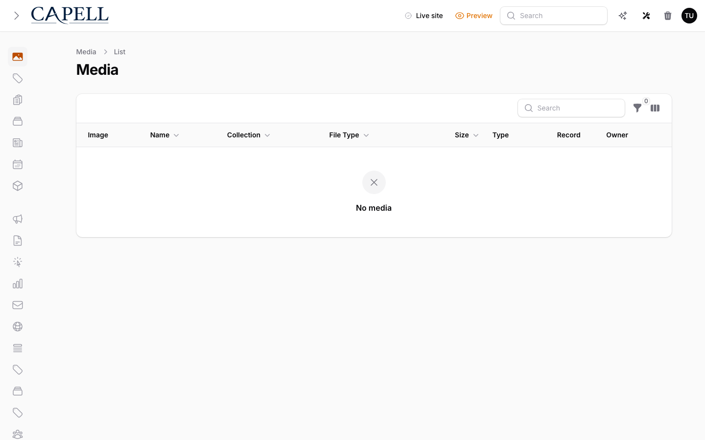

# Using Media AI

This guide is for editors who want to improve images in the media library. No technical knowledge needed. Every step uses the labels you see on screen. Media AI adds a single tool, **Doctor image**, to an image's edit page. You ask it to make a change, it works in the background, and you decide whether to keep the result.

## Using Media AI (editor how-to)

### How to improve or repair an image

1. Open the media library and click the image you want to work on so its edit page opens.
2. Click **Doctor image** in the header. This button only appears on images, and only when an image doctor is available.
3. Pick what you want from the **Operation** list:
    - **Improve image** for a general clean-up.
    - **Remove background** to drop the background out.
    - **Remove object** to take something out of the picture.
    - **Restore image** to repair an old or damaged photo.
    - **Upscale image** to make it larger and sharper.
4. In **Instructions**, describe what should change in plain words. For **Remove object**, name the object clearly so it is obvious what to take out.
5. Confirm to start the request.

### How to remove the background from an image

1. Open the image and click **Doctor image**.
2. Set **Operation** to **Remove background**.
3. Leave **Instructions** blank, or add a note if part of the image should stay.
4. Confirm to start the request.

### How to remove an unwanted object from an image

1. Open the image and click **Doctor image**.
2. Set **Operation** to **Remove object**.
3. In **Instructions**, name the object to remove as clearly as you can (for example, "the bin on the left").
4. Confirm to start the request.

### How to wait for a result and check it

1. After you confirm, you may see a message that the request has been queued. This means it is running in the background.
2. Give it a moment to finish. You do not need to stay on the page.
3. When it is done, compare the new version against the original before you commit to it.
4. If the result is an improvement, keep it. If it looks worse, keep the original instead.

## Rolling out Media AI (for owners)

### Turn on first

- **The image doctor connection.** Media AI only works once an image doctor is set up through your AI tooling. Until then, the **Doctor image** button stays hidden. Get this connected first, then let editors try it on a few images.

### Good to know

| Need                              | What happens                                                                |
| --------------------------------- | --------------------------------------------------------------------------- |
| Editors want to enhance images    | They open an image and use **Doctor image**                                 |
| Requests should not block editing | They run in the background and finish shortly after                         |
| Heavy use in a short time         | A rate limit can apply, and editors are asked to try again in a few seconds |

## Troubleshooting

| What you see                                   | What it means                                          | What to do                                                               |
| ---------------------------------------------- | ------------------------------------------------------ | ------------------------------------------------------------------------ |
| There is no **Doctor image** button            | The item is not an image, or no image doctor is set up | Open an image; if it is an image, ask your developer to connect a doctor |
| A message says the AI service is not available | The AI connection is offline or not configured         | Ask your developer to check the AI setup, then try again                 |
| A message says no image doctor is configured   | The doctor connection has not been set up yet          | Ask your developer to set up an image doctor                             |
| The result looks worse than the original       | The change did not improve the image                   | Keep the original; do not replace it                                     |
| A message mentions a rate limit                | Too many requests were started in a short time         | Wait the number of seconds shown, then try again                         |
| Nothing seems to happen after you confirm      | The request is queued and running in the background    | Wait a moment for it to finish, then check the result                    |
