# Using Newsletter

This guide is for editors who send newsletters and owners deciding how to manage subscribers. Every step uses the labels you see on screen.

## Using Newsletter (editor how-to)

### How to write and send a newsletter

1. Go to **Newsletter** and start a new send.
2. Write your subject and content.
3. **Send a test** to yourself and check it looks right.
4. Send it to your subscribers, or schedule it (below).

### How to schedule a send

1. In the send, set the **Scheduled** date and time.
2. Save. It goes out automatically at that time.

### How to check your dashboard stats

1. Open **Newsletter** to see the overview dashboard.
2. Read the headline numbers for subscribed, pending, and sync failures.
3. Use these to spot problems early, such as a rising number of failures.

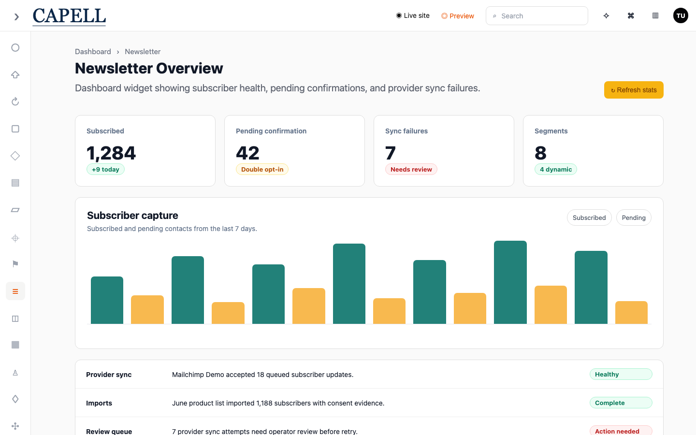

### How to manage subscribers

1. Open **Subscribers**.
2. See who is subscribed, their status, site scope, tags, and consent.
3. Use the filters at the top to narrow the list, for example by status or site.
4. Export the list when you need a copy.

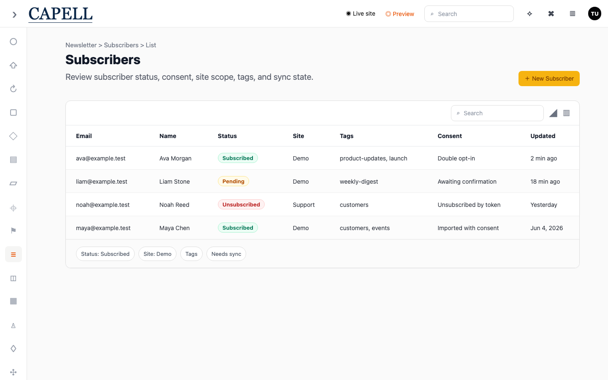

### How to add or edit a subscriber

1. In **Subscribers**, open an existing person or start a new one.
2. Set their email and name, status, site, and tags.
3. Fill in the consent details so you have a record of how they opted in.
4. Save.

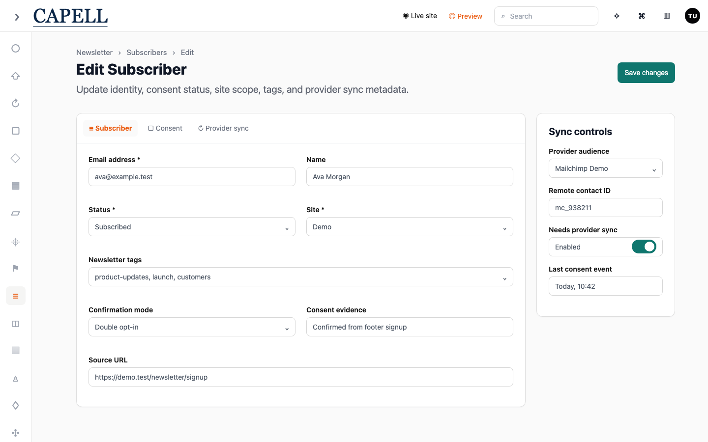

### How to manage newsletter tags

1. Open **Newsletter Tags**.
2. Create the tags you want to group subscribers by, such as interests or topics.
3. Edit or remove tags as your needs change.

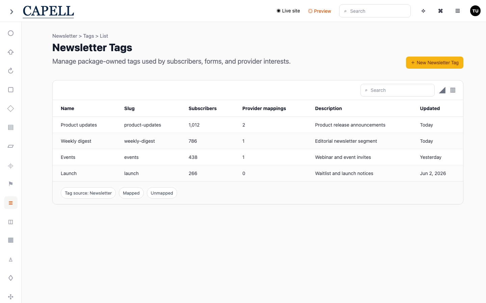

### How to build segments

1. Open **Segments**.
2. Create a segment to target a group of subscribers.
3. Choose a fixed list of people, or rules that update the segment automatically.
4. Save, then use the segment when you send.

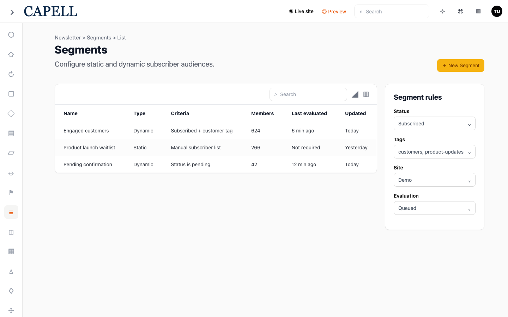

### How to connect an email provider

1. Open **Provider Connections**.
2. Add your email service and enter its credentials.
3. Save. This is the service that actually delivers your newsletters.

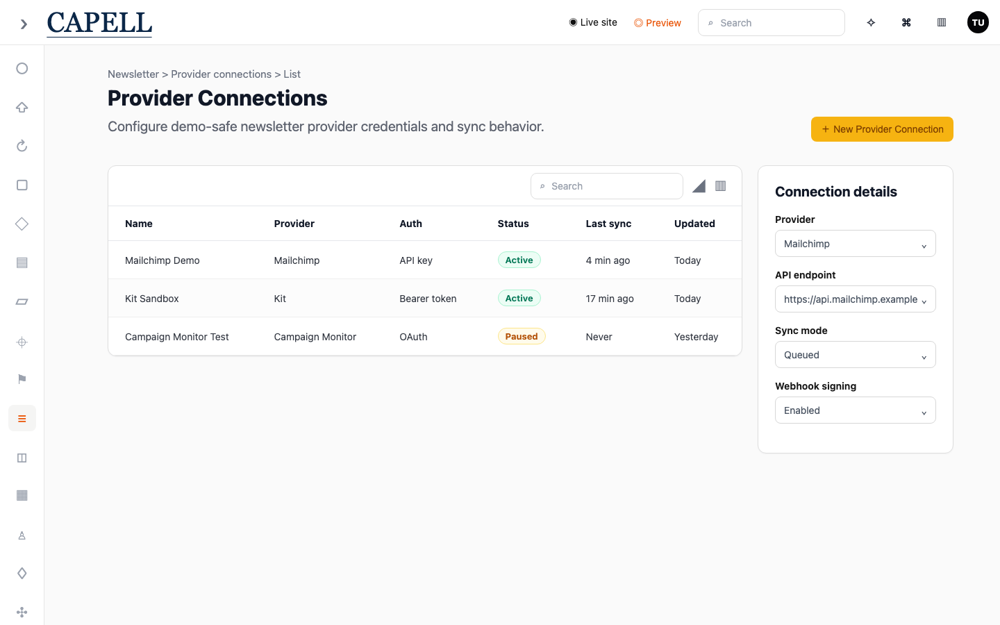

### How to map sites to provider audiences

1. Open **Provider Audiences**.
2. Match each of your local sites to the matching audience on the provider.
3. Save, so subscribers sync into the right audience.

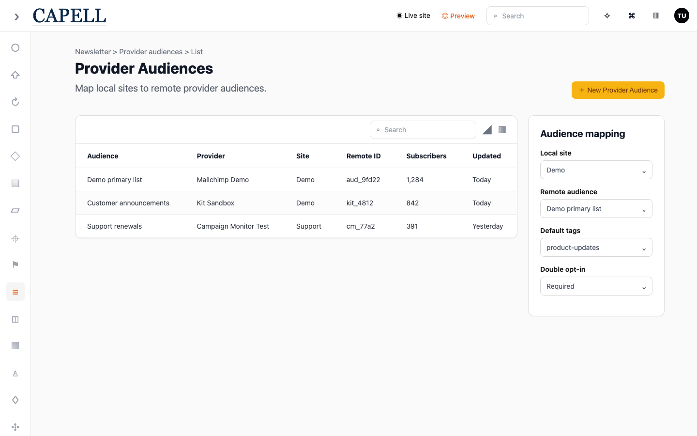

### How to map provider interests to tags

1. Open **Provider Interest Mappings**.
2. Match each interest from the provider to one of your newsletter tags.
3. Save, so tagged subscribers carry the right interests to the provider.

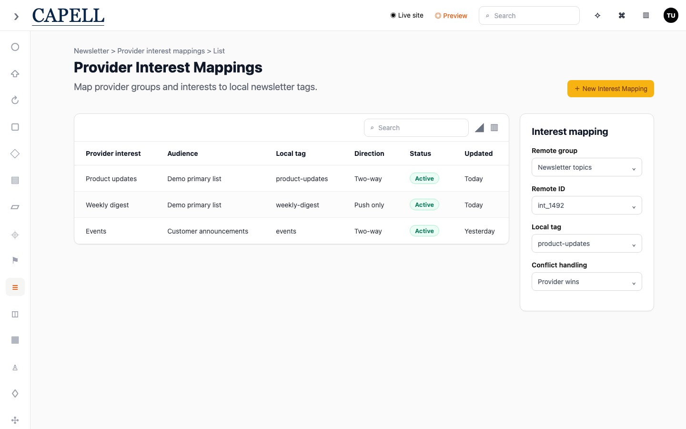

### How to connect a form to subscriptions

1. Open **Form Mappings**.
2. Choose a form and connect it to newsletter subscription handling.
3. Save. People who submit that form are added as subscribers.

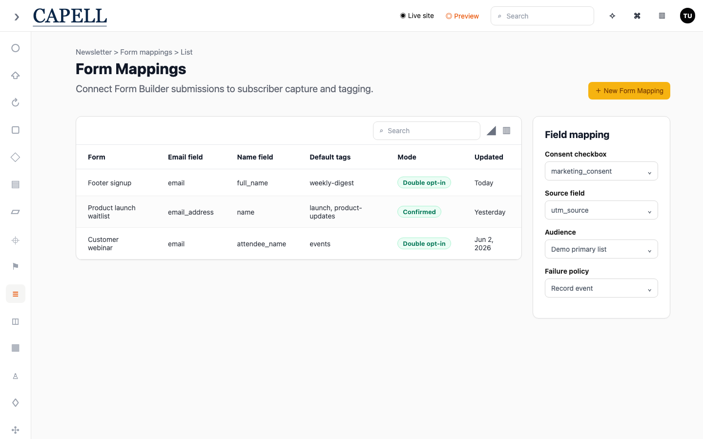

### How to import subscribers and review imports

1. Open **Imports / Exports**.
2. Start an import to bring in a list of subscribers.
3. Review each batch and its outcome, including anything that was skipped.

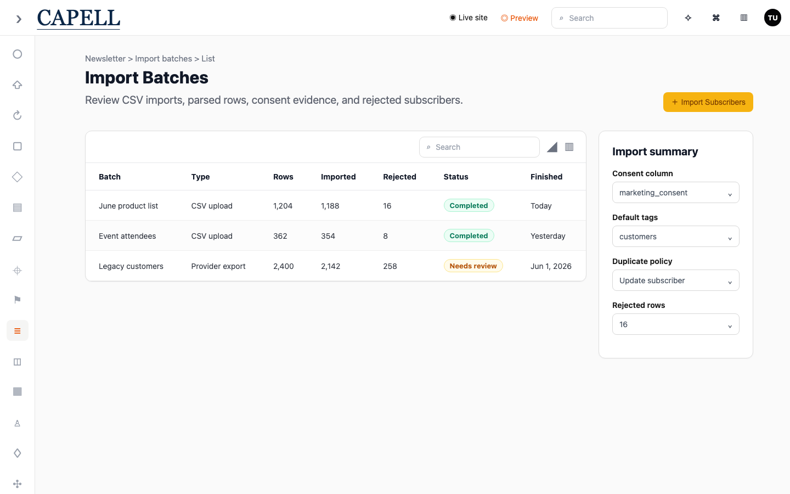

### How to check provider sync

1. Open **Sync Attempts**.
2. Review each attempt to send subscriber changes to the provider.
3. Look for failures and retries, and follow up on anything that keeps failing.

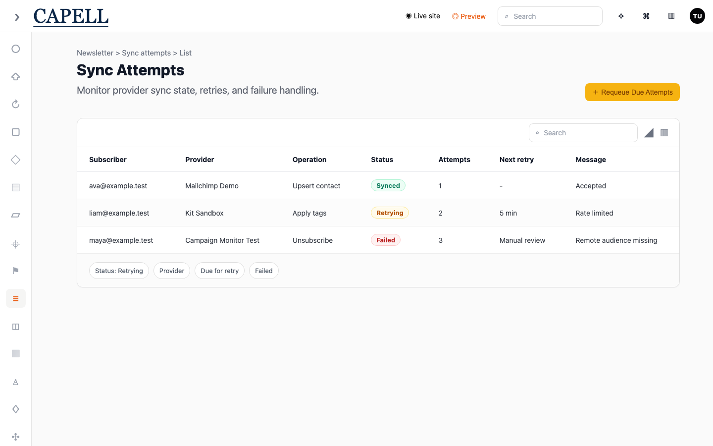

### How to see opens

1. Open a finished send.
2. See how many people opened it.
3. Use this to judge subject lines and timing.

## Rolling out Newsletter (for owners)

### Turn on first

- **A connected email provider and a test send.** Connect your sending service and send a test before emailing real subscribers.

### Add when needed

| Need                                | Enable                          |
| ----------------------------------- | ------------------------------- |
| Confirm subscribers really opted in | Double opt-in / a consent field |
| Send at the best time               | Scheduling                      |

### Don't enable yet

- Don't send to your full list before a test send looks correct. Mistakes can't be unsent.

### Who does what

| Role       | First useful screen                          |
| ---------- | -------------------------------------------- |
| Editor     | **Newsletter sends**: write, test, send      |
| Site owner | **Subscribers** and **Provider connections** |

## Troubleshooting for editors

| What you see                   | What it means                                              | What to do                                                    |
| ------------------------------ | ---------------------------------------------------------- | ------------------------------------------------------------- |
| My test email didn't arrive    | The provider isn't connected, or it's in spam              | Check **Provider connections**, and look in your spam folder  |
| A scheduled send didn't go out | The schedule time hasn't passed, or sending failed         | Re-check the **Scheduled** time; if it failed, retry the send |
| Subscriber numbers look wrong  | Unconfirmed or unsubscribed people are counted differently | Review the **Subscribers** list and their status              |
| Open numbers seem low          | Opens aren't always tracked, or the subject didn't land    | Compare subject lines over a few sends                        |
