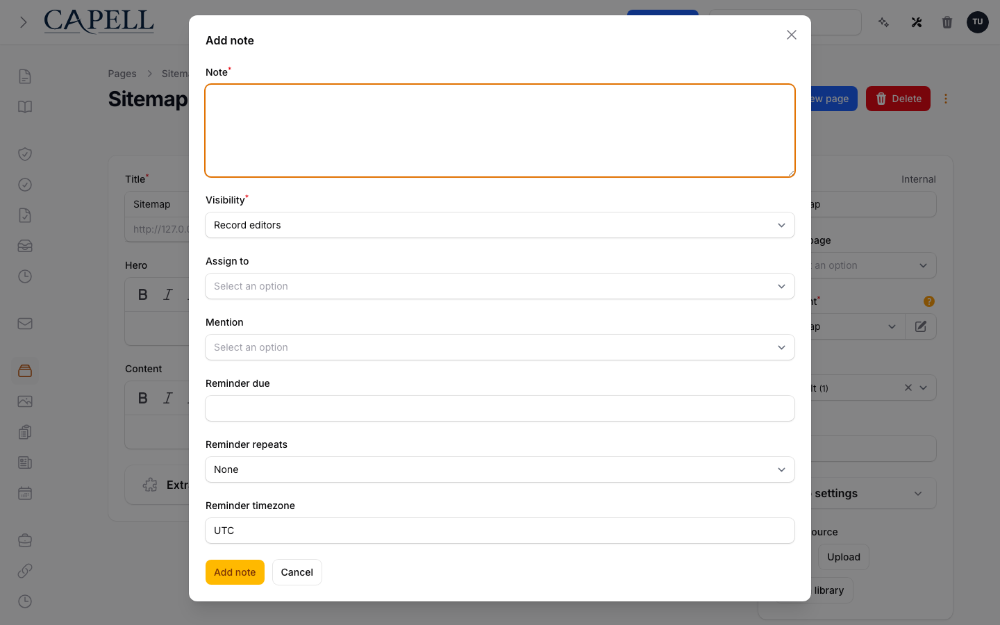
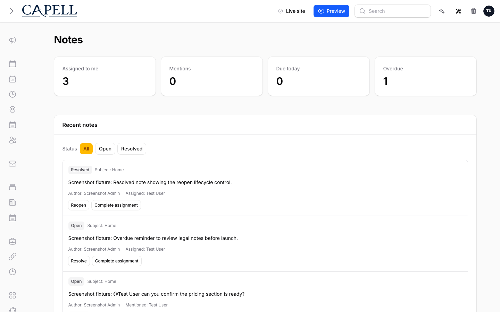

# Notes

<!-- prettier-ignore-start -->

## What This Plugin Adds

Notes is an **Available**, **Schema-owning** Capell package in the **Capell Collaboration** product group. It ships as `capell-app/notes` and extends these surfaces: admin.

Add private, assignable notes and @mentions to any Capell admin record so editors can leave context, hand off work, and never lose track of what needs attention.

After install, admins get package-owned management or reporting surfaces inside Capell.

Status details:

- Status: Available
- Tier: premium
- Bundle: collaboration
- Composer package: `capell-app/notes`
- Namespace: `Capell\Notes`
- Theme key: not applicable

## Why It Matters

**For developers:** The package gives developers package-owned service providers, Actions, Data objects, models, Filament classes, and Blade views instead of pushing this behaviour into core or application code.

**For teams:** Add private, assignable notes and @mentions to any Capell admin record so editors can leave context, hand off work, and never lose track of what needs attention.

## Screens And Workflow

Screenshot contract: `screenshots.json`.

- User-menu notes item with attention badge (admin, required).
- Notes inbox page (admin, required).
- Record-level Add note modal (admin, required).
- Empty notes inbox state (admin, required).
- Notes inbox with assigned, mentioned, and lifecycle controls (admin, required).

## Screenshot Evidence

These captures are the package-owned visual contract for the admin pages, public pages, actions, workflows, and feature surfaces described above. Keep this section aligned with `docs/screenshots.json` whenever the package surface changes.

### User-menu notes item with attention badge

- Surface: admin · Target: AdminServiceProvider::registerUserMenuItem.
- Documents: An administrator sees the user-menu notes item with an attention badge.
- Capture notes: Opens the Filament user menu after seeding assigned, mentioned, or overdue note attention counts.

### Notes inbox page

- Surface: admin · Target: NotesInboxPage.
- Documents: An administrator reviews assigned notes, mentions, and lifecycle actions from the inbox.
- Capture notes: Shows the main inbox at /admin/notes.

### Record-level Add note modal

- Surface: admin · Target: PageResource/EditPage.
- Documents: An administrator leaves contextual record-level notes from the Capell page edit surface.
- Capture notes: Opens the real Create note Filament header action on a page edit record.

### Empty notes inbox state

- Surface: admin · Target: NotesInboxPage.
- Documents: An administrator sees the default empty inbox state when no notes need attention.
- Capture notes: Shows the default inbox state for a user with no notes requiring attention.

### Notes inbox with assigned, mentioned, and lifecycle controls

- Surface: admin · Target: NotesInboxPage.
- Documents: An administrator reviews seeded assigned and mentioned notes with resolve, reopen, and complete-assignment controls.
- Capture notes: Requires seeded notes covering assignment, mention, resolved, and open states.

## Technical Shape

- Service providers: `Capell\Notes\Providers\NotesServiceProvider`, `Capell\Notes\Providers\AdminServiceProvider`.
- Config files: `packages/notes/config/capell-notes.php`.
- Migrations: `packages/notes/database/migrations/2026_05_10_190862_01_create_notes_tables.php`.
- Models: `Note`, `NoteAssignment`, `NoteMention`, `NoteReminder`.
- Filament classes: `CreateNoteResourceHeaderActionExtender`, `NotesInboxPage`.
- Actions: `AssignNoteUsersAction`, `BuildSubjectNotesAction`, `BuildUserAttentionCountsAction`, `BuildUserInboxNotesAction`, `CanViewNoteAction`, `CompleteNoteAssignmentAction`, `CreateNoteAction`, `MarkNoteMentionsReadAction`, `MentionNoteUsersAction`, `PruneNotesForDeletedParticipantAction`, `PruneNotesForDeletedSubjectAction`, `ReopenNoteAction`, `and 5 more`.
- Data objects: `CreateNoteData`, `NoteReminderData`, `UserAttentionCountData`.
- Command signatures: `capell:notes-demo`, `capell:notes:send-due-reminders`.
- Console command classes: `DemoCommand`, `SendDueNoteRemindersCommand`.
- Manifest contributions: `admin-action-extender: Capell\Notes\Manifest\NotesAdminActionExtenderContribution`, `admin-page: Capell\Notes\Manifest\NotesAdminPageContribution`, `console-command: Capell\Notes\Manifest\NotesConsoleCommandsContribution`, `health-check: Capell\Notes\Manifest\NotesHealthContribution`, `model: Capell\Notes\Manifest\NotesModelsContribution`, `scheduled-job: Capell\Notes\Manifest\NotesReminderScheduleContribution`.
- Health checks: `Capell\Notes\Health\NotesHealthCheck`.
- Blade views: `packages/notes/resources/views/filament/pages/notes-inbox.blade.php`.

## Data Model

- Required tables: `notes`, `note_assignments`, `note_mentions`, `note_reminders`.
- Models: `Note`, `NoteAssignment`, `NoteMention`, `NoteReminder`.
- Migration files: `2026_05_10_190862_01_create_notes_tables.php`.
- Migration impact: run host migrations through the package install flow before opening package surfaces.
- Deletion/retention behaviour: Docs gap unless the package has an explicit pruning command, retention setting, or tested cascade path.

## Install Impact

- Admin navigation: adds package-owned Filament classes when registered.
- Permissions: none declared in `capell.json`.
- Public routes: none detected in package route files.
- Database changes: package migrations are declared.
- Settings: no package settings declared.
- Queues or schedules: none detected in standard package paths.
- Cache tags: none declared.
- Commands: `capell:notes-demo`, `capell:notes:send-due-reminders`.

## Common Pitfalls

- Run migrations before opening package resources or public routes.
- Keep `composer.json`, `composer.local.json`, `capell.json`, docs, screenshots, and tests aligned when the package surface changes.

## Troubleshooting

| Symptom | Likely cause | Check | Fix |
| --- | --- | --- | --- |
| Package surface is missing after install | Provider or manifest is not loaded | Confirm `capell.json`, package `composer.json`, and provider registration | Reinstall the package, refresh Composer autoload, and clear host caches |
| Admin screen or command fails on missing table | Package migrations have not run | Check the tables listed in `Data Model` | Run host migrations and rerun the focused package test |
| Background work does not run | Queue worker or scheduled command is not active | Check package jobs, commands, and host scheduler configuration | Start the queue or scheduler, then run the focused command or package test |

## Quick Start

1. Install the package: `composer require capell-app/notes`.
2. Run the required setup: `php artisan capell:notes-demo`.
3. Open the related Capell admin surface and verify Notes appears.

## Next Steps

- [Package docs index](README.md)
- [Screenshot contract](screenshots.json)
- [Marketplace assets](assets/marketplace/)
- [Capell content language plan](../../../docs/CONTENT_LANGUAGE_PLAN.md)
- [Capell documentation design system](../../../docs/DESIGN_SYSTEM.md)
- [Capell and package ERD notes](../../../docs/erd/capell-and-package-erds.md)
- Focused tests: `vendor/bin/pest packages/notes/tests --configuration=phpunit.xml`.

<!-- prettier-ignore-end -->
