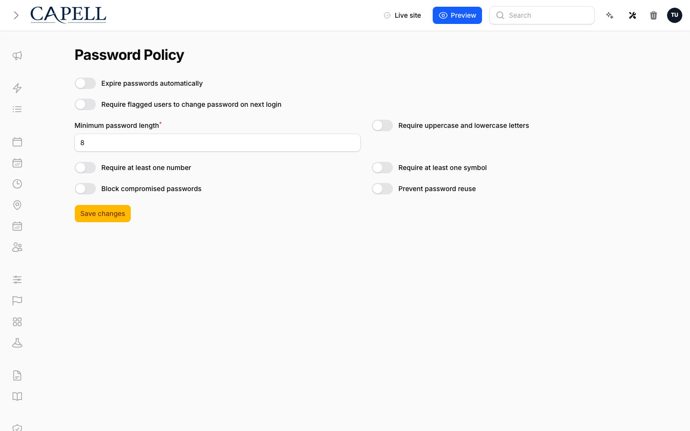
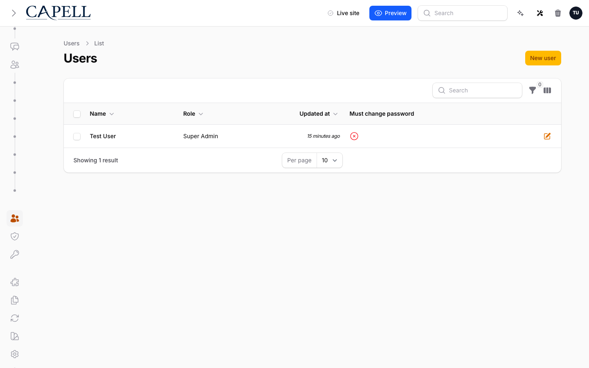
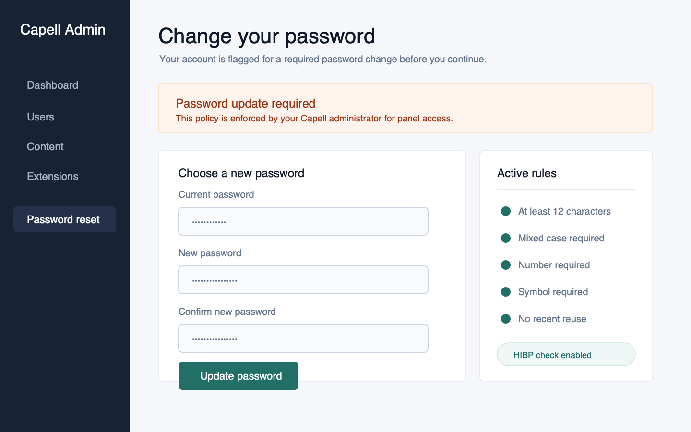

# Using Password Policy

This guide is for owners and operators who set the password rules for admin accounts. No technical knowledge needed. Every step uses the labels you see on screen. You decide how strong passwords must be, whether they expire, and when people are made to change them.

## Using Password Policy (how-to)

### How to set your password rules

1. Go to **System > Password Policy** in the admin.
2. Set **Minimum password length** to the shortest password you will allow.
3. Turn on the strength rules you want: **Require uppercase and lowercase letters**, **Require at least one number**, and **Require at least one symbol**.
4. Turn on **Block compromised passwords** to reject passwords that have shown up in known data leaks. This is checked without storing the password itself.
5. Save your changes.

### How to stop people reusing old passwords

1. Go to **System > Password Policy**.
2. Turn on **Prevent password reuse**.
3. Set **Remembered passwords** to how many recent passwords should be off-limits.
4. Save your changes. People will now be asked to choose a password they have not used recently.

### How to expire passwords on a schedule

1. Go to **System > Password Policy**.
2. Turn on **Expire passwords automatically**.
3. Set **Expiry interval in days** to how long a password stays valid.
4. To warn people before their password expires, turn on **Send expiry warning emails** and set **Warning window in days** to how many days of notice they get.
5. Save your changes.

### How to require a user to change their password

1. Go to the users list in the admin.
2. Find the user. The added columns show their password state, including **Must change password**, **Password changed**, and **Password expired**.
3. Use the filters to narrow the list, for example to people who **Must change password**, whose **Password expired**, or who have a **Password never changed**.
4. Use the **Require password change** action on that user. To do several at once, select them and use the **Require password change** bulk action.
5. The next time each flagged user signs in, they are sent to the password-change screen before they can continue.

### How the forced password-change screen works

1. When a flagged user signs in, they land on the **Change your password** screen and cannot move on until they set a new password.
2. They enter their **Current password**, then a **New password**, and repeat it in **Confirm new password**.
3. The new password must meet all the rules you set. If it does not, the screen explains what to fix.
4. They click **Update password** to continue into the admin.

## Rolling out Password Policy (for owners)

### Turn on first

- **Length and strength rules.** Start with **Minimum password length** and the **Require...** strength options, plus **Block compromised passwords**. These protect new and changed passwords without disrupting anyone immediately.

### Add when needed

| Need                                       | Turn on                                                                                                 |
| ------------------------------------------ | ------------------------------------------------------------------------------------------------------- |
| Stop people recycling old passwords        | **Prevent password reuse**, with **Remembered passwords**                                               |
| Make passwords age out over time           | **Expire passwords automatically**, with **Expiry interval in days**                                    |
| Give warning before expiry                 | **Send expiry warning emails**, with **Warning window in days**                                         |
| Force a fresh password at the next sign-in | **Require flagged users to change password on next login**, then the **Require password change** action |

### Who does what

| Role     | First useful screen                                                                 |
| -------- | ----------------------------------------------------------------------------------- |
| Owner    | **System > Password Policy**: set the rules                                         |
| Operator | The users list: review password state and use **Require password change** as needed |

## Troubleshooting

| What you see                                           | What it means                                                   | What to do                                                                |
| ------------------------------------------------------ | --------------------------------------------------------------- | ------------------------------------------------------------------------- |
| A new password is rejected                             | It fails one of your rules                                      | Read the message; meet the length and strength rules, then try again      |
| A password is rejected as compromised                  | It has appeared in a known data leak                            | Choose a different password that is not in any breach                     |
| A password is rejected as recently used                | **Prevent password reuse** is on and this one is in the history | Choose a password not used recently                                       |
| A user is stuck on the **Change your password** screen | They are flagged to change their password                       | They must set a compliant new password to continue                        |
| Someone is locked out after a rule change              | Their existing password no longer meets the rules               | Help them set a new compliant password on the change screen               |
| You are about to tighten the rules                     | Existing passwords may suddenly fail                            | Tell your team first so the change does not surprise them at next sign-in |
