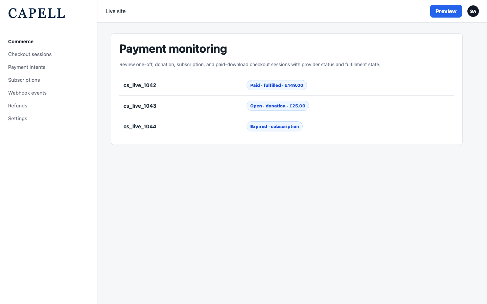
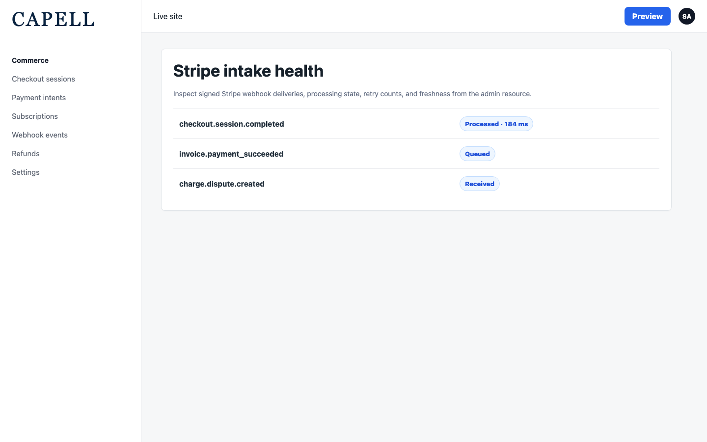
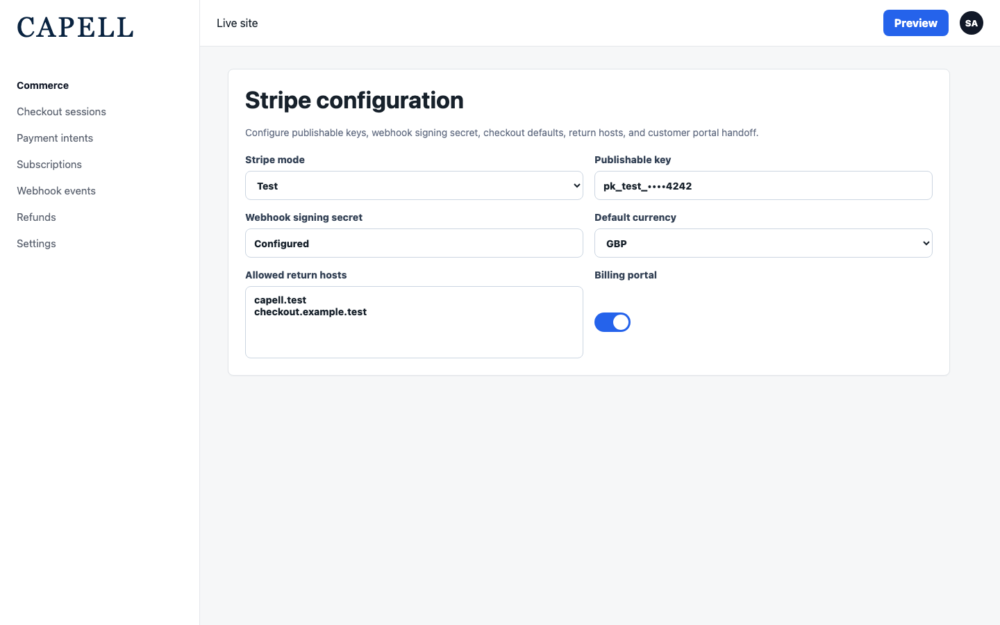
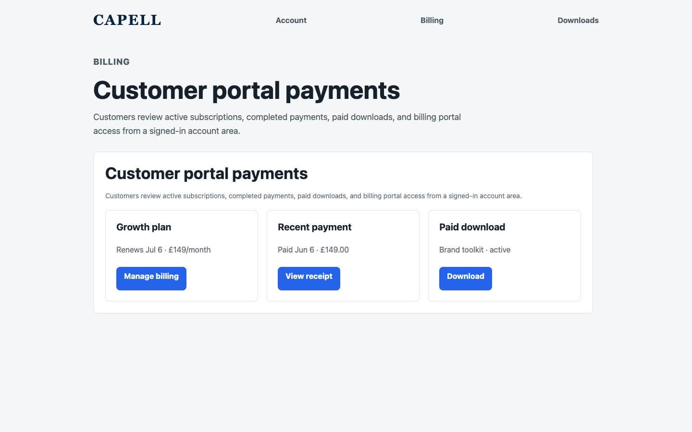
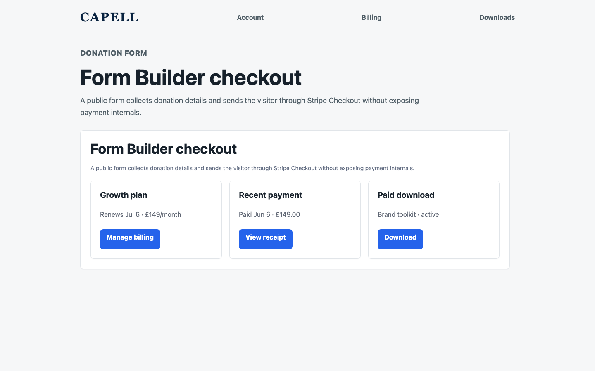

# Payments

<!-- prettier-ignore-start -->

## What This Plugin Adds

Payments is an **Available**, **Schema-owning** Capell package in the **Capell Commerce** product group. It ships as `capell-app/payments` and extends these surfaces: admin, frontend, console.

Payments gives Capell a first-party way to charge customers without depending on an external store. It ships native Stripe Checkout and PayPal Checkout for one-off purchases, donations, paid file downloads, and fulfillment-backed gated-access handoffs, plus Stripe subscriptions, billing portal sessions, and signed webhook intake. Every record is stored behind a provider-neutral model layer, so admins get read-only audit resources, customers get self-service billing, and Form Builder fields can collect payment inline. Designed for revenue-generating sites that want checkout, fulfilment, and reconciliation handled inside the CMS.

After install, admins get package-owned management surfaces and public users may see package-owned frontend output or routes.

Status details:

- Status: Available
- Tier: premium
- Bundle: commerce
- Composer package: `capell-app/payments`
- Namespace: `Capell\Payments`
- Theme key: not applicable

## Why It Matters

**For developers:** The package gives developers package-owned service providers, Actions, Data objects, models, Laravel routes, and Filament classes instead of pushing this behaviour into core or application code.

**For teams:** Take one-off payments, donations, paid downloads, and fulfillment-backed gated-access handoffs through Stripe or PayPal Checkout - with subscriptions and billing workflows on Stripe.

## Screens And Workflow

Screenshot contract: `screenshots.json`.

- Payments checkout sessions (admin, required).
- Payments webhook events (admin, required).
- Payments settings (admin, required).
- Payments customer portal billing (frontend, required).
- Payments Form Builder checkout (frontend, required).

## Screenshot Evidence

These captures are the package-owned visual contract for the admin pages, public pages, actions, workflows, and feature surfaces described above. Keep this section aligned with `docs/screenshots.json` whenever the package surface changes.

### Payments checkout sessions

- Surface: admin · Target: CheckoutSessionResource.
- Documents: An administrator monitors checkout session status, mode, amount, and fulfillment state.
- Capture notes: Capture the admin checkout sessions resource with paid, open, and expired statuses visible.

### Payments webhook events

- Surface: admin · Target: PaymentWebhookEventResource.
- Documents: An operator verifies Stripe webhook intake health and processing status.
- Capture notes: Capture webhook event processing state, freshness, and retry information.

### Payments settings

- Surface: admin · Target: PaymentsSettings.
- Documents: An administrator configures Stripe Checkout and webhook settings before launch.
- Capture notes: Capture Stripe mode, publishable key, webhook secret state, checkout defaults, and allowed return hosts.

### Payments customer portal billing

- Surface: frontend · Target: CustomerPortalBilling.
- Documents: A customer reviews billing, subscriptions, payments, and paid-download entitlements.
- Capture notes: Capture billing portal state with subscriptions, completed payments, and paid downloads visible.

### Payments Form Builder checkout

- Surface: frontend · Target: FormBuilderPaymentField.
- Documents: A visitor submits a Form Builder payment field and is sent to Stripe Checkout.
- Capture notes: Capture a public form with payment field state and Stripe Checkout handoff copy.

## Technical Shape

- Service providers: `Capell\Payments\Providers\PaymentsServiceProvider`, `Capell\Payments\Providers\AdminServiceProvider`.
- Config files: `packages/payments/config/capell-payments.php`.
- Migrations: `packages/payments/database/migrations/2026_05_31_000001_create_payment_customers_table.php`, `packages/payments/database/migrations/2026_05_31_000002_create_payment_checkout_sessions_table.php`, `packages/payments/database/migrations/2026_05_31_000003_create_payment_intents_table.php`, `packages/payments/database/migrations/2026_05_31_000004_create_payment_subscriptions_table.php`, `packages/payments/database/migrations/2026_05_31_000005_create_payment_webhook_events_table.php`, `packages/payments/database/migrations/2026_05_31_000006_create_payment_refunds_table.php`, `packages/payments/database/migrations/2026_05_31_000007_create_payment_disputes_table.php`, `packages/payments/database/migrations/2026_05_31_000009_create_payment_download_entitlements_table.php`.
- Settings migrations: `packages/payments/database/settings/2026_05_31_000008_create_payments_settings.php`.
- Settings classes: `PaymentsSettings`.
- Models: `CheckoutSession`, `PaymentCustomer`, `PaymentDispute`, `PaymentDownloadEntitlement`, `PaymentIntent`, `PaymentRefund`, `PaymentWebhookEvent`, `Subscription`.
- Filament classes: `CheckoutSessionResource`, `ListCheckoutSessions`, `ListPaymentCustomers`, `PaymentCustomerResource`, `ListPaymentDisputes`, `PaymentDisputeResource`, `ListPaymentIntents`, `PaymentIntentResource`, `ListPaymentRefunds`, `PaymentRefundResource`, `ListSubscriptions`, `SubscriptionResource`, `and 3 more`.
- Route files: `packages/payments/routes/web.php`.
- Policies: `AbstractPaymentsResourcePolicy`, `CheckoutSessionPolicy`, `PaymentCustomerPolicy`, `PaymentDisputePolicy`, `PaymentIntentPolicy`, `PaymentRefundPolicy`, `PaymentWebhookEventPolicy`, `SubscriptionPolicy`.
- Actions: `BuildPaymentsHealthReportAction`, `CreateBillingPortalSessionAction`, `CreateCheckoutSessionAction`, `CreateFormPaymentCheckoutSessionAction`, `CreateFormPaymentCheckoutUrlAction`, `CreatePaidDownloadUrlAction`, `DownloadPaidDownloadAction`, `FormatPaymentMoneyAction`, `FulfillCompletedCheckoutSessionAction`, `GeneratePaymentGatewayIdempotencyKeyAction`, `GrantPaidDownloadAccessAction`, `HandleStripeWebhookAction`, `and 17 more`.
- Data objects: `BillingPortalSessionData`, `CheckoutLineItemData`, `CheckoutSessionData`, `CreateBillingPortalSessionData`, `CreateCheckoutSessionData`, `FormPaymentCheckoutData`, `PaymentCustomerData`, `PaymentDisputeData`, `PaymentFulfillmentResultData`, `PaymentIntentData`, `PaymentRefundData`, `PaymentsHealthReportData`, `and 4 more`.
- Jobs: `ProcessStripeWebhookEventJob`.
- Command signatures: `capell:payments:webhooks:reconcile`, `capell:payments:webhooks:reprocess`.
- Console command classes: `ReconcilePaymentWebhooksCommand`, `ReprocessPaymentWebhookEventsCommand`.
- Manifest contributions: `admin-resource: Capell\Payments\Manifest\CheckoutSessionResourceContribution`, `admin-resource: Capell\Payments\Manifest\PaymentCustomerResourceContribution`, `admin-resource: Capell\Payments\Manifest\PaymentDisputeResourceContribution`, `admin-resource: Capell\Payments\Manifest\PaymentIntentResourceContribution`, `admin-resource: Capell\Payments\Manifest\PaymentRefundResourceContribution`, `admin-resource: Capell\Payments\Manifest\PaymentWebhookEventResourceContribution`, `admin-resource: Capell\Payments\Manifest\SubscriptionResourceContribution`, `console-command: Capell\Payments\Manifest\PaymentsConsoleCommandsContribution`, `health-check: Capell\Payments\Manifest\PaymentsHealthContribution`, `model: Capell\Payments\Manifest\PaymentsModelsContribution`, `route: Capell\Payments\Manifest\PaymentsFrontendRoutesContribution`, `setting: Capell\Payments\Manifest\PaymentsSettingsContribution`.
- Health checks: `Capell\Payments\Health\PaymentsHealthCheck`.
- Cache tags: `payments`.

## Data Model

- Required tables: `payment_customers`, `payment_checkout_sessions`, `payment_intents`, `payment_subscriptions`, `payment_webhook_events`, `payment_refunds`, `payment_disputes`, `payment_download_entitlements`.
- Protected tables: `payment_customers`, `payment_checkout_sessions`, `payment_intents`, `payment_subscriptions`, `payment_webhook_events`, `payment_refunds`, `payment_disputes`, `payment_download_entitlements`.
- Models: `CheckoutSession`, `PaymentCustomer`, `PaymentDispute`, `PaymentDownloadEntitlement`, `PaymentIntent`, `PaymentRefund`, `PaymentWebhookEvent`, `Subscription`.
- Migration files: `2026_05_31_000001_create_payment_customers_table.php`, `2026_05_31_000002_create_payment_checkout_sessions_table.php`, `2026_05_31_000003_create_payment_intents_table.php`, `2026_05_31_000004_create_payment_subscriptions_table.php`, `2026_05_31_000005_create_payment_webhook_events_table.php`, `2026_05_31_000006_create_payment_refunds_table.php`, `2026_05_31_000007_create_payment_disputes_table.php`, `2026_05_31_000009_create_payment_download_entitlements_table.php`.
- Migration impact: run host migrations through the package install flow before opening package surfaces.
- Deletion/retention behaviour: Docs gap unless the package has an explicit pruning command, retention setting, or tested cascade path.

## Install Impact

- Admin navigation: adds package-owned Filament classes when registered.
- Permissions: `View:PaymentCustomer`, `View:CheckoutSession`, `View:PaymentIntent`, `View:Subscription`, `View:PaymentWebhookEvent`, `View:PaymentRefund`, `View:PaymentDispute`.
- Public routes: route files exist and must be reviewed before public enablement.
- Database changes: package migrations are declared.
- Settings: `Capell\Payments\Settings\PaymentsSettings`.
- Queues or schedules: review package jobs or schedules before install.
- Cache tags: `payments`.
- Commands: `capell:payments:webhooks:reconcile`, `capell:payments:webhooks:reprocess`.

## Common Pitfalls

- Run migrations before opening package resources or public routes.
- Configure package settings before testing production-like workflows.
- Review route middleware, throttling, signed URLs, and public-output safety before exposing routes.
- Keep public Blade and cached HTML free of authoring markers, model IDs, permissions, signed editor URLs, and lazy database queries.
- Run package commands from the host app; in this repository use `vendor/bin/pest` for package tests.
- Keep `composer.json`, `composer.local.json`, `capell.json`, docs, screenshots, and tests aligned when the package surface changes.

## Troubleshooting

| Symptom | Likely cause | Check | Fix |
| --- | --- | --- | --- |
| Package surface is missing after install | Provider or manifest is not loaded | Confirm `capell.json`, package `composer.json`, and provider registration | Reinstall the package, refresh Composer autoload, and clear host caches |
| Admin screen or command fails on missing table | Package migrations have not run | Check the tables listed in `Data Model` | Run host migrations and rerun the focused package test |
| Route returns unexpected output | Route cache, middleware, or signed URL setup does not match the package route file | Check the route files listed in `Technical Shape` | Clear route cache and verify middleware before exposing public routes |
| Background work does not run | Queue worker or scheduled command is not active | Check package jobs, commands, and host scheduler configuration | Start the queue or scheduler, then run the focused command or package test |
| Public output leaks unexpected state | Render data, cache variation, or authoring boundary has regressed | Check public Blade, cache tags, and public-output safety tests | Move data loading out of Blade and rerun the package public-output tests |

## Quick Start

1. Install the package: `composer require capell-app/payments`.
2. Run the required setup: `php artisan migrate`.
3. Open the related Capell admin surface and verify Payments appears.

## Next Steps

- [Package docs index](README.md)
- [Screenshot contract](screenshots.json)
- [Marketplace assets](assets/marketplace/)
- [Capell content language plan](../../../docs/CONTENT_LANGUAGE_PLAN.md)
- [Capell documentation design system](../../../docs/DESIGN_SYSTEM.md)
- [Capell and package ERD notes](../../../docs/erd/capell-and-package-erds.md)
- Related packages: [Access Gate](../../access-gate/README.md), [Customer Portal](../../customer-portal/README.md), [Form Builder](../../form-builder/README.md).
- Focused tests: `vendor/bin/pest packages/payments/tests --configuration=phpunit.xml`.

<!-- prettier-ignore-end -->
