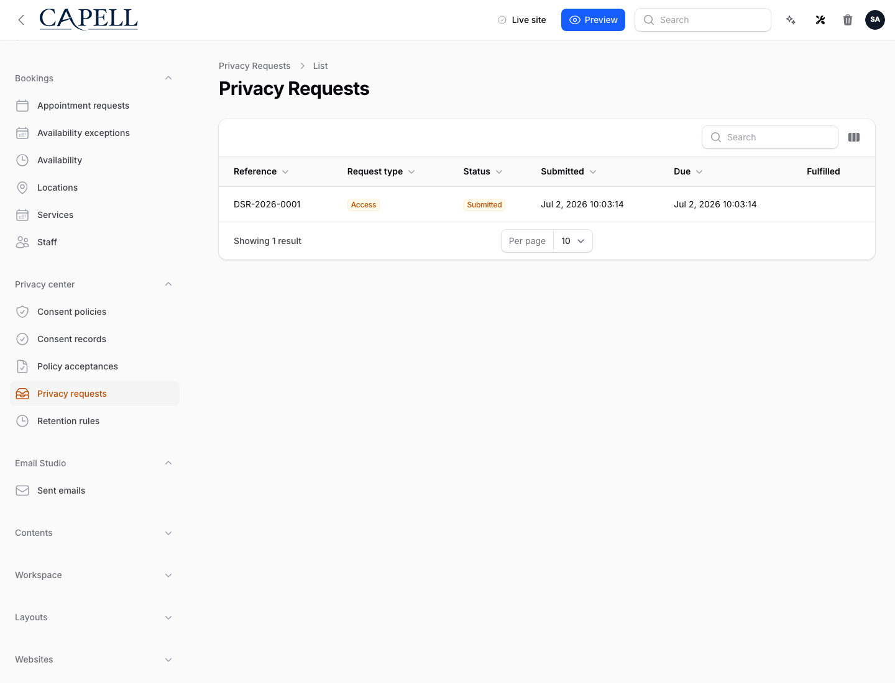
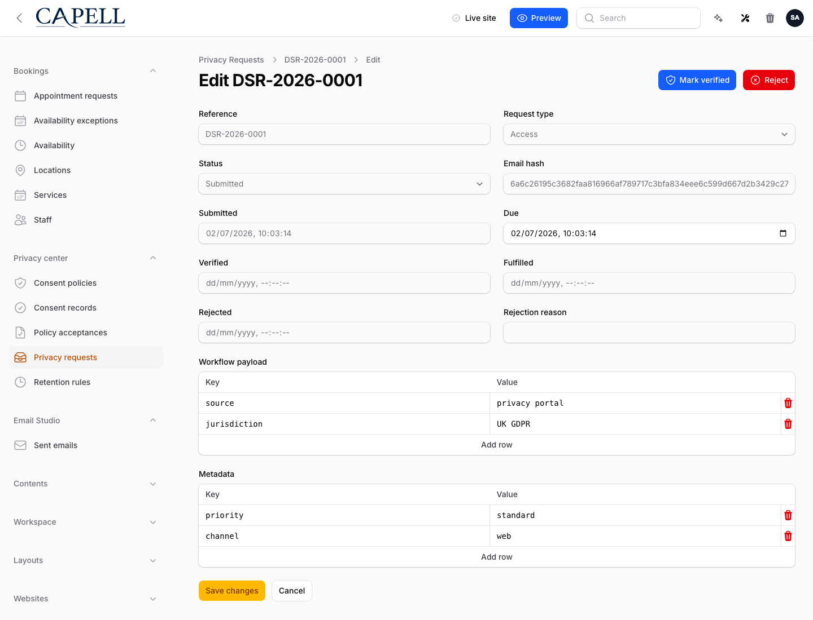
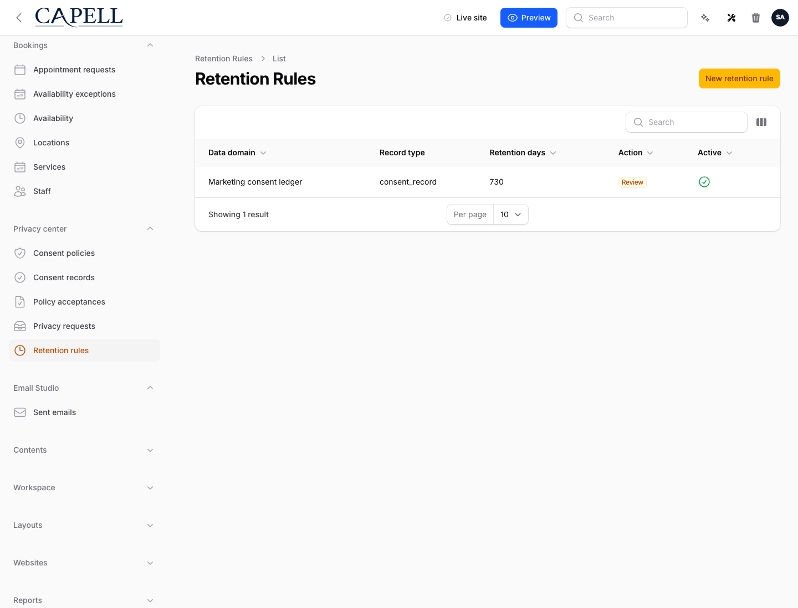

# Privacy Center

<!-- prettier-ignore-start -->

## What This Plugin Adds

Privacy Center is an **Available**, **Schema-owning** Capell package in the **Capell Operations** product group. It ships as `capell-app/privacy-center` and extends these surfaces: admin, console, frontend.

Privacy Center gives every Capell site a single, queryable system of record for privacy obligations: granular cookie-category consent, versioned policy acceptances, retention rules, and access/export/delete subject requests. Consent and subject data are recorded through stable Actions that other Capell packages can call. Hashed request evidence (IP, user-agent) and consent records give you defensible proof, while retention rules keep data minimised. Admin operators get resources and an at-a-glance compliance dashboard; nothing sensitive ever leaks to public output.

After install, admins get package-owned management surfaces and public users may see package-owned frontend output or routes.

Status details:

- Status: Available
- Tier: premium
- Bundle: operations
- Composer package: `capell-app/privacy-center`
- Namespace: `Capell\PrivacyCenter`
- Theme key: not applicable

## Why It Matters

**For developers:** The package gives developers package-owned service providers, Actions, Data objects, models, Laravel routes, Filament classes, and Blade views instead of pushing this behaviour into core or application code.

**For teams:** The compliance backbone for Capell - one auditable ledger for cookie consent, policy acceptances, retention rules, and GDPR/CCPA subject requests, with Actions your other packages plug straight into.

## Screens And Workflow

Screenshot contract: `screenshots.json`.

- Privacy requests admin queue (admin, required).
- Privacy request workflow actions (admin, required).
- Privacy retention rules admin list (admin, required).

## Screenshot Evidence

These captures are the package-owned visual contract for the admin pages, public pages, actions, workflows, and feature surfaces described above. Keep this section aligned with `docs/screenshots.json` whenever the package surface changes.

### Privacy requests admin queue

- Surface: admin · Target: PrivacyRequestResource.
- Documents: An operator triages access, export, and deletion requests from a single compliance queue.
- Capture notes: Captured from a seeded Capell admin runner app with capell-app/privacy-center installed.

### Privacy request workflow actions

- Surface: admin · Target: PrivacyRequestResource.edit.
- Documents: An operator verifies and completes a data-subject request through audited Capell Actions.
- Capture notes: Captured from a seeded Capell admin runner app with a stable data-subject request record.

### Privacy retention rules admin list

- Surface: admin · Target: RetentionRuleResource.
- Documents: An operator reviews automated data minimisation rules and their retention windows.
- Capture notes: Captured from a seeded Capell admin runner app with active retention rules.

## Technical Shape

- Service providers: `Capell\PrivacyCenter\Providers\PrivacyCenterServiceProvider`, `Capell\PrivacyCenter\Providers\AdminServiceProvider`.
- Config files: `packages/privacy-center/config/capell-privacy-center.php`.
- Migrations: `packages/privacy-center/database/migrations/2026_05_31_000001_create_privacy_consent_policies_table.php`, `packages/privacy-center/database/migrations/2026_05_31_000002_create_privacy_consent_records_table.php`, `packages/privacy-center/database/migrations/2026_05_31_000003_create_privacy_policy_acceptances_table.php`, `packages/privacy-center/database/migrations/2026_05_31_000004_create_privacy_retention_rules_table.php`, `packages/privacy-center/database/migrations/2026_05_31_000005_create_privacy_requests_table.php`.
- Models: `ConsentPolicy`, `ConsentRecord`, `PolicyAcceptance`, `PrivacyRequest`, `RetentionRule`.
- Filament classes: `ConsentPolicyResource`, `CreateConsentPolicy`, `EditConsentPolicy`, `ListConsentPolicies`, `ConsentRecordResource`, `ListConsentRecords`, `ListPolicyAcceptances`, `PolicyAcceptanceResource`, `EditPrivacyRequest`, `ListPrivacyRequests`, `PrivacyRequestResource`, `CreateRetentionRule`, `and 4 more`.
- Route files: `packages/privacy-center/routes/web.php`.
- Actions: `AnonymizePrivacySubjectAction`, `ApplyRetentionRuleAction`, `ApplyRetentionRulesAction`, `BuildPrivacyCenterOverviewStatsAction`, `BuildPrivacyExportAction`, `CreateRetentionRuleAction`, `MarkPrivacyRequestFulfilledAction`, `MarkPrivacyRequestVerifiedAction`, `OpenPrivacyRequestAction`, `RecordConsentAction`, `RecordPolicyAcceptanceAction`, `RegisterConsentPolicyAction`, `and 1 more`.
- Data objects: `ConsentPolicyData`, `ConsentRecordData`, `PolicyAcceptanceData`, `PrivacyExportData`, `PrivacyRequestData`, `RetentionExecutionResultData`, `RetentionRuleData`.
- Command signatures: `privacy:apply-retention`.
- Console command classes: `ApplyRetentionRulesCommand`.
- Manifest contributions: `admin-resource: Capell\PrivacyCenter\Manifest\ConsentPolicyResourceContribution`, `admin-resource: Capell\PrivacyCenter\Manifest\ConsentRecordResourceContribution`, `admin-resource: Capell\PrivacyCenter\Manifest\PolicyAcceptanceResourceContribution`, `admin-resource: Capell\PrivacyCenter\Manifest\PrivacyRequestResourceContribution`, `admin-resource: Capell\PrivacyCenter\Manifest\RetentionRuleResourceContribution`, `console-command: Capell\PrivacyCenter\Manifest\PrivacyCenterConsoleCommandsContribution`, `dashboard-widget: Capell\PrivacyCenter\Manifest\PrivacyCenterOverviewWidgetContribution`, `health-check: Capell\PrivacyCenter\Manifest\PrivacyCenterHealthContribution`, `model: Capell\PrivacyCenter\Manifest\PrivacyCenterModelsContribution`, `route: Capell\PrivacyCenter\Manifest\PrivacyCenterRoutesContribution`, `scheduled-job: Capell\PrivacyCenter\Manifest\PrivacyRetentionScheduleContribution`.
- Health checks: `Capell\PrivacyCenter\Health\PrivacyCenterHealthCheck`.
- Blade views: `packages/privacy-center/resources/views/consent/banner.blade.php`, `packages/privacy-center/resources/views/consent/preferences.blade.php`.
- Cache tags: `privacy-center`.

## Shipped And Deferred Privacy Surfaces

Privacy Center currently ships admin and console surfaces for consent policy records, privacy requests, retention rules, policy acceptances, retention execution, and audited DSAR handling. It also ships a cache-safe public preference center for cookie consent preferences, but it does not ship a public DSAR intake form.

Current boundaries:

- Public consent: use the public cookie consent preference center and `RecordConsentAction`; `RecordConsentAction` can infer a subject from a source model when another package mirrors consent.
- Subject data: the cross-package subject-data export/erasure registry is Action-backed through `BuildPrivacyExportAction` and `AnonymizePrivacySubjectAction`.
- Request intake: open requests through `OpenPrivacyRequestAction` or admin workflows until a public DSAR intake route is shipped.
- Evidence hashing: configure `CAPELL_PRIVACY_CENTER_HASH_SECRET` before relying on request or consent evidence hashes.
- Admin surface: The admin provider contributes these Filament surfaces: consent policies, consent records, policy acceptances, privacy requests, retention rules, and the overview widget.

## Data Model

- Required tables: `privacy_consent_policies`, `privacy_consent_records`, `privacy_policy_acceptances`, `privacy_retention_rules`, `privacy_requests`.
- Models: `ConsentPolicy`, `ConsentRecord`, `PolicyAcceptance`, `PrivacyRequest`, `RetentionRule`.
- Migration files: `2026_05_31_000001_create_privacy_consent_policies_table.php`, `2026_05_31_000002_create_privacy_consent_records_table.php`, `2026_05_31_000003_create_privacy_policy_acceptances_table.php`, `2026_05_31_000004_create_privacy_retention_rules_table.php`, `2026_05_31_000005_create_privacy_requests_table.php`.
- Migration impact: run host migrations through the package install flow before opening package surfaces.
- Deletion/retention behaviour: Docs gap unless the package has an explicit pruning command, retention setting, or tested cascade path.

## Install Impact

- Admin navigation: adds package-owned Filament classes when registered.
- Permissions: `ViewAny:ConsentPolicy`, `View:ConsentPolicy`, `Create:ConsentPolicy`, `Update:ConsentPolicy`, `Delete:ConsentPolicy`, `ViewAny:ConsentRecord`, `View:ConsentRecord`, `ViewAny:PolicyAcceptance`, `View:PolicyAcceptance`, `ViewAny:PrivacyRequest`, `View:PrivacyRequest`, `Update:PrivacyRequest`, `ViewAny:RetentionRule`, `View:RetentionRule`, `Create:RetentionRule`, `Update:RetentionRule`, `Delete:RetentionRule`.
- Public routes: route files exist and must be reviewed before public enablement.
- Database changes: package migrations are declared.
- Settings: no package settings declared.
- Queues or schedules: none detected in standard package paths.
- Cache tags: `privacy-center`.
- Commands: `privacy:apply-retention`.

## Common Pitfalls

- Run migrations before opening package resources or public routes.
- Review route middleware, throttling, signed URLs, and public-output safety before exposing routes.
- Keep public Blade and cached HTML free of authoring markers, model IDs, permissions, signed editor URLs, and lazy database queries.
- Run package commands from the host app; in this repository use `vendor/bin/pest` for package tests.
- Keep `composer.json`, `composer.local.json`, `capell.json`, docs, screenshots, and tests aligned when the package surface changes.

## Troubleshooting

| Symptom | Likely cause | Check | Fix |
| --- | --- | --- | --- |
| Package surface is missing after install | Provider or manifest is not loaded | Confirm `capell.json`, package `composer.json`, and provider registration | Reinstall the package, refresh Composer autoload, and clear host caches |
| Admin screen or command fails on missing table | Package migrations have not run | Check the tables listed in `Data Model` | Run host migrations and rerun the focused package test |
| Route returns unexpected output | Route cache, middleware, or signed URL setup does not match the package route file | Check the route files listed in `Technical Shape` | Clear route cache and verify middleware before exposing public routes |
| Background work does not run | Queue worker or scheduled command is not active | Check package jobs, commands, and host scheduler configuration | Start the queue or scheduler, then run the focused command or package test |
| Public output leaks unexpected state | Render data, cache variation, or authoring boundary has regressed | Check public Blade, cache tags, and public-output safety tests | Move data loading out of Blade and rerun the package public-output tests |

## Quick Start

1. Install the package: `composer require capell-app/privacy-center`.
2. Run the required setup: `php artisan migrate`.
3. Open the related Capell admin surface and verify Privacy Center appears.

## Next Steps

- [Package docs index](README.md)
- [Screenshot contract](screenshots.json)
- [Marketplace assets](assets/marketplace/)
- [Capell content language plan](../../../docs/CONTENT_LANGUAGE_PLAN.md)
- [Capell documentation design system](../../../docs/DESIGN_SYSTEM.md)
- [Capell and package ERD notes](../../../docs/erd/capell-and-package-erds.md)
- Related packages: [Access Gate](../../access-gate/README.md), [Contacts](../../contacts/README.md), [Insights](../../insights/README.md), [Newsletter](../../newsletter/README.md).
- Focused tests: `vendor/bin/pest packages/privacy-center/tests --configuration=phpunit.xml`.

<!-- prettier-ignore-end -->
