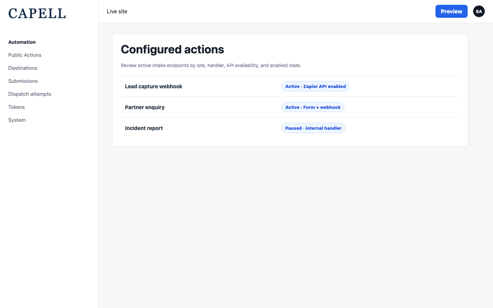
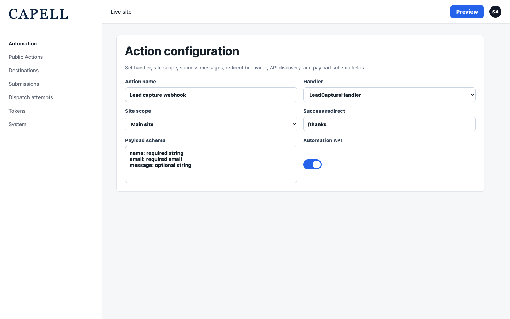
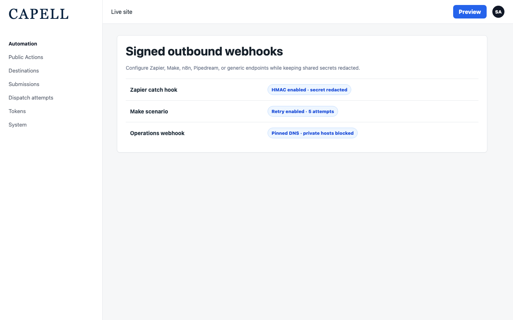
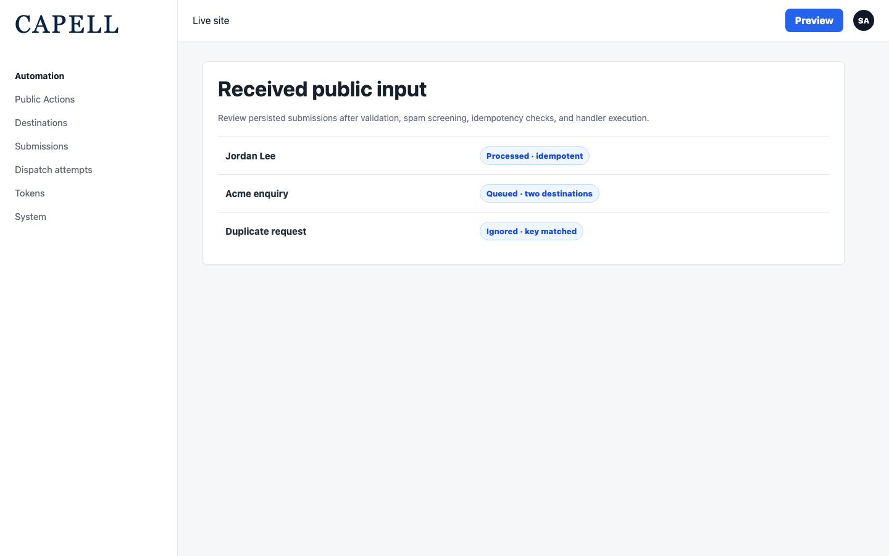
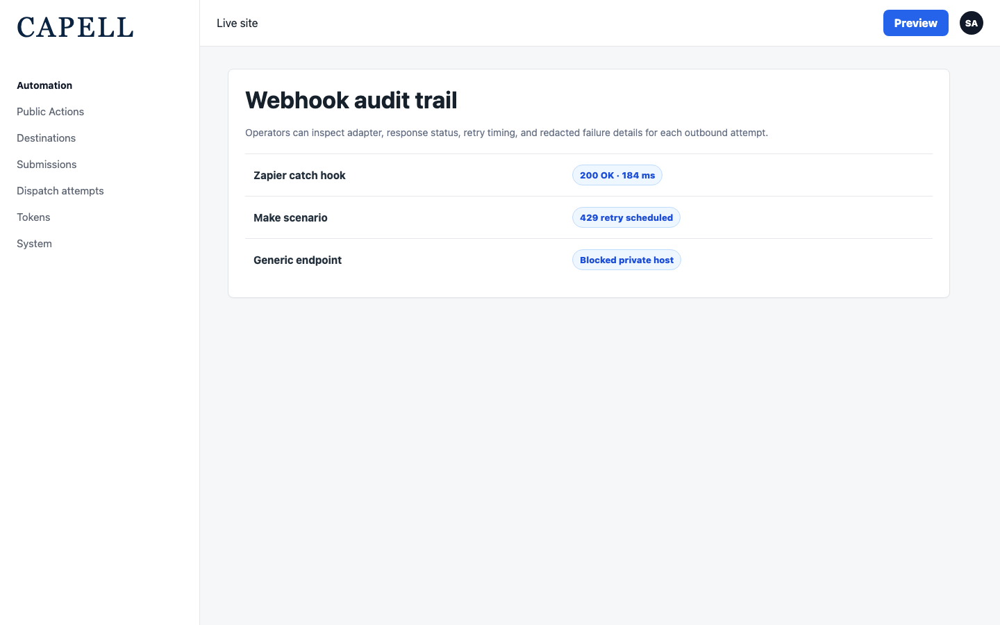
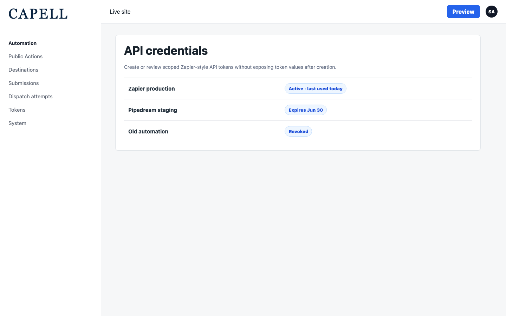
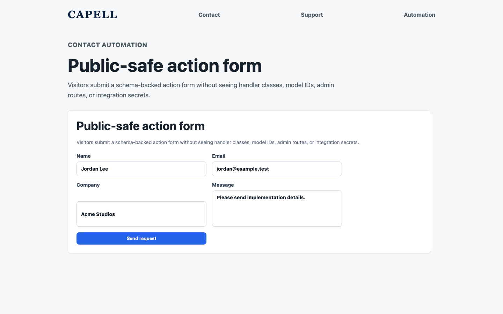
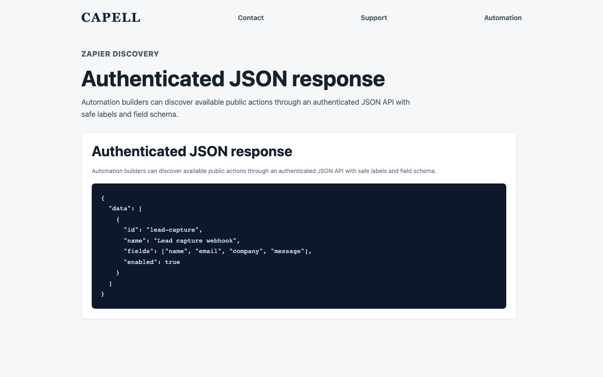

# Public Actions

<!-- prettier-ignore-start -->

## What This Plugin Adds

Public Actions is an **Available**, **Schema-owning** Capell package in the **Capell Automation** product group. It ships as `capell-app/public-actions` and extends these surfaces: admin, frontend, console.

Public Actions gives Capell a safe boundary for public and trusted server-to-server input: submissions are validated against a per-action schema, screened for spam through honeypot, Turnstile, hCaptcha, or reCAPTCHA checks where appropriate, de-duplicated by idempotency key, and persisted before anything fires. Successful submissions fan out to configured destinations over signed HTTP webhooks (HMAC-SHA256) with SSRF protection, encrypted secrets, durable retry, and a complete per-attempt dispatch audit. Native presets cover Zapier, Make, n8n, Pipedream, and generic endpoints, while trusted inbound API submissions can be verified by HMAC or Bearer secret before entering the same audit pipeline. A registry lets other packages plug in their own handlers, destination adapters, and spam guards, and an authenticated Zapier-style JSON API exposes discoverable actions and submissions for no-code automation builders.

After install, admins get package-owned management surfaces and public users may see package-owned frontend output or routes.

Status details:

- Status: Available
- Tier: premium
- Bundle: automation
- Composer package: `capell-app/public-actions`
- Namespace: `Capell\PublicActions`
- Theme key: not applicable

## Why It Matters

**For developers:** The package gives developers package-owned service providers, Actions, Data objects, models, Laravel routes, Filament classes, and Blade views instead of pushing this behaviour into core or application code.

**For teams:** Turn any public form or API request into a signed, retried, fully-audited webhook to Zapier, Make, n8n, Pipedream, or your own endpoint - without exposing a single admin route.

## Screens And Workflow

Screenshot contract: `screenshots.json`.

- Public Actions admin index (admin, required).
- Public Action create/edit form (admin, required).
- Public Action destinations (admin, required).
- Public Action submissions (admin, required).
- Public Action dispatch attempts (admin, required).
- Public Action integration tokens (admin, required).
- Public Action frontend form (frontend, required).
- Zapier action discovery API (frontend, required).

## Screenshot Evidence

These captures are the package-owned visual contract for the admin pages, public pages, actions, workflows, and feature surfaces described above. Keep this section aligned with `docs/screenshots.json` whenever the package surface changes.

### Public Actions admin index

- Surface: admin · Target: PublicActionResource.
- Documents: An administrator reviews configured public actions and their enabled/site state.
- Capture notes: Capture the configured actions list with at least one active action.

### Public Action create/edit form

- Surface: admin · Target: PublicActionResource.
- Documents: An administrator configures handler, site scope, redirect/messages, API/Zapier toggles, and payload schema fields.
- Capture notes: Show handler, site scope, redirect/messages, API/Zapier toggles, and payload schema fields.

### Public Action destinations

- Surface: admin · Target: PublicActionDestinationResource.
- Documents: An administrator configures outbound destinations while secrets stay redacted.
- Capture notes: Capture the destination list or form with secrets redacted.

### Public Action submissions

- Surface: admin · Target: PublicActionSubmissionResource.
- Documents: An administrator reviews received submissions and processing status.
- Capture notes: Capture received submissions and status after demo data is prepared.

### Public Action dispatch attempts

- Surface: admin · Target: PublicActionDispatchAttemptResource.
- Documents: An operator reviews outbound dispatch status, adapter, response status, and dispatch timing.
- Capture notes: Capture outbound dispatch status, adapter, response status, and dispatch time.

### Public Action integration tokens

- Surface: admin · Target: PublicActionIntegrationTokenResource.
- Documents: An administrator creates or reviews integration tokens without exposing token values.
- Capture notes: Capture the token list and create-token modal without exposing token values.

### Public Action frontend form

- Surface: frontend · Target: /actions/{action}.
- Documents: A visitor submits an active public action form with no admin-only metadata visible.
- Capture notes: Capture the public form for an active action with no admin-only metadata visible.

### Zapier action discovery API

- Surface: frontend · Target: /api/public-actions/zapier/actions.
- Documents: An integration client verifies the authenticated Zapier action discovery response shape with a demo token.
- Capture notes: Capture or assert the authenticated API response shape using a demo token.

## Technical Shape

- Service providers: `Capell\PublicActions\Providers\PublicActionsServiceProvider`.
- Config files: `packages/public-actions/config/capell-public-actions.php`.
- Migrations: `packages/public-actions/database/migrations/2026_05_10_190865_01_create_public_actions_table.php`, `packages/public-actions/database/migrations/2026_05_10_190865_02_create_public_action_destinations_table.php`, `packages/public-actions/database/migrations/2026_05_10_190865_03_create_public_action_submissions_table.php`, `packages/public-actions/database/migrations/2026_05_10_190865_04_create_public_action_dispatch_attempts_table.php`, `packages/public-actions/database/migrations/2026_05_10_190865_05_create_public_action_integration_tokens_table.php`, `packages/public-actions/database/migrations/2026_05_28_000002_add_idempotency_keys_to_public_action_submissions_table.php`.
- Models: `PublicAction`, `PublicActionDestination`, `PublicActionDispatchAttempt`, `PublicActionIntegrationToken`, `PublicActionSubmission`.
- Filament classes: `PublicActionFilamentOptions`, `CreatePublicActionDestination`, `EditPublicActionDestination`, `ListPublicActionDestinations`, `PublicActionDestinationResource`, `ListPublicActionDispatchAttempts`, `PublicActionDispatchAttemptResource`, `ListPublicActionIntegrationTokens`, `PublicActionIntegrationTokenResource`, `CreatePublicAction`, `EditPublicAction`, `ListPublicActions`, `and 3 more`.
- Route files: `packages/public-actions/routes/web.php`.
- Policies: `AbstractPublicActionResourcePolicy`, `PublicActionDestinationPolicy`, `PublicActionDispatchAttemptPolicy`, `PublicActionIntegrationTokenPolicy`, `PublicActionPolicy`, `PublicActionSubmissionPolicy`.
- Listeners: `SubmitPublicActionFromFormSubmission`.
- Actions: `BuildPublicActionIntegrationQueryAction`, `BuildZapierSubmissionPayloadAction`, `CreatePublicActionIntegrationTokenAction`, `DispatchPublicActionDestinationAction`, `ListPublicActionOptionsAction`, `PrunePublicActionSubmissionsAction`, `ReplayPublicActionDispatchAttemptAction`, `ResolvePublicActionForIntegrationTokenAction`, `ResolvePublicActionIntegrationTokenAction`, `RevokePublicActionIntegrationTokenAction`, `SubmitPublicActionAction`, `VerifyTrustedPublicActionSubmissionRequestAction`.
- Data objects: `PublicActionDispatchResultData`, `PublicActionIntegrationTokenData`, `PublicActionMetadataData`, `PublicActionPayloadData`, `PublicActionProviderPresetData`, `PublicActionResultData`, `PublicActionRetentionPruneResultData`, `PublicActionSpamProtectionResultData`, `PublicActionSubmissionData`, `PublicActionZapierSubmissionData`, `ResolvedWebhookEndpointData`.
- Jobs: `DispatchPublicActionDestinationJob`.
- Command signatures: `capell:public-actions:prune-submissions`.
- Console command classes: `PrunePublicActionSubmissionsCommand`.
- Manifest contributions: `admin-resource: Capell\PublicActions\Manifest\PublicActionsAdminResourcesContribution`, `console-command: Capell\PublicActions\Manifest\PublicActionsConsoleCommandsContribution`, `health-check: Capell\PublicActions\Manifest\PublicActionsHealthContribution`, `model: Capell\PublicActions\Manifest\PublicActionsModelsContribution`, `route: Capell\PublicActions\Manifest\PublicActionsRoutesContribution`.
- Health checks: `Capell\PublicActions\Health\PublicActionsHealthCheck`.
- Blade views: `packages/public-actions/resources/views/action.blade.php`, `packages/public-actions/resources/views/components/action-button.blade.php`.
- Cache tags: `public-actions`.

## Data Model

- Required tables: `public_actions`, `public_action_destinations`, `public_action_submissions`, `public_action_dispatch_attempts`, `public_action_integration_tokens`.
- Protected tables: `public_actions`, `public_action_destinations`, `public_action_submissions`, `public_action_dispatch_attempts`, `public_action_integration_tokens`.
- Models: `PublicAction`, `PublicActionDestination`, `PublicActionDispatchAttempt`, `PublicActionIntegrationToken`, `PublicActionSubmission`.
- Migration files: `2026_05_10_190865_01_create_public_actions_table.php`, `2026_05_10_190865_02_create_public_action_destinations_table.php`, `2026_05_10_190865_03_create_public_action_submissions_table.php`, `2026_05_10_190865_04_create_public_action_dispatch_attempts_table.php`, `2026_05_10_190865_05_create_public_action_integration_tokens_table.php`, `2026_05_28_000002_add_idempotency_keys_to_public_action_submissions_table.php`.
- Migration impact: run host migrations through the package install flow before opening package surfaces.
- Deletion/retention behaviour: Docs gap unless the package has an explicit pruning command, retention setting, or tested cascade path.

## Install Impact

- Admin navigation: adds package-owned Filament classes when registered.
- Permissions: none declared in `capell.json`.
- Public routes: route files exist and must be reviewed before public enablement.
- Database changes: package migrations are declared.
- Settings: no package settings declared.
- Queues or schedules: review package jobs or schedules before install.
- Cache tags: `public-actions`.
- Commands: `capell:public-actions:prune-submissions`.

## Common Pitfalls

- Run migrations before opening package resources or public routes.
- Review route middleware, throttling, signed URLs, and public-output safety before exposing routes.
- Keep public Blade and cached HTML free of authoring markers, model IDs, permissions, signed editor URLs, and lazy database queries.
- Run package commands from the host app; in this repository use `vendor/bin/pest` for package tests.
- Keep `composer.json`, `composer.local.json`, `capell.json`, docs, screenshots, and tests aligned when the package surface changes.

## Troubleshooting

| Symptom | Likely cause | Check | Fix |
| --- | --- | --- | --- |
| Package surface is missing after install | Provider or manifest is not loaded | Confirm `capell.json`, package `composer.json`, and provider registration | Reinstall the package, refresh Composer autoload, and clear host caches |
| Admin screen or command fails on missing table | Package migrations have not run | Check the tables listed in `Data Model` | Run host migrations and rerun the focused package test |
| Route returns unexpected output | Route cache, middleware, or signed URL setup does not match the package route file | Check the route files listed in `Technical Shape` | Clear route cache and verify middleware before exposing public routes |
| Background work does not run | Queue worker or scheduled command is not active | Check package jobs, commands, and host scheduler configuration | Start the queue or scheduler, then run the focused command or package test |
| Public output leaks unexpected state | Render data, cache variation, or authoring boundary has regressed | Check public Blade, cache tags, and public-output safety tests | Move data loading out of Blade and rerun the package public-output tests |

## Quick Start

1. Install the package: `composer require capell-app/public-actions`.
2. Run the required setup: `php artisan migrate`.
3. Open the related Capell admin surface and verify Public Actions appears.

## Next Steps

- [Package docs index](README.md)
- [Screenshot contract](screenshots.json)
- [Marketplace assets](assets/marketplace/)
- [Capell content language plan](../../../docs/CONTENT_LANGUAGE_PLAN.md)
- [Capell documentation design system](../../../docs/DESIGN_SYSTEM.md)
- [Capell and package ERD notes](../../../docs/erd/capell-and-package-erds.md)
- Related packages: [Access Gate](../../access-gate/README.md), [Form Builder](../../form-builder/README.md).
- Focused tests: `vendor/bin/pest packages/public-actions/tests --configuration=phpunit.xml`.

<!-- prettier-ignore-end -->
