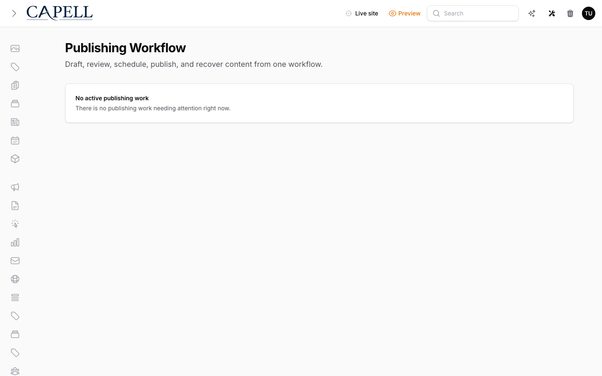
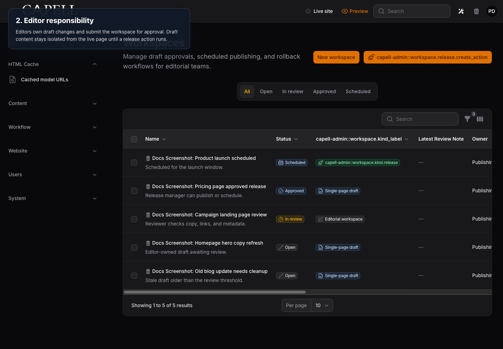
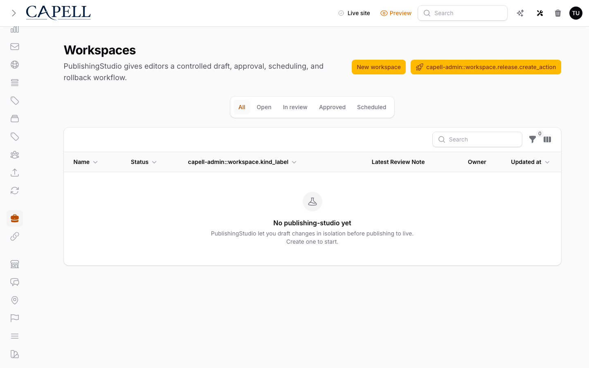
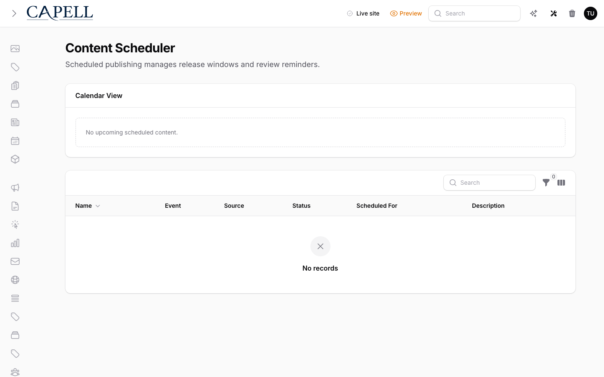
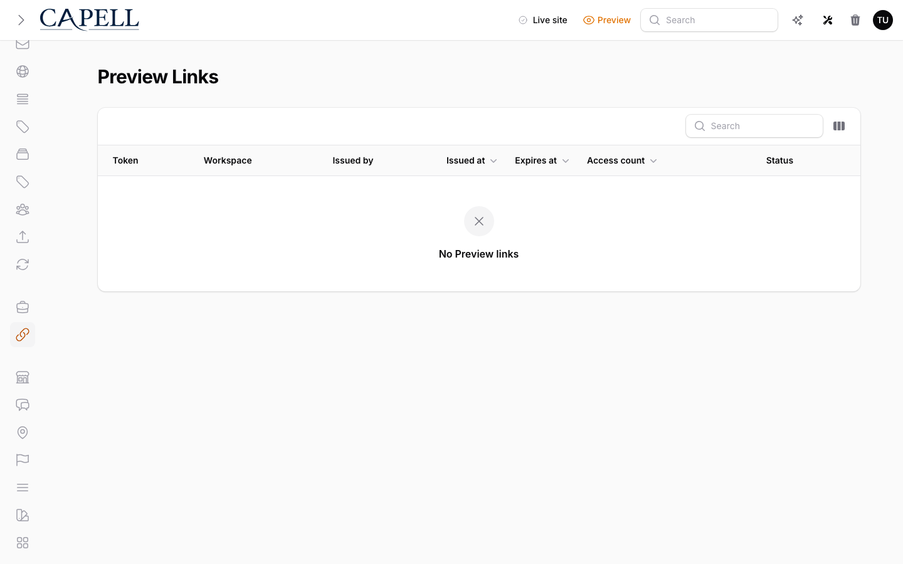
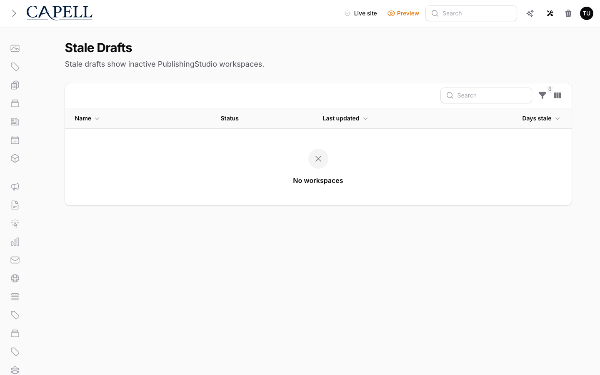
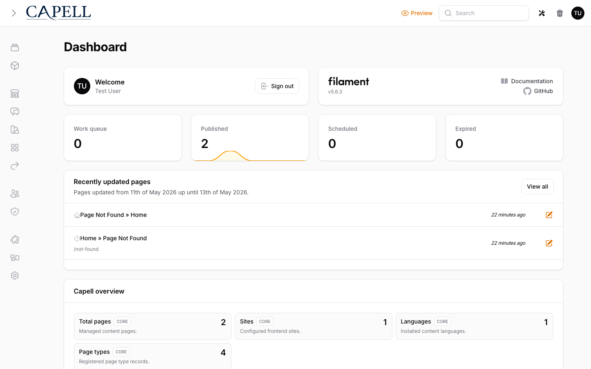
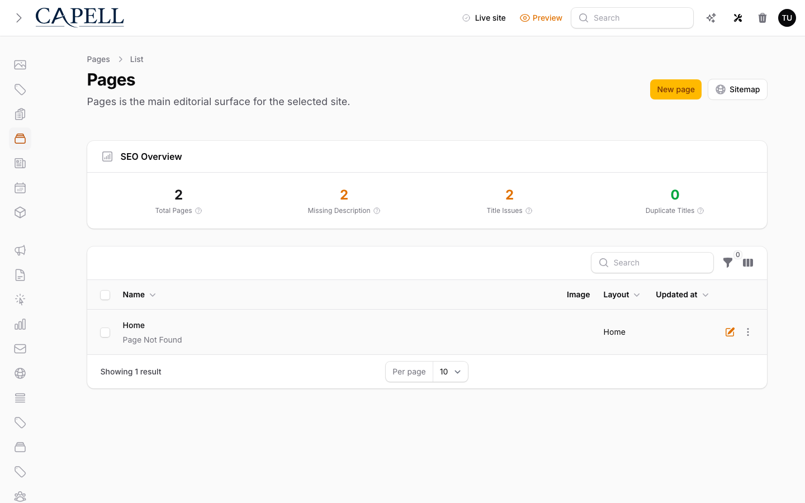

# Using Publishing Studio

This guide is for editors who change content under review, reviewers who approve it, and owners deciding how much of the review-and-release process to switch on. Every step uses the labels you see on screen.

## Using Publishing Studio (editor how-to)

### How to find your way around the editorial timeline

1. Open **Publishing Studio**.
2. The timeline dashboard shows your active drafts, their review status, publish readiness, and recent workflow activity.
3. Use it as your starting point to pick up work or check where a release has got to.

### How to start a release workspace and make edits

1. Open **Publishing Studio**.
2. Click **Create release workspace**.
3. Make your content edits inside the workspace. They stay private here.
4. Your changes are staged in the workspace until the release is approved and published. The live page is not affected until then.

### How to submit your work for review

1. In your workspace, send it for review. Its status changes to **Submitted**.
2. A reviewer sees it under **Approvals & change requests**.
3. If they ask for changes, the status shows **Changes requested**. Make the edits and submit again.

### How to approve a release (for reviewers)

1. Go to **Approvals & change requests**.
2. Open the submitted workspace and review the staged changes.
3. Mark it **Approved**, or request changes with a note. Publish controls only become available after approval.

### How to compare changes before approving

1. From a submitted workspace, open the compare view.
2. Review the field-level changes side by side, along with any comments and the publish checks.
3. Use this to decide whether to approve or request changes before the release goes out.

### How to review approval history

1. Open the **Approval history** for a workspace.
2. See reviewer assignments and each approve, reject, or request-changes decision in timeline order.
3. Use this to confirm who signed off and when.

### How to schedule a release

1. Once a workspace is **Approved**, open the **Content Scheduler**.
2. Set the date and time you want it to go live.
3. The release publishes itself at that moment. A workspace must be approved before it can be scheduled.
4. Check the queue to see what is lined up for future publication.

### How to set unpublish dates and embargo windows

1. Open the scheduling details for the workspace.
2. Set an unpublish date if the content should come down on its own, an embargo window if it must not appear before a set time, and any review reminders.
3. Save. These dates travel with the workspace.

### How to share a preview link

1. In the workspace, create a **Preview link**.
2. Share the link with anyone who needs to see the work before it is live.
3. The link list shows expiry, last access, and how many times each link has been opened.
4. Revoke the link when you no longer need it.

### How to clean up stale drafts

1. Open the **Stale drafts** view.
2. It flags workspaces that have sat unfinished, with review nudges and cleanup actions.
3. Nudge the owner to finish a draft, or clear it out if it is no longer needed.

### How to review the activity history

1. Open the **Activity history**.
2. It records content history across previews, comments, approvals, publishing, and rollback events.
3. Use it to see exactly what happened to a piece of content and when, for audit purposes.

### How to roll back a release

1. Open **Rollback-ready versions**.
2. Review the version history, the rollback lineage, and which version is currently live.
3. Pick the earlier version you want to restore.
4. Roll back. The live site returns to that version in seconds.

## Rolling out Publishing Studio (for owners)

### Turn on first

- **Review-first publishing.** Begin with workspaces and approvals so no change reaches the live site without a second pair of eyes.

### Add when needed

| Need                              | Enable                      |
| --------------------------------- | --------------------------- |
| Plan releases ahead of time       | The **Content Scheduler**   |
| Recover quickly from a bad change | **Rollback-ready versions** |
| Show work to stakeholders early   | **Preview links**           |

### Don't enable yet

- Hold off on scheduling and rollback until your team is comfortable with the basic review flow. Add them as the team grows.

### Who does what

| Role       | First useful screen                                                                    |
| ---------- | -------------------------------------------------------------------------------------- |
| Editor     | A **release workspace**: make and submit changes                                       |
| Reviewer   | **Approvals & change requests**: approve or request changes                            |
| Site owner | The **Content Scheduler** and **Rollback-ready versions**: oversee timing and recovery |

## Troubleshooting for editors

| What you see                                    | What it means                                            | What to do                                                                             |
| ----------------------------------------------- | -------------------------------------------------------- | -------------------------------------------------------------------------------------- |
| I can't schedule my release                     | The workspace isn't approved yet                         | Submit it for review and wait for a reviewer to mark it **Approved**                   |
| My edits aren't on the live site                | They are still staged in a workspace                     | Submit, get approval, then publish or schedule the release                             |
| A preview link stopped working                  | The link was revoked or expired                          | Create a new **Preview link** and share that                                           |
| I published the wrong thing                     | The previous version is still recoverable                | Open **Rollback-ready versions** and roll back                                         |
| The release won't publish at its scheduled time | The release window is closed or the workspace is blocked | Check the scheduler message and the readiness notes, then re-check approval and timing |
