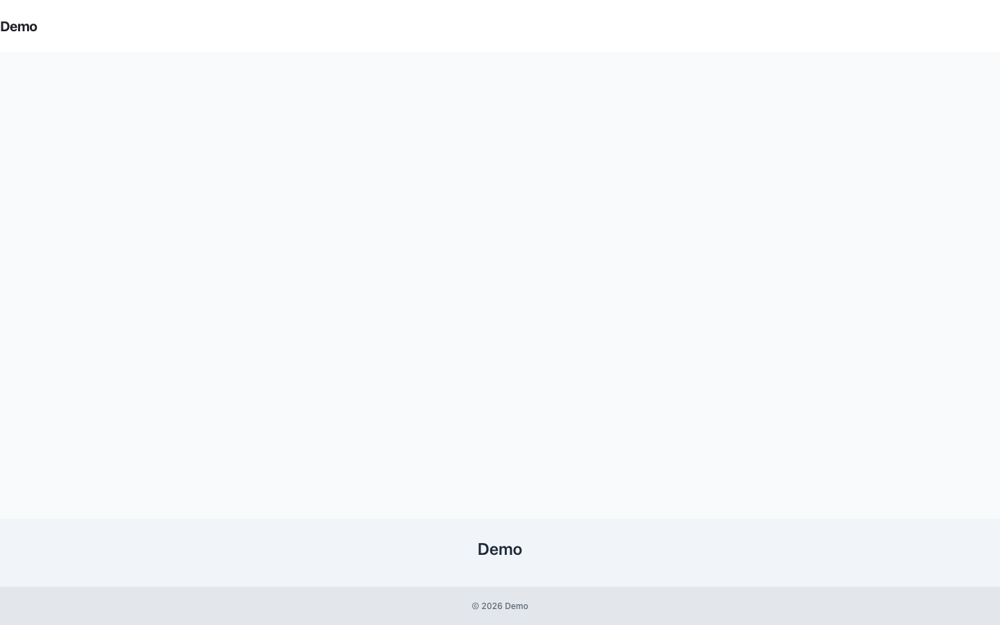

# Publishing Studio

<!-- prettier-ignore-start -->

## What This Plugin Adds

Publishing Studio is an **Available**, **Schema-owning** Capell package in the **Capell Publishing Pro** product group. It ships as `capell-app/publishing-studio` and extends these surfaces: admin, console.

Publishing Studio is Capell's premium editorial workflow. Every change happens in a copy-on-write workspace that stays invisible to visitors until it's approved and published as a single atomic, versioned release - so the live site is never half-edited. Built-in publish-readiness checks (accessibility, SEO meta, alt text, internal links, URL collisions, stale-draft and release-window guards) stop risky publishes before they ship, while signed, revocable preview links let stakeholders review the exact pending state. When a publish goes wrong, roll back to any prior version or restore individual entities in seconds.

After install, admins get package-owned management or reporting surfaces inside Capell.

Status details:

- Status: Available
- Tier: premium
- Bundle: publishing-pro
- Composer package: `capell-app/publishing-studio`
- Namespace: `Capell\PublishingStudio`
- Theme key: not applicable

## Why It Matters

**For developers:** The package gives developers package-owned service providers, Actions, Data objects, models, Laravel routes, Filament classes, and Blade views instead of pushing this behaviour into core or application code.

**For teams:** Publishing Studio turns Capell into a review-first CMS: edit any content in an isolated draft workspace, get sign-off, schedule it, and publish atomically - with one-click rollback when something breaks.

## Screens And Workflow

Screenshot contract: `screenshots.json`.

- Editorial timeline dashboard (admin, required).
- Editor responsibility (admin, required).
- Reviewer responsibility (admin, required).
- Live preview (frontend, required).
- Preview link management (admin, required).
- Compare and publish readiness (admin, required).
- Approval history (admin, required).
- Scheduled publishing (admin, required).
- Scheduler metadata (admin, required).
- Stale drafts (admin, required).
- Activity history (admin, required).
- Rollback and restore (admin, required).
- Preview banner (frontend, required).

## Screenshot Evidence

These captures are the package-owned visual contract for the admin pages, public pages, actions, workflows, and feature surfaces described above. Keep this section aligned with `docs/screenshots.json` whenever the package surface changes.

### Editorial timeline dashboard

- Surface: admin · Target: WorkspaceResource.
- Documents: An editor reviews active drafts, review status, publish readiness, and recent workflow activity.
- Capture notes: Show the flagship timeline entry point with active drafts, review status, publish readiness, and recent workflow activity.

### Editor responsibility

- Surface: admin · Target: WorkspaceResource.
- Documents: An editor manages draft changes while live content remains isolated until release.
- Capture notes: Show editors managing draft changes while content remains isolated from the live page until a release action runs.

### Reviewer responsibility

- Surface: admin · Target: WorkspaceResource.
- Documents: A reviewer approves, rejects, or requests changes before publish controls become available.
- Capture notes: Show reviewers approving, rejecting, or requesting changes before publish controls become available.

### Live preview

- Surface: frontend · Target: frontend-url.
- Documents: An editor opens a signed preview URL that renders draft content before it reaches the live page.
- Capture notes: Show a signed preview URL rendering draft content before it reaches the live version.

### Preview link management

- Surface: admin · Target: PreviewLinkResource.
- Documents: An editor manages issued preview links, expiry, revocation, last access, and access count.
- Capture notes: Show issued preview links with expiry, revocation, last accessed time, and access count.

### Compare and publish readiness

- Surface: admin · Target: CompareVersionPage.
- Documents: A reviewer compares field-level changes and publish checks before approving or releasing content.
- Capture notes: Show side-by-side changes, field comments, and publish checks before approval or release.

### Approval history

- Surface: admin · Target: WorkspaceResource.
- Documents: An editor reviews reviewer assignments and approval decisions in timeline order.
- Capture notes: Show reviewer assignments and approve, reject, or request-changes decisions in timeline order.

### Scheduled publishing

- Surface: admin · Target: ScheduledPublishingPage.
- Documents: An editor schedules release timing and reviews queue state for future publication.
- Capture notes: Show release timing, scheduled publishing-studio, embargo-aware publishing windows, and queue state.

### Scheduler metadata

- Surface: admin · Target: WorkspaceResource.
- Documents: An editor reviews unpublish dates, embargo windows, and review reminders on a workspace.
- Capture notes: Show unpublish dates, embargo windows, and review reminders attached to a workspace.

### Stale drafts

- Surface: admin · Target: StaleDraftsPage.
- Documents: An editor identifies stale workspaces and uses review nudges or cleanup actions.
- Capture notes: Show stale workspace detection, review nudges, and cleanup actions for unfinished draft work.

### Activity history

- Surface: admin · Target: ActivityTrailPage.
- Documents: An auditor reviews content history across previews, comments, approvals, publishing, and rollback events.
- Capture notes: Show the audit-friendly content history across previews, comments, approvals, publishing, and rollback events.

### Rollback and restore

- Surface: admin · Target: PageVersionHistoryPage.
- Documents: An administrator reviews version history, rollback lineage, and the currently live version before restore.
- Capture notes: Show version history with restore context, rollback lineage, and the currently live version.

### Preview banner

- Surface: frontend · Target: frontend-url.
- Documents: An editor sees the frontend preview banner confirming draft preview mode and offering an exit path.
- Capture notes: Show the frontend workspace banner that confirms editors are viewing draft content and can exit preview mode.

## Technical Shape

- Service providers: `Capell\PublishingStudio\Providers\ConsoleServiceProvider`, `Capell\PublishingStudio\Providers\PublishingStudioServiceProvider`, `Capell\PublishingStudio\Providers\AdminServiceProvider`.
- Config files: `packages/publishing-studio/config/publishing-studio.php`.
- Migrations: `packages/publishing-studio/database/migrations/2026_05_10_190866_01_create_preview_links_table.php`, `packages/publishing-studio/database/migrations/2026_05_10_190866_02_create_publishing-studio_table.php`, `packages/publishing-studio/database/migrations/2026_05_10_190866_03_create_versions_table.php`, `packages/publishing-studio/database/migrations/2026_05_10_190866_04_create_workspace_approvals_table.php`, `packages/publishing-studio/database/migrations/2026_05_10_190866_05_create_workspace_field_comments_table.php`, `packages/publishing-studio/database/migrations/2026_05_10_190866_06_create_workspace_review_assignments_table.php`, `packages/publishing-studio/database/migrations/2026_05_10_190866_07_seed_bootstrap_workspace_version.php`, `packages/publishing-studio/database/migrations/2026_05_10_190866_08_z_add_workspace_columns_to_core_tables.php`, `packages/publishing-studio/database/migrations/2026_05_10_190866_09_z_add_workspace_id_to_external_tables.php`, `packages/publishing-studio/database/migrations/2026_05_10_190866_10_z_add_workspace_id_to_import_sessions_table.php`, `packages/publishing-studio/database/migrations/2026_05_10_190866_11_create_publishing_revisions_table.php`, `packages/publishing-studio/database/migrations/2026_05_10_190866_12_create_publishing_scheduler_tables.php`.
- Settings migrations: `packages/publishing-studio/database/settings/2026_05_10_190867_01_add_publishing_studio_settings.php`.
- Settings classes: `PublishingStudioSettings`.
- Models: `PreviewLink`, `PublishingRevision`, `SchedulerDelivery`, `SchedulerEvent`, `SchedulerIcalToken`, `Version`, `Workspace`, `WorkspaceApproval`, `WorkspaceFieldComment`, `WorkspaceReviewAssignment`.
- Filament classes: `PublishingRevisionsHeaderAction`, `ActivityTrailPage`, `PublishingWorkflowPage`, `ScheduledPublishingPage`, `StaleDraftsPage`, `ActivityTrailTable`, `ScheduledPublishingTable`, `StaleDraftsTable`, `DiscardDraftsBulkAction`, `PublishPageAction`, `RequestReviewBulkAction`, `ResubmitForReviewAction`, `and 39 more`.
- Livewire components: `DiffPanel`, `FieldCommentThread`, `PageApprovalStatus`, `PublishStatusPanel`, `ReleaseWorkspaceSummaryPanel`, `WorkspaceApprovalHistory`, `WorkspaceContextBanner`, `WorkspaceSwitcher`.
- Route files: `packages/publishing-studio/routes/web.php`.
- Policies: `WorkspacePolicy`.
- Events: `WorkspaceEventSubscriber`, `VersionRolledBack`, `WorkspaceEventDispatcher`, `WorkspaceStateChanged`.
- Listeners: `SendWorkspaceStateNotification`, `StampWorkspaceOnActivity`.
- Actions: `BuildEditorialCalendarEventsAction`, `BuildPublishReadinessAction`, `BuildReleaseWorkspaceReadinessAction`, `BuildReleaseWorkspaceSummaryAction`, `BuildSchedulerIcalFeedAction`, `CancelSchedulerEventAction`, `ComparePublishingRevisionAction`, `CopyOnWriteAction`, `CreatePageDraftWorkspaceAction`, `CreateRecordDraftWorkspaceAction`, `CreateSchedulerIcalTokenAction`, `BuildContentHealthAction`, `and 34 more`.
- Data objects: `MergeHistoryEntryData`, `WorkspaceActivityData`, `WorkspaceMergeData`, `WorkspaceMergeHistoryData`, `EditorialCalendarEventData`, `EditorialCalendarQueryData`, `PublishReadinessData`, `ReleaseWorkspaceItemData`, `ReleaseWorkspaceReadinessData`, `ReleaseWorkspaceSummaryData`, `SavedRecordDraftData`, `SchedulerEventData`, `and 4 more`.
- Command signatures: `capell:publishing-studio:load-test`, `capell:publishing-studio:prune`.
- Console command classes: `InstallCommand`, `LoadTestPublishingStudioCommand`, `PruneAbandonedPublishingStudioCommand`.
- Manifest contributions: `admin-page: Capell\PublishingStudio\Manifest\ActivityTrailPageContribution`, `admin-page: Capell\PublishingStudio\Manifest\PublishingWorkflowPageContribution`, `admin-page: Capell\PublishingStudio\Manifest\ScheduledPublishingPageContribution`, `admin-page: Capell\PublishingStudio\Manifest\StaleDraftsPageContribution`, `admin-resource: Capell\PublishingStudio\Manifest\PublishingStudioAdminResourcesContribution`, `console-command: Capell\PublishingStudio\Manifest\PublishingStudioConsoleCommandsContribution`, `dashboard-widget: Capell\PublishingStudio\Manifest\PublishingStudioDashboardWidgetsContribution`, `health-check: Capell\PublishingStudio\Manifest\PublishingStudioHealthContribution`, `model: Capell\PublishingStudio\Manifest\PublishingStudioModelsContribution`, `overview-stat: Capell\PublishingStudio\Manifest\ContentSchedulerOverviewStatsContribution`, `route: Capell\PublishingStudio\Manifest\PublishingStudioRoutesContribution`, `scheduled-job: Capell\PublishingStudio\Manifest\PublishingStudioPruneScheduleContribution`, `scheduled-job: Capell\PublishingStudio\Manifest\ScheduledPublishingJobContribution`, `setting: Capell\PublishingStudio\Manifest\PublishingStudioSettingsContribution`, `workflow-attention: Capell\PublishingStudio\Actions\Workflow\BuildPublishingWorkflowAttentionItemsAction`.
- Health checks: `Capell\PublishingStudio\Health\PublishingStudioHealthCheck`.
- Blade views: `packages/publishing-studio/resources/views/components/pages/publishing-studio/compare.blade.php`, `packages/publishing-studio/resources/views/components/publishing-studio/approval-history.blade.php`, `packages/publishing-studio/resources/views/components/publishing-studio/diff-panel.blade.php`, `packages/publishing-studio/resources/views/components/publishing-studio/field-comment-thread.blade.php`, `packages/publishing-studio/resources/views/components/workspace-preview-pill.blade.php`, `packages/publishing-studio/resources/views/filament/actions/publishing-revisions.blade.php`, `packages/publishing-studio/resources/views/filament/pages/publishing-workflow.blade.php`, `packages/publishing-studio/resources/views/filament/resources/pages/revisions-table.blade.php`, `packages/publishing-studio/resources/views/filament/resources/pages/version-history.blade.php`, `packages/publishing-studio/resources/views/livewire/header/workspace-context-banner.blade.php`, `packages/publishing-studio/resources/views/livewire/header/workspace-switcher.blade.php`, `packages/publishing-studio/resources/views/livewire/publish-status-panel.blade.php`, `and 4 more`.

## Data Model

- Required tables: `preview_links`, `workspaces`, `versions`, `workspace_approvals`, `workspace_field_comments`, `workspace_review_assignments`, `publishing_revisions`, `publishing_scheduler_events`, `publishing_scheduler_deliveries`, `publishing_scheduler_ical_tokens`.
- Models: `PreviewLink`, `PublishingRevision`, `SchedulerDelivery`, `SchedulerEvent`, `SchedulerIcalToken`, `Version`, `Workspace`, `WorkspaceApproval`, `WorkspaceFieldComment`, `WorkspaceReviewAssignment`.
- Migration files: `2026_05_10_190866_01_create_preview_links_table.php`, `2026_05_10_190866_02_create_publishing-studio_table.php`, `2026_05_10_190866_03_create_versions_table.php`, `2026_05_10_190866_04_create_workspace_approvals_table.php`, `2026_05_10_190866_05_create_workspace_field_comments_table.php`, `2026_05_10_190866_06_create_workspace_review_assignments_table.php`, `2026_05_10_190866_07_seed_bootstrap_workspace_version.php`, `2026_05_10_190866_08_z_add_workspace_columns_to_core_tables.php`, `2026_05_10_190866_09_z_add_workspace_id_to_external_tables.php`, `2026_05_10_190866_10_z_add_workspace_id_to_import_sessions_table.php`, `2026_05_10_190866_11_create_publishing_revisions_table.php`, `2026_05_10_190866_12_create_publishing_scheduler_tables.php`.
- Migration impact: run host migrations through the package install flow before opening package surfaces.
- Deletion/retention behaviour: Docs gap unless the package has an explicit pruning command, retention setting, or tested cascade path.

## Install Impact

- Admin navigation: adds package-owned Filament classes when registered.
- Permissions: `submit_workspace_for_approval`, `approve_workspace`, `publish_workspace`, `rollback_workspace`, `publish_outside_release_window`, `View:ActivityTrailPage`, `View:PublishingWorkflowPage`, `View:ScheduledPublishingPage`, `View:StaleDraftsPage`.
- Public routes: route files exist and must be reviewed before public enablement.
- Database changes: package migrations are declared.
- Settings: `Capell\PublishingStudio\Settings\PublishingStudioSettings`.
- Queues or schedules: none detected in standard package paths.
- Cache tags: none declared.
- Commands: `capell:publishing-studio:load-test`, `capell:publishing-studio:prune`.

## Common Pitfalls

- Run migrations before opening package resources or public routes.
- Configure package settings before testing production-like workflows.
- Review route middleware, throttling, signed URLs, and public-output safety before exposing routes.
- Run package commands from the host app; in this repository use `vendor/bin/pest` for package tests.
- Keep `composer.json`, `composer.local.json`, `capell.json`, docs, screenshots, and tests aligned when the package surface changes.

## Troubleshooting

| Symptom | Likely cause | Check | Fix |
| --- | --- | --- | --- |
| Package surface is missing after install | Provider or manifest is not loaded | Confirm `capell.json`, package `composer.json`, and provider registration | Reinstall the package, refresh Composer autoload, and clear host caches |
| Admin screen or command fails on missing table | Package migrations have not run | Check the tables listed in `Data Model` | Run host migrations and rerun the focused package test |
| Route returns unexpected output | Route cache, middleware, or signed URL setup does not match the package route file | Check the route files listed in `Technical Shape` | Clear route cache and verify middleware before exposing public routes |
| Background work does not run | Queue worker or scheduled command is not active | Check package jobs, commands, and host scheduler configuration | Start the queue or scheduler, then run the focused command or package test |

## Quick Start

1. Install the package: `composer require capell-app/publishing-studio`.
2. Run the required setup: `php artisan migrate`.
3. Open the related Capell admin surface and verify Publishing Studio appears.

## Next Steps

- [Package docs index](README.md)
- [Screenshot contract](screenshots.json)
- [Marketplace assets](assets/marketplace/)
- [Capell content language plan](../../../docs/CONTENT_LANGUAGE_PLAN.md)
- [Capell documentation design system](../../../docs/DESIGN_SYSTEM.md)
- [Capell and package ERD notes](../../../docs/erd/capell-and-package-erds.md)
- Related packages: [Html Cache](../../html-cache/README.md), [Migration Assistant](../../migration-assistant/README.md), [Navigation](../../navigation/README.md), [Blog](../../blog/README.md), [Campaign Studio](../../campaign-studio/README.md), [Events](../../events/README.md), [Newsletter](../../newsletter/README.md).
- Focused tests: `vendor/bin/pest packages/publishing-studio/tests --configuration=phpunit.xml`.

<!-- prettier-ignore-end -->
