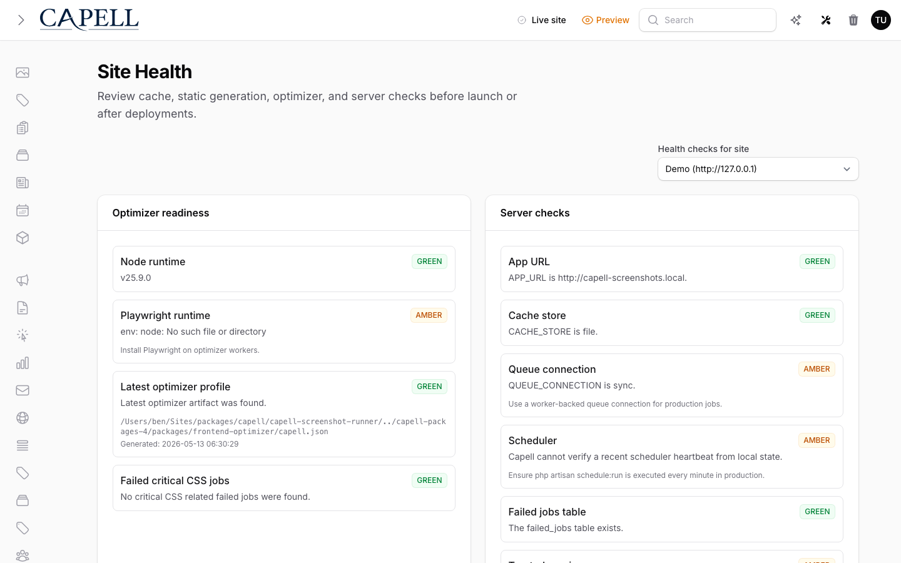

# Using SEO Suite

This guide is for editors who want their pages found in search and owners deciding what to fix first. Every step uses the labels you see on screen.

## Using SEO Suite (editor how-to)

### How to edit a page's SEO details

1. Open the page in the admin and find its SEO panel.
2. Set the page **title** and **meta description**, the canonical setting, and the social sharing details.
3. Watch the SEO checks update as you fill the fields in.
4. Save the page.

### How to run an SEO audit on a page

1. Open the page in the admin.
2. Run an **SEO audit**.
3. Read the findings: each one tells you what is missing or weak (for example a missing description).
4. Fix the items, starting with the most important, and re-run the audit.

The audit list shows a score, severity, and status for each page so you can see what needs attention first.

### How to draft a title and description with AI Creator

1. While editing the page, open **AI Creator**.
2. Let it draft a **title** and **meta description** from your page content.
3. Review the suggestion in the action window before you accept it.
4. Edit the suggestion so it reads naturally and matches your voice, then save the page.

### How to turn a 404 into a redirect

1. Open the **404 opportunities** (broken or missing links visitors hit).
2. Pick the one you want to fix.
3. Send it to the right page with a redirect, so visitors no longer hit an error.

### How to review broken links

1. Open the broken links list.
2. Each row shows the source page, the target link, its status, and a redirect action.
3. For each one, either fix the link or set up a redirect.
4. Re-check after changes to confirm the link now works.

### How to track rankings

1. Open **Rankings**.
2. See how your pages are performing in search over time, with clicks, impressions, movement, and opportunities.
3. Use this to decide which pages to improve next.

### How to check sitemap coverage

1. Open the **Sitemap** screen.
2. Review which URLs are included and their crawler-ready status.
3. Use this to confirm search engines can find your important pages.

### How to check translation coverage

1. Open the **Translation coverage** screen.
2. Review which pages are missing or have stale translations for each site and language.
3. Update the flagged pages so your search-relevant content is covered in every language.

## Rolling out SEO Suite (for owners)

### Turn on first

- **Audits and AI Creator.** Get editors auditing pages and drafting good titles and descriptions before worrying about rankings.

### Add when needed

| Need                                 | Enable                                            |
| ------------------------------------ | ------------------------------------------------- |
| Recover lost traffic from dead links | The **404** and broken-link tools, with redirects |
| Track search performance             | **Rankings** (connect your search data)           |
| Control AI crawlers                  | The **AI crawler policy** settings                |

### Don't enable yet

- Don't chase rankings before the basics (titles, descriptions, working links) are in place. Fix those first.

### Who does what

| Role       | First useful screen                           |
| ---------- | --------------------------------------------- |
| Editor     | **SEO audit** and **AI Creator** on each page |
| Site owner | **Rankings** and the broken-link list         |

## Troubleshooting for editors

| What you see                          | What it means                      | What to do                                                      |
| ------------------------------------- | ---------------------------------- | --------------------------------------------------------------- |
| The audit flags a missing description | The page has no meta description   | Add one, or draft it with **AI Creator**                        |
| Visitors report a "page not found"    | A link or URL changed              | Open **404 opportunities** and add a redirect to the right page |
| AI Creator's text doesn't sound right | It is a draft, not a final version | Edit it before saving; the wording is yours to change           |
| Rankings show no data                 | Search data isn't connected yet    | Ask your developer to connect your search console data          |
