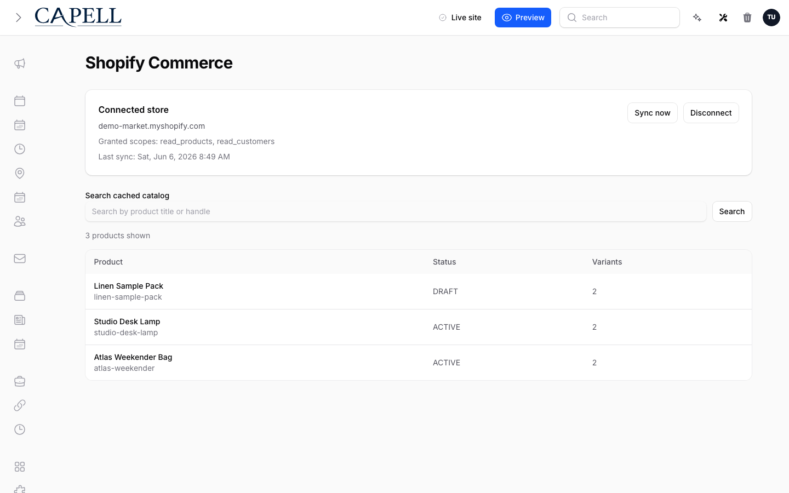

# Using Shopify Commerce

This guide is for staff who manage the Shopify connection and owners deciding when to rely on the catalogue. Every step uses the labels you see on screen.

## Using Shopify Commerce (editor how-to)

### How to connect your store

1. Go to **Shopify Commerce**.
2. Click **Connect** and follow the prompts to authorise your Shopify store.
3. When it shows **Connected store**, the connection is live.

### How to sync and search products

1. After connecting, let products sync. The screen shows the **Last sync** time.
2. Use **Sync now** if you want to refresh the catalogue right away.
3. Search the catalogue with **Search cached catalog** to find a product.
4. Synced products appear wherever admin search is used.

### How to re-sync

1. If a product looks out of date or is missing, trigger a re-sync.
2. Wait for the **Last sync** time to update.
3. Search again to confirm the product is current.

## Rolling out Shopify Commerce (for owners)

### Turn on first

- **The store connection and a first sync.** Connect and confirm products appear before building anything that depends on the catalogue.

### Add when needed

| Need                         | Enable                                     |
| ---------------------------- | ------------------------------------------ |
| Keep the catalogue fresh     | Regular re-syncs                           |
| Use products across the site | Admin search once the first sync completes |

### Don't enable yet

- Don't rely on the catalogue before the first sync finishes and shows a recent **Last sync**.

### Who does what

| Role       | First useful screen                            |
| ---------- | ---------------------------------------------- |
| Staff      | **Products**: search the synced catalogue      |
| Site owner | **Connection**: manage the store link and sync |

## Troubleshooting for editors

| What you see                 | What it means                                        | What to do                                             |
| ---------------------------- | ---------------------------------------------------- | ------------------------------------------------------ |
| No matching products found   | The sync hasn't run, or the product isn't in Shopify | Check the **Last sync** time and re-sync               |
| A product is out of date     | The latest change hasn't synced yet                  | Trigger a re-sync and wait for **Last sync** to update |
| The store shows disconnected | The connection dropped or expired                    | **Connect** the store again                            |
| Sync keeps failing           | The Shopify API request is failing                   | Ask your developer to check the store credentials      |
