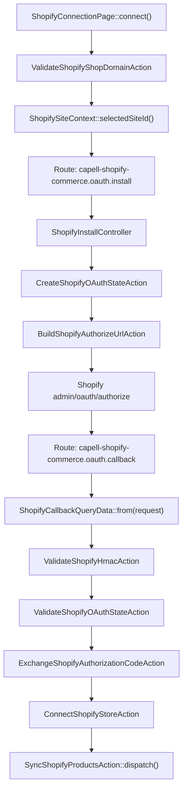
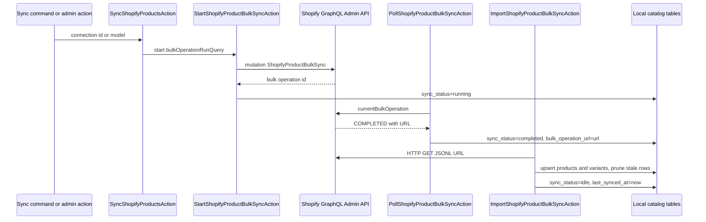

# OAuth And Catalog Sync

This doc covers the runtime flow that starts with an admin connecting a Shopify shop and ends with locally searchable `shopify_products` and `shopify_product_variants` rows.

## OAuth Request Flow



The install and callback routes both use `web` and `auth` middleware and both call `ShopifyConnectionPage::canAccess()`. A user without `manage_shopify_commerce` should never reach the Shopify OAuth redirect or callback handler.

Expired OAuth nonce rows are removed by `capell-shopify-commerce:prune-oauth-states`, which is scheduled hourly after the package is installed. Callback validation still deletes the matched row immediately, so the scheduled pruning path only clears abandoned or already-expired connection attempts.

## OAuth Data Ownership

| Data                    | Owner                              | Notes                                                                                                                               |
| ----------------------- | ---------------------------------- | ----------------------------------------------------------------------------------------------------------------------------------- |
| Shopify app credentials | Host env/config                    | `SHOPIFY_APP_CLIENT_ID`, `SHOPIFY_APP_CLIENT_SECRET`, `capell-shopify-commerce.client_id`, `capell-shopify-commerce.client_secret`. |
| OAuth nonce             | `shopify_oauth_states`             | Created by `CreateShopifyOAuthStateAction`, expires from `capell-shopify-commerce.state_ttl_seconds`.                               |
| Access token            | `shopify_connections.access_token` | Stored by `ConnectShopifyStoreAction`; do not expose outside trusted admin/server code.                                             |
| Site scope              | `shopify_connections.site_id`      | Selected through `ShopifySiteContext`; nullable only where the code explicitly allows a global connection.                          |
| Scopes                  | `shopify_connections.scopes`       | Defaults come from `ShopifyCommerceSettings::default_scopes` or `capell-shopify-commerce.default_scopes`.                           |

## Catalog Sync Flow



`SyncShopifyProductsAction` and the bulk sync sub-actions use the lock key `capell-shopify-commerce.sync.{connectionId}`. The queued Action middleware uses `WithoutOverlapping` with a six-hour expiry; the start, poll, and import Actions also use cache locks around their critical sections.

## Customer Sync Flow

`SyncShopifyCustomersAction` is the package-owned producer for `shopify_customers`. It calls Shopify Admin GraphQL `customers(first:, after:)` in pages, passes each returned customer node through `UpsertShopifyCustomerAction`, and dispatches `ShopifyCustomerSynced` from that upsert path so Contacts and CRM consumers receive the same event shape as direct customer writes.

The console entrypoint is:

```bash
php artisan capell-shopify-commerce:sync-customers {connection?}
```

If no connection id is supplied, the command targets the latest active connection. Page size and maximum page count come from `capell-shopify-commerce.customer_sync_page_size` and `capell-shopify-commerce.customer_sync_max_pages`; both are bounded by the Action so a bad config cannot request more than Shopify's 250-record page size or loop indefinitely.

## Search Behavior

`SearchShopifyProductsAction` searches the local cache first. If there are no local matches and the term is not empty, it performs a live Shopify GraphQL product search, persists any returned products, invalidates the connection search version, and searches locally again.

Search cache keys use:

```text
capell-shopify-commerce.search.{connectionId}.{version}.{sha1LowercaseTerm}.{limit}
```

The TTL comes from `shopify_commerce.search_cache_ttl_minutes`, with a fallback of five minutes.

## Failure Boundaries

| Boundary                             | Failure behavior                                                                                                                                       |
| ------------------------------------ | ------------------------------------------------------------------------------------------------------------------------------------------------------ |
| Invalid shop domain                  | Install route aborts with `422`; admin page adds a field error.                                                                                        |
| Missing app credentials              | Install route redirects back to `filament.admin.pages.shopify-commerce` with a configuration error.                                                    |
| Bad callback HMAC                    | Callback logs `Shopify OAuth failed` and redirects back with an OAuth error.                                                                           |
| Expired or wrong-user state          | Callback logs `Shopify OAuth failed` and shows the invalid-state message.                                                                              |
| GraphQL request failure              | `ExecuteShopifyAdminGraphqlAction` throws `ShopifyGraphqlException`.                                                                                   |
| Bulk start failure                   | Connection `sync_status` becomes `failed`; GraphQL user errors also mark connection `status` as `error`; persisted errors are scrubbed before storage. |
| Bulk poll failure status             | `FAILED` or `CANCELED` marks `sync_status` as lowercase status and connection `status` as `error`.                                                     |
| Import failure                       | Connection `sync_status` becomes `failed`, connection `status` becomes `error`, and `last_sync_error` stores a scrubbed exception summary.             |
| Revoked connection                   | Sync/import returns without reactivating the connection.                                                                                               |
| Customer sync on inactive connection | Customer sync returns `0` without calling Shopify.                                                                                                     |

## Troubleshooting

| Symptom                               | Likely cause                                                                               | Check                                                                                                                        | Fix                                                                                                                              |
| ------------------------------------- | ------------------------------------------------------------------------------------------ | ---------------------------------------------------------------------------------------------------------------------------- | -------------------------------------------------------------------------------------------------------------------------------- |
| Shopify rejects the OAuth redirect    | Wrong Shopify app client id or callback URL                                                | Compare `SHOPIFY_APP_CLIENT_ID` and app callback URL with `route('capell-shopify-commerce.oauth.callback')`                  | Update the Shopify app settings and clear host config cache.                                                                     |
| OAuth callback always says it failed  | Secret mismatch causing bad HMAC                                                           | Laravel log line `Shopify OAuth failed` with `invalid_hmac`; config key `capell-shopify-commerce.client_secret`              | Set `SHOPIFY_APP_CLIENT_SECRET` to the current Shopify app secret.                                                               |
| OAuth state is invalid                | Nonce expired or callback handled by another signed-in user                                | Inspect `shopify_oauth_states.nonce`, `user_id`, `shop_domain`, and `expires_at`                                             | Restart OAuth from the same browser session; increase `state_ttl_seconds` only if admins consistently exceed ten minutes.        |
| Sync stays queued                     | Queue worker is not processing dispatched Actions                                          | Check `shopify_connections.sync_status`, `last_sync_queued_at`, queue worker logs, and failed jobs                           | Start the host queue worker or run the sync command for the connection while debugging.                                          |
| Sync stays running                    | Bulk operation was started but not polled/imported                                         | Check `bulk_operation_id`, `bulk_operation_url`, and Shopify current bulk operation status                                   | Run or schedule the poll/import workflow that calls `PollShopifyProductBulkSyncAction` and `ImportShopifyProductBulkSyncAction`. |
| Search returns old products           | Import did not complete or search cache still has the old version                          | Check `shopify_products.synced_at`, `shopify_connections.last_synced_at`, and cache prefix `capell-shopify-commerce.search.` | Complete import and run `InvalidateShopifyProductSearchCacheAction::run($connection)`.                                           |
| Customer cache stays empty            | Customer sync has not run, the token is revoked, or the Shopify app lacks `read_customers` | Check `shopify_customers`, connection status/scopes, and the command output for `capell-shopify-commerce:sync-customers`.    | Grant customer-read scope, reconnect if required, then run the customer sync command for the connection.                         |
| Site-limited admin sees no connection | Connection is scoped to a site the actor cannot access                                     | Check `shopify_connections.site_id` and the actor's assigned site ids                                                        | Reconnect under the intended site or update the actor's site assignment.                                                         |
| GraphQL calls pause briefly           | Shopify throttle metadata reports insufficient points or Shopify returns `429 Retry-After` | Inspect response `extensions.cost.throttleStatus`, `Retry-After`, and cache key `capell-shopify-commerce.graphql.throttle.*` | This is expected; `ExecuteShopifyAdminGraphqlAction` retries 429s, carries throttle state forward, and sleeps up to five seconds before paced requests. |

## Focused Test Recipes

| Change                               | Test recipe                                                                                                                                                      |
| ------------------------------------ | ---------------------------------------------------------------------------------------------------------------------------------------------------------------- |
| OAuth install URL or shop validation | Add or update `ShopifyInstallControllerTest`; assert route status, stored OAuth state, and redirect query.                                                       |
| Callback validation                  | Add or update `ShopifyCallbackControllerTest`; fake token exchange HTTP, assert bad HMAC/state failures, and assert valid callback creates a connection.         |
| HMAC logic                           | Extend `ValidateShopifyHmacActionTest` with sorted query values and mutation cases.                                                                              |
| Token exchange                       | Extend `ExchangeShopifyAuthorizationCodeActionTest`; fake Shopify token HTTP and assert `ShopifyTokenExchangeResponseData`.                                      |
| Bulk operation mutation              | Extend `SyncShopifyProductsActionTest`; fake GraphQL responses and assert connection status fields.                                                              |
| Import mapping                       | Extend `SyncShopifyProductsActionTest`; fake JSONL download and assert product, variant, stale-prune, and money precision behavior.                              |
| Customer producer                    | Extend `SyncShopifyCustomersActionTest`; fake paginated Admin GraphQL customers and assert local encrypted customer rows plus sync events.                       |
| Search cache                         | Extend `SearchShopifyProductsActionTest`; seed multiple connections and assert cache keys stay connection-scoped.                                                |
| Public-output safety                 | Add a frontend or render test in the consuming package; assert tokens, OAuth state, internal routes, `raw_snapshot`, and admin URLs are absent from public HTML. |

Run the full Shopify Commerce package tests from the repository root:

```bash
vendor/bin/pest packages/shopify-commerce/tests --configuration=phpunit.xml
```

## Read Next

| Next doc                                                               | Use it for                                                                 |
| ---------------------------------------------------------------------- | -------------------------------------------------------------------------- |
| [Overview](overview.md)                                                | Package boundary, provider boot, runtime surfaces, and extension guidance. |
| [Package README](../README.md)                                         | Install commands and the concise maintenance checklist.                    |
| [Search drivers and logging](../../search/docs/drivers-and-logging.md) | Adjacent patterns for search-related driver behavior and logs.             |
