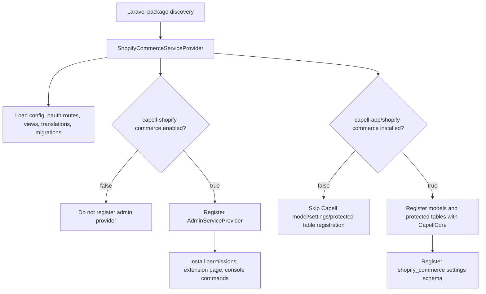
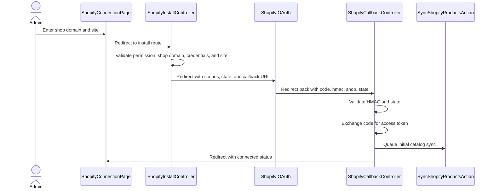

# Shopify Commerce Overview

Shopify Commerce connects a site-scoped Shopify store to Capell, stores the admin API token, and keeps local product, variant, and customer caches for admin-side catalog lookup and CRM integrations.

## Boundary

This package owns Shopify app credentials, authenticated OAuth routes, site-scoped connection records, local product/customer cache tables, catalog/customer sync Actions, and the Filament page used by admins to connect or disconnect a store.

It does not own public storefront rendering, checkout, carts, orders, webhooks, or product merchandising components. It may cache Shopify customer records for CRM integrations, but public frontend packages must not expose `shopify_connections.access_token`, OAuth state, GraphQL errors, internal product/customer snapshots, admin URLs, or site assignment metadata in rendered HTML.

## Runtime Surfaces

| Type        | Surface                                                                                                                                           |
| ----------- | ------------------------------------------------------------------------------------------------------------------------------------------------- |
| Providers   | `Capell\ShopifyCommerce\Providers\ShopifyCommerceServiceProvider`, `Capell\ShopifyCommerce\Providers\AdminServiceProvider`                        |
| Config      | `capell-shopify-commerce.enabled`, `client_id`, `client_secret`, `default_api_version`, `default_scopes`, `state_ttl_seconds`, `default_currency` |
| Env vars    | `CAPELL_SHOPIFY_COMMERCE_ENABLED`, `SHOPIFY_APP_CLIENT_ID`, `SHOPIFY_APP_CLIENT_SECRET`                                                           |
| Settings    | `shopify_commerce.api_version`, `shopify_commerce.default_scopes`, `shopify_commerce.search_cache_ttl_minutes`                                    |
| Routes      | `GET capell/oauth/shopify/install`, `GET capell/oauth/shopify/callback`                                                                           |
| Route names | `capell-shopify-commerce.oauth.install`, `capell-shopify-commerce.oauth.callback`                                                                 |
| Commands    | `capell-shopify-commerce:install`, `capell-shopify-commerce:sync {connection?}`, `capell-shopify-commerce:sync-customers {connection?}`           |
| Admin page  | `filament.admin.pages.shopify-commerce` backed by `ShopifyConnectionPage`                                                                         |
| Permission  | `manage_shopify_commerce`                                                                                                                         |
| Models      | `ShopifyConnection`, `ShopifyOAuthState`, `ShopifyProduct`, `ShopifyProductVariant`, `ShopifyCustomer`                                            |
| Tables      | `shopify_connections`, `shopify_oauth_states`, `shopify_products`, `shopify_product_variants`, `shopify_customers`                                |
| Health      | `shopify-commerce.package-health` using `ShopifyCommerceHealthCheck`                                                                              |
| Cache keys  | `capell-shopify-commerce.sync.{connectionId}`, `capell-shopify-commerce.search.{connectionId}.{version}.{hash}.{limit}`                           |

## Boot Flow



`AdminServiceProvider` stops early when the package is disabled or the host Capell package registry says `capell-app/shopify-commerce` is not installed. That keeps routes and package files available while hiding admin and command surfaces from uninstalled hosts.

## Install Flow

Run this from the host Capell application, not from this package repository:

```bash
composer require capell-app/shopify-commerce
php artisan capell-shopify-commerce:install
php artisan migrate
```

`capell-shopify-commerce:install` publishes config, package migrations, the settings migration, and installs `manage_shopify_commerce` through `InstallShopifyCommercePermissionsAction`.

## Admin Flow



The admin page uses `ShopifySiteContext` to keep connection selection scoped to the current actor. Global admins can choose a site; site-limited users can only use assigned site ids.

## Extension Points

Shopify Commerce does not currently expose a formal provider contract for third-party extensions. Integrate through package Actions and Capell registry surfaces that already exist:

| Need                          | Use                                                            | Register or call from                                     | Test shape                                                                                      |
| ----------------------------- | -------------------------------------------------------------- | --------------------------------------------------------- | ----------------------------------------------------------------------------------------------- |
| Connect or disconnect a store | `ConnectShopifyStoreAction`, `DisconnectShopifyStoreAction`    | Admin UI or a trusted internal Action                     | Action test with fake token data and asserted `shopify_connections` changes.                    |
| Trigger sync                  | `SyncShopifyProductsAction::run()` or `::dispatch()`           | Trusted admin command, job, or internal integration       | Fake HTTP or mock Actions; assert status transitions and `bulk_operation_id`.                   |
| Sync customer cache           | `SyncShopifyCustomersAction::run()`                            | Trusted admin command, job, or internal integration       | Fake paginated Admin GraphQL customer responses; assert encrypted local customer rows.          |
| Search cached products        | `SearchShopifyProductsAction::run($term, $limit, $connection)` | Admin-facing product picker or internal commerce workflow | Seed products; assert connection-scoped results and cache behavior.                             |
| Expose safe frontend behavior | A separate package-owned public Action                         | Public Actions or a package controller                    | Frontend safety test proving no token, OAuth state, admin URL, or raw snapshot leaks.           |
| Report package health         | `ShopifyCommerceHealthCheck`                                   | Diagnostics package discovery                             | Provider or manifest test asserting health class exists and implements `ChecksExtensionHealth`. |

Do not invent provider tags or registry contracts until a second concrete integration needs them.

## Test Recipes

| Behavior                        | Smallest useful test                                                                                                           |
| ------------------------------- | ------------------------------------------------------------------------------------------------------------------------------ |
| Admin page permission gate      | `vendor/bin/pest packages/shopify-commerce/tests/Feature/Filament/ShopifyConnectionPageTest.php --configuration=phpunit.xml`   |
| OAuth route validation          | `vendor/bin/pest packages/shopify-commerce/tests/Feature/OAuth --configuration=phpunit.xml`                                    |
| Shopify HMAC verification       | `vendor/bin/pest packages/shopify-commerce/tests/Unit/Actions/ValidateShopifyHmacActionTest.php --configuration=phpunit.xml`   |
| Bulk sync lifecycle             | `vendor/bin/pest packages/shopify-commerce/tests/Unit/Actions/SyncShopifyProductsActionTest.php --configuration=phpunit.xml`   |
| Customer sync producer          | `vendor/bin/pest packages/shopify-commerce/tests/Unit/Actions/SyncShopifyCustomersActionTest.php --configuration=phpunit.xml`  |
| Cached search and live fallback | `vendor/bin/pest packages/shopify-commerce/tests/Unit/Actions/SearchShopifyProductsActionTest.php --configuration=phpunit.xml` |
| Full package                    | `vendor/bin/pest packages/shopify-commerce/tests --configuration=phpunit.xml`                                                  |

## Read Next

| Next doc                                                   | Use it for                                                                              |
| ---------------------------------------------------------- | --------------------------------------------------------------------------------------- |
| [OAuth and catalog sync](oauth-and-catalog-sync.md)        | Detailed request, GraphQL, bulk import, cache, troubleshooting, and failure boundaries. |
| [Package README](../README.md)                             | Install commands, high-level surfaces, and maintenance rules.                           |
| [Diagnostics overview](../../diagnostics/docs/overview.md) | Health check discovery and admin operations context.                                    |
