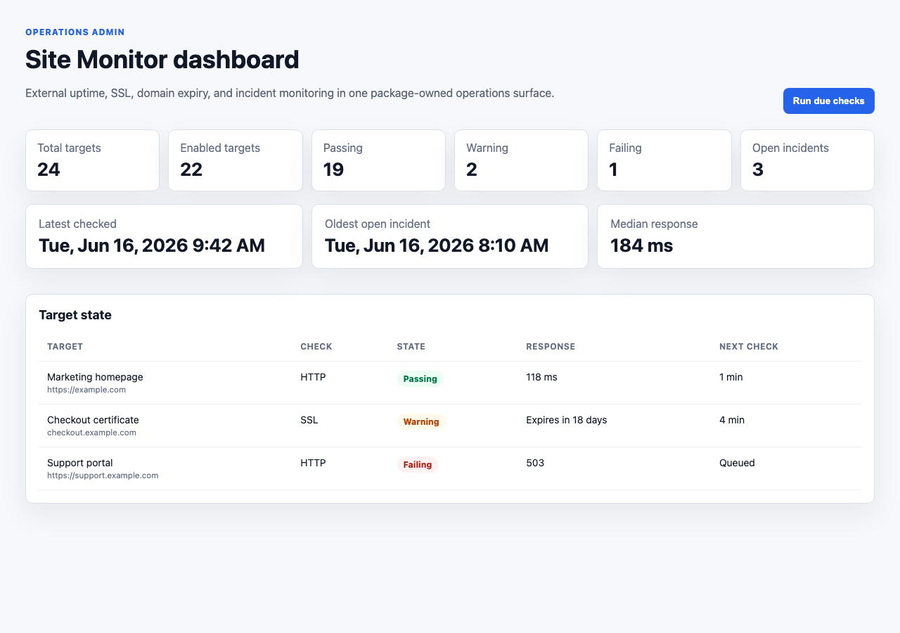
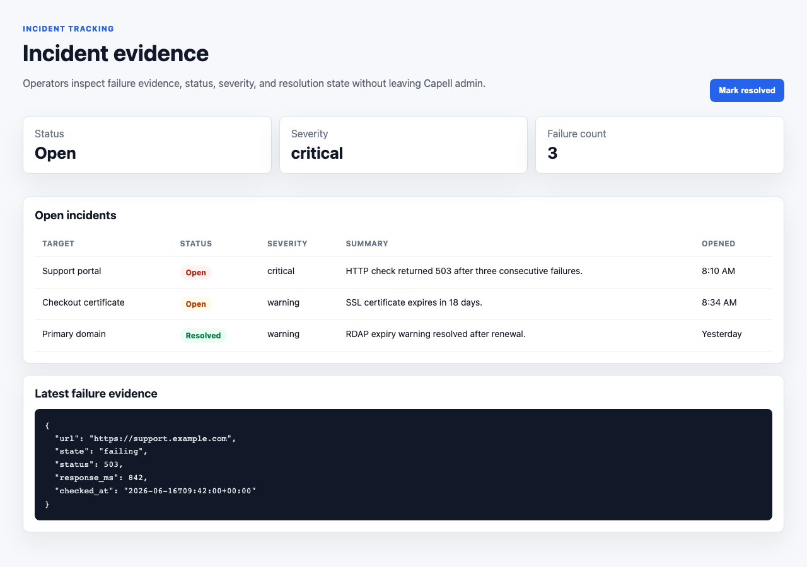

# Using Site Monitor

This guide is for owners and operators who watch site health and uptime. No technical knowledge needed. Every step uses the labels you see on screen. Site Monitor runs checks on a schedule, shows you whether each one is passing, and opens an incident when something fails - all away from the public site.

## Using Site Monitor (how-to)

### How to read the dashboard

1. Go to **Monitoring > Site monitor** in the admin.
2. The top counters give you the picture at a glance: **Targets** (how many you watch), **Enabled**, **Passing**, **Warnings**, **Failing**, and **Open incidents**.
3. Below that, the timing figures show the **Latest check**, the **Oldest incident**, and the **Median response** time.
4. A figure of **No data yet** simply means nothing has been checked in that area so far.

### How to add something to monitor

1. Go to **Monitoring > Monitor targets**.
2. Create a new target.
3. Give it a **Name** and the **URL** to watch.
4. Choose the **Check type**: **HTTP status** to confirm a page responds, **SSL certificate** to watch for an expiring certificate, or **Domain expiry** to watch for an expiring domain.
5. Leave **Enabled** on so it is included in scheduled checks.
6. Set how often it runs with **Interval minutes**, how long to wait with **Timeout milliseconds**, and how many failures in a row count as a real problem with **Failure threshold**.
7. For an HTTP status check, set the acceptable range with **Minimum expected status** and **Maximum expected status**.
8. Save the target.

### How to run a check straight away

1. To check everything that is due now, open **Monitoring > Site monitor** and use **Run due checks**. Results are queued and update shortly after.
2. To re-check one target on its own, go to **Monitoring > Monitor targets** and use the **Run now** action on that target's row.
3. Use either of these after you have made a change and want a fresh result rather than waiting for the schedule.

### How to check a target's current state

1. Go to **Monitoring > Monitor targets**.
2. Each target shows its **Current state**: **Passing**, **Warning**, **Failing**, or **Unknown** if it has not run yet.
3. The **Last checked** and **Next check** times tell you when it ran and when it runs again, and **Consecutive failures** shows how many times in a row it has failed.

### How to review and resolve incidents

1. Go to **Monitoring > Monitor incidents**.
2. Each incident shows the **Target** it relates to, its **Status** (**Open** or **Resolved**), the **Severity**, and a **Summary** of what went wrong.
3. Open an incident to read the failure evidence, including the **Failure count**, when it was **Opened**, and the **Last failure** time.
4. Once the underlying problem is fixed and the target is passing again, set the incident **Status** to **Resolved** and save.

## Rolling out Site Monitor (for owners)

### Turn on first

- **A few targets and the dashboard.** Add the URLs that matter most as **Monitor targets**, leave them **Enabled**, and watch the **Site monitor** dashboard. Build up coverage from there.

### Add when needed

| Need                                   | Use                                                             |
| -------------------------------------- | --------------------------------------------------------------- |
| Confirm a page is responding           | A target with **Check type** set to **HTTP status**             |
| Catch an expiring security certificate | A target with **Check type** set to **SSL certificate**         |
| Catch an expiring domain name          | A target with **Check type** set to **Domain expiry**           |
| A fresh result after a change          | **Run due checks** on the dashboard, or **Run now** on a target |
| A record of what failed and when       | The **Monitor incidents** list                                  |

### Who does what

| Role     | First useful screen                                                               |
| -------- | --------------------------------------------------------------------------------- |
| Owner    | **Monitoring > Monitor targets**: decide what to watch                            |
| Operator | **Monitoring > Site monitor** and **Monitor incidents**: spot and act on failures |

## Troubleshooting

| What you see                               | What it means                                                         | What to do                                                                                                  |
| ------------------------------------------ | --------------------------------------------------------------------- | ----------------------------------------------------------------------------------------------------------- |
| A target shows **Failing**                 | Its last check did not pass                                           | Open the matching incident to read the evidence and act on it                                               |
| A target shows **Warning**                 | Something is close to a problem, such as a soon-to-expire certificate | Plan the fix before it becomes a failure                                                                    |
| A target shows **Unknown**                 | It has not been checked yet                                           | Use **Run now**, or wait for its next scheduled check                                                       |
| Counters or times show **No data yet**     | Nothing has been checked in that area so far                          | Add a target, then run a check                                                                              |
| A target's **Last checked** time looks old | Scheduled checks may not be running                                   | Use **Run due checks**; if it stays stale, ask your developer to confirm the schedule and queue are running |
| An incident is still **Open** after a fix  | It has not been closed off yet                                        | Confirm the target is **Passing**, then set the incident to **Resolved**                                    |
| A check needs technical work to understand | The failure detail is beyond day-to-day operating                     | Share the incident detail with your developer                                                               |
