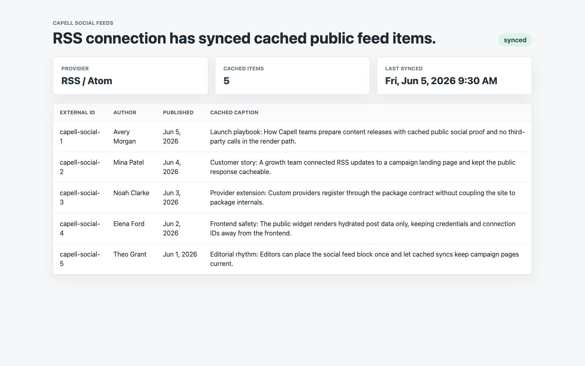

# Using Social Feeds

This guide is for editors who show social posts on the site and owners deciding which networks to connect. Every step uses the labels you see on screen.

## Using Social Feeds (editor how-to)

### How to connect a feed

1. Go to **Social Feeds**.
2. Add a **Social feed connection** for the network you want.
3. Follow the prompts to connect the account.
4. When it shows **Connected**, it is ready to use.

### How to choose what shows and embed it

1. Edit the page where you want the feed.
2. Add the social feed widget.
3. Choose how many posts appear.
4. Save the page.

### How to check a feed is producing items

1. Go to **Social Feeds** and open your connection.
2. Use **Sync now** to pull the latest posts.
3. Check the **Sync status** and **Last synced** time, then confirm posts appear under **Cached social feed items**.

### How to reconnect a feed

1. Go to **Social Feeds**.
2. If a connection shows **Disconnected**, reconnect it.
3. The feed starts updating again.

## Rolling out Social Feeds (for owners)

### Turn on first

- **One active network.** Connect the social account you post to most and confirm it shows before adding others.

### Add when needed

| Need                       | Enable                      |
| -------------------------- | --------------------------- |
| Show more than one network | Additional **connections**  |
| Keep the page tidy         | A small post count per feed |

### Don't enable yet

- Don't connect networks you rarely post to. An empty or stale feed looks worse than none.

### Who does what

| Role       | First useful screen         |
| ---------- | --------------------------- |
| Editor     | The feed widget on the page |
| Site owner | **Social feed connections** |

## Troubleshooting for editors

| What you see               | What it means                                  | What to do                                                    |
| -------------------------- | ---------------------------------------------- | ------------------------------------------------------------- |
| The feed is empty          | No posts cached yet, or the connection dropped | Check the connection shows **Connected**; reconnect if needed |
| The feed stopped updating  | The connection expired or hit a rate limit     | Reconnect the feed and wait for the next refresh              |
| Too many posts on the page | The post count is high                         | Lower how many posts the widget shows                         |
