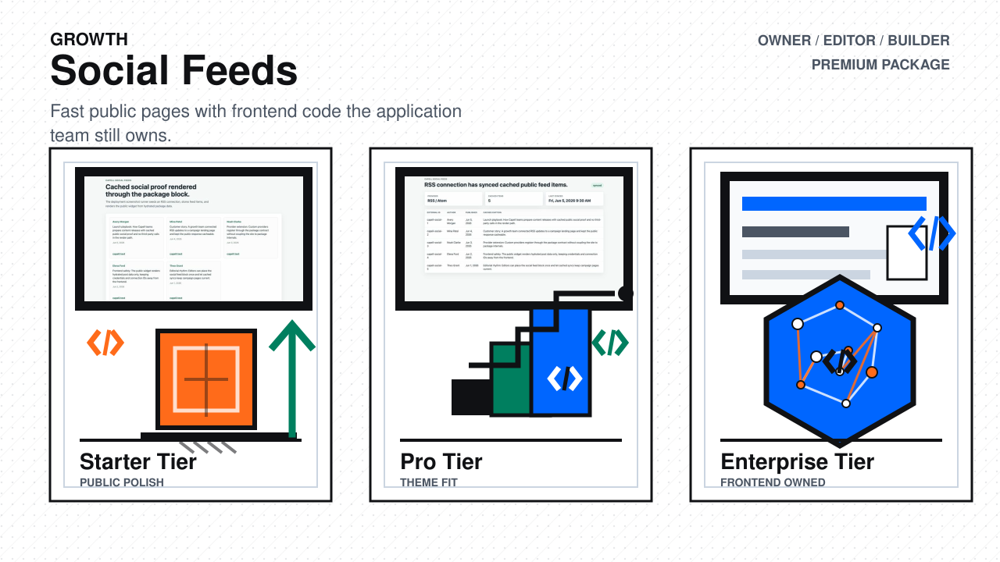
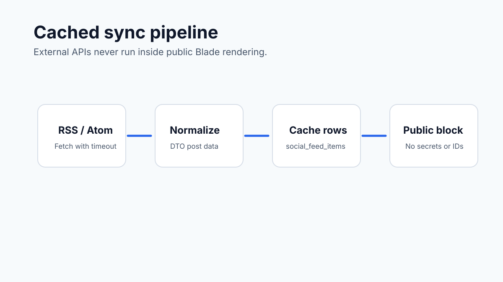
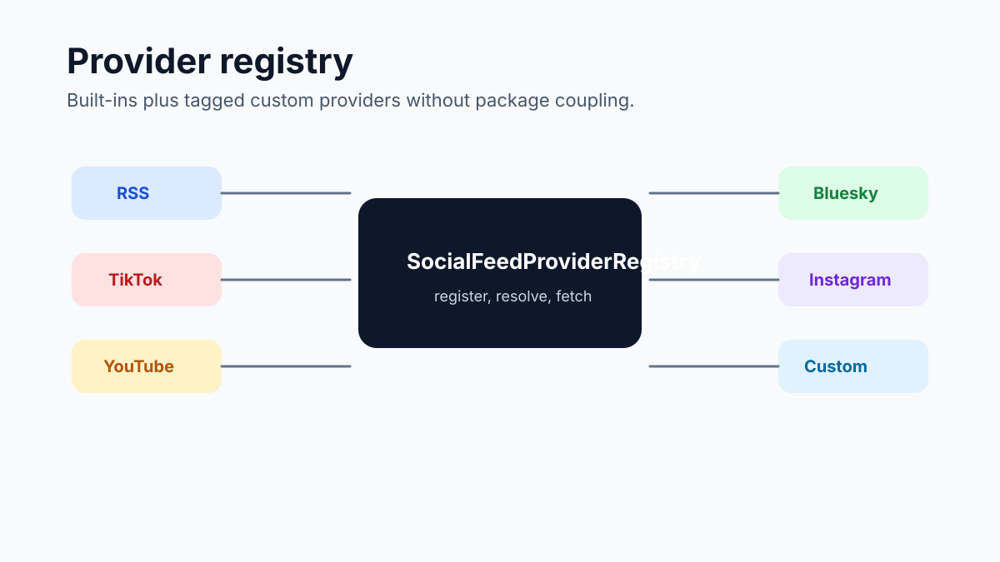

# Social Feeds Overview

Status: **Available, schema-owning** · Kind: **package** · Tier: **premium** · Bundle: **growth** · Contexts: **admin, frontend**

Social Feeds gives Capell sites a premium social-feed widget that renders from cached feed items instead of calling third-party APIs during public page requests. Editors can place the `social-feed` block and choose list, slideshow, carousel, or paginated layouts with controls for limits, page size, columns, media, captions, authors, dates, autoplay, transition speed, aspect ratio, and empty-state behavior.

## Extension Surface

- `SocialFeedProvider` is the provider contract for RSS, TikTok, YouTube, Bluesky, Instagram, Facebook, LinkedIn, X, and custom providers.
- RSS / Atom is the native v1 provider. Other built-in social provider keys sync from configured `feed_url` credentials until native API bridges are completed.
- `SocialFeedProviderProvider::TAG` lets another package register providers through `SocialFeedProviderRegistry`.
- `SocialFeedWidgetContribution` declares the public widget contribution in `capell.json`.
- `SocialFeedConnectionModelContribution` and `SocialFeedItemModelContribution` document the schema-owned records exposed by the package.

## Marketplace

The marketplace gallery is backed by committed preview assets in `docs/assets/marketplace` and a deployment screenshot contract in [screenshots.json](screenshots.json). The real screenshot runner should install the package, seed an RSS connection with cached posts, render the public block, and capture the required PNGs into `packages/social-feeds/docs/screenshots`.

## Safety

Public rendering consumes `SocialFeedRenderData` only. The Blade view must not query the database, lazy-load relationships, output credentials, expose connection IDs, leak package internals, or include authoring/admin markers.
