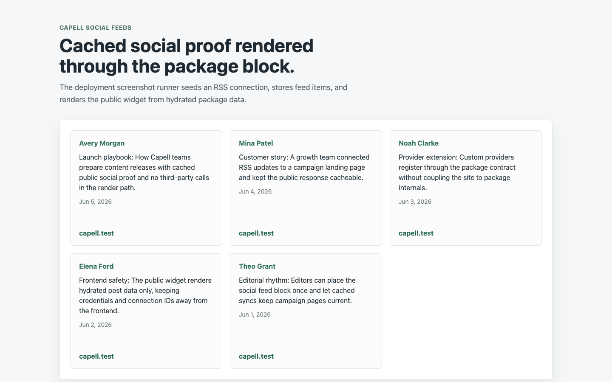
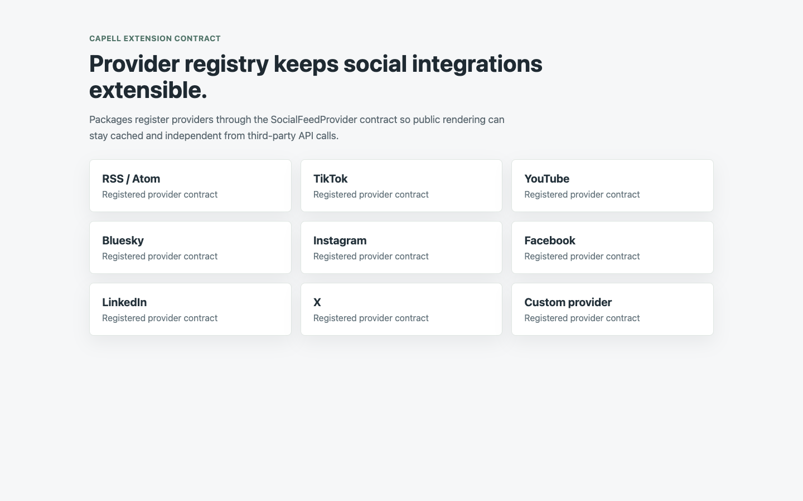

# Social Feeds

<!-- prettier-ignore-start -->

## What This Plugin Adds

Social Feeds is an **Available**, **Schema-owning** Capell package in the **Capell Growth** product group. It ships as `capell-app/social-feeds` and extends these surfaces: admin, frontend, console.

Premium social feed widgets for Capell with cached public rendering, provider extensibility, and configurable list, slideshow, carousel, and paginated layouts.

After install, admins get package-owned management surfaces and public users may see package-owned frontend output or routes.

Status details:

- Status: Available
- Tier: premium
- Bundle: growth
- Composer package: `capell-app/social-feeds`
- Namespace: `Capell\SocialFeeds`
- Theme key: not applicable

## Why It Matters

**For developers:** The package gives developers package-owned service providers, Actions, Data objects, models, Filament classes, and Blade views instead of pushing this behaviour into core or application code.

**For teams:** Place cached RSS-compatible social feeds in Capell pages with a provider registry and clean public rendering.

## Screens And Workflow

Screenshot contract: `screenshots.json`.

- Social feed carousel widget (frontend, required).
- RSS feed sync and cached items (admin, required).
- Provider registry extension surface (shared, required).

## Screenshot Evidence

These captures are the package-owned visual contract for the admin pages, public pages, actions, workflows, and feature surfaces described above. Keep this section aligned with `docs/screenshots.json` whenever the package surface changes.

### Social feed carousel widget

- Surface: frontend · Target: social-feed.
- Documents: A visitor sees a branded carousel of social posts without exposing feed connection internals.
- Capture notes: Capture a public page with seeded cached feed items rendered through the social-feed block using the carousel layout.

### RSS feed sync and cached items

- Surface: admin · Target: social_feed_items.
- Documents: An administrator verifies an RSS feed is connected and producing cached social feed items.
- Capture notes: Capture after creating an RSS connection, running the sync action, and confirming cached items exist for render.

### Provider registry extension surface

- Surface: shared · Target: SocialFeedProviderRegistry.
- Documents: A developer confirms social feeds can be extended without coupling their provider package to package internals.
- Capture notes: Capture package documentation or diagnostics output showing built-in RSS, TikTok, YouTube, Bluesky, Instagram, Facebook, LinkedIn, X, and a custom provider.

## Technical Shape

- Service providers: `Capell\SocialFeeds\Providers\SocialFeedsServiceProvider`, `Capell\SocialFeeds\Providers\AdminServiceProvider`, `AbstractConfiguredProvider`, `BlueskyFeedProvider`, `FacebookFeedProvider`, `InstagramFeedProvider`, `LinkedInFeedProvider`, `RssFeedProvider`, `TikTokFeedProvider`, `XFeedProvider`, `YouTubeFeedProvider`.
- Config files: `packages/social-feeds/config/capell-social-feeds.php`.
- Migrations: `packages/social-feeds/database/migrations/2026_06_04_000001_create_social_feed_connections_table.php`, `packages/social-feeds/database/migrations/2026_06_04_000002_create_social_feed_items_table.php`, `packages/social-feeds/database/migrations/2026_06_04_000003_create_social_feed_oauth_states_table.php`.
- Models: `SocialFeedConnection`, `SocialFeedItem`, `SocialFeedOAuthState`.
- Filament classes: `CreateSocialFeedConnection`, `EditSocialFeedConnection`, `ListSocialFeedConnections`, `SocialFeedConnectionResource`, `ListSocialFeedItems`, `SocialFeedItemResource`.
- Actions: `FetchSocialFeedRenderDataAction`, `RedactSocialFeedSyncErrorAction`, `SyncSocialFeedConnectionAction`, `SyncSocialFeedConnectionsAction`, `UpsertSocialFeedItemsAction`.
- Data objects: `ResolvedFeedEndpointData`, `SocialFeedPostData`, `SocialFeedRenderData`, `SocialFeedRenderItemData`, `SocialFeedWidgetConfigData`.
- Command signatures: `capell:social-feeds:sync`.
- Console command classes: `SyncSocialFeedsCommand`.
- Manifest contributions: `admin-resource: Capell\SocialFeeds\Manifest\SocialFeedConnectionResourceContribution`, `admin-resource: Capell\SocialFeeds\Manifest\SocialFeedItemResourceContribution`, `frontend-component: Capell\SocialFeeds\Manifest\SocialFeedWidgetContribution`, `model: Capell\SocialFeeds\Manifest\SocialFeedConnectionModelContribution`, `model: Capell\SocialFeeds\Manifest\SocialFeedItemModelContribution`, `scheduled-job: Capell\SocialFeeds\Manifest\SocialFeedsSyncScheduleContribution`.
- Health checks: `Capell\SocialFeeds\Health\SocialFeedsHealthCheck`.
- Blade views: `packages/social-feeds/resources/views/blocks/social-feed.blade.php`.
- Cache tags: `social-feeds`.

## Data Model

- Required tables: `social_feed_connections`, `social_feed_items`, `social_feed_oauth_states`.
- Models: `SocialFeedConnection`, `SocialFeedItem`, `SocialFeedOAuthState`.
- Migration files: `2026_06_04_000001_create_social_feed_connections_table.php`, `2026_06_04_000002_create_social_feed_items_table.php`, `2026_06_04_000003_create_social_feed_oauth_states_table.php`.
- Migration impact: run host migrations through the package install flow before opening package surfaces.
- Deletion/retention behaviour: `UpsertSocialFeedItemsAction` keeps the newest `capell-social-feeds.retention_items` cached items per connection and prunes older cached items after successful syncs.

## Install Impact

- Admin navigation: adds package-owned Filament classes when registered.
- Permissions: none declared in `capell.json`.
- Public routes: none detected in package route files.
- Database changes: package migrations are declared.
- Settings: no package settings declared.
- Queues or schedules: optional hourly `capell:social-feeds:sync --all` scheduler is disabled by default and controlled by `capell-social-feeds.sync_schedule_enabled`; stale connected feeds are reported by health diagnostics after `capell-social-feeds.stale_sync_minutes`.
- Cache tags: `social-feeds`.
- Commands: `capell:social-feeds:sync`.

## Common Pitfalls

- Run migrations before opening package resources or public routes.
- Keep public Blade and cached HTML free of authoring markers, model IDs, permissions, signed editor URLs, and lazy database queries.
- Keep `composer.json`, `composer.local.json`, `capell.json`, docs, screenshots, and tests aligned when the package surface changes.

## Troubleshooting

| Symptom | Likely cause | Check | Fix |
| --- | --- | --- | --- |
| Package surface is missing after install | Provider or manifest is not loaded | Confirm `capell.json`, package `composer.json`, and provider registration | Reinstall the package, refresh Composer autoload, and clear host caches |
| Admin screen or command fails on missing table | Package migrations have not run | Check the tables listed in `Data Model` | Run host migrations and rerun the focused package test |
| Background work does not run | Queue worker or scheduled command is not active | Check package jobs, commands, host scheduler configuration, and stale-sync health diagnostics | Start the queue or scheduler, then run `capell:social-feeds:sync --all` |
| Public output leaks unexpected state | Render data, cache variation, or authoring boundary has regressed | Check public Blade, cache tags, and public-output safety tests | Move data loading out of Blade and rerun the package public-output tests |

## Quick Start

1. Install the package: `composer require capell-app/social-feeds`.
2. Run the required setup: `php artisan migrate`.
3. Open the related Capell admin surface and verify Social Feeds appears.

## Next Steps

- [Package docs index](README.md)
- [Screenshot contract](screenshots.json)
- [Marketplace assets](assets/marketplace/)
- [Capell content language plan](../../../docs/CONTENT_LANGUAGE_PLAN.md)
- [Capell documentation design system](../../../docs/DESIGN_SYSTEM.md)
- [Capell and package ERD notes](../../../docs/erd/capell-and-package-erds.md)
- Related packages: [Block Library](../../block-library/README.md).
- Focused tests: `vendor/bin/pest packages/social-feeds/tests --configuration=phpunit.xml`.

<!-- prettier-ignore-end -->
