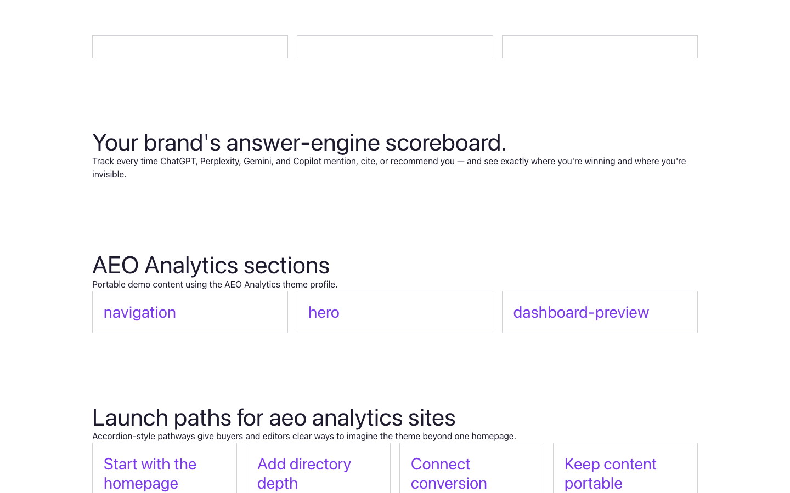

# Theme AEO Analytics

AEO Analytics provides a distinct Capell frontend theme for Visible AEO. From the repository root, run `vendor/bin/pest packages/theme-aeo-analytics/tests`; this package does not ship its own PHPUnit config.

## Screenshot Evidence

These captures are the package-owned visual contract for the admin pages, public pages, actions, workflows, and feature surfaces described above. Keep this section aligned with `docs/screenshots.json` whenever the package surface changes.

### AEO Analytics Homepage

- Surface: frontend · Target: /.
- Documents: Theme marketplace preview.
- Capture notes: AEO Analytics Homepage.

### AEO Analytics Landing page

- Surface: frontend · Target: /.
- Documents: Theme marketplace preview.
- Capture notes: AEO Analytics Landing page.

### AEO Analytics List page

- Surface: frontend · Target: /.
- Documents: Theme marketplace preview.
- Capture notes: AEO Analytics List page.

### AEO Analytics Search results

- Surface: frontend · Target: /.
- Documents: Theme marketplace preview.
- Capture notes: AEO Analytics Search results.

### AEO Analytics Contact form

- Surface: frontend · Target: /.
- Documents: Theme marketplace preview.
- Capture notes: AEO Analytics Contact form.
