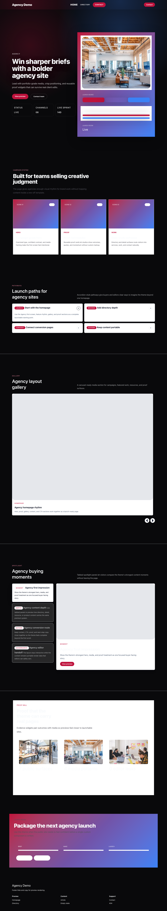
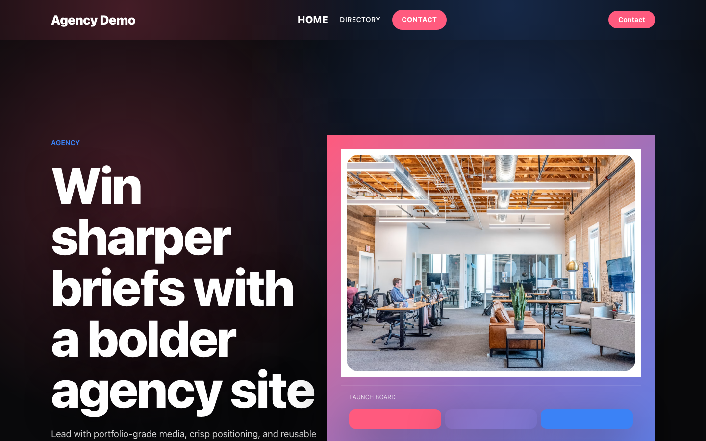
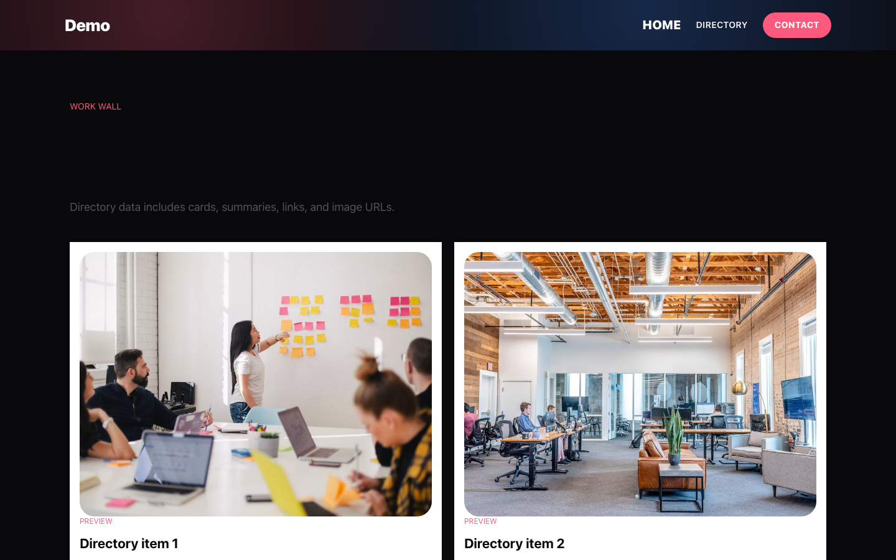
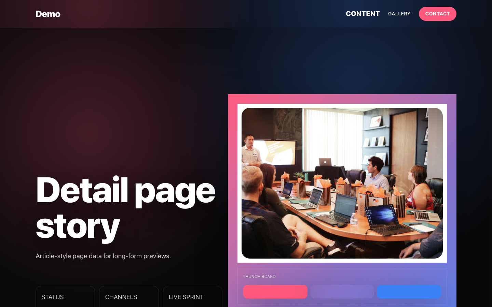
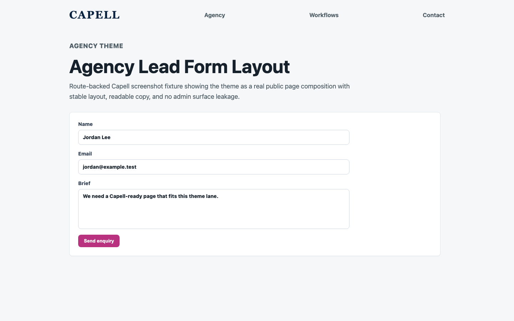
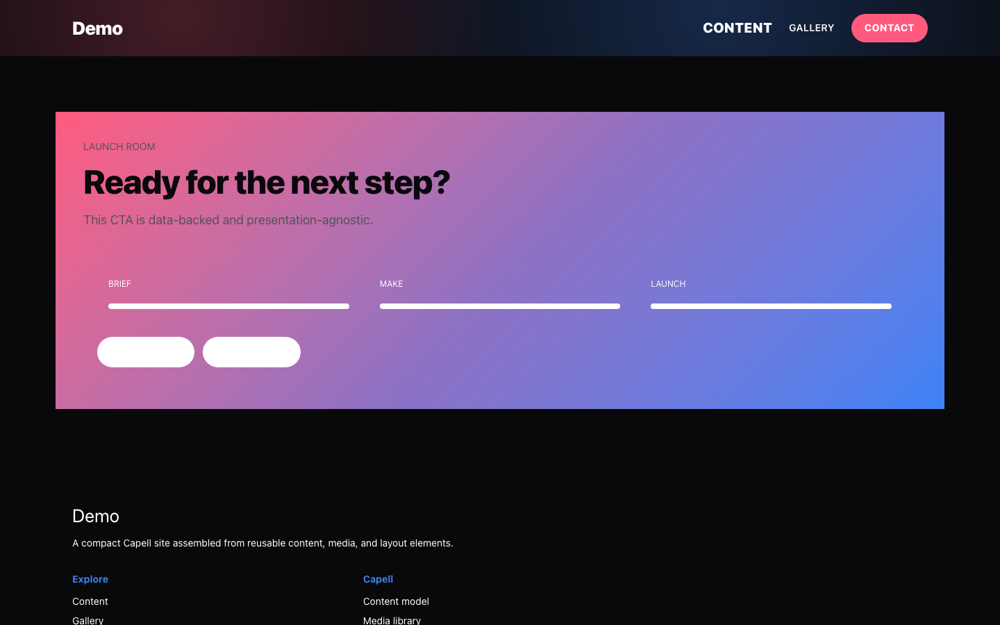

# Theme Agency

<!-- prettier-ignore-start -->

## What This Plugin Adds

Theme Agency is an **Available**, **No schema impact** Capell theme in the **Capell Themes** product group. It ships as `capell-app/theme-agency` and extends these surfaces: frontend.

Theme Agency turns a Capell site into a confident creative portfolio. It ships an expressive page system - full-bleed launch hero, animated proof wall, project showcase, and a conversion-focused brief CTA - built to make studio and agency work look like the work, not a template. Three presets (Signal, Gallery, Atelier) re-skin every section from energetic high-contrast to refined editorial neutrals, all driven by Theme Studio tokens with zero code. Built on the built-in default frontend contracts, it stays fast, cache-aware, and safe for public output, so it drops into the standard Capell theme workflow.

After install, admins can select the theme through the core theme management surface. Editors keep using normal Capell content workflows while the package controls public presentation.

Status details:

- Status: Available
- Tier: premium
- Bundle: themes
- Composer package: `capell-app/theme-agency`
- Namespace: `Capell\ThemeStudio\Agency`
- Theme key: `agency`

## Why It Matters

**For developers:** The package gives developers package-owned service providers, Actions, and Blade views instead of pushing this behaviour into core or application code.

**For teams:** A bold, motion-led theme for creative studios and marketing agencies - campaign hero, case-study proof, and a filterable work showcase, with three presets from high-contrast Signal to editorial Atelier.

## Screens And Workflow

Screenshot contract: `screenshots.json`.

- Frontend page rendered with Agency theme (frontend, optional).
- Agency homepage (frontend, optional).
- Services page (frontend, optional).
- Campaign work board (frontend, optional).
- Launch recap detail (frontend, optional).
- Insights article (frontend, optional).
- Event landing page (frontend, optional).
- Lead generation page (frontend, optional).
- Campaign page (frontend, optional).
- Search results page (frontend, optional).

## Screenshot Evidence

These captures are the package-owned visual contract for the admin pages, public pages, actions, workflows, and feature surfaces described above. Keep this section aligned with `docs/screenshots.json` whenever the package surface changes.

### Frontend page rendered with Agency theme

- Surface: frontend · Target: /theme-agency.
- Documents: A visitor sees a seeded public page rendered through every Agency theme section.
- Capture notes: Capture the seeded package theme route instead of the shared theme-gallery route. Optional until the Capell runner can browser-capture seeded package theme routes without navigation failures.

### Agency homepage

- Surface: frontend · Target: /theme-agency.
- Documents: A creative team reviews the premium Agency theme as a campaign launch surface, not a quiet creator portfolio.
- Capture notes: Capture the seeded package theme route instead of the shared theme-gallery route. Optional until the Capell runner can browser-capture seeded package theme routes without navigation failures.

### Services page

- Surface: frontend · Target: /theme-agency-directory.
- Documents: A studio or campaign team checks that services stay focused on campaign delivery rather than broad consulting.
- Capture notes: Capture the seeded package theme route instead of the shared theme-gallery route. Optional until the Capell runner can browser-capture seeded package theme routes without navigation failures.

### Campaign work board

- Surface: frontend · Target: /theme-agency-directory.
- Documents: A buyer sees recent campaign assets without Agency overlapping Portfolio's premium case-file workflow.
- Capture notes: Capture the seeded package theme route instead of the shared theme-gallery route. Optional until the Capell runner can browser-capture seeded package theme routes without navigation failures.

### Launch recap detail

- Surface: frontend · Target: /theme-agency-detail.
- Documents: A campaign team can show delivery proof while leaving deep outcome-led case studies to Portfolio.
- Capture notes: Capture the seeded package theme route instead of the shared theme-gallery route. Optional until the Capell runner can browser-capture seeded package theme routes without navigation failures.

### Insights article

- Surface: frontend · Target: /theme-agency-directory.
- Documents: A creative team checks that editorial content supports campaigns instead of becoming a knowledge-base theme.
- Capture notes: Capture the seeded package theme route instead of the shared theme-gallery route. Optional until the Capell runner can browser-capture seeded package theme routes without navigation failures.

### Event landing page

- Surface: frontend · Target: /theme-agency-cta.
- Documents: A campaign team can promote launches and webinars without requiring a premium SaaS or Events-specific layout.
- Capture notes: Capture the seeded package theme route instead of the shared theme-gallery route. Optional until the Capell runner can browser-capture seeded package theme routes without navigation failures.

### Lead generation page

- Surface: frontend · Target: /theme-agency-contact.
- Documents: A creative team checks that the preset converts campaign interest into a usable brief.
- Capture notes: Capture the seeded package theme route instead of the shared theme-gallery route. Optional until the Capell runner can browser-capture seeded package theme routes without navigation failures.

### Campaign page

- Surface: frontend · Target: /theme-agency-cta.
- Documents: A buyer sees Agency's strongest lane: fast campaign and launch pages with basic creative polish.
- Capture notes: Capture the seeded package theme route instead of the shared theme-gallery route. Optional until the Capell runner can browser-capture seeded package theme routes without navigation failures.

### Search results page

- Surface: frontend · Target: /theme-agency-directory.
- Documents: A visitor can find campaigns, briefs, and resources without the page feeling like Knowledge's archive search.
- Capture notes: Capture the seeded package theme route instead of the shared theme-gallery route. Optional until the Capell runner can browser-capture seeded package theme routes without navigation failures.

## Technical Shape

- Service providers: `Capell\ThemeStudio\Agency\AgencyThemeServiceProvider`.
- Actions: `InstallAgencyThemeDemoAction`.
- Command signatures: `capell:theme-agency-demo`.
- Console command classes: `DemoCommand`.
- Manifest contributions: `admin-page: Capell\ThemeStudio\Agency\Manifest\ThemeManagementPageContribution`.
- Health checks: `Capell\ThemeStudio\Agency\Health\ThemeAgencyHealthCheck`.
- Blade views: `packages/theme-agency/resources/views/livewire/page/page.blade.php`, `packages/theme-agency/resources/views/page.blade.php`, `packages/theme-agency/resources/views/sections/case-study.blade.php`, `packages/theme-agency/resources/views/sections/client-logos.blade.php`, `packages/theme-agency/resources/views/sections/content-listing.blade.php`, `packages/theme-agency/resources/views/sections/cta.blade.php`, `packages/theme-agency/resources/views/sections/features.blade.php`, `packages/theme-agency/resources/views/sections/footer.blade.php`, `packages/theme-agency/resources/views/sections/hero.blade.php`, `packages/theme-agency/resources/views/sections/navigation.blade.php`, `packages/theme-agency/resources/views/sections/partials/hero-canvas.blade.php`, `packages/theme-agency/resources/views/sections/project-showcase.blade.php`, `and 3 more`.
- Cache tags: `theme-agency`.

## Marketplace Classification

Tier: **premium**

Product group: **Capell Themes**

## Data Model

This theme has no schema impact. It relies on core Capell site, page, locale, and theme records instead of declaring package-owned tables.

## Install Impact

- Admin navigation: contributes admin extension points through `capell.json`.
- Permissions: none declared in `capell.json`.
- Public routes: none detected in package route files.
- Database changes: no package migrations declared.
- Settings: no package settings declared.
- Queues or schedules: none detected in standard package paths.
- Cache tags: `theme-agency`.
- Commands: `capell:theme-agency-demo`.

## Common Pitfalls

- Keep public Blade and cached HTML free of authoring markers, model IDs, permissions, signed editor URLs, and lazy database queries.
- Keep `composer.json`, `composer.local.json`, `capell.json`, docs, screenshots, and tests aligned when the package surface changes.

## Troubleshooting

| Symptom | Likely cause | Check | Fix |
| --- | --- | --- | --- |
| Package surface is missing after install | Provider or manifest is not loaded | Confirm `capell.json`, package `composer.json`, and provider registration | Reinstall the package, refresh Composer autoload, and clear host caches |
| Background work does not run | Queue worker or scheduled command is not active | Check package jobs, commands, and host scheduler configuration | Start the queue or scheduler, then run the focused command or package test |
| Public output leaks unexpected state | Render data, cache variation, or authoring boundary has regressed | Check public Blade, cache tags, and public-output safety tests | Move data loading out of Blade and rerun the package public-output tests |

## Quick Start

1. Install the package: `composer require capell-app/theme-agency`.
2. Run the required setup: `php artisan capell:theme-agency-demo`.
3. Verify the package provider is registered and the related frontend, command, or extension point is active.

## Next Steps

- [Package docs index](README.md)
- [Screenshot contract](screenshots.json)
- [Marketplace assets](assets/marketplace/)
- [Capell content language plan](../../../docs/CONTENT_LANGUAGE_PLAN.md)
- [Capell documentation design system](../../../docs/DESIGN_SYSTEM.md)
- [Capell and package ERD notes](../../../docs/erd/capell-and-package-erds.md)
- Focused tests: `vendor/bin/pest packages/theme-agency/tests --configuration=phpunit.xml`.

<!-- prettier-ignore-end -->
