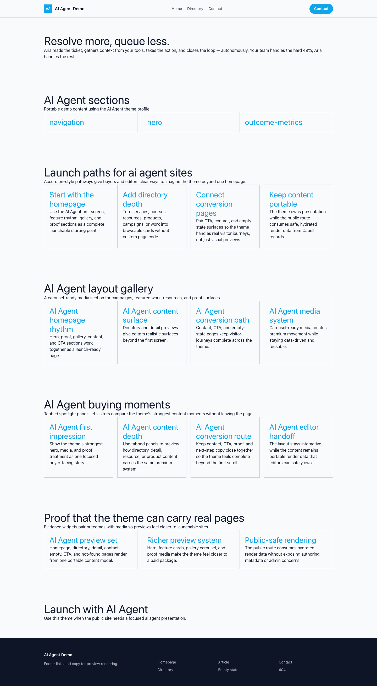

# Theme AI Agent

AI Agent provides a distinct Capell frontend theme for Aria Agents. From the repository root, run `vendor/bin/pest packages/theme-ai-agent/tests`; this package does not ship its own PHPUnit config.

## Screenshot Evidence

These captures are the package-owned visual contract for the admin pages, public pages, actions, workflows, and feature surfaces described above. Keep this section aligned with `docs/screenshots.json` whenever the package surface changes.

### AI Agent Homepage

- Surface: frontend · Target: /.
- Documents: Theme marketplace preview.
- Capture notes: AI Agent Homepage.

### AI Agent Landing page

- Surface: frontend · Target: /.
- Documents: Theme marketplace preview.
- Capture notes: AI Agent Landing page.

### AI Agent List page

- Surface: frontend · Target: /.
- Documents: Theme marketplace preview.
- Capture notes: AI Agent List page.

### AI Agent Search results

- Surface: frontend · Target: /.
- Documents: Theme marketplace preview.
- Capture notes: AI Agent Search results.

### AI Agent Contact form

- Surface: frontend · Target: /.
- Documents: Theme marketplace preview.
- Capture notes: AI Agent Contact form.
