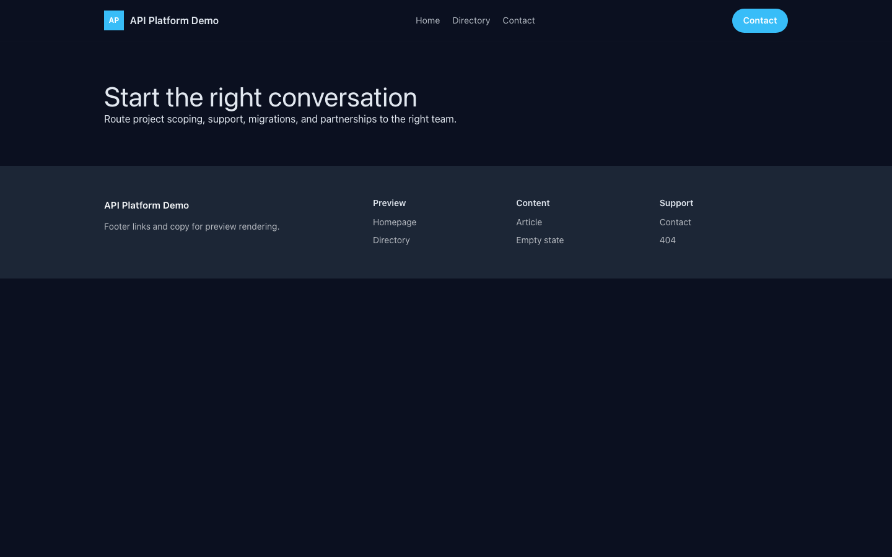

# Theme API Platform

API Platform provides a distinct Capell frontend theme for Sonari API. From the repository root, run `vendor/bin/pest packages/theme-api-platform/tests`; this package does not ship its own PHPUnit config.

## Screenshot Evidence

These captures are the package-owned visual contract for the admin pages, public pages, actions, workflows, and feature surfaces described above. Keep this section aligned with `docs/screenshots.json` whenever the package surface changes.

### API Platform Homepage

- Surface: frontend · Target: /.
- Documents: Theme marketplace preview.
- Capture notes: API Platform Homepage.

### API Platform Landing page

- Surface: frontend · Target: /.
- Documents: Theme marketplace preview.
- Capture notes: API Platform Landing page.

### API Platform List page

- Surface: frontend · Target: /.
- Documents: Theme marketplace preview.
- Capture notes: API Platform List page.

### API Platform Search results

- Surface: frontend · Target: /.
- Documents: Theme marketplace preview.
- Capture notes: API Platform Search results.

### API Platform Contact form

- Surface: frontend · Target: /.
- Documents: Theme marketplace preview.
- Capture notes: API Platform Contact form.
