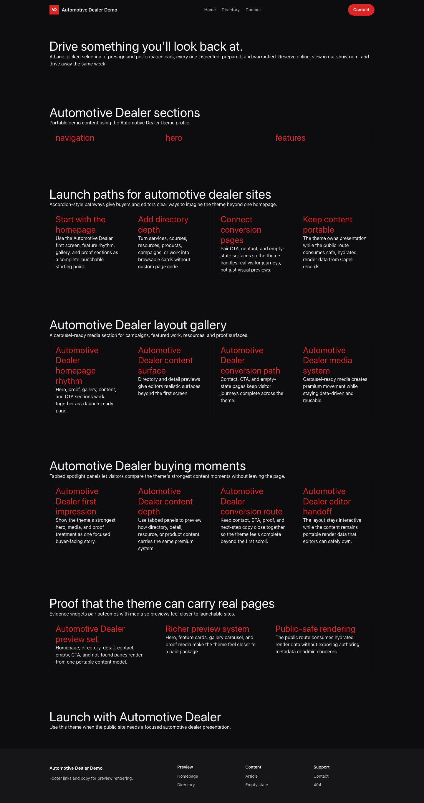
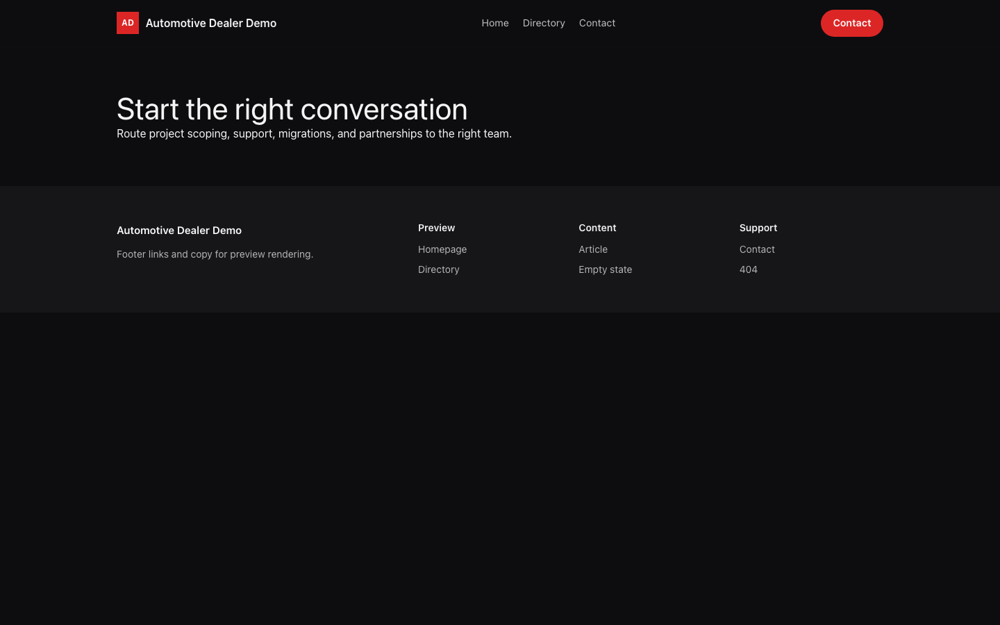

# Theme Automotive Dealer

Automotive Dealer provides a distinct Capell frontend theme for Apex Motors. From the repository root, run `vendor/bin/pest packages/theme-automotive-dealer/tests`; this package does not ship its own PHPUnit config.

## Screenshot Evidence

These captures are the package-owned visual contract for the admin pages, public pages, actions, workflows, and feature surfaces described above. Keep this section aligned with `docs/screenshots.json` whenever the package surface changes.

### Automotive Dealer Homepage

- Surface: frontend · Target: /.
- Documents: Theme marketplace preview.
- Capture notes: Automotive Dealer Homepage.

### Automotive Dealer Landing page

- Surface: frontend · Target: /.
- Documents: Theme marketplace preview.
- Capture notes: Automotive Dealer Landing page.

### Automotive Dealer List page

- Surface: frontend · Target: /.
- Documents: Theme marketplace preview.
- Capture notes: Automotive Dealer List page.

### Automotive Dealer Search results

- Surface: frontend · Target: /.
- Documents: Theme marketplace preview.
- Capture notes: Automotive Dealer Search results.

### Automotive Dealer Contact form

- Surface: frontend · Target: /.
- Documents: Theme marketplace preview.
- Capture notes: Automotive Dealer Contact form.
