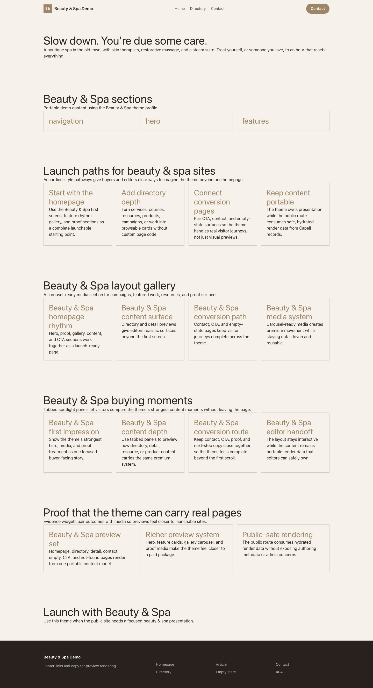

# Theme Beauty & Spa

Beauty & Spa provides a distinct Capell frontend theme for Lumière Spa. From the repository root, run `vendor/bin/pest packages/theme-beauty-spa/tests`; this package does not ship its own PHPUnit config.

## Screenshot Evidence

These captures are the package-owned visual contract for the admin pages, public pages, actions, workflows, and feature surfaces described above. Keep this section aligned with `docs/screenshots.json` whenever the package surface changes.

### Beauty & Spa Homepage

- Surface: frontend · Target: /.
- Documents: Theme marketplace preview.
- Capture notes: Beauty & Spa Homepage.

### Beauty & Spa Landing page

- Surface: frontend · Target: /.
- Documents: Theme marketplace preview.
- Capture notes: Beauty & Spa Landing page.

### Beauty & Spa List page

- Surface: frontend · Target: /.
- Documents: Theme marketplace preview.
- Capture notes: Beauty & Spa List page.

### Beauty & Spa Search results

- Surface: frontend · Target: /.
- Documents: Theme marketplace preview.
- Capture notes: Beauty & Spa Search results.

### Beauty & Spa Contact form

- Surface: frontend · Target: /.
- Documents: Theme marketplace preview.
- Capture notes: Beauty & Spa Contact form.
