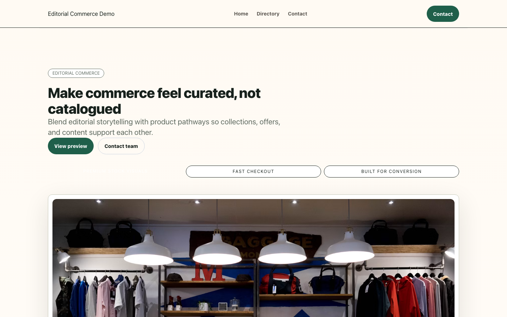
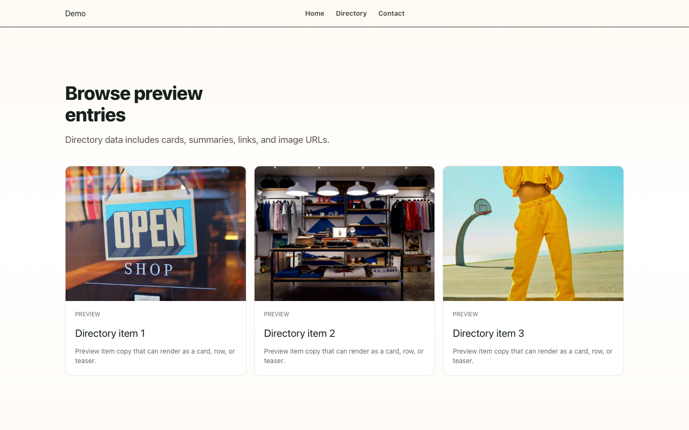
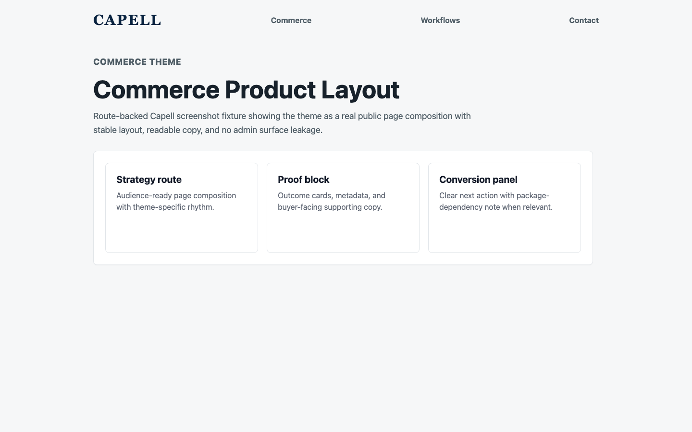
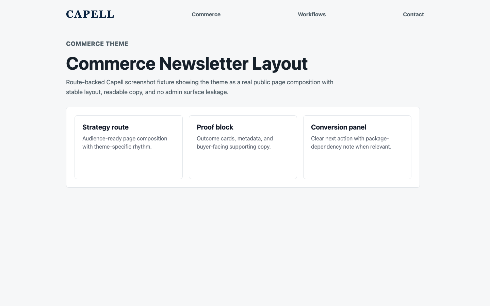
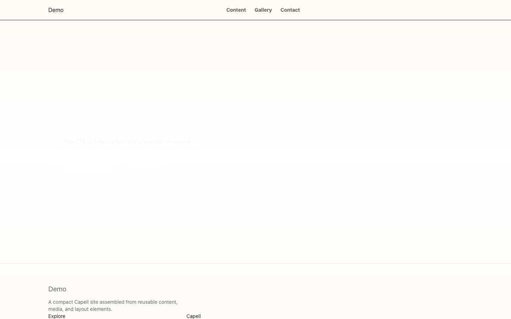
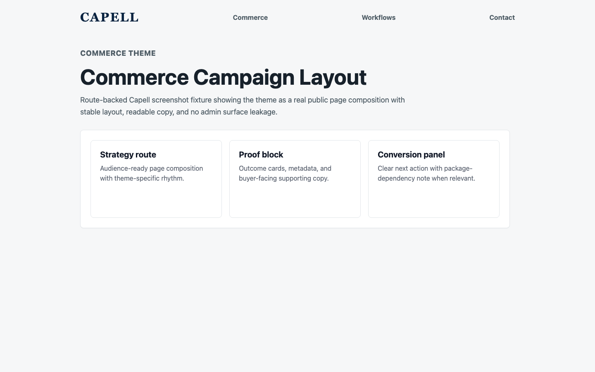

# Theme Commerce

<!-- prettier-ignore-start -->

## What This Plugin Adds

Theme Commerce is an **Available**, **No schema impact** Capell theme in the **Capell Themes** product group. It ships as `capell-app/theme-commerce` and extends these surfaces: frontend.

Editorial Commerce is a premium Capell theme built for retail and e-commerce storefronts that need to feel like a buying journey, not a styled brochure. It ships an image-led hero, product finder, collection and product grids, comparison and proof sections, buying-guide editorial, and conversion CTAs - all driven by hydrated render data with zero database access in public Blade. Pair it with Capell Shopify Commerce to light up connected-catalog merchandising panels, and with Blog for buying-guide content that supports purchase decisions. Warm editorial direction (deep ink, forest-green merchandising, coral action accents) and a token-driven design system keep every store on-brand while staying fast and accessible.

After install, admins can select the theme through the core theme management surface. Editors keep using normal Capell content workflows while the package controls public presentation.

Status details:

- Status: Available
- Tier: premium
- Bundle: themes
- Composer package: `capell-app/theme-commerce`
- Namespace: `Capell\ThemeStudio\Commerce`
- Theme key: `commerce`

## Why It Matters

**For developers:** The package gives developers package-owned service providers, Actions, and Blade views instead of pushing this behaviour into core or application code.

**For teams:** A premium, conversion-focused retail theme for Capell - image-led catalog, product discovery, social proof, and buying-guide layouts that turn browsing into baskets.

## Screens And Workflow

Screenshot contract: `screenshots.json`.

- Frontend page rendered with commerce theme (frontend, optional).
- Commerce homepage (frontend, optional).
- Collection listing (frontend, optional).
- Product detail page (frontend, optional).
- Lookbook page (frontend, optional).
- Buying guide article (frontend, optional).
- Newsletter capture page (frontend, optional).
- Retail event page (frontend, optional).
- Product search page (frontend, optional).
- Promotion campaign page (frontend, optional).

## Screenshot Evidence

These captures are the package-owned visual contract for the admin pages, public pages, actions, workflows, and feature surfaces described above. Keep this section aligned with `docs/screenshots.json` whenever the package surface changes.

### Frontend page rendered with commerce theme

- Surface: frontend · Target: /theme-commerce.
- Documents: A visitor sees a seeded product page rendered through the commerce navigation, hero, product finder, collections, product grid, catalog, proof, blog teaser, CTA, and footer sections.
- Capture notes: Capture the seeded package theme route instead of the shared theme-gallery route. Optional until the Capell runner can browser-capture seeded package theme routes without navigation failures.

### Commerce homepage

- Surface: frontend · Target: /theme-commerce.
- Documents: A retailer checks that the theme feels like a buying journey rather than a plain catalogue wrapper.
- Capture notes: Capture the seeded package theme route instead of the shared theme-gallery route. Optional until the Capell runner can browser-capture seeded package theme routes without navigation failures.

### Collection listing

- Surface: frontend · Target: /theme-commerce-directory.
- Documents: A retailer reviews whether shoppers can scan ranges, campaigns, and stock signals quickly.
- Capture notes: Capture the seeded package theme route instead of the shared theme-gallery route. Optional until the Capell runner can browser-capture seeded package theme routes without navigation failures.

### Product detail page

- Surface: frontend · Target: /theme-commerce-detail.
- Documents: A retailer checks that product pages keep purchase intent, proof, and merchandising context together.
- Capture notes: Capture the seeded package theme route instead of the shared theme-gallery route. Optional until the Capell runner can browser-capture seeded package theme routes without navigation failures.

### Lookbook page

- Surface: frontend · Target: /theme-commerce-directory.
- Documents: A retailer can sell a range visually without the page becoming Portfolio's work gallery.
- Capture notes: Capture the seeded package theme route instead of the shared theme-gallery route. Optional until the Capell runner can browser-capture seeded package theme routes without navigation failures.

### Buying guide article

- Surface: frontend · Target: /theme-commerce-directory.
- Documents: A retailer checks that advice content supports purchase decisions instead of becoming a plain blog.
- Capture notes: Capture the seeded package theme route instead of the shared theme-gallery route. Optional until the Capell runner can browser-capture seeded package theme routes without navigation failures.

### Newsletter capture page

- Surface: frontend · Target: /theme-commerce-cta.
- Documents: A retailer reviews how the theme converts browsing intent into owned-audience growth.
- Capture notes: Capture the seeded package theme route instead of the shared theme-gallery route. Optional until the Capell runner can browser-capture seeded package theme routes without navigation failures.

### Retail event page

- Surface: frontend · Target: /theme-commerce-cta.
- Documents: A retailer can promote launches and in-store events without leaving the merchandising lane.
- Capture notes: Capture the seeded package theme route instead of the shared theme-gallery route. Optional until the Capell runner can browser-capture seeded package theme routes without navigation failures.

### Product search page

- Surface: frontend · Target: /theme-commerce-directory.
- Documents: A shopper can refine buying paths without the page looking like Knowledge search or a standard directory.
- Capture notes: Capture the seeded package theme route instead of the shared theme-gallery route. Optional until the Capell runner can browser-capture seeded package theme routes without navigation failures.

### Promotion campaign page

- Surface: frontend · Target: /theme-commerce-cta.
- Documents: A retailer checks that campaigns stay tied to buying paths rather than becoming Agency launch pages.
- Capture notes: Capture the seeded package theme route instead of the shared theme-gallery route. Optional until the Capell runner can browser-capture seeded package theme routes without navigation failures.

## Technical Shape

- Service providers: `Capell\ThemeStudio\Commerce\CommerceThemeServiceProvider`.
- Actions: `InstallCommerceThemeDemoAction`.
- Command signatures: `capell:theme-commerce-demo`.
- Console command classes: `DemoCommand`.
- Manifest contributions: `admin-page: Capell\ThemeStudio\Commerce\Manifest\ThemeManagementPageContribution`.
- Health checks: `Capell\ThemeStudio\Commerce\Health\ThemeCommerceHealthCheck`.
- Blade views: `packages/theme-commerce/resources/views/blog/article.blade.php`, `packages/theme-commerce/resources/views/blog/index.blade.php`, `packages/theme-commerce/resources/views/page.blade.php`, `packages/theme-commerce/resources/views/sections/blog-teaser.blade.php`, `packages/theme-commerce/resources/views/sections/buying-guide.blade.php`, `packages/theme-commerce/resources/views/sections/campaign.blade.php`, `packages/theme-commerce/resources/views/sections/catalog.blade.php`, `packages/theme-commerce/resources/views/sections/collections.blade.php`, `packages/theme-commerce/resources/views/sections/comparison.blade.php`, `packages/theme-commerce/resources/views/sections/cta.blade.php`, `packages/theme-commerce/resources/views/sections/footer.blade.php`, `packages/theme-commerce/resources/views/sections/hero.blade.php`, `and 11 more`.
- Cache tags: `theme-commerce`.

## Data Model

This theme has no schema impact. It relies on core Capell site, page, locale, and theme records instead of declaring package-owned tables.

## Install Impact

- Admin navigation: contributes admin extension points through `capell.json`.
- Permissions: none declared in `capell.json`.
- Public routes: none detected in package route files.
- Database changes: no package migrations declared.
- Settings: no package settings declared.
- Queues or schedules: none detected in standard package paths.
- Cache tags: `theme-commerce`.
- Commands: `capell:theme-commerce-demo`.

## Common Pitfalls

- Keep public Blade and cached HTML free of authoring markers, model IDs, permissions, signed editor URLs, and lazy database queries.
- Keep `composer.json`, `composer.local.json`, `capell.json`, docs, screenshots, and tests aligned when the package surface changes.

## Troubleshooting

| Symptom | Likely cause | Check | Fix |
| --- | --- | --- | --- |
| Package surface is missing after install | Provider or manifest is not loaded | Confirm `capell.json`, package `composer.json`, and provider registration | Reinstall the package, refresh Composer autoload, and clear host caches |
| Background work does not run | Queue worker or scheduled command is not active | Check package jobs, commands, and host scheduler configuration | Start the queue or scheduler, then run the focused command or package test |
| Public output leaks unexpected state | Render data, cache variation, or authoring boundary has regressed | Check public Blade, cache tags, and public-output safety tests | Move data loading out of Blade and rerun the package public-output tests |

## Quick Start

1. Install the package: `composer require capell-app/theme-commerce`.
2. Run the required setup: `php artisan capell:theme-commerce-demo`.
3. Verify the package provider is registered and the related frontend, command, or extension point is active.

## Next Steps

- [Package docs index](README.md)
- [Screenshot contract](screenshots.json)
- [Marketplace assets](assets/marketplace/)
- [Capell content language plan](../../../docs/CONTENT_LANGUAGE_PLAN.md)
- [Capell documentation design system](../../../docs/DESIGN_SYSTEM.md)
- [Capell and package ERD notes](../../../docs/erd/capell-and-package-erds.md)
- Related packages: [Blog](../../blog/README.md), [Campaign Studio](../../campaign-studio/README.md), [Media Library](../../media-library/README.md), [Payments](../../payments/README.md), [Search](../../search/README.md), [Shopify Commerce](../../shopify-commerce/README.md).
- Focused tests: `vendor/bin/pest packages/theme-commerce/tests --configuration=phpunit.xml`.

<!-- prettier-ignore-end -->
