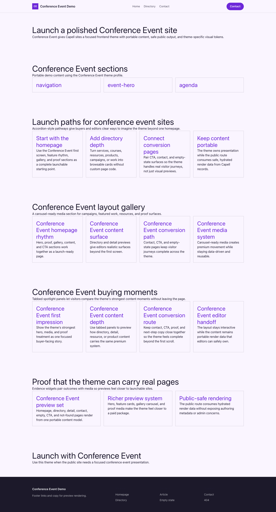

# Theme Conference Event

Conference Event provides a distinct Capell frontend theme for Forge Summit 2026. From the repository root, run `vendor/bin/pest packages/theme-conference-event/tests`; this package does not ship its own PHPUnit config.

## Screenshot Evidence

These captures are the package-owned visual contract for the admin pages, public pages, actions, workflows, and feature surfaces described above. Keep this section aligned with `docs/screenshots.json` whenever the package surface changes.

### Conference Event Homepage

- Surface: frontend · Target: /.
- Documents: Theme marketplace preview.
- Capture notes: Conference Event Homepage.

### Conference Event Landing page

- Surface: frontend · Target: /.
- Documents: Theme marketplace preview.
- Capture notes: Conference Event Landing page.

### Conference Event List page

- Surface: frontend · Target: /.
- Documents: Theme marketplace preview.
- Capture notes: Conference Event List page.

### Conference Event Search results

- Surface: frontend · Target: /.
- Documents: Theme marketplace preview.
- Capture notes: Conference Event Search results.

### Conference Event Contact form

- Surface: frontend · Target: /.
- Documents: Theme marketplace preview.
- Capture notes: Conference Event Contact form.
